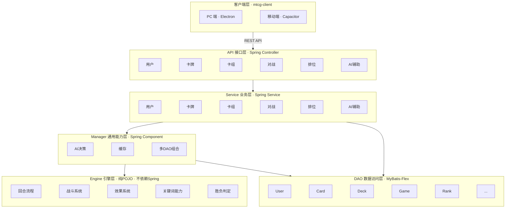

# 需求分析文档

> 项目：MTCG 后端程序  
> 版本：v0.1（草案）  
> 日期：2026-07-30  

---

## 1. 引言

### 1.1 目的

本文档对《超英击战》卡牌游戏后端系统进行需求分析，明确系统边界、功能需求与非功能需求，作为后续概要设计和详细设计的依据。

### 1.2 范围

系统目标是将官方规则书 v1.01 中定义的游戏规则，沉淀为**可运行的在线对战后端程序**，包含：

- 卡牌数据管理
- 用户系统与权限管理
- 卡组构筑与管理
- 对战规则引擎
- 对战接口（API）
- AI 对战
- 排位与匹配系统

后续可扩展：WebSocket 实时推送、AI 辅助扩展、前端界面、模块化拆分。

### 1.3 参考资料

| 文档 | 说明 |
| --- | --- |
| [综合规则书 v1.01](../规则文档/02-综合规则书-v1.01.md) | 裁定基准，条款编号作为规则 ID |
| [快速入门规则](../规则文档/01-快速入门规则.md) | 教学向摘要 |
| [术语表与关键词速查](../规则文档/03-术语表与关键词速查.md) | 引擎枚举映射 |
| [区域模型与回合流程](../规则文档/04-区域模型与回合流程.md) | 代码建模参考 |

### 1.4 术语

| 术语 | 说明 |
| --- | --- |
| 角色卡 | 主卡组卡牌，含 Lv/R/战力/颜色/特征等字段 |
| 冲击卡 | 计分卡，放入时间线作为胜利条件，9 张组成冲击卡组 |
| 号召 | 将角色卡从手牌放置到场上的操作；Lv4+ 须先撤退合计 Lv 的角色 |
| 破绽 | 玩家空置的战区位置 |
| 战区 | 场上区域，分先锋区(1)、侧翼区(2)、后卫区(1) |
| 基地区 | 场上区域，上限 6（角色+盖卡） |
| 时间线 | 放置冲击卡的区域，达 9 张获胜 |
| 盖卡 | 背面朝上放置于场上的卡；失去效果，仅本人可查看 |
| 结附 | 角色卡叠放在另一角色卡下方，不占区域上限 |
| 应对 | 关键词能力，手牌中可响应对方攻击进行号召 |
| 拦截 | 关键词能力，将攻击目标改为此卡 |
| 连击 | 关键词能力，获得第 2 次攻击机会 |
| 强袭 | 关键词能力，战胜时视为成功攻击破绽 |
| 空袭 | 关键词能力，有角色也可攻破绽 |
| 唯一 | 关键词能力，场上同名唯一 |
| 调度（Mulligan） | 起始手牌调整：弃牌置卡组底→补等量→洗匀 |
| 预组牌（Structure Deck） | 预先组好的固定卡组产品，编号以 SD 开头（如 SD01），开盒即玩 |
| 补充包（Booster Pack） | 随机卡牌补充包产品，编号以 BP 开头（如 BP01），抽取扩充收藏 |
| 推广包（Promo Pack） | 推广用卡牌包产品，编号以 PB 开头（如 PB01），活动赠送或宣传发放 |

---

## 2. 项目概述

### 2.1 背景

《超英击战》是基于漫威 IP 的集换式卡牌游戏。两名玩家各持 50 张角色卡组 + 9 张冲击卡组，通过号召部署角色、在战区攻击对手，将冲击卡放入时间线达 9 张，或抽空对方卡组即可获胜。

### 2.2 系统架构

**分层说明**：

| 层 | 职责 | 技术栈 |
| --- | --- | --- |
| 客户端层 | 游戏 UI 渲染（PixiJS）、状态管理（Pinia）、PC/移动端打包 | Vue 3 / PixiJS / Electron / Capacitor |
| API 接口层 | 对外暴露 REST 接口，参数校验、协议适配 | Spring Controller |
| Service 业务层 | 业务编排，调用 Manager 和 DAO | Spring Service |
| Manager 通用能力层 | AI 决策封装、缓存、多 DAO 组合等下沉能力 | Spring Component |
| Engine 引擎层 | 纯规则逻辑（回合、战斗、效果） | **不依赖 Spring**，纯 POJO |
| DAO 数据访问层 | 持久化操作 | MyBatis-Flex Mapper |

### 2.3 用户角色

| 角色 | 说明 | 当前阶段 |
| --- | --- | --- |
| 玩家 | 通过 API 进行对战操作 | ✅ |
| 卡牌管理员 | 录入/维护卡牌数据 | ✅ |
| AI 玩家 | 自动决策对战策略，替代人类对手 | ✅ 需实现 |
| 系统管理员 | 用户管理、系统配置、卡牌数据维护（含卡牌管理员全部权限） | ✅ |

---

## 3. 功能需求

### FR1：卡牌数据管理

管理角色卡和冲击卡的卡牌数据库，为卡组构筑和对战引擎提供基础数据。

| 编号 | 需求 | 优先级 | 说明 |
| --- | --- | --- | --- |
| FR1.1 | 角色卡 CRUD | 高 | 录入/查询/修改/删除角色卡（编号、名称、Lv、颜色、R、战力、特征、效果等） |
| FR1.2 | 冲击卡 CRUD | 高 | 录入/查询/修改/删除冲击卡（编号、名称、稀有度、卡面图） |
| FR1.3 | 卡牌查询 | 高 | 按颜色、等级、稀有度、特征、名称等条件筛选 |
| FR1.4 | 批量导入 | 中 | 通过 JSON/CSV 批量导入卡牌数据 |

### FR2：卡组构筑

玩家构建合法的主卡组和冲击卡组，系统负责校验合法性。

| 编号 | 需求 | 优先级 | 说明 |
| --- | --- | --- | --- |
| FR2.1 | 创建/编辑/删除卡组 | 高 | 管理主卡组（50 张）和冲击卡组（9 张） |
| FR2.2 | 卡组校验 | 高 | 主卡组：50 张、最多 2 色、同名最多 3 张；冲击卡组：9 张 |
| FR2.3 | 卡组列表 | 中 | 查看已保存的卡组 |
| FR2.4 | 卡组导入/导出 | 低 | JSON 格式导入导出，方便分享 |
| FR2.5 | 卡牌收藏管理 | 中 | 玩家登记已拥有的卡牌，为 AI 构筑辅助提供数据基础 |

### FR3：对战引擎

将规则书定义的游戏规则实现为可执行的状态机，是系统的核心模块。

> 引擎应为**纯 Java 逻辑**，尽量不依赖 Spring，便于独立测试和未来拆分。

#### FR3.1 对局初始化

| 编号 | 需求 | 说明 |
| --- | --- | --- |
| FR3.1.1 | 创建对局 | 指定双方卡组，初始化游戏状态 |
| FR3.1.2 | 洗牌 | 双方卡组随机洗匀 |
| FR3.1.3 | 决定先后攻 | 约定或随机 |
| FR3.1.4 | 起始手牌 | 各抽 6 张 |
| FR3.1.5 | 调度（Mulligan） | 先攻先决定，后攻后决定；弃牌置卡组底→补等量→洗匀 |

#### FR3.2 回合流程

6 阶段顺序执行，不可回退（规则 303.2.a）：

| 阶段 | 引擎动作 | 规则条款 |
| --- | --- | --- |
| 回合开始 | 触发「回合开始时」效果 | 303.2.a.1 |
| 抽卡阶段 | 回合玩家抽 2 张 | 303.2.a.2 |
| 行动阶段 | 基地部署/行动号召/战基移动/启动效果 | 303.2.a.3 |
| 战斗阶段 | 调整位置→按行攻击→应对→判定 | 303.2.a.4 |
| 应对阶段 | 应对号召/应对·启动 | 303.2.a.5 |
| 回合结束 | 触发结束效果→终止本回合效果→手牌弃至 9 张 | 303.2.a.6 |

#### FR3.3 行动阶段

| 编号 | 需求 | 说明 |
| --- | --- | --- |
| FR3.3.1 | 基地部署 | 手牌 1 张盖入基地→抽 1；每阶段最多 1 次 |
| FR3.3.2 | 行动号召 | 号召角色到战区或基地；每阶段最多 3 次（先攻首回合 1 次）；Lv4+ 须先撤退合计 Lv 的角色 |
| FR3.3.3 | 战基移动 | 战区↔基地移动；每角色每回合 1 次；本回合进场者不能 |
| FR3.3.4 | 启动效果 | 启动【启动】与【应对·启动】效果 |
| FR3.3.5 | 盖卡操作 | 基地部署时盖放手牌；效果导致的盖伏（翻面至背面）；翻开盖卡恢复为角色卡 |
| FR3.3.6 | 结附/解除 | 角色叠放为结附卡；结附卡随父卡移动；解除结附移动到指定区域 |

#### FR3.4 战斗阶段

| 编号 | 需求 | 说明 |
| --- | --- | --- |
| FR3.4.1 | 调整 | 最多 4 张战区角色互换位置；不计为移动 |
| FR3.4.2 | 攻击序列 | 先锋→侧翼→后卫；侧翼两翼各有角色时可自选顺序 |
| FR3.4.3 | 距离判定 | 按线性路径计算攻击距离（己后卫→敌后卫 = 5） |
| FR3.4.4 | 应对步骤 | 敌方先→我方后，轮流三选一（应对号召/应对·启动/不行动） |
| FR3.4.5 | 判定结算 | 角色 vs 角色（战力比较）；角色 vs 破绽（冲击卡→时间线） |
| FR3.4.6 | 中断处理 | 攻击者 R=0/离场/不能攻击 → 战斗结束 |

#### FR3.5 效果系统

| 编号 | 需求 | 说明 |
| --- | --- | --- |
| FR3.5.1 | 触发型效果 | 满足条件自动触发；逐个结算；同方自选顺序；双方同时回合玩家先 |
| FR3.5.2 | 常驻型效果 | 在对应区域持续生效 |
| FR3.5.3 | 启动型效果 | 行动阶段可主动启动；须有可结算内容 |
| FR3.5.4 | 应对·启动 | 行动/应对阶段/战斗应对步骤可启动 |
| FR3.5.5 | 优先级 | 效果【不能】>效果【能】>规则【不能】>规则【能】 |
| FR3.5.6 | 战力变更 | 触发/启动 vs 常驻的叠加与覆盖规则（301.41） |

#### FR3.6 关键词能力

| 编号 | 需求 | 说明 |
| --- | --- | --- |
| FR3.6.1 | 应对 | 手牌常驻；可应对号召 |
| FR3.6.2 | 拦截 | 应对·启动；改攻击目标为此卡；每回合 1 次 |
| FR3.6.3 | 连击 | 战区常驻；获得第 2 次攻击机会 |
| FR3.6.4 | 强袭 | 战区常驻；战胜时视为成功攻击破绽 |
| FR3.6.5 | 空袭 | 战区常驻；有角色也可攻破绽 |
| FR3.6.6 | 唯一 | 场上常驻；同名唯一；效果不可失去 |

#### FR3.7 胜负判定

| 条件 | 说明 |
| --- | --- |
| 时间线 ≥ 9 张冲击卡 | 即时获胜 |
| 对方卡组 = 0 张 | 即时获胜 |
| 卡牌效果宣布获胜 | 效果结算触发 |

### FR4：对战接口

将对战引擎封装为 API，供客户端调用。**当前阶段用 REST**，后续迭代叠加 WebSocket 实时推送（引擎与通信方式解耦，切换不影响 engine 包）。

| 编号 | 需求 | 优先级 | 说明 |
| --- | --- | --- | --- |
| FR4.1 | 创建对局 | 高 | 指定双方卡组 ID，返回对局 ID |
| FR4.2 | 查询对局状态 | 高 | 返回当前局面（区域、卡牌、阶段、可执行操作） |
| FR4.3 | 执行操作 | 高 | 提交操作：调度、基地部署、行动号召、战基移动、启动效果、盖卡/翻开、结附/解除、调整位置、攻击、应对号召、拦截、不行动、宣布结束 |
| FR4.4 | 认输/结束 | 中 | 主动结束对局 |
| FR4.5 | 对局记录与复盘 | 中 | 对局状态持久化到数据库，支持历史查询和复盘回放 |
| FR4.6 | WebSocket 实时推送 | 低（未来） | 对方操作后实时推送局面变更，避免轮询 |

### FR5：用户系统

玩家需注册登录后才能构筑卡组和对战。

| 编号 | 需求 | 优先级 | 说明 |
| --- | --- | --- | --- |
| FR5.1 | 注册 | 高 | 用户名/密码注册 |
| FR5.2 | 登录 | 高 | 登录后获取 Token，后续请求携带 |
| FR5.3 | 用户资料 | 中 | 查看/修改昵称、头像等个人资料 |
| FR5.4 | 对局记录 | 中 | 查看个人对局历史、胜败统计 |
| FR5.5 | 卡组归属 | 高 | 卡组关联用户，仅能操作自己的卡组 |
| FR5.6 | 对局归属 | 高 | 对局关联双方用户 |
| FR5.7 | 打牌习惯分析 | 中 | 量化玩家打牌倾向（激进/防守、偏好颜色、常见操作模式），为 AI 辅助和排位匹配提供数据 |

### FR6：AI 对战与智能辅助

引入 Spring AI，在 manager 层封装 AI 能力。目标是让 AI 具备类似顶级 TCG 玩家的**策略思维**——理解卡牌协同、费用效率、环境 meta、针对性解牌，最终成为 TCG 界的「阿尔法狗」。

#### FR6.1 AI 对战（高）

AI 作为玩家自动决策，替代人类对手。需引擎和 API 完成后实现。

| 编号 | 子需求 | 说明 |
| --- | --- | --- |
| FR6.1.1 | 局面评估 | 评估当前局面优劣势：战力对比、手牌资源、区域控制、威胁判断 |
| FR6.1.2 | 策略决策 | 基于局面评估选择最优操作：何时号召、何时攻击、何时防守、何时启动效果 |
| FR6.1.3 | 应对策略 | 面对对手操作时做出反应：应对号召时机、拦截目标选择、解牌优先级 |
| FR6.1.4 | 难度分级 | 提供多档 AI 难度（新手/进阶/expert），适配不同水平玩家 |
| FR6.1.5 | AI 配置 | 可量化配置 AI 玩家属性：指定卡组、打牌倾向（激进/防守/控制）、决策深度、操作随机性 |

#### FR6.2 卡组构筑辅助（未来）

AI 像资深玩家一样理解卡牌间的协同关系，辅助玩家构筑卡组。

| 编号 | 子需求 | 说明 |
| --- | --- | --- |
| FR6.2.1 | 卡牌协同分析 | 分析哪些卡牌之间存在 combo 配合（如 A 卡的效果为 B 卡创造触发条件） |
| FR6.2.2 | 费用效率分析 | 评估 Lv/战力/R 的性价比，识别高效率号召路线 |
| FR6.2.3 | 卡牌强度量化 | 综合评估单卡强度评分（战力/Lv/R/效果联动/环境适配），输出卡牌 tier 分级 |
| FR6.2.4 | 环境 meta 分析 | 分析当前流行卡组类型、胜率，给出克制建议 |
| FR6.2.5 | 收藏感知构筑 | 根据玩家已收藏的卡牌（FR2.5），推荐最优可用卡组方案及替代卡牌 |
| FR6.2.6 | 缺卡补齐建议 | 构筑推荐时若缺关键卡，明确告知缺哪些卡、为何需要、用什么卡能替代 |
| FR6.2.7 | 意图驱动构筑 | 玩家描述期望策略（如「快攻」「控制」），AI 据此生成卡组方案 |

#### FR6.3 对局分析与复盘（未来）

AI 像解说员一样分析对局，帮助玩家提升。

| 编号 | 子需求 | 说明 |
| --- | --- | --- |
| FR6.3.1 | 实时操作建议 | 分析当前局面，给出推荐操作及理由 |
| FR6.3.2 | 解牌建议 | 面对对手威胁卡时，推荐最优解牌方案 |
| FR6.3.3 | 复盘分析 | 对局结束后回放关键回合，分析失误点和更优路线 |

#### FR6.4 规则问答（未来）

AI 对话，解答规则疑问和卡牌裁定。

| 编号 | 子需求 | 说明 |
| --- | --- | --- |
| FR6.4.1 | 规则解释 | 自然语言问答，解释规则条款和关键词能力 |
| FR6.4.2 | 卡牌效果解读 | 解读具体卡牌的效果文本和结算流程 |
| FR6.4.3 | 裁定案例 | 对边缘情况给出裁定建议，引用规则条款编号 |

> **演进路线**：FR6.1 先用规则/启发式策略实现基础 AI，后续引入 LLM（Spring AI）增强局面理解和决策推理，远期可探索自对弈强化学习。

### FR7：权限管理

基于角色控制 API 访问权限（RBAC）。

| 编号 | 需求 | 优先级 | 说明 |
| --- | --- | --- | --- |
| FR7.1 | 角色定义 | 高 | 玩家、卡牌管理员、系统管理员、AI 玩家 |
| FR7.2 | 接口鉴权 | 高 | 登录后携带 Token，按角色校验访问权限 |
| FR7.3 | 权限隔离 | 高 | 玩家仅操作自己的卡组/对局；卡牌管理员仅管理卡牌；系统管理员全部权限 |

### FR8：系统管理

系统管理员的后台管理功能。

| 编号 | 需求 | 优先级 | 说明 |
| --- | --- | --- | --- |
| FR8.1 | 用户管理 | 中 | 查看用户列表、禁用/启用账号 |
| FR8.2 | 系统配置 | 低 | 运行参数配置（如并发对局上限） |
| FR8.3 | 操作日志 | 低 | 关键操作审计日志（卡牌变更、用户管理） |

### FR9：排位系统

竞技对战排位机制，激励玩家持续参与。

| 编号 | 需求 | 优先级 | 说明 |
| --- | --- | --- | --- |
| FR9.1 | 段位系统 | 高 | 分段位：青铜→白银→黄金→铂金→钻石→大师→宗师；胜升负降 |
| FR9.2 | 排位匹配 | 高 | 按段位和胜率匹配对手；支持 AI 填补等待超时 |
| FR9.3 | 排行榜 | 高 | 全服排行榜（段位、胜率、胜场数）；支持分赛季查看 |
| FR9.4 | 赛季机制 | 中 | 定期赛季重置；赛季奖励（称号/记录）；历史赛季归档 |
| FR9.5 | 休闲模式 | 中 | 不影响排位的练习模式；可指定对手或随机 |

---

## 4. 非功能需求

| 编号 | 需求 | 说明 |
| --- | --- | --- |
| NFR1 | 引擎独立性 | `engine` 包为纯 Java 逻辑，不依赖 Spring，可独立单元测试 |
| NFR2 | 分层规范 | 遵循阿里 Java 开发手册分层：controller→service→manager→dao |
| NFR3 | 可扩展性 | 预留 AI 玩家接口；后续可拆分为 mtcg-engine/mtcg-web/mtcg-ai 模块 |
| NFR4 | 数据一致性 | 对局状态变更必须原子化；对局状态持久化到数据库，支持崩溃恢复和复盘 |
| NFR5 | 规则可追溯 | 引擎逻辑与规则条款编号对应，便于规则更新时定位修改 |
| NFR6 | 通信解耦 | 引擎层与通信方式（REST/WebSocket）解耦，切换不影响 engine 包 |
| NFR7 | 安全性 | 密码加密存储（BCrypt）；Token 过期机制；防 SQL 注入（MyBatis-Flex 参数化）；输入校验 |
| NFR8 | 性能 | 卡牌查询 < 200ms；对局操作 < 100ms；支持至少 100 并发对局 |
| NFR9 | API 版本管理 | 接口统一 `/api/v1/...` 前缀，后续版本兼容 |
| NFR10 | 可观测性 | 结构化日志（操作审计、异常堆栈）；健康检查端点；关键指标监控（对局数、响应耗时、错误率） |
| NFR11 | 数据备份 | PostgreSQL 定时备份与恢复策略；对局数据支持按时间点恢复 |

---

## 5. 约束与假设

### 技术约束

- Java 17 / Spring Boot 3.5
- MyBatis-Flex + PostgreSQL（支持 OLTP 事务、JSONB、全文检索）
- 规则以综合规则书 v1.01 为准

### 假设

- 当前阶段后端 API 优先，前端游戏客户端（`mtcg-client`）Monorepo 项目结构已搭建
- 通信模式：**当前用 REST**，后续叠加 WebSocket 实时推送
- 卡牌效果文本**人工录入**，结构化解析（effect_json）**后续阶段再做**，当前只存原文

### 已确认决策

| 编号 | 问题 | 决策 | 说明 |
| --- | --- | --- | --- |
| Q1 | 对战通信模式 | REST 先行，WebSocket 后续 | 卡牌游戏回合制，REST 够用；引擎与通信解耦 |
| Q2 | 用户系统 | 需要登录/注册 | 卡组和对局关联用户 |
| Q3 | 对局持久化 | 数据库持久化 | 支持崩溃恢复和复盘回放 |
| Q4 | 效果解析时机 | 先存文本，后续再解析 | effect_json 暂留空，引擎先跑通基础流程 |
| Q5 | 数据库选型 | PostgreSQL | OLTP 事务 + JSONB + 全文检索；不适合 SQLite（并发写）和 Doris（OLAP） |
| Q6 | AI 玩家 | 需实现（非未来） | AI 作为玩家替代人类对手，排在引擎和 API 完成后 |
| Q7 | 排位系统 | 需实现 | 段位+匹配+排行榜+赛季，排在 AI 对战后 |
| Q8 | 前端框架 | Vue 3 + PixiJS（游戏渲染）+ Electron/Capacitor（打包） | PC 和移动端共用一套 PixiJS 引擎和 Pinia 状态，view 层分开；Monorepo 管理 |

---

## 6. 需求优先级与迭代规划

| 迭代 | 范围 | 对应需求 |
| --- | --- | --- |
| **迭代一** | 卡牌数据落地 | FR1.1、FR1.2、FR1.3、FR1.4、FR1.5 |
| **迭代二** | 用户系统 + 权限管理 | FR5.1、FR5.2、FR5.3、FR7.1、FR7.2、FR7.3 |
| **迭代三** | 卡组构筑 + 卡牌收藏 | FR2.1、FR2.2、FR2.3、FR2.5、FR5.5 |
| **迭代四** | 引擎核心：状态模型 + 回合流程 | FR3.1、FR3.2 |
| **迭代五** | 引擎核心：行动 + 战斗 | FR3.3、FR3.4、FR3.7 |
| **迭代六** | 效果系统 + 关键词能力 | FR3.5、FR3.6 |
| **迭代七** | 对战 API + 对局持久化 | FR4.1–FR4.5、FR5.4、FR5.6 |
| **迭代八** | AI 对战 | FR6.1 |
| **迭代九** | 排位系统 + 打牌习惯分析 | FR9.1–FR9.5、FR5.7 |
| **迭代十** | 系统管理 | FR8.1、FR8.2、FR8.3 |
| **未来** | WebSocket 实时、卡组导入导出、AI 辅助扩展、模块拆分 | FR4.6、FR2.4、FR6.2–FR6.4 |
