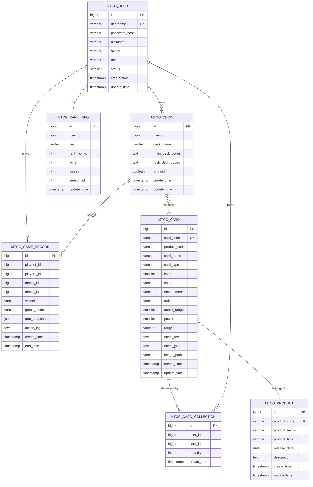
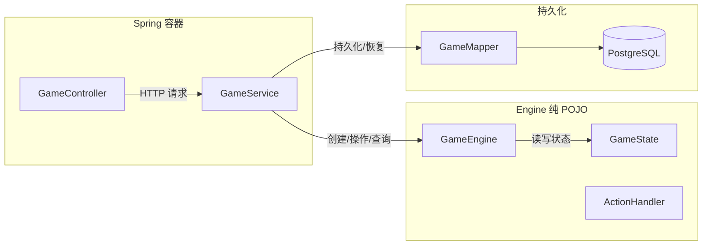
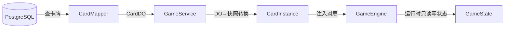

# 概要设计文档

> 项目：MTCG —《超英击战 / Hero Rush TCG》后端程序
> 版本：v0.1（草案）
> 日期：2026-07-30
> 依据：[需求分析文档](./01-需求分析.md)

---

## 1. 引言

### 1.1 目的

在需求分析基础上，定义系统模块划分、包结构、数据库模型、核心类设计和 API 规范，为详细设计和编码提供蓝图。

### 1.2 设计原则

| 原则 | 说明 |
| --- | --- |
| 引擎独立性 | `engine` 包纯 POJO，零 Spring 依赖，可独立单元测试 |
| 分层清晰 | Controller → Service → Manager → DAO，各层职责单一 |
| 规则可追溯 | 引擎代码注释标注规则条款编号（如 `// 303.2.a.4.3.1`） |
| 枚举优先 | 颜色、阶段、区域、效果类型等固定值用枚举，避免魔法值 |
| 枚举存储 | DB 存枚举名称字符串（如 `RED`），不存下标；配合 MyBatis-Flex 自动转换 + DB CHECK 约束 |
| 渐进式 | 先跑通基础流程（无效果），再叠加效果系统和关键词能力 |

---

## 2. 包结构

```
com.aris.mtcg
├── controller                  // API 接口层
│   ├── CardController                // 卡牌管理 API
│   ├── UserController                // 用户 API
│   ├── DeckController                // 卡组 API
│   ├── GameController                // 对战 API
│   ├── RankController                // 排位 API
│   ├── dto                           // 请求 DTO
│   ├── vo                            // 返回视图
│   └── global                        // 全局异常处理、响应包装
├── service                     // Service 业务层
│   ├── CardService / UserService / DeckService / GameService / RankService
│   └── impl                          // Service 实现类
├── manager                     // Manager 通用能力层
│   ├── AIManager                      // AI 决策封装
│   └── CacheManager                  // 缓存管理
├── engine                      // 引擎层（纯 POJO，不依赖 Spring）
│   ├── model                          // 状态模型
│   │   ├── GameState                  // 对局全局状态
│   │   ├── PlayerState                // 玩家状态
│   │   ├── CardInstance               // 卡牌实例（对局中的卡，含快照数据）
│   │   ├── FieldZone                  // 场上区域（战区+基地）
│   │   └── ActionLog                  // 操作流水记录
│   ├── phase                          // 回合阶段
│   │   ├── PhaseType                  // 阶段枚举
│   │   └── PhaseHandler               // 阶段处理器
│   ├── action                         // 操作
│   │   ├── ActionType                 // 操作类型枚举
│   │   └── ActionHandler              // 操作处理器
│   ├── combat                         // 战斗系统
│   │   ├── DistanceCalculator         // 距离计算
│   │   └── BattleResolver             // 战斗判定
│   ├── effect                         // 效果系统
│   │   ├── EffectType                 // 效果类型枚举
│   │   ├── EffectContext              // 效果结算上下文
│   │   └── EffectResolver             // 效果结算器
│   ├── keyword                        // 关键词能力
│   │   └── KeywordHandler             // 关键词处理器
│   └── rule                           // 规则常量与校验
│       ├── RuleConstants              // 规则常量
│       └── RuleValidator              // 规则校验器
├── dao                         // DAO 数据访问层
│   ├── CardMapper / UserMapper / DeckMapper / GameMapper / RankMapper
├── domain                      // 实体与 DO
│   ├── entity                         // 业务实体
│   └── do                             // 数据库 DO
│       ├── CardDO / UserDO / DeckDO / GameDO / RankDO
├── common                      // 公共模块
│   ├── enums                          // 全局枚举（Color、Rarity 等）
│   ├── result                         // 统一响应体
│   ├── exception                      // 业务异常
│   └── utils                          // 工具类
└── config                      // Spring 配置
    ├── SecurityConfig                 // 安全配置
    ├── MyBatisFlexConfig              // 数据访问配置
    └── SwaggerConfig                  // API 文档配置
```

**resources 目录**：

```
src/main/resources
├── application.yml              // Spring Boot 配置
├── application-dev.yml          // 开发环境
├── application-prod.yml         // 生产环境
├── db/
│   └── init.sql                 // 建表 SQL
└── mapper/                      // MyBatis XML（如需复杂 SQL）
```

---

## 3. 数据库设计

### 3.1 ER 图

> **设计约定**：不追求三大范式，允许适度冗余；不使用数据库外键约束，关系完整性在应用层校验。



### 3.2 表说明

| 表 | 说明 | 关键设计点 |
| --- | --- | --- |
| `mtcg_user` | 用户账号 | `role` 枚举：PLAYER / CARD_ADMIN / SYS_ADMIN / AI；`password_hash` BCrypt |
| `mtcg_card` | 卡牌统一表 | `card_type` 区分角色卡/冲击卡；`effect_json` 当前留空，后续解析 |
| `mtcg_product` | 卡牌产品表 | `product_type` 区分预组牌/补充包/推广包；`product_code` 唯一标识（如 SD01/BP01/PB01） |
| `mtcg_deck` | 卡组 | `main_deck_codes` / `rush_deck_codes` 存卡牌编号的 JSON 数组（D1 决策） |
| `mtcg_game_record` | 对局记录 | `turn_snapshot` JSONB 存每回合快照；`action_log` 存操作流水用于崩溃恢复和复盘（D2 决策） |
| `mtcg_rank_info` | 排位信息 | 按赛季隔离；`tier` 枚举：青铜/白银/黄金/铂金/钻石/大师/宗师 |
| `mtcg_card_collection` | 卡牌收藏 | 玩家拥有的卡牌登记，为 AI 构筑辅助提供数据 |

### 3.3 关键决策

| 决策 | 理由 |
| --- | --- |
| 角色卡和冲击卡合并为 `mtcg_card` 表 | 用 `card_type` 区分，避免双表查询；字段差异用 nullable 处理 |
| 卡组用 JSON 数组存卡牌编号 | 50 张 / 9 张固定规模，无需独立卡组明细表；存编号而非 ID，稳定可读、导入导出友好（D1） |
| 对局记录用操作流水 + 回合快照 | `action_log` 存操作流水用于复盘回放；`turn_snapshot` JSONB 每回合存快照用于崩溃恢复（D2） |
| 排位按赛季隔离 | `season_id` 区分赛季，支持历史归档 |
| 卡牌冗余存 `product_code` | 卡牌表直接存 `product_code` 而非外键关联 `mtcg_product` 表，方便按产品筛选卡牌；关系完整性在应用层校验，符合不使用数据库外键的整体设计约定 |

---

## 4. 核心类设计

### 4.1 引擎状态模型

```java
// 对局全局状态
public class GameState {
    private String gameId;
    private PlayerState activePlayer;      // 当前回合玩家
    private PlayerState inactivePlayer;     // 非当前回合玩家
    private int turnCount;
    private PhaseType currentPhase;
    private GameStatus status;              // WAITING / IN_PROGRESS / FINISHED
    private List<ActionLog> actionLog;      // 操作流水（复盘用）
}

// 玩家状态
public class PlayerState {
    private String playerId;
    private boolean isFirstPlayer;           // 是否先攻
    private List<CardInstance> deck;         // 卡组
    private List<CardInstance> rushDeck;     // 冲击卡组
    private List<CardInstance> hand;         // 手牌
    private List<CardInstance> timeline;     // 时间线
    private List<CardInstance> retreat;      // 撤退区
    private List<CardInstance> voidZone;     // 虚空区
    private FieldZone field;                 // 场上（战区+基地）
    // 行动阶段计数器
    private int baseDeployCount;             // 基地部署次数
    private int summonCount;                 // 行动号召次数
}

// 场上区域
public class FieldZone {
    private CardInstance vanguard;           // 先锋区（1）
    private CardInstance[] flank;            // 侧翼区（2）
    private CardInstance rearguard;          // 后卫区（1）
    private List<CardInstance> base;         // 基地区（上限 6）
}

// 卡牌实例（对局中所有卡牌的统一表示）
// 无论在哪个区域（手牌、卡组、场上、撤退区），都用 CardInstance 表示
// 场上卡牌比其他区域多了状态标记字段
public class CardInstance {
    // === 卡牌快照（从 DB 加载，对局中不可变） ===
    private String cardCode;                 // 卡牌编号
    private String cardName;                 // 名称
    private int level;                       // 等级
    private Color color;                     // 颜色
    private int attackRange;                 // 原始 R
    private int power;                       // 原始战力
    private List<Keyword> keywords;          // 关键词能力
    private String effectText;               // 效果原文

    // === 运行时状态（仅场上卡牌使用） ===
    private Zone currentZone;                // 当前区域
    private int currentPower;                // 当前战力（受效果影响）
    private int currentRange;                // 当前 R（受效果影响）
    private boolean enteredThisTurn;         // 本回合进场
    private boolean movedThisTurn;           // 本回合已战基移动
    private int attackUsed;                  // 本回合已攻击次数（连击=2）
    private boolean interceptUsed;           // 本回合已拦截
    private boolean isFaceDown;              // 是否盖卡
    private List<CardInstance> attachedCards; // 结附卡列表（按顺序，不可改变）
}
```

> **CardInstance 说明**：对局中所有卡牌统一用 `CardInstance` 表示。卡牌快照部分从数据库加载后不可变（对局中不查 DB），运行时状态部分仅场上卡牌使用。这样引擎完全自包含，无需访问数据库。

### 4.2 枚举设计

```java
// 颜色（201.5）
public enum Color { RED, YELLOW, BLUE, GREEN, ORANGE, PURPLE }

// 稀有度（201.14）
public enum Rarity { C, R, SR, GR, UR, MR, SEC, HR, LR, PR, ER, TR }

// 产品类型
public enum EnumProductType { STRUCTURE_DECK, BOOSTER_PACK, PROMO_PACK }

// 回合阶段（303.2.a）
public enum PhaseType { TURN_START, DRAW, ACTION, COMBAT, RESPONSE, TURN_END }

// 区域
public enum Zone {
    // 战区
    VANGUARD, FLANK_LEFT, FLANK_RIGHT, REARGUARD,
    // 基地
    BASE,
    // 场外
    DECK, RUSH_DECK, HAND, TIMELINE, RETREAT, VOID
}

// 效果类型（201.10）
public enum EffectType { TRIGGER, CONTINUOUS, ACTIVATED, RESPONSE_ACTIVATED }

// 关键词能力（305）
public enum Keyword { RESPONSE, INTERCEPT, COMBO, ASSAULT, AIR_STRIKE, UNIQUE }

// 操作类型（对战 API）
public enum ActionType {
    MULLIGAN,               // 调度
    BASE_DEPLOY,            // 基地部署
    SUMMON,                 // 行动号召
    COMBAT_BASE_MOVE,       // 战基移动
    ACTIVATE_EFFECT,        // 启动效果
    SET_FACE_DOWN,          // 盖卡
    FLIP_FACE_UP,           // 翻开盖卡
    ATTACH,                 // 结附
    DETACH,                 // 解除结附
    COMBAT_ADJUST,          // 调整位置
    ATTACK,                 // 攻击
    RESPONSE_SUMMON,        // 应对号召
    INTERCEPT,              // 拦截
    PASS,                   // 不行动
    END_PHASE,              // 宣布结束
    SURRENDER               // 认输
}
```

### 4.3 距离计算（引擎核心）

```java
// 规则 303.2.a.4.3.1.1.1–5
// 6 个位置构成线性路径，相邻距离均为 1
// 己后卫 ─ 己侧翼 ─ 己先锋 ─ 敌先锋 ─ 敌侧翼 ─ 敌后卫

public class DistanceCalculator {
    // 位置索引：0=己后卫, 1=己侧翼, 2=己先锋, 3=敌先锋, 4=敌侧翼, 5=敌后卫
    private static final int[] PATH = {0, 1, 2, 3, 4, 5};

    public static int distance(Zone attacker, Zone target) {
        return Math.abs(indexOf(attacker) - indexOf(target));
    }
}
```

**距离矩阵**：

| 攻击方 ＼ 目标 | 敌先锋 | 敌侧翼 | 敌后卫 |
| --- | --- | --- | --- |
| **己先锋** | 1 | 2 | 3 |
| **己侧翼** | 2 | 3 | 4 |
| **己后卫** | 3 | 4 | 5 |

---

## 5. API 设计

### 5.1 接口规范

- 统一前缀：`/api/v1`
- 统一响应体：

```json
{
  "code": 200,
  "message": "success",
  "data": {}
}
```

- 鉴权：除注册/登录外，所有接口需携带 `Authorization: Bearer <token>`
- 分页：`?page=1&size=20`

### 5.2 接口清单

| 模块 | 方法 | 路径 | 说明 | 需求 |
| --- | --- | --- | --- | --- |
| **卡牌** | GET | `/cards` | 查询卡牌列表（分页+筛选，支持 productCode 筛选） | FR1.3 |
| | GET | `/cards/{id}` | 查询卡牌详情 | FR1.1 |
| | POST | `/cards` | 新增卡牌（管理员） | FR1.1 |
| | PUT | `/cards/{id}` | 修改卡牌（管理员） | FR1.1 |
| | DELETE | `/cards/{id}` | 删除卡牌（管理员） | FR1.1 |
| | POST | `/cards/batch` | 批量导入（管理员） | FR1.4 |
| **产品** | GET | `/products` | 产品列表 | FR1.5 |
| | GET | `/products/{code}` | 产品详情 | FR1.5 |
| | POST | `/products` | 新增产品（管理员） | FR1.5 |
| | PUT | `/products/{code}` | 修改产品（管理员） | FR1.5 |
| **用户** | POST | `/auth/register` | 注册 | FR5.1 |
| | POST | `/auth/login` | 登录 | FR5.2 |
| | GET | `/users/me` | 查看个人资料 | FR5.3 |
| | PUT | `/users/me` | 修改个人资料 | FR5.3 |
| **卡组** | GET | `/decks` | 我的卡组列表 | FR2.3 |
| | POST | `/decks` | 创建卡组 | FR2.1 |
| | PUT | `/decks/{id}` | 编辑卡组 | FR2.1 |
| | DELETE | `/decks/{id}` | 删除卡组 | FR2.1 |
| | POST | `/decks/{id}/validate` | 校验卡组合法性 | FR2.2 |
| | GET | `/collections` | 查看卡牌收藏 | FR2.5 |
| | POST | `/collections` | 登记卡牌收藏 | FR2.5 |
| **对战** | POST | `/games` | 创建对局 | FR4.1 |
| | GET | `/games/{id}` | 查询对局状态 | FR4.2 |
| | POST | `/games/{id}/actions` | 执行操作 | FR4.3 |
| | POST | `/games/{id}/surrender` | 认输 | FR4.4 |
| | GET | `/games/{id}/replay` | 获取复盘数据 | FR4.5 |
| **排位** | GET | `/rank/me` | 查看我的段位 | FR9.1 |
| | POST | `/rank/match` | 匹配对手 | FR9.2 |
| | GET | `/rank/leaderboard` | 排行榜 | FR9.3 |
| **AI** | POST | `/ai/games` | 创建 AI 对局 | FR6.1 |
| | GET | `/ai/config` | 查询 AI 配置项 | FR6.1.5 |
| | PUT | `/ai/config` | 设置 AI 配置 | FR6.1.5 |

---

## 6. 引擎与 Spring 的解耦



**解耦要点**：

| 要点 | 说明 |
| --- | --- |
| `GameEngine` 是纯 POJO | 无 `@Component` / `@Service` 注解，通过 `new` 或工厂创建 |
| `GameService` 做桥接 | Spring 管理生命周期，将 HTTP 请求翻译为引擎操作 |
| 状态持久化由 Service 负责 | 引擎不关心存储，Service 在操作后调用 Mapper 持久化 |
| 引擎可独立测试 | 无需启动 Spring 容器，直接 `new GameEngine()` 单元测试 |

### 6.1 卡牌数据流向

引擎自包含，对局中不访问数据库。卡牌数据在对局初始化时一次性加载为快照：



| 步骤 | 说明 |
| --- | --- |
| 1. 加载 | GameService 根据 deck 中的 cardCode 列表，批量查 CardMapper 获取 CardDO |
| 2. 转换 | CardDO → CardInstance（复制 level/power/color 等为快照数据） |
| 3. 注入 | CardInstance 列表交给 GameEngine 初始化 GameState（洗牌、发牌） |
| 4. 运行 | 引擎运行期间只操作 CardInstance 的运行时状态，不再查 DB |
| 5. 持久化 | 每回合结束 GameService 从 GameState 取快照 + 流水存入 game_record |

---

## 7. 配置与构建

### 7.1 核心依赖（pom.xml）

| 依赖 | 说明 |
| --- | --- |
| spring-boot-starter-web | REST API |
| spring-boot-starter-validation | 参数校验 |
| mybatis-flex-spring-boot3-starter | ORM |
| postgresql | PostgreSQL 驱动 |
| spring-boot-starter-security | 鉴权（迭代二引入） |
| jjwt | JWT Token（迭代二引入） |
| lombok | 简化代码 |
| fastjson2 | JSON 序列化 |
| springdoc-openapi-starter-webmvc-ui | API 文档（Swagger UI） |
| spring-boot-starter-test | 单元测试 |

### 7.2 关键配置（application.yml）

```yaml
spring:
  datasource:
    url: jdbc:postgresql://localhost:5432/mtcg
    username: mtcg
    password: mtcg
    driver-class-name: org.postgresql.Driver
  jackson:
    default-property-inclusion: non_null     # 序列化忽略 null 字段

mybatis-flex:
  global-config:
    print-banner: false

server:
  port: 8080
  servlet:
    context-path: /api/v1                    # 统一前缀
```

> `context-path: /api/v1` 使所有接口自动带 `/api/v1` 前缀，无需每个 Controller 手写。

---

## 8. 迭代一实现范围

迭代一聚焦卡牌数据落地，涉及：

| 组件 | 内容 |
| --- | --- |
| `mtcg_card` 表建表 SQL | 合并角色卡/冲击卡，`card_type` 区分 |
| `CardDO` | 数据库映射实体 |
| `CardMapper` | MyBatis-Flex Mapper |
| `CardService` | 业务逻辑：CRUD + 条件查询 + 批量导入 |
| `CardController` | REST API：`/api/v1/cards` |
| 枚举 | `Color`、`Rarity`、`CardType` |
| 统一响应体 | `Result<T>` + 全局异常处理 |

不涉及：用户、卡组、引擎、对战。

---

## 9. 已确认决策

| 编号 | 问题 | 决策 | 理由 |
| --- | --- | --- | --- |
| D1 | 卡组存卡牌 ID 还是编号 | **存编号** | 稳定、可读、导入导出友好；查询用缓存解决 |
| D2 | 对局状态持久化粒度 | **操作流水 + 回合快照** | 每次操作追加流水（轻量），每回合存快照（JSONB）；崩溃恢复=快照+重放流水；复盘按流水逐条回放 |
| D3 | AI 对战集成方式 | **同进程调用** | 当前阶段 AI 为规则/启发式，计算量小；引擎纯 POJO 直接调用最自然；远期拆分时再改微服务 |
