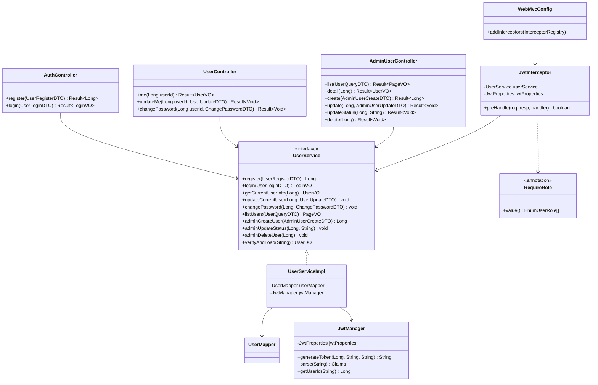

# 详细设计：迭代一 — 用户系统与用户管理

> 项目：MTCG 后端程序
> 版本：v0.2
> 日期：2026-08-03
> 依据：[需求分析](./01-需求分析.md) FR5.1–FR5.2、FR7.1–FR7.3、FR8.1、[概要设计](./02-概要设计.md) §3 §5 §8

---

## 1. 概述

### 1.1 迭代目标

交付「管理后台能登录、能管用户」的最小闭环。登录注册与用户管理 CRUD 一次做完——同操作 `mtcg_user` 表，共用 `UserService` / `UserMapper`，不拆分。同时建立后端基础设施（统一响应、全局异常、枚举体系、JWT 鉴权、RBAC 权限），为后续所有迭代奠定地基。

### 1.2 范围

| 包含 | 不包含 |
| --- | --- |
| `mtcg_user` / `mtcg_card` / `mtcg_product` 三张表建表 | 卡牌/产品 CRUD 接口（迭代二） |
| `EnumUserRole` / `EnumUserStatus` 枚举 + 卡牌相关枚举 | 卡组构筑（迭代三） |
| UserDO / DTO / VO 实体（含管理员管理用 DTO/VO） | 头像系统、消息通知（迭代九） |
| UserMapper（MyBatis-Flex） | OAuth / 第三方登录 |
| JwtManager（Token 生成/验证） | WebSocket 鉴权 |
| UserService（注册/登录/资料/改密 + 管理员 CRUD/启用禁用/删除） | 细粒度权限（资源级 ACL） |
| AuthController / UserController / AdminUserController | |
| JwtInterceptor + `@RequireRole` 注解 + WebMvcConfig | |
| 统一响应体 `Result<T>` + 全局异常处理 + `ErrorCode` | |

### 1.3 对应需求

| 需求 | 说明 | 实现 |
| --- | --- | --- |
| FR5.1 | 注册（用户名/密码） | `POST /auth/register`，密码 BCrypt 加密 |
| FR5.2 | 登录（获取 Token） | `POST /auth/login`，签发 JWT |
| FR7.1 | 角色定义 | `EnumUserRole`：PLAYER/CARD_ADMIN/SYS_ADMIN/AI |
| FR7.2 | 接口鉴权 | JwtInterceptor 校验 Token + `@RequireRole` 角色控制 |
| FR7.3 | 权限隔离 | `/users/me` 以 Token 中的 userId 为准；管理员接口 `@RequireRole(SYS_ADMIN)` |
| FR8.1 | 用户管理 | `GET /admin/users` 分页查询；`POST /admin/users` 新增；`PUT /admin/users/{id}` 修改；`PATCH /admin/users/{id}/status` 启用/禁用；`DELETE /admin/users/{id}` 删除 |

### 1.4 关键决策

| 编号 | 决策 | 理由 |
| --- | --- | --- |
| D1 | 不引入 Spring Security，自实现 JWT | 项目当前为纯 REST，Security 过滤链过重；JWT 用 jjwt 自管，拦截器+注解即可覆盖 RBAC；快速开发优先 |
| D2 | 密码用 BCrypt（`spring-security-crypto`） | 仅引入加密工具模块，不引入 Security 过滤链；BCrypt 自带盐、抗彩虹表 |
| D3 | role / status 用 VARCHAR 存枚举名 + CHECK 约束 | 可读、稳定，配合枚举 code 直存；CHECK 兜底防脏数据 |
| D4 | 不建外键 | 遵循概要设计 §3.1 约定，关系完整性在应用层校验 |
| D5 | Token 通过 `Authorization: Bearer <token>` 传递 | REST 通用方案，无状态、易横向扩展 |
| D6 | 当前用户身份由拦截器写入 Request 属性 | Controller 用 `@RequestAttribute` 取用，避免魔法字符串 |
| D7 | 登录注册与用户管理统一在 `UserService` | 同操作 `mtcg_user` 表，共用 Mapper/密码加密/JWT，不拆分为两个 Service |
| D8 | 三张表一次建完 | `mtcg_card` / `mtcg_product` 虽迭代二才用，但提前建表避免后续 DDL 变更 |

---

## 2. 数据库设计

### 2.1 建表 SQL（三张表一次建完）

```sql
-- =====================================================
-- 用户表（本迭代核心）
-- 注意：user 是 PostgreSQL 保留字，建表与查询均须加双引号
-- =====================================================
CREATE TABLE "mtcg_user" (
    id              BIGSERIAL       PRIMARY KEY,
    username        VARCHAR(32)     NOT NULL,                          -- 登录用户名
    password_hash   VARCHAR(72)     NOT NULL,                          -- BCrypt 密文（60 字符，72 留余量）
    nickname        VARCHAR(64),                                       -- 昵称
    avatar          VARCHAR(256),                                      -- 头像 URL（迭代九完善头像系统）
    role            VARCHAR(16)     NOT NULL DEFAULT 'PLAYER',         -- 角色：PLAYER/CARD_ADMIN/SYS_ADMIN/AI
    status          VARCHAR(16)     NOT NULL DEFAULT 'ACTIVE',         -- 状态：ACTIVE/DISABLED
    create_time     TIMESTAMP       NOT NULL DEFAULT NOW(),
    update_time     TIMESTAMP       NOT NULL DEFAULT NOW(),
    CONSTRAINT uk_user_username UNIQUE (username),
    CONSTRAINT ck_user_role   CHECK (role   IN ('PLAYER','CARD_ADMIN','SYS_ADMIN','AI')),
    CONSTRAINT ck_user_status CHECK (status IN ('ACTIVE','DISABLED'))
);

CREATE INDEX idx_user_role ON "mtcg_user" (role);

-- 初始化默认管理员（密码：admin123）
-- BCrypt hash 需在应用启动时由代码写入，此处仅占位
INSERT INTO "mtcg_user" (username, password_hash, nickname, role, status)
VALUES ('admin', '$2a$10$N.zmdr9k7uOCQb376NoUnuTJ8iAt6Z5EHsM8lE9lBOsl7iAt6Z5EH', '系统管理员', 'SYS_ADMIN', 'ACTIVE')
ON CONFLICT (username) DO NOTHING;

-- =====================================================
-- 卡牌表（迭代二使用，本迭代先建空表）
-- =====================================================
CREATE TABLE IF NOT EXISTS mtcg_card (
    id              BIGSERIAL       PRIMARY KEY,
    card_code       VARCHAR(32)     NOT NULL UNIQUE,
    product_code    VARCHAR(16),
    card_name       VARCHAR(128)    NOT NULL,
    card_type       VARCHAR(16)     NOT NULL,
    level           SMALLINT,
    color           VARCHAR(16),
    environment     VARCHAR(16),
    traits          VARCHAR(256),
    attack_range    SMALLINT,
    power           SMALLINT,
    rarity          VARCHAR(16)     NOT NULL,
    effect_text     TEXT,
    effect_json     TEXT,
    image_path      VARCHAR(256),
    create_time     TIMESTAMP       NOT NULL DEFAULT NOW(),
    update_time     TIMESTAMP       NOT NULL DEFAULT NOW(),
    CONSTRAINT ck_card_type CHECK (card_type IN ('CHARACTER', 'RUSH_POINT')),
    CONSTRAINT ck_color     CHECK (color IS NULL OR color IN ('RED','YELLOW','BLUE','GREEN','ORANGE','PURPLE')),
    CONSTRAINT ck_rarity    CHECK (rarity IN ('C','R','SR','GR','UR','MR','SEC','HR','LR','PR','ER','TR')),
    CONSTRAINT ck_level     CHECK (level IS NULL OR (level >= 1 AND level <= 6))
);

CREATE INDEX idx_card_type    ON mtcg_card (card_type);
CREATE INDEX idx_card_product ON mtcg_card (product_code);

-- =====================================================
-- 产品表（迭代二使用，本迭代先建空表）
-- 卡包/商品系列目录，如 BP01 复仇者联盟补充包、SD01 蜘蛛侠预组牌
-- =====================================================
CREATE TABLE IF NOT EXISTS mtcg_product (
    id              BIGSERIAL       PRIMARY KEY,
    product_code    VARCHAR(16)     NOT NULL UNIQUE,
    product_name    VARCHAR(128)    NOT NULL,
    release_date    DATE,
    description     TEXT,
    create_time     TIMESTAMP       NOT NULL DEFAULT NOW(),
    update_time     TIMESTAMP       NOT NULL DEFAULT NOW()
);

-- =====================================================
-- 触发器：update_time 自动更新（三表共用一个函数）
-- =====================================================
CREATE OR REPLACE FUNCTION update_update_time()
RETURNS TRIGGER AS $$
BEGIN
    NEW.update_time = NOW();
    RETURN NEW;
END;
$$ LANGUAGE plpgsql;

DROP TRIGGER IF EXISTS trigger_user_update_time ON "mtcg_user";
CREATE TRIGGER trigger_user_update_time
    BEFORE UPDATE ON "mtcg_user" FOR EACH ROW EXECUTE FUNCTION update_update_time();

DROP TRIGGER IF EXISTS trigger_card_update_time ON mtcg_card;
CREATE TRIGGER trigger_card_update_time
    BEFORE UPDATE ON mtcg_card FOR EACH ROW EXECUTE FUNCTION update_update_time();

DROP TRIGGER IF EXISTS trigger_product_update_time ON mtcg_product;
CREATE TRIGGER trigger_product_update_time
    BEFORE UPDATE ON mtcg_product FOR EACH ROW EXECUTE FUNCTION update_update_time();
```

### 2.2 字段说明（mtcg_user）

| 字段 | 类型 | 说明 |
| --- | --- | --- |
| id | BIGSERIAL | 主键，自增 |
| username | VARCHAR(32) | 登录名，唯一，注册时校验长度 3–32 |
| password_hash | VARCHAR(72) | BCrypt 密文，永不明文存储、永不返回给前端 |
| nickname | VARCHAR(64) | 展示昵称，可空，可修改 |
| avatar | VARCHAR(256) | 头像 URL，迭代九完善头像系统 |
| role | VARCHAR(16) | 角色枚举 code，默认 PLAYER |
| status | VARCHAR(16) | 账号状态，默认 ACTIVE；DISABLED 禁止登录 |
| create_time | TIMESTAMP | 创建时间 |
| update_time | TIMESTAMP | 更新时间，触发器自动维护 |

---

## 3. 枚举设计

> 遵循现有 `EnumCardType` 规范：`code`（存 DB）+ `desc`（中文说明），`@Getter` + 全参构造，放在 `com.aris.mtcg.common.enums` 包下。DB 存枚举 `code` 字符串。

### 3.1 EnumUserRole（本迭代核心）

```java
package com.aris.mtcg.common.enums;

import lombok.Getter;

@Getter
public enum EnumUserRole {
    PLAYER("PLAYER", "玩家"),
    CARD_ADMIN("CARD_ADMIN", "卡牌管理员"),
    SYS_ADMIN("SYS_ADMIN", "系统管理员"),
    AI("AI", "AI玩家");

    private final String code;
    private final String desc;

    EnumUserRole(String code, String desc) {
        this.code = code;
        this.desc = desc;
    }

    public static EnumUserRole of(String code) {
        if (code == null) return null;
        for (EnumUserRole role : values()) {
            if (role.code.equals(code)) return role;
        }
        return null;
    }
}
```

### 3.2 EnumUserStatus

```java
package com.aris.mtcg.common.enums;

import lombok.Getter;

@Getter
public enum EnumUserStatus {
    ACTIVE("ACTIVE", "正常"),
    DISABLED("DISABLED", "禁用");

    private final String code;
    private final String desc;

    EnumUserStatus(String code, String desc) {
        this.code = code;
        this.desc = desc;
    }

    public static EnumUserStatus of(String code) {
        if (code == null) return null;
        for (EnumUserStatus status : values()) {
            if (status.code.equals(code)) return status;
        }
        return null;
    }
}
```

### 3.3 卡牌相关枚举（迭代二使用，本迭代顺便建好）

`EnumCardType`（CHARACTER/RUSH_POINT）、`EnumColor`（6 色）、`EnumRarity`（12 种）—— 结构同上，详见 [迭代二详细设计](./04-详细设计-迭代二-卡牌与产品管理.md) §3。

> **注意**：产品（卡包/商品系列）由 `mtcg_product` 表管理，不使用固定枚举，详见迭代二设计。

---

## 4. 实体类设计

### 4.1 UserDO

```java
package com.aris.mtcg.domain.entity;

import com.mybatisflex.annotation.Id;
import com.mybatisflex.annotation.KeyType;
import com.mybatisflex.annotation.Table;
import lombok.Data;
import java.time.LocalDateTime;

@Data
@Table("\"mtcg_user\"")
public class UserDO {
    @Id(keyType = KeyType.Auto)
    private Long id;
    private String username;
    private String passwordHash;   // BCrypt 密文，永不返回前端
    private String nickname;
    private String avatar;
    private String role;           // EnumUserRole.code
    private String status;         // EnumUserStatus.code
    private LocalDateTime createTime;
    private LocalDateTime updateTime;
}
```

### 4.2 DTO 清单

| DTO | 用途 | 字段 |
| --- | --- | --- |
| `UserRegisterDTO` | 注册请求 | username(@NotBlank @Length 3-32)、password(@NotBlank @Length 6-32)、nickname(@Length max 64) |
| `UserLoginDTO` | 登录请求 | username(@NotBlank)、password(@NotBlank) |
| `UserUpdateDTO` | 修改个人资料 | nickname(@Length max 64)、avatar(@Length max 256) |
| `ChangePasswordDTO` | 修改密码 | oldPassword(@NotBlank)、newPassword(@NotBlank @Length 6-32) |
| `UserQueryDTO` | 管理员列表查询 | username(模糊)、role(精确)、status(精确)、page=1、size=20 |
| `AdminUserCreateDTO` | 管理员新增用户 | username(@NotBlank)、password(@NotBlank)、nickname、role(@NotBlank) |
| `AdminUserUpdateDTO` | 管理员修改用户 | nickname、role、status |

```java
// UserRegisterDTO 示例（其余同理）
@Data
public class UserRegisterDTO {
    @NotBlank(message = "用户名不能为空")
    @Length(min = 3, max = 32, message = "用户名长度需为 3-32")
    private String username;

    @NotBlank(message = "密码不能为空")
    @Length(min = 6, max = 32, message = "密码长度需为 6-32")
    private String password;

    @Length(max = 64, message = "昵称长度不能超过 64")
    private String nickname;
}
```

### 4.3 VO 清单

| VO | 用途 | 字段 |
| --- | --- | --- |
| `LoginVO` | 登录返回 | token(String)、user(UserVO) |
| `UserVO` | 用户视图（不含密码） | id、username、nickname、avatar、role、status、createTime |

```java
@Data
public class UserVO {
    private Long id;
    private String username;
    private String nickname;
    private String avatar;
    private String role;
    private String status;
    private LocalDateTime createTime;
}

@Data
public class LoginVO {
    private String token;
    private UserVO user;
}
```

---

## 5. DAO 层设计

### 5.1 UserMapper

```java
package com.aris.mtcg.dao;

import com.aris.mtcg.domain.entity.UserDO;
import com.mybatisflex.core.BaseMapper;
import org.apache.ibatis.annotations.Mapper;

@Mapper
public interface UserMapper extends BaseMapper<UserDO> {
    // 自定义方法：无（条件查询用 QueryWrapper）
}
```

---

## 6. Manager 层设计（JWT）

### 6.1 JwtProperties（配置绑定）

```java
package com.aris.mtcg.config;

import lombok.Data;
import org.springframework.boot.context.properties.ConfigurationProperties;
import org.springframework.stereotype.Component;

@Data
@Component
@ConfigurationProperties(prefix = "mtcg.jwt")
public class JwtProperties {
    private String secret = "changeme-please-use-a-long-random-secret-key-32chars";
    private long expireMinutes = 120;
    private String header = "Authorization";
    private String tokenPrefix = "Bearer ";
}
```

对应 `application.yml` 新增：

```yaml
mtcg:
  jwt:
    secret: ${MTCG_JWT_SECRET:changeme-please-use-a-long-random-secret-key-32chars}
    expire-minutes: 120
    header: Authorization
    token-prefix: "Bearer "
```

### 6.2 JwtManager

```java
package com.aris.mtcg.manager;

@Component
public class JwtManager {

    public static final String CLAIM_USER_ID  = "userId";
    public static final String CLAIM_USERNAME = "username";
    public static final String CLAIM_ROLE     = "role";

    @Resource
    private JwtProperties jwtProperties;

    private SecretKey getKey() {
        return Keys.hmacShaKeyFor(jwtProperties.getSecret().getBytes(StandardCharsets.UTF_8));
    }

    /** 生成 Token */
    public String generateToken(Long userId, String username, String role) {
        long now = System.currentTimeMillis();
        long expireAt = now + jwtProperties.getExpireMinutes() * 60_000L;
        return Jwts.builder()
                .claim(CLAIM_USER_ID, userId)
                .claim(CLAIM_USERNAME, username)
                .claim(CLAIM_ROLE, role)
                .setIssuedAt(new Date(now))
                .setExpiration(new Date(expireAt))
                .signWith(getKey())
                .compact();
    }

    /** 解析 Token，无效或过期抛 BusinessException */
    public Claims parse(String token) {
        try {
            return Jwts.parser()
                    .verifyWith(getKey())
                    .build()
                    .parseSignedClaims(token)
                    .getPayload();
        } catch (Exception e) {
            throw new BusinessException(ErrorCode.UNAUTHORIZED, "Token 无效或已过期");
        }
    }

    public Long getUserId(String token) {
        return parse(token).get(CLAIM_USER_ID, Long.class);
    }

    public String getRole(String token) {
        return parse(token).get(CLAIM_ROLE, String.class);
    }
}
```

### 6.3 依赖（pom.xml 新增）

```xml
<!-- JWT -->
<dependency>
    <groupId>io.jsonwebtoken</groupId>
    <artifactId>jjwt-api</artifactId>
    <version>0.12.6</version>
</dependency>
<dependency>
    <groupId>io.jsonwebtoken</groupId>
    <artifactId>jjwt-impl</artifactId>
    <version>0.12.6</version>
    <scope>runtime</scope>
</dependency>
<dependency>
    <groupId>io.jsonwebtoken</groupId>
    <artifactId>jjwt-jackson</artifactId>
    <version>0.12.6</version>
    <scope>runtime</scope>
</dependency>
<!-- BCrypt 加密工具（仅 crypto 模块，不引入 Spring Security 过滤链） -->
<dependency>
    <groupId>org.springframework.security</groupId>
    <artifactId>spring-security-crypto</artifactId>
</dependency>
```

---

## 7. Service 层设计

### 7.1 UserService 接口（统一玩家自操作 + 管理员操作）

```java
package com.aris.mtcg.service;

public interface UserService {
    // === 匿名（注册/登录）===
    Long register(UserRegisterDTO dto);
    LoginVO login(UserLoginDTO dto);

    // === 登录用户（自操作）===
    UserVO getCurrentUserInfo(Long userId);
    void updateCurrentUser(Long userId, UserUpdateDTO dto);
    void changePassword(Long userId, ChangePasswordDTO dto);

    // === 管理员操作 ===
    PageVO<UserVO> listUsers(UserQueryDTO query);
    UserVO getUserById(Long id);
    Long adminCreateUser(AdminUserCreateDTO dto);
    void adminUpdateUser(Long id, AdminUserUpdateDTO dto);
    void adminUpdateStatus(Long id, String status);
    void adminDeleteUser(Long id);

    // === 拦截器调用 ===
    UserDO verifyAndLoad(String token);
}
```

### 7.2 业务逻辑

| 方法 | 逻辑 |
| --- | --- |
| register | 1. 按 username 查重 → 已存在抛 `用户名已存在`<br>2. BCrypt 加密密码<br>3. 组装 UserDO（role=PLAYER、status=ACTIVE）<br>4. insert → 返回 id |
| login | 1. 按 username 查用户 → 不存在抛 `用户名或密码错误`<br>2. 校验 status=ACTIVE → 否则抛 `账号已被禁用`<br>3. BCrypt 校验密码 → 不匹配抛 `用户名或密码错误`<br>4. JwtManager 生成 token<br>5. 组装 LoginVO 返回 |
| getCurrentUserInfo | selectOneById → DO → VO |
| updateCurrentUser | selectOneById 校验存在 → 仅拷贝 nickname/avatar 非空字段 → updateById |
| changePassword | 1. selectOneById 校验存在<br>2. BCrypt matches 校验原密码 → 不匹配抛 `原密码错误`<br>3. encode 新密码 → updateById |
| listUsers | 1. 构造 QueryWrapper（username LIKE / role 精确 / status 精确）<br>2. 按 create_time 倒序<br>3. paginate 分页<br>4. DO → VO 列表 |
| getUserById | selectOneById → 不存在抛 `用户不存在` → VO |
| adminCreateUser | 1. username 查重<br>2. 校验 role 合法（EnumUserRole.of）<br>3. BCrypt 加密密码<br>4. 组装 UserDO（指定 role、status=ACTIVE）<br>5. insert |
| adminUpdateUser | 1. selectOneById 校验存在<br>2. 禁止修改 SYS_ADMIN 的 role（防降级锁死）<br>3. 拷贝 nickname/role/status 非空字段<br>4. updateById |
| adminUpdateStatus | 1. selectOneById 校验存在<br>2. **禁止禁用 SYS_ADMIN 账号**（防后台锁死）<br>3. **禁止禁用自己**（当前操作人）<br>4. updateById 仅改 status |
| adminDeleteUser | 1. selectOneById 校验存在<br>2. **禁止删除 SYS_ADMIN 账号**<br>3. **禁止删除自己**<br>4. deleteById |
| verifyAndLoad | 1. JwtManager.parse(token) 取 userId<br>2. selectOneById → 不存在/已禁用抛 UNAUTHORIZED<br>3. 返回 UserDO |

> 安全要点：登录失败统一返回"用户名或密码错误"，不区分用户名是否存在，防枚举。

### 7.3 UserServiceImpl 核心代码

```java
package com.aris.mtcg.service.impl;

@Service
public class UserServiceImpl implements UserService {

    private static final BCryptPasswordEncoder PASSWORD_ENCODER = new BCryptPasswordEncoder();

    @Resource
    private UserMapper userMapper;
    @Resource
    private JwtManager jwtManager;

    // === 注册 ===
    @Override
    public Long register(UserRegisterDTO dto) {
        if (existsByUsername(dto.getUsername())) {
            throw new BusinessException(ErrorCode.PARAMS_ERROR, "用户名已存在");
        }
        UserDO userDO = new UserDO();
        userDO.setUsername(dto.getUsername());
        userDO.setPasswordHash(PASSWORD_ENCODER.encode(dto.getPassword()));
        userDO.setNickname(dto.getNickname());
        userDO.setRole(EnumUserRole.PLAYER.getCode());
        userDO.setStatus(EnumUserStatus.ACTIVE.getCode());
        userMapper.insert(userDO);
        return userDO.getId();
    }

    // === 登录 ===
    @Override
    public LoginVO login(UserLoginDTO dto) {
        UserDO userDO = userMapper.selectOneByQuery(
                QueryWrapper.create().eq("username", dto.getUsername()));
        if (userDO == null) {
            throw new BusinessException(ErrorCode.PARAMS_ERROR, "用户名或密码错误");
        }
        if (!EnumUserStatus.ACTIVE.getCode().equals(userDO.getStatus())) {
            throw new BusinessException(ErrorCode.FORBIDDEN, "账号已被禁用");
        }
        if (!PASSWORD_ENCODER.matches(dto.getPassword(), userDO.getPasswordHash())) {
            throw new BusinessException(ErrorCode.PARAMS_ERROR, "用户名或密码错误");
        }
        String token = jwtManager.generateToken(userDO.getId(), userDO.getUsername(), userDO.getRole());
        LoginVO loginVO = new LoginVO();
        loginVO.setToken(token);
        loginVO.setUser(toVO(userDO));
        return loginVO;
    }

    // === 修改密码 ===
    @Override
    public void changePassword(Long userId, ChangePasswordDTO dto) {
        UserDO userDO = loadOrThrow(userId);
        if (!PASSWORD_ENCODER.matches(dto.getOldPassword(), userDO.getPasswordHash())) {
            throw new BusinessException(ErrorCode.PARAMS_ERROR, "原密码错误");
        }
        UserDO update = new UserDO();
        update.setId(userId);
        update.setPasswordHash(PASSWORD_ENCODER.encode(dto.getNewPassword()));
        userMapper.updateById(update);
    }

    // === 管理员：分页查询用户 ===
    @Override
    public PageVO<UserVO> listUsers(UserQueryDTO query) {
        QueryWrapper qw = QueryWrapper.create();
        if (query.getUsername() != null && !query.getUsername().isBlank()) {
            qw.like("username", query.getUsername());
        }
        if (query.getRole() != null && !query.getRole().isBlank()) {
            qw.eq("role", query.getRole());
        }
        if (query.getStatus() != null && !query.getStatus().isBlank()) {
            qw.eq("status", query.getStatus());
        }
        qw.orderBy("create_time", false);

        int page = query.getPage() == null ? 1 : query.getPage();
        int size = query.getSize() == null ? 20 : query.getSize();

        Page<UserDO> result = userMapper.paginate(Page.of(page, size), qw);
        List<UserVO> records = result.getRecords().stream().map(this::toVO).toList();
        return new PageVO<>(records, result.getTotalRow());
    }

    // === 管理员：新增用户 ===
    @Override
    public Long adminCreateUser(AdminUserCreateDTO dto) {
        if (existsByUsername(dto.getUsername())) {
            throw new BusinessException(ErrorCode.PARAMS_ERROR, "用户名已存在");
        }
        if (EnumUserRole.of(dto.getRole()) == null) {
            throw new BusinessException(ErrorCode.PARAMS_ERROR, "非法的角色: " + dto.getRole());
        }
        UserDO userDO = new UserDO();
        userDO.setUsername(dto.getUsername());
        userDO.setPasswordHash(PASSWORD_ENCODER.encode(dto.getPassword()));
        userDO.setNickname(dto.getNickname());
        userDO.setRole(dto.getRole());
        userDO.setStatus(EnumUserStatus.ACTIVE.getCode());
        userMapper.insert(userDO);
        return userDO.getId();
    }

    // === 管理员：启用/禁用 ===
    @Override
    public void adminUpdateStatus(Long userId, String status) {
        EnumUserStatus targetStatus = EnumUserStatus.of(status);
        if (targetStatus == null) {
            throw new BusinessException(ErrorCode.PARAMS_ERROR, "非法的状态: " + status);
        }
        UserDO userDO = loadOrThrow(userId);
        // 保护：禁止禁用 SYS_ADMIN，防后台锁死
        if (EnumUserRole.SYS_ADMIN.getCode().equals(userDO.getRole())
                && EnumUserStatus.DISABLED == targetStatus) {
            throw new BusinessException(ErrorCode.FORBIDDEN, "禁止禁用系统管理员账号");
        }
        UserDO update = new UserDO();
        update.setId(userId);
        update.setStatus(targetStatus.getCode());
        userMapper.updateById(update);
    }

    // === 管理员：删除用户 ===
    @Override
    public void adminDeleteUser(Long userId) {
        UserDO userDO = loadOrThrow(userId);
        // 保护：禁止删除 SYS_ADMIN
        if (EnumUserRole.SYS_ADMIN.getCode().equals(userDO.getRole())) {
            throw new BusinessException(ErrorCode.FORBIDDEN, "禁止删除系统管理员账号");
        }
        userMapper.deleteById(userId);
    }

    // === 拦截器调用 ===
    @Override
    public UserDO verifyAndLoad(String token) {
        Long userId = jwtManager.getUserId(token);
        UserDO userDO = userMapper.selectOneById(userId);
        if (userDO == null || !EnumUserStatus.ACTIVE.getCode().equals(userDO.getStatus())) {
            throw new BusinessException(ErrorCode.UNAUTHORIZED, "用户不存在或已被禁用");
        }
        return userDO;
    }

    // === 私有方法 ===
    private boolean existsByUsername(String username) {
        return userMapper.selectOneByQuery(
                QueryWrapper.create().eq("username", username)) != null;
    }

    private UserDO loadOrThrow(Long userId) {
        UserDO userDO = userMapper.selectOneById(userId);
        if (userDO == null) {
            throw new BusinessException(ErrorCode.NOT_FOUND, "用户不存在");
        }
        return userDO;
    }

    private UserVO toVO(UserDO userDO) {
        UserVO vo = new UserVO();
        vo.setId(userDO.getId());
        vo.setUsername(userDO.getUsername());
        vo.setNickname(userDO.getNickname());
        vo.setAvatar(userDO.getAvatar());
        vo.setRole(userDO.getRole());
        vo.setStatus(userDO.getStatus());
        vo.setCreateTime(userDO.getCreateTime());
        return vo;
    }
}
```

> **adminUpdateUser / adminUpdateStatus / adminDeleteUser 中的"禁止操作自己"校验**：当前操作人 userId 由 Controller 从 `@RequestAttribute(SecurityConstant.ATTR_USER_ID)` 取出后传入。Controller 调用时传 `currentUserId`，Service 校验 `userId.equals(currentUserId)` 时抛 `CANNOT_MODIFY_SELF_STATUS`。

### 7.4 异常场景

| 场景 | ErrorCode | message |
| --- | --- | --- |
| 注册用户名已存在 | PARAMS_ERROR(400) | 用户名已存在 |
| 登录用户名/密码错误 | PARAMS_ERROR(400) | 用户名或密码错误 |
| 登录账号已禁用 | FORBIDDEN(403) | 账号已被禁用 |
| 用户不存在 | NOT_FOUND(404) | 用户不存在 |
| 原密码错误 | PARAMS_ERROR(400) | 原密码错误 |
| 非法角色值 | PARAMS_ERROR(400) | 非法的角色: xxx |
| 非法状态值 | PARAMS_ERROR(400) | 非法的状态: xxx |
| 禁用 SYS_ADMIN | FORBIDDEN(403) | 禁止禁用系统管理员账号 |
| 删除 SYS_ADMIN | FORBIDDEN(403) | 禁止删除系统管理员账号 |
| 操作自己 | FORBIDDEN(403) | 不能禁用/删除自己的账号 |
| 未携带/无效 Token | UNAUTHORIZED(401) | 未登录 / Token 无效或已过期 |
| 角色权限不足 | FORBIDDEN(403) | 无操作权限 |

---

## 8. Controller 层设计

> 职责按**调用者角色**拆分 Controller（不按领域拆），三类接口权限边界清晰。

### 8.1 AuthController（注册/登录，免鉴权）

```
路径：/auth
```

| 方法 | HTTP | 路径 | 入参 | 出参 |
| --- | --- | --- | --- | --- |
| register | POST | `/auth/register` | UserRegisterDTO | `Result<Long>` |
| login | POST | `/auth/login` | UserLoginDTO | `Result<LoginVO>` |

### 8.2 UserController（个人资料，需登录）

```
路径：/users
```

| 方法 | HTTP | 路径 | 入参 | 出参 |
| --- | --- | --- | --- | --- |
| me | GET | `/users/me` | @RequestAttribute userId | `Result<UserVO>` |
| updateMe | PUT | `/users/me` | @RequestAttribute userId, UserUpdateDTO | `Result<Void>` |
| changePassword | PUT | `/users/me/password` | @RequestAttribute userId, ChangePasswordDTO | `Result<Void>` |

> 权限隔离（FR7.3）：路径不含用户 id，直接取 Token 解析出的 userId，玩家只能操作自身资料。

### 8.3 AdminUserController（用户管理，仅 SYS_ADMIN）

```
路径：/admin/users
类注解：@RequireRole(EnumUserRole.SYS_ADMIN)
```

| 方法 | HTTP | 路径 | 入参 | 出参 |
| --- | --- | --- | --- | --- |
| list | GET | `/admin/users` | UserQueryDTO | `Result<PageVO<UserVO>>` |
| detail | GET | `/admin/users/{id}` | Long id | `Result<UserVO>` |
| create | POST | `/admin/users` | AdminUserCreateDTO | `Result<Long>` |
| update | PUT | `/admin/users/{id}` | Long id, AdminUserUpdateDTO | `Result<Void>` |
| updateStatus | PATCH | `/admin/users/{id}/status` | Long id, @RequestParam status | `Result<Void>` |
| delete | DELETE | `/admin/users/{id}` | Long id | `Result<Void>` |

```java
@RestController
@RequestMapping("/admin/users")
@Tag(name = "管理员-用户管理")
@RequireRole(EnumUserRole.SYS_ADMIN)
public class AdminUserController {

    @Resource
    private UserService userService;

    @GetMapping
    @Operation(summary = "分页查询用户列表")
    public Result<PageVO<UserVO>> list(UserQueryDTO query) {
        return Result.success(userService.listUsers(query));
    }

    @GetMapping("/{id}")
    @Operation(summary = "查询用户详情")
    public Result<UserVO> detail(@PathVariable Long id) {
        return Result.success(userService.getUserById(id));
    }

    @PostMapping
    @Operation(summary = "管理员新增用户")
    public Result<Long> create(@Valid @RequestBody AdminUserCreateDTO dto) {
        return Result.success(userService.adminCreateUser(dto));
    }

    @PutMapping("/{id}")
    @Operation(summary = "管理员修改用户")
    public Result<Void> update(@PathVariable Long id,
                               @Valid @RequestBody AdminUserUpdateDTO dto,
                               @RequestAttribute(SecurityConstant.ATTR_USER_ID) Long currentUserId) {
        userService.adminUpdateUser(id, dto, currentUserId);
        return Result.success();
    }

    @PatchMapping("/{id}/status")
    @Operation(summary = "启用/禁用账号")
    public Result<Void> updateStatus(@PathVariable Long id,
                                     @RequestParam String status,
                                     @RequestAttribute(SecurityConstant.ATTR_USER_ID) Long currentUserId) {
        userService.adminUpdateStatus(id, status, currentUserId);
        return Result.success();
    }

    @DeleteMapping("/{id}")
    @Operation(summary = "删除用户")
    public Result<Void> delete(@PathVariable Long id,
                               @RequestAttribute(SecurityConstant.ATTR_USER_ID) Long currentUserId) {
        userService.adminDeleteUser(id, currentUserId);
        return Result.success();
    }
}
```

---

## 9. 拦截器与鉴权设计

### 9.1 SecurityConstant（常量）

```java
package com.aris.mtcg.common.constant;

public final class SecurityConstant {
    private SecurityConstant() {}

    public static final String ATTR_USER_ID   = "currentUserId";
    public static final String ATTR_USERNAME  = "currentUsername";
    public static final String ATTR_ROLE      = "currentRole";
}
```

### 9.2 @RequireRole 注解

```java
package com.aris.mtcg.common.annotation;

@Target({ElementType.METHOD, ElementType.TYPE})
@Retention(RetentionPolicy.RUNTIME)
public @interface RequireRole {
    /** 允许访问的角色列表，空表示任意已登录用户 */
    EnumUserRole[] value() default {};
}
```

### 9.3 JwtInterceptor

**preHandle 流程**：

1. 通过 `HandlerMethod` 获取方法/类上的 `@RequireRole`（方法注解优先于类注解）。
2. 从 `Authorization` 头取 Token，去掉 `Bearer ` 前缀。
3. 无 Token / 解析失败 → 抛 `BusinessException(UNAUTHORIZED)`。
4. 调 `UserService.verifyAndLoad(token)` 校验用户存在且 ACTIVE，得到 UserDO。
5. 将 userId / username / role 写入 `request.setAttribute`。
6. 若 `@RequireRole.value()` 非空且当前角色不在允许列表 → 抛 `BusinessException(FORBIDDEN)`。
7. return true。

```java
package com.aris.mtcg.component;

@Component
public class JwtInterceptor implements HandlerInterceptor {

    @Resource
    private UserService userService;
    @Resource
    private JwtProperties jwtProperties;

    @Override
    public boolean preHandle(HttpServletRequest request, HttpServletResponse response,
                             Object handler) {
        if (!(handler instanceof HandlerMethod handlerMethod)) {
            return true;
        }

        // 1. 取 @RequireRole（方法优先于类）
        RequireRole requireRole = handlerMethod.getMethodAnnotation(RequireRole.class);
        if (requireRole == null) {
            requireRole = handlerMethod.getBeanType().getAnnotation(RequireRole.class);
        }

        // 2. 解析 Token
        String header = request.getHeader(jwtProperties.getHeader());
        if (header == null || !header.startsWith(jwtProperties.getTokenPrefix())) {
            throw new BusinessException(ErrorCode.UNAUTHORIZED, "未登录");
        }
        String token = header.substring(jwtProperties.getTokenPrefix().length()).trim();

        // 3. 校验并加载用户
        UserDO userDO = userService.verifyAndLoad(token);

        // 4. 写入请求上下文
        request.setAttribute(SecurityConstant.ATTR_USER_ID, userDO.getId());
        request.setAttribute(SecurityConstant.ATTR_USERNAME, userDO.getUsername());
        request.setAttribute(SecurityConstant.ATTR_ROLE, userDO.getRole());

        // 5. 角色校验
        if (requireRole != null && requireRole.value().length > 0) {
            EnumUserRole current = EnumUserRole.of(userDO.getRole());
            boolean allowed = Arrays.asList(requireRole.value()).contains(current);
            if (!allowed) {
                throw new BusinessException(ErrorCode.FORBIDDEN, "无操作权限");
            }
        }
        return true;
    }
}
```

### 9.4 WebMvcConfig（拦截器注册）

```java
package com.aris.mtcg.config;

@Configuration
public class WebMvcConfig implements WebMvcConfigurer {

    @Resource
    private JwtInterceptor jwtInterceptor;

    @Override
    public void addInterceptors(InterceptorRegistry registry) {
        registry.addInterceptor(jwtInterceptor)
                .addPathPatterns("/**")
                .excludePathPatterns(
                        "/auth/**",
                        "/health",
                        "/swagger-ui/**",
                        "/swagger-ui.html",
                        "/v3/api-docs/**"
                );
    }
}
```

### 9.5 鉴权使用示例

```java
// 任意已登录用户（玩家查自己资料）
@GetMapping("/users/me")
public Result<UserVO> me(@RequestAttribute(SecurityConstant.ATTR_USER_ID) Long userId) { ... }

// 仅系统管理员
@RequireRole(EnumUserRole.SYS_ADMIN)
@RestController
@RequestMapping("/admin/users")
public class AdminUserController { ... }

// 后续迭代二：卡牌管理员 + 系统管理员
@RequireRole({EnumUserRole.CARD_ADMIN, EnumUserRole.SYS_ADMIN})
@PostMapping("/cards")
public Result<Long> createCard(@Valid @RequestBody CardCreateDTO dto) { ... }
```

---

## 10. 类关系图



---

## 11. 文件清单

> 包名前缀统一为 `com.aris.mtcg`。

| # | 文件 | 包路径 | 说明 |
| --- | --- | --- | --- |
| 1 | `EnumUserRole.java` | `common/enums` | 用户角色枚举 |
| 2 | `EnumUserStatus.java` | `common/enums` | 用户状态枚举 |
| 3 | `EnumCardType.java` | `common/enums` | 卡牌类型枚举（迭代二用） |
| 4 | `EnumColor.java` | `common/enums` | 颜色枚举（迭代二用） |
| 5 | `EnumRarity.java` | `common/enums` | 稀有度枚举（迭代二用） |
| 6 | ~~`EnumProductType.java`~~ | ~~`common/enums`~~ | **已移除**：产品（卡包）由 `mtcg_product` 表管理 |
| 7 | `RequireRole.java` | `common/annotation` | 角色控制注解 |
| 8 | `SecurityConstant.java` | `common/constant` | 安全相关常量 |
| 9 | `UserDO.java` | `domain/entity` | 用户数据库实体 |
| 10 | `UserRegisterDTO.java` | `domain/dto` | 注册请求 DTO |
| 11 | `UserLoginDTO.java` | `domain/dto` | 登录请求 DTO |
| 12 | `UserUpdateDTO.java` | `domain/dto` | 资料修改 DTO |
| 13 | `ChangePasswordDTO.java` | `domain/dto` | 修改密码 DTO |
| 14 | `UserQueryDTO.java` | `domain/dto` | 管理员列表查询 DTO |
| 15 | `AdminUserCreateDTO.java` | `domain/dto` | 管理员新增用户 DTO |
| 16 | `AdminUserUpdateDTO.java` | `domain/dto` | 管理员修改用户 DTO |
| 17 | `UserVO.java` | `domain/vo` | 用户视图对象 |
| 18 | `LoginVO.java` | `domain/vo` | 登录返回对象 |
| 19 | `UserMapper.java` | `dao` | MyBatis-Flex Mapper |
| 20 | `JwtProperties.java` | `config` | JWT 配置绑定 |
| 21 | `JwtManager.java` | `manager` | Token 生成/校验 |
| 22 | `WebMvcConfig.java` | `config` | 注册拦截器 |
| 23 | `UserService.java` | `service` | 用户服务接口（含管理员方法） |
| 24 | `UserServiceImpl.java` | `service/impl` | 用户服务实现 |
| 25 | `JwtInterceptor.java` | `component` | JWT 鉴权拦截器 |
| 26 | `AuthController.java` | `controller` | 注册/登录接口 |
| 27 | `UserController.java` | `controller` | 资料查询/修改接口 |
| 28 | `AdminUserController.java` | `controller` | 用户管理接口（SYS_ADMIN） |

**配置/依赖变更（非新增文件）**：

| 文件 | 变更内容 |
| --- | --- |
| `pom.xml` | 新增 `jjwt-api` / `jjwt-impl` / `jjwt-jackson`（0.12.6）、`spring-security-crypto` |
| `application.yml` | 新增 `mtcg.jwt.*` 配置段 |
| `ErrorCode.java` | 新增用户/权限相关错误码 |
| `init.sql` | 重写三张表（mtcg_user / mtcg_card / mtcg_product）+ 触发器 |

共新增 **28 个文件**，修改 4 个配置/已有文件。

---

## 12. 验收要点

| 需求 | 验收项 |
| --- | --- |
| FR5.1 | 注册成功返回 userId；重复用户名返回 400 |
| FR5.2 | 登录成功返回 JWT + 用户信息；密码错误返回统一"用户名或密码错误" |
| FR5.2 | 禁用用户登录返回 403"账号已被禁用" |
| FR7.2 | 匿名访问受保护接口返回 401；携带有效 Token 正常访问 |
| FR7.2 | Token 过期/篡改返回 401 |
| FR7.3 | PLAYER 角色访问 `/admin/users` 返回 403 |
| FR7.3 | CARD_ADMIN 角色访问 `/admin/users` 返回 403（仅 SYS_ADMIN） |
| FR8.1 | SYS_ADMIN 可分页查询用户列表（支持用户名/角色/状态筛选） |
| FR8.1 | SYS_ADMIN 可新增用户（指定角色） |
| FR8.1 | SYS_ADMIN 可启用/禁用账号；禁用后该用户登录被拒 |
| FR8.1 | 禁止禁用 SYS_ADMIN 账号，防后台锁死 |
| FR8.1 | 禁止删除 SYS_ADMIN 账号 |
| FR8.1 | 禁止管理员禁用/删除自己 |
| FR8.1 | SYS_ADMIN 可删除普通用户 |
