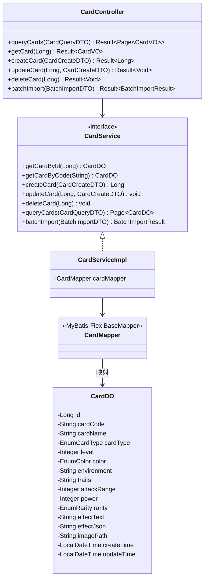

# 详细设计：迭代二 — 卡牌与产品管理

> 项目：MTCG 后端程序
> 版本：v0.2
> 日期：2026-08-03
> 依据：[需求分析](./01-需求分析.md) FR1.1–FR1.5、[概要设计](./02-概要设计.md) §3 §4 §5 §8、[迭代一详细设计](./03-详细设计-迭代一-用户系统与用户管理.md)（用户系统、`@RequireRole`）

---

## 1. 迭代目标

在迭代一（用户系统 + 鉴权基础设施）基础上，实现卡牌与产品数据的完整 CRUD 和查询功能，对接管理后台卡牌/产品管理页面。

### 前置依赖

| 依赖 | 来源 | 复用内容 |
| --- | --- | --- |
| 鉴权 | 迭代一 | `@RequireRole`、`JwtInterceptor`、`SecurityConstant` |
| 基础设施 | 迭代一 | `Result<T>` / `PageVO<T>` / `ErrorCode` / `BusinessException` / `GlobalExceptionHandler` |
| 枚举 | 迭代一 | `EnumCardType` / `EnumColor` / `EnumRarity`（迭代一已建好）；产品分类为 `mtcg_product_category` 表管理，非枚举 |
| 建表 | 迭代一 | `mtcg_card` / `mtcg_product` 表已在迭代一 init.sql 中建完 |

### 范围

| 包含 | 不包含 |
| --- | --- |
| CardDO 实体（重构为 level/color/power 结构） | 卡组构筑（迭代三） |
| CardMapper / CardService / CardController | 引擎（迭代四） |
| ProductDO / ProductMapper / ProductService / ProductController | 对战 API（迭代五） |
| 卡牌 CRUD + 条件查询 + 批量导入 | 效果系统（迭代六） |
| 产品 CRUD + 按产品筛选卡牌 | |
| 管理后台卡牌/产品管理页对接 | |
| `@RequireRole({CARD_ADMIN, SYS_ADMIN})` 鉴权 | |

---

## 2. 数据库设计

### 2.1 建表 SQL

```sql
-- 卡牌统一表（角色卡 + 冲击卡）
CREATE TABLE mtcg_card (
    id              BIGSERIAL       PRIMARY KEY,
    card_code       VARCHAR(32)     NOT NULL UNIQUE,          -- 编号，如 BP01-020
    product_code    VARCHAR(16),                                -- 产品编号，如 BP01/SD01/PB01
    card_name       VARCHAR(128)    NOT NULL,                  -- 名称（含称号）
    card_type       VARCHAR(16)     NOT NULL,                  -- 卡牌类型：CHARACTER / RUSH_POINT
    level           SMALLINT,                                  -- 等级 Lv（1-6），冲击卡为 NULL
    color           VARCHAR(16),                                -- 颜色：RED/YELLOW/BLUE/GREEN/ORANGE/PURPLE，冲击卡为 NULL
    environment     VARCHAR(16),                                -- 环境，如 S1
    traits          VARCHAR(256),                               -- 特征，逗号分隔，如 "人类,复仇者联盟"
    attack_range    SMALLINT,                                  -- 攻击距离 R，冲击卡为 NULL
    power           SMALLINT,                                  -- 战力，冲击卡为 NULL
    rarity          VARCHAR(16)     NOT NULL,                  -- 稀有度：C/R/SR/GR/UR/MR/SEC/HR/LR/PR/ER/TR
    effect_text     TEXT,                                      -- 效果描述原文
    effect_json     TEXT,                                      -- 效果结构化 JSON（当前留空）
    image_path      VARCHAR(256),                               -- 卡面图片路径（冲击卡用）
    create_time     TIMESTAMP       NOT NULL DEFAULT NOW(),
    update_time     TIMESTAMP       NOT NULL DEFAULT NOW(),
    -- 枚举字段 CHECK 约束（防止脏数据）
    CONSTRAINT ck_card_type   CHECK (card_type IN ('CHARACTER', 'RUSH_POINT')),
    CONSTRAINT ck_color       CHECK (color IS NULL OR color IN ('RED','YELLOW','BLUE','GREEN','ORANGE','PURPLE')),
    CONSTRAINT ck_rarity      CHECK (rarity IN ('C','R','SR','GR','UR','MR','SEC','HR','LR','PR','ER','TR')),
    CONSTRAINT ck_level       CHECK (level IS NULL OR (level >= 1 AND level <= 6))
);

-- 查询优化索引
CREATE INDEX idx_card_color      ON mtcg_card (color);
CREATE INDEX idx_card_level      ON mtcg_card (level);
CREATE INDEX idx_card_rarity     ON mtcg_card (rarity);
CREATE INDEX idx_card_card_type  ON mtcg_card (card_type);
CREATE INDEX idx_card_name       ON mtcg_card (card_name);
CREATE INDEX idx_card_product    ON mtcg_card (product_code);

-- update_time 自动更新
CREATE OR REPLACE FUNCTION update_update_time()
RETURNS TRIGGER AS $$
BEGIN
    NEW.update_time = NOW();
    RETURN NEW;
END;
$$ LANGUAGE plpgsql;

CREATE TRIGGER trigger_card_update_time
    BEFORE UPDATE ON mtcg_card
    FOR EACH ROW
    EXECUTE FUNCTION update_update_time();
```

### 2.2 产品表（mtcg_product）+ 产品分类表（mtcg_product_category）

> 产品类型不再使用固定枚举，改为 `mtcg_product_category` 分类表管理（可扩展）。`mtcg_product.category_code` 引用分类表的 `category_code`，应用层校验，不建外键。建表 SQL 已在迭代一 init.sql 中统一执行，此处仅作字段说明。

**mtcg_product 表**：

| 字段 | 类型 | 说明 |
| --- | --- | --- |
| id | BIGSERIAL | 主键 |
| product_code | VARCHAR(16) | 产品编号，唯一（如 SD01/BP01） |
| product_name | VARCHAR(128) | 产品名称 |
| category_code | VARCHAR(32) | 产品分类编码，引用 mtcg_product_category |
| release_date | DATE | 发售日期 |
| description | TEXT | 描述 |

**mtcg_product_category 表**（可扩展的发售分类目录）：

| 字段 | 类型 | 说明 |
| --- | --- | --- |
| id | BIGSERIAL | 主键 |
| category_code | VARCHAR(32) | 分类编码，唯一（如 STRUCTURE_DECK） |
| category_name | VARCHAR(64) | 分类名称（如 预组牌） |
| sort_order | INTEGER | 排序号，默认 0 |
| create_time | TIMESTAMP | 创建时间 |
| update_time | TIMESTAMP | 更新时间 |

初始数据：预组牌（STRUCTURE_DECK）、补充包（BOOSTER_PACK）、推广包（PROMO_PACK），后续可由管理后台增删改。

### 2.3 字段与卡牌类型对照

| 字段 | 角色卡（CHARACTER） | 冲击卡（RUSH_POINT） |
| --- | --- | --- |
| card_code | 必填 | 必填 |
| card_name | 必填 | 必填 |
| level | 必填（1-6） | NULL |
| color | 必填 | NULL |
| environment | 可填 | NULL |
| traits | 可填 | NULL |
| attack_range | 必填 | NULL |
| power | 必填 | NULL |
| rarity | 必填 | 必填（含 C） |
| effect_text | 可填 | NULL |
| effect_json | 留空 | NULL |
| image_path | 可填 | 可填 |

---

## 3. 枚举设计

### 3.1 枚举设计规范

所有枚举统一采用 `code`（存 DB）+ `desc`（中文显示）模式，DB 存字符串名称不存下标。

### 3.2 EnumCardType

```java
public enum EnumCardType {
    CHARACTER("CHARACTER", "角色卡"),
    RUSH_POINT("RUSH_POINT", "冲击卡");

    private final String code;
    private final String desc;
}
```

### 3.3 EnumColor

```java
public enum EnumColor {
    RED("RED", "红"),
    YELLOW("YELLOW", "黄"),
    BLUE("BLUE", "蓝"),
    GREEN("GREEN", "绿"),
    ORANGE("ORANGE", "橙"),
    PURPLE("PURPLE", "紫");

    private final String code;
    private final String desc;
}
```

### 3.4 EnumRarity

```java
public enum EnumRarity {
    C("C", "普通"),
    R("R", "稀有"),
    SR("SR", "超稀有"),
    GR("GR", "黄金稀有"),
    UR("UR", "极度稀有"),
    MR("MR", "奇迹稀有"),
    SEC("SEC", "秘稀"),
    HR("HR", "隐藏稀有"),
    LR("LR", "传奇稀有"),
    PR("PR", "促销稀有"),
    ER("ER", "特别稀有"),
    TR("TR", "究极稀有");

    private final String code;
    private final String desc;
}
```

### 3.5 产品分类（mtcg_product_category 表管理，非枚举）

> 产品分类不再使用固定枚举（原 `EnumProductType` 已移除），改为 `mtcg_product_category` 表管理，支持管理后台增删改。分类数据在应用启动时加载到内存缓存（Caffeine），避免每次查询产品都 JOIN 分类表。

**ProductCategoryDO**：

```java
package com.aris.mtcg.domain.entity;

@Data
@Table("mtcg_product_category")
public class ProductCategoryDO {
    @Id(keyType = KeyType.Auto)
    private Long id;
    private String categoryCode;   // 分类编码，如 STRUCTURE_DECK
    private String categoryName;   // 分类名称，如 预组牌
    private Integer sortOrder;     // 排序号
    private LocalDateTime createTime;
    private LocalDateTime updateTime;
}
```

**ProductCategoryVO**：

```java
@Data
public class ProductCategoryVO {
    private Long id;
    private String categoryCode;
    private String categoryName;
    private Integer sortOrder;
}
```

**ProductCategoryService** — CRUD + 缓存：

| 方法 | 说明 |
| --- | --- |
| `listAll()` | 查询全部分类（按 sortOrder 排序），优先从缓存读取 |
| `getByCode(String code)` | 按 categoryCode 查分类名（缓存命中） |
| `create(ProductCategoryDTO)` | 新增分类，刷新缓存 |
| `update(Long id, ProductCategoryDTO)` | 修改分类，刷新缓存 |
| `delete(Long id)` | 删除分类（校验：关联的产品已迁移或无引用），刷新缓存 |

**ProductCategoryController**：

```
路径：/api/v1/product-categories
类注解：@RequireRole({EnumUserRole.CARD_ADMIN, EnumUserRole.SYS_ADMIN})  // 写操作需管理员
```

| 方法 | HTTP | 路径 | 鉴权 | 出参 |
| --- | --- | --- | --- | --- |
| list | GET | `/` | 任意已登录 | `Result<List<ProductCategoryVO>>` |

> 查询接口放行给任意已登录用户（前端下拉选择需要），写操作需 CARD_ADMIN/SYS_ADMIN。

> 枚举（EnumCardType / EnumColor / EnumRarity）放在 `com.aris.mtcg.common.enums` 包下。产品分类不是枚举，是数据库表。

---

## 4. 实体类设计

### 4.1 CardDO

```
包：com.aris.mtcg.domain.entity
表：mtcg_card

字段：
- Long id
- String cardCode         // 编号
- String productCode      // 产品编号
- String cardName         // 名称
- EnumCardType cardType       // 卡牌类型
- Integer level           // 等级
- EnumColor color             // 颜色
- String environment      // 环境
- String traits           // 特征
- Integer attackRange     // 攻击距离
- Integer power           // 战力
- EnumRarity rarity           // 稀有度
- String effectText       // 效果原文
- String effectJson       // 效果 JSON
- String imagePath        // 卡面图片
- LocalDateTime createTime
- LocalDateTime updateTime

注解：
- @Table("mtcg_card")                          // MyBatis-Flex
- @Id(keyType = KeyType.Auto)
- @Column + enum 映射用 TypeHandler
```

### 4.2 CardQueryDTO（查询条件）

```
包：com.aris.mtcg.domain.dto

字段（全部可选）：
- String cardName         // 模糊匹配
- EnumCardType cardType       // 精确匹配
- EnumColor color             // 精确匹配
- Integer level           // 精确匹配
- EnumRarity rarity           // 精确匹配
- String productCode      // 精确匹配（按产品筛选）
- String traits           // 模糊匹配
- Integer page            // 页码，默认 1
- Integer size            // 每页条数，默认 20
```

### 4.3 CardCreateDTO（新增/修改）

```
包：com.aris.mtcg.domain.dto

字段：
- String cardCode         // @NotBlank
- String productCode      // 关联产品编号
- String cardName         // @NotBlank
- EnumCardType cardType       // @NotNull
- Integer level           // 角色卡必填（@NotNull 当 cardType=CHARACTER）
- EnumColor color             // 角色卡必填
- String environment
- String traits
- Integer attackRange     // 角色卡必填
- Integer power           // 角色卡必填
- EnumRarity rarity           // @NotNull
- String effectText
- String imagePath
```

### 4.4 BatchImportDTO（批量导入）

```
包：com.aris.mtcg.domain.dto

字段：
- List<CardCreateDTO> cards   // @NotEmpty
```

### 4.5 ProductDO

```
包：com.aris.mtcg.domain.entity
表：mtcg_product

字段：
- Long id
- String productCode      // 产品编号
- String productName      // 产品名称
- String categoryCode     // 产品分类编码（引用 mtcg_product_category，非枚举）
- LocalDate releaseDate   // 发售日期
- String description      // 描述
- LocalDateTime createTime
- LocalDateTime updateTime

注解：
- @Data                                   // Lombok
- @Table("mtcg_product")                       // MyBatis-Flex
- @Id(keyType = KeyType.Auto)
```

### 4.6 ProductCreateDTO（新增/修改）

```
包：com.aris.mtcg.domain.dto

字段：
- String productCode      // @NotBlank
- String productName      // @NotBlank
- String categoryCode     // @NotBlank（引用 mtcg_product_category，Service 层校验存在性）
- LocalDate releaseDate
- String description
```

---

## 5. DAO 层设计

### 5.1 CardMapper

```
包：com.aris.mtcg.dao
继承：BaseMapper<CardDO>（MyBatis-Flex）

自带方法（无需手写 SQL）：
- insert(cardDO)
- updateById(cardDO)
- deleteById(id)
- selectOneById(id)
- selectListByQuery(QueryWrapper)
- paginate(page, queryWrapper)

自定义方法：无（当前 CRUD 和条件查询用 QueryWrapper 足够）
```

### 5.2 ProductMapper

```
包：com.aris.mtcg.dao
继承：BaseMapper<ProductDO>（MyBatis-Flex）

自带方法（无需手写 SQL）：
- insert(productDO)
- updateById(productDO)
- deleteById(id)
- selectOneById(id)
- selectListByQuery(QueryWrapper)

自定义方法：无
```

---

## 6. Service 层设计

### 6.1 CardService 接口

```
包：com.aris.mtcg.service

方法：
// CRUD
- CardDO getCardById(Long id)
- CardDO getCardByCode(String cardCode)
- Long createCard(CardCreateDTO dto)
- void updateCard(Long id, CardCreateDTO dto)
- void deleteCard(Long id)

// 查询
- Page<CardDO> queryCards(CardQueryDTO query)

// 批量导入
- BatchImportResult batchImport(BatchImportDTO dto)
```

### 6.2 BatchImportResult

```
字段：
- int total           // 总数
- int success         // 成功数
- int failed          // 失败数
- List<String> errors // 失败详情（编号 + 原因）
```

### 6.3 业务逻辑

| 方法 | 逻辑 |
| --- | --- |
| createCard | 1. 检查 cardCode 是否已存在 → 2. DTO 转 DO → 3. insert |
| updateCard | 1. 检查 id 是否存在 → 2. 检查 cardCode 唯一性（排除自身）→ 3. DTO 转 DO → 4. updateById |
| deleteCard | 1. 检查 id 是否存在 → 2. deleteById |
| queryCards | 1. 构造 QueryWrapper（按 DTO 非空字段）→ 2. cardName/traits 用 LIKE → 3. 分页查询 |
| batchImport | 1. 遍历 cards → 2. 逐条 try createCard → 3. 失败记录到 errors → 4. 返回汇总结果 |

### 6.4 异常定义

```
包：com.aris.mtcg.common.exception

- BusinessException(String message)
  - 卡牌编号已存在
  - 卡牌不存在
  - 卡牌类型字段不合法（如冲击卡填了 level）
  - 产品编号已存在
  - 产品不存在
```

### 6.5 ProductService 接口

```
包：com.aris.mtcg.service

方法：
// CRUD
- ProductDO getProductById(Long id)
- ProductDO getProductByCode(String productCode)
- Long createProduct(ProductCreateDTO dto)
- void updateProduct(Long id, ProductCreateDTO dto)
- void deleteProduct(Long id)

// 查询
- List<ProductDO> listProducts()
- Page<CardDO> listCardsByProduct(String productCode, Integer page, Integer size)   // 按产品筛选卡牌
```

### 6.6 ProductService 业务逻辑

| 方法 | 逻辑 |
| --- | --- |
| createProduct | 1. 检查 productCode 是否已存在 → 2. DTO 转 DO → 3. insert |
| updateProduct | 1. 检查 id 是否存在 → 2. 检查 productCode 唯一性（排除自身）→ 3. DTO 转 DO → 4. updateById |
| deleteProduct | 1. 检查 id 是否存在 → 2. deleteById |
| listProducts | 1. selectListByQuery（空条件）→ 返回全部产品 |
| listCardsByProduct | 1. 构造 QueryWrapper（productCode 精确匹配）→ 2. 分页查询 card 表 |

---

## 7. Controller 层设计

> **鉴权**：所有卡牌/产品管理接口需 `@RequireRole({EnumUserRole.CARD_ADMIN, EnumUserRole.SYS_ADMIN})`，查询接口（GET）可放宽为任意已登录用户。鉴权机制依赖迭代一的 `JwtInterceptor` + `@RequireRole` 注解。

### 7.1 CardController

```
包：com.aris.mtcg.controller
路径：/api/v1/cards
类注解：@RequireRole({EnumUserRole.CARD_ADMIN, EnumUserRole.SYS_ADMIN})  // 写操作需管理员
```

| 方法 | HTTP | 路径 | 入参 | 出参 | 说明 |
| --- | --- | --- | --- | --- | --- |
| queryCards | GET | `/cards` | CardQueryDTO（Query Param） | `Result<Page<CardVO>>` | 分页查询 |
| getCard | GET | `/cards/{id}` | Long id | `Result<CardVO>` | 查询详情 |
| createCard | POST | `/cards` | @RequestBody CardCreateDTO | `Result<Long>` | 返回新增 ID |
| updateCard | PUT | `/cards/{id}` | Long id, @RequestBody CardCreateDTO | `Result<Void>` | |
| deleteCard | DELETE | `/cards/{id}` | Long id | `Result<Void>` | |
| batchImport | POST | `/cards/batch` | @RequestBody BatchImportDTO | `Result<BatchImportResult>` | 批量导入 |

### 7.2 CardVO（返回视图）

```
与 CardDO 字段一致，但：
- 所有字段可空（查询时可能不需要全部字段）
- 时间字段格式化为字符串（yyyy-MM-dd HH:mm:ss）
```

### 7.3 ProductController

```
包：com.aris.mtcg.controller
路径：/api/v1/products
```

| 方法 | HTTP | 路径 | 入参 | 出参 | 说明 |
| --- | --- | --- | --- | --- | --- |
| listProducts | GET | `/products` | 无 | `Result<List<ProductVO>>` | 产品列表 |
| getProduct | GET | `/products/{id}` | Long id | `Result<ProductVO>` | 查询详情 |
| createProduct | POST | `/products` | @RequestBody ProductCreateDTO | `Result<Long>` | 返回新增 ID |
| updateProduct | PUT | `/products/{id}` | Long id, @RequestBody ProductCreateDTO | `Result<Void>` | |
| deleteProduct | DELETE | `/products/{id}` | Long id | `Result<Void>` | |
| listCardsByProduct | GET | `/products/{productCode}/cards` | String productCode, Integer page, Integer size | `Result<Page<CardVO>>` | 按产品筛选卡牌 |

### 7.4 ProductVO（返回视图）

```
与 ProductDO 字段一致，但：
- 所有字段可空
- 时间字段格式化为字符串（yyyy-MM-dd HH:mm:ss）
```

---

## 8. 统一响应与异常处理

### 8.1 Result<T>

```
包：com.aris.mtcg.common.result

字段：
- int code           // 200 成功，400 参数错误，404 未找到，500 系统错误
- String message
- T data

静态工厂：
- Result.success(data)
- Result.success()
- Result.error(code, message)
```

### 8.2 全局异常处理

```
包：com.aris.mtcg.advice

- @RestControllerAdvice
- 处理 BusinessException → Result.error(400, message)
- 处理 MethodArgumentNotValidException → Result.error(400, 校验错误信息)
- 处理 Exception → Result.error(500, "系统错误")
```

---

## 9. 类关系图



---

## 10. 文件清单

| 文件 | 包 | 说明 |
| --- | --- | --- |
| `EnumColor.java` | `common.enums` | 颜色枚举 |
| `EnumRarity.java` | `common.enums` | 稀有度枚举 |
| `EnumCardType.java` | `common.enums` | 卡牌类型枚举 |
| `Result.java` | `common.result` | 统一响应体 |
| `BusinessException.java` | `common.exception` | 业务异常 |
| `CardDO.java` | `domain.entity` | 卡牌数据库实体 |
| `CardMapper.java` | `dao` | MyBatis-Flex Mapper |
| `CardService.java` | `service` | 卡牌服务接口 |
| `CardServiceImpl.java` | `service.impl` | 卡牌服务实现 |
| `CardQueryDTO.java` | `domain.dto` | 查询条件 DTO |
| `CardCreateDTO.java` | `domain.dto` | 新增/修改 DTO |
| `BatchImportDTO.java` | `domain.dto` | 批量导入 DTO |
| `BatchImportResult.java` | `domain.dto` | 批量导入结果 |
| `CardVO.java` | `controller.vo` | 卡牌返回视图 |
| `CardController.java` | `controller` | 卡牌 REST API |
| `ProductDO.java` | `domain.entity` | 产品数据库实体 |
| `ProductMapper.java` | `dao` | 产品 Mapper |
| `ProductService.java` | `service` | 产品服务接口 |
| `ProductServiceImpl.java` | `service.impl` | 产品服务实现 |
| `ProductCreateDTO.java` | `domain.dto` | 产品新增/修改 DTO |
| `ProductVO.java` | `controller.vo` | 产品返回视图 |
| `ProductController.java` | `controller` | 产品 REST API |
| `ProductCategoryDO.java` | `domain.entity` | 产品分类数据库实体 |
| `ProductCategoryMapper.java` | `dao` | 产品分类 Mapper |
| `ProductCategoryService.java` | `service` | 产品分类服务接口（含缓存） |
| `ProductCategoryServiceImpl.java` | `service.impl` | 产品分类服务实现 |
| `ProductCategoryDTO.java` | `domain.dto` | 产品分类新增/修改 DTO |
| `ProductCategoryVO.java` | `domain.vo` | 产品分类返回视图 |
| `ProductCategoryController.java` | `controller` | 产品分类 REST API |
| `GlobalExceptionHandler.java` | `advice` | 全局异常处理 |
| `init.sql` | `resources/db` | 建表 SQL（含 product + product_category 表） |

共 30 个文件。
