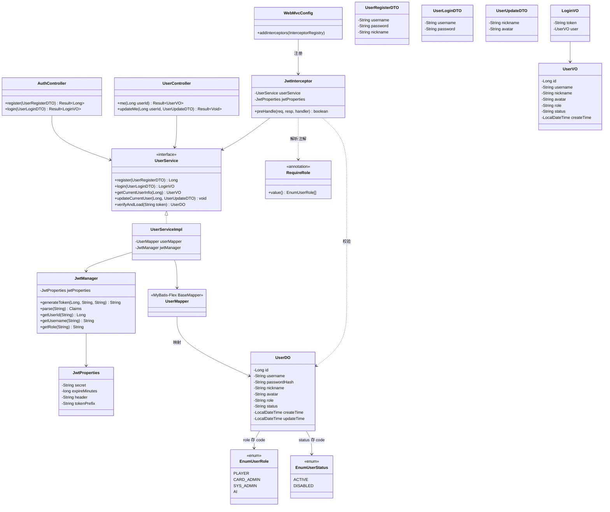

# 详细设计：迭代二 — 用户系统与权限管理

> 项目：MTCG 后端程序
> 版本：v0.1
> 日期：2026-07-31
> 依据：[需求分析](./01-需求分析.md) FR5.1–FR5.3、FR7.1–FR7.3、[概要设计](./02-概要设计.md) §3 §5、[迭代一详细设计](./03-详细设计-迭代一-卡牌数据落地.md)

---

## 1. 概述

### 1.1 迭代目标

在迭代一卡牌数据落地基础上，实现用户注册/登录、个人资料管理，以及基于 JWT + 角色注解的接口鉴权与权限隔离，为后续卡组归属、对局归属提供用户基座。

### 1.2 范围

| 包含 | 不包含 |
| --- | --- |
| `mtcg_user` 表建表（PostgreSQL） | 卡组构筑（迭代三） |
| `EnumUserRole` / `EnumUserStatus` 枚举 | 对局记录（迭代七） |
| UserDO / DTO / VO 实体 | 排位、系统管理（迭代九/十） |
| UserMapper（MyBatis-Flex） | 细粒度权限（资源级 ACL） |
| JwtManager（Token 生成/验证） | OAuth / 第三方登录 |
| UserService（注册/登录/资料查改） | WebSocket 鉴权 |
| AuthController / UserController | |
| JwtInterceptor + `@RequireRole` 注解 | |
| WebMvcConfig 拦截器注册 | |

### 1.3 对应需求

| 需求 | 说明 | 实现 |
| --- | --- | --- |
| FR5.1 | 注册（用户名/密码） | `POST /auth/register`，密码 BCrypt 加密 |
| FR5.2 | 登录（获取 Token） | `POST /auth/login`，签发 JWT |
| FR5.3 | 用户资料（昵称/头像） | `GET/PUT /users/me` |
| FR7.1 | 角色定义 | `EnumUserRole`：PLAYER/CARD_ADMIN/SYS_ADMIN/AI |
| FR7.2 | 接口鉴权 | JwtInterceptor 校验 Token + `@RequireRole` 角色控制 |
| FR7.3 | 权限隔离 | `/users/me` 以 Token 中的 userId 为准，玩家仅操作自身资源 |

### 1.4 关键决策

| 编号 | 决策 | 理由 |
| --- | --- | --- |
| D1 | 不引入 Spring Security，自实现 JWT | 项目当前为纯 REST，Security 过滤链过重；JWT 用 jjwt 自管，拦截器+注解即可覆盖 RBAC |
| D2 | 密码用 BCrypt（`spring-security-crypto`） | 仅引入加密工具模块，不引入 Security 过滤链；BCrypt 自带盐、抗彩虹表 |
| D3 | role / status 用 VARCHAR 存枚举名 + CHECK 约束 | 可读、稳定，配合枚举 code 直存；CHECK 兜底防脏数据 |
| D4 | 不建外键 | 遵循概要设计 §3.1 约定，关系完整性在应用层校验 |
| D5 | Token 通过 `Authorization: Bearer <token>` 传递 | REST 通用方案，无状态、易横向扩展 |
| D6 | 当前用户身份由拦截器写入 Request 属性 | Controller 用 `@RequestAttribute` 取用，避免魔法字符串 |
| D7 | 表名使用 `mtcg_user`（PostgreSQL 保留字，DDL 加双引号） | 与概要设计 ER 图一致；DO 的 `@Table` 需带引号转义 |

---

## 2. 数据库设计

### 2.1 建表 SQL

```sql
-- 用户表
-- 注意：user 是 PostgreSQL 保留字，建表与查询均须加双引号
CREATE TABLE "mtcg_user" (
    id              BIGSERIAL       PRIMARY KEY,
    username        VARCHAR(32)     NOT NULL,                          -- 登录用户名
    password_hash   VARCHAR(72)     NOT NULL,                          -- BCrypt 密文（60 字符，72 留余量）
    nickname        VARCHAR(64),                                       -- 昵称
    avatar          VARCHAR(256),                                      -- 头像 URL
    role            VARCHAR(16)     NOT NULL DEFAULT 'PLAYER',         -- 角色：PLAYER/CARD_ADMIN/SYS_ADMIN/AI
    status          VARCHAR(16)     NOT NULL DEFAULT 'ACTIVE',         -- 状态：ACTIVE/DISABLED
    create_time     TIMESTAMP       NOT NULL DEFAULT NOW(),
    update_time     TIMESTAMP       NOT NULL DEFAULT NOW(),
    -- 唯一约束
    CONSTRAINT uk_user_username UNIQUE (username),
    -- 枚举字段 CHECK 约束（防脏数据）
    CONSTRAINT ck_user_role   CHECK (role   IN ('PLAYER','CARD_ADMIN','SYS_ADMIN','AI')),
    CONSTRAINT ck_user_status CHECK (status IN ('ACTIVE','DISABLED'))
);

-- 按角色查询（管理员后台筛选）
CREATE INDEX idx_user_role ON "mtcg_user" (role);

-- update_time 自动更新（与迭代一一致）
CREATE OR REPLACE FUNCTION update_update_time()
RETURNS TRIGGER AS $$
BEGIN
    NEW.update_time = NOW();
    RETURN NEW;
END;
$$ LANGUAGE plpgsql;

CREATE TRIGGER trigger_user_update_time
    BEFORE UPDATE ON "mtcg_user"
    FOR EACH ROW
    EXECUTE FUNCTION update_update_time();
```

### 2.2 字段说明

| 字段 | 类型 | 说明 |
| --- | --- | --- |
| id | BIGSERIAL | 主键，自增 |
| username | VARCHAR(32) | 登录名，唯一，注册时校验长度 3–32 |
| password_hash | VARCHAR(72) | BCrypt 密文，永不明文存储、永不返回给前端 |
| nickname | VARCHAR(64) | 展示昵称，可空，可修改 |
| avatar | VARCHAR(256) | 头像 URL，可空，可修改 |
| role | VARCHAR(16) | 角色枚举 code，默认 PLAYER |
| status | VARCHAR(16) | 账号状态，默认 ACTIVE；DISABLED 禁止登录 |
| create_time | TIMESTAMP | 创建时间 |
| update_time | TIMESTAMP | 更新时间，触发器自动维护 |

---

## 3. 枚举设计

> 遵循现有 `EnumCardType` 规范：`code`（存 DB）+ `desc`（中文说明），`@Getter` + 全参构造，放在 `com.aris.mtcg.common.enums` 包下。DB 存枚举 `code` 字符串。

### 3.1 EnumUserRole

```java
package com.aris.mtcg.common.enums;

import lombok.Getter;

/**
 * 用户角色枚举（FR7.1）
 *
 * @author pengYuJun
 */
@Getter
public enum EnumUserRole {

    PLAYER("PLAYER", "玩家"),
    CARD_ADMIN("CARD_ADMIN", "卡牌管理员"),
    SYS_ADMIN("SYS_ADMIN", "系统管理员"),
    AI("AI", "AI玩家");

    private final String code;
    private final String desc;

    EnumUserRole(String code, String desc) {
        this.code = code;
        this.desc = desc;
    }

    /**
     * 由 code 解析枚举，非法返回 null
     */
    public static EnumUserRole of(String code) {
        if (code == null) {
            return null;
        }
        for (EnumUserRole role : values()) {
            if (role.code.equals(code)) {
                return role;
            }
        }
        return null;
    }
}
```

### 3.2 EnumUserStatus

```java
package com.aris.mtcg.common.enums;

import lombok.Getter;

/**
 * 用户状态枚举
 *
 * @author pengYuJun
 */
@Getter
public enum EnumUserStatus {

    ACTIVE("ACTIVE", "正常"),
    DISABLED("DISABLED", "禁用");

    private final String code;
    private final String desc;

    EnumUserStatus(String code, String desc) {
        this.code = code;
        this.desc = desc;
    }

    public static EnumUserStatus of(String code) {
        if (code == null) {
            return null;
        }
        for (EnumUserStatus status : values()) {
            if (status.code.equals(code)) {
                return status;
            }
        }
        return null;
    }
}
```

---

## 4. 实体类设计

### 4.1 UserDO

```
包：com.aris.mtcg.domain.entity
表："mtcg_user"

字段：
- Long id                  // 主键
- String username          // 登录名
- String passwordHash      // BCrypt 密文
- String nickname          // 昵称
- String avatar            // 头像 URL
- String role              // 角色 code（EnumUserRole.code）
- String status            // 状态 code（EnumUserStatus.code）
- LocalDateTime createTime
- LocalDateTime updateTime

注解：
- @Data
- @Table("\"mtcg_user\"")                       // MyBatis-Flex；user 为保留字需转义
- @Id(keyType = KeyType.Auto)
```

```java
package com.aris.mtcg.domain.entity;

import com.mybatisflex.annotation.Id;
import com.mybatisflex.annotation.KeyType;
import com.mybatisflex.annotation.Table;
import lombok.Data;

import java.time.LocalDateTime;

/**
 * 用户数据对象，与 "mtcg_user" 表一一对应
 *
 * @author pengYuJun
 */
@Data
@Table("\"mtcg_user\"")
public class UserDO {

    @Id(keyType = KeyType.Auto)
    private Long id;

    private String username;

    private String passwordHash;

    private String nickname;

    private String avatar;

    /** 角色，见 {@link com.aris.mtcg.common.enums.EnumUserRole} */
    private String role;

    /** 状态，见 {@link com.aris.mtcg.common.enums.EnumUserStatus} */
    private String status;

    private LocalDateTime createTime;

    private LocalDateTime updateTime;
}
```

> 说明：role / status 以 `String` 存储，与现有 `CardDO.cardType` 一致；不使用枚举类型字段，避免 MyBatis-Flex TypeHandler 额外配置。

### 4.2 UserRegisterDTO（注册请求）

```
包：com.aris.mtcg.domain.dto

字段：
- String username     // @NotBlank @Length(min=3, max=32)
- String password     // @NotBlank @Length(min=6, max=32)
- String nickname     // @Length(max=64)，可选
```

```java
package com.aris.mtcg.domain.dto;

import jakarta.validation.constraints.NotBlank;
import lombok.Data;
import org.hibernate.validator.constraints.Length;

/**
 * 用户注册请求
 *
 * @author pengYuJun
 */
@Data
public class UserRegisterDTO {

    @NotBlank(message = "用户名不能为空")
    @Length(min = 3, max = 32, message = "用户名长度需为 3-32")
    private String username;

    @NotBlank(message = "密码不能为空")
    @Length(min = 6, max = 32, message = "密码长度需为 6-32")
    private String password;

    @Length(max = 64, message = "昵称长度不能超过 64")
    private String nickname;
}
```

### 4.3 UserLoginDTO（登录请求）

```
包：com.aris.mtcg.domain.dto

字段：
- String username     // @NotBlank
- String password     // @NotBlank
```

```java
package com.aris.mtcg.domain.dto;

import jakarta.validation.constraints.NotBlank;
import lombok.Data;

/**
 * 用户登录请求
 *
 * @author pengYuJun
 */
@Data
public class UserLoginDTO {

    @NotBlank(message = "用户名不能为空")
    private String username;

    @NotBlank(message = "密码不能为空")
    private String password;
}
```

### 4.4 UserUpdateDTO（资料修改请求）

```
包：com.aris.mtcg.domain.dto

字段（均可选，仅允许修改昵称/头像；用户名/密码/角色不可通过此接口改）：
- String nickname     // @Length(max=64)
- String avatar       // @Length(max=256)
```

```java
package com.aris.mtcg.domain.dto;

import lombok.Data;
import org.hibernate.validator.constraints.Length;

/**
 * 用户资料修改请求（仅昵称/头像）
 *
 * @author pengYuJun
 */
@Data
public class UserUpdateDTO {

    @Length(max = 64, message = "昵称长度不能超过 64")
    private String nickname;

    @Length(max = 256, message = "头像地址长度不能超过 256")
    private String avatar;
}
```

### 4.5 UserVO（用户视图）

```
包：com.aris.mtcg.domain.vo

字段：
- Long id
- String username
- String nickname
- String avatar
- String role
- String status
- LocalDateTime createTime
```

> 不含 passwordHash；对外输出永不暴露密文。

```java
package com.aris.mtcg.domain.vo;

import lombok.Data;

import java.time.LocalDateTime;

/**
 * 用户视图对象
 *
 * @author pengYuJun
 */
@Data
public class UserVO {

    private Long id;
    private String username;
    private String nickname;
    private String avatar;
    private String role;
    private String status;
    private LocalDateTime createTime;
}
```

### 4.6 LoginVO（登录返回）

```
包：com.aris.mtcg.domain.vo

字段：
- String token        // JWT
- UserVO user         // 当前用户基本信息
```

```java
package com.aris.mtcg.domain.vo;

import lombok.Data;

/**
 * 登录返回对象
 *
 * @author pengYuJun
 */
@Data
public class LoginVO {

    private String token;
    private UserVO user;
}
```

---

## 5. DAO 层设计

### 5.1 UserMapper

```
包：com.aris.mtcg.dao
继承：BaseMapper<UserDO>（MyBatis-Flex）

自带方法（无需手写 SQL）：
- insert(userDO)
- updateById(userDO)
- selectOneById(id)
- selectOneByQuery(QueryWrapper)   // 按 username 查询用

自定义方法：无（与 CardMapper 风格一致，条件查询用 QueryWrapper）
```

```java
package com.aris.mtcg.dao;

import com.aris.mtcg.domain.entity.UserDO;
import com.mybatisflex.core.BaseMapper;
import org.apache.ibatis.annotations.Mapper;

/**
 * 用户 DAO
 *
 * @author pengYuJun
 */
@Mapper
public interface UserMapper extends BaseMapper<UserDO> {
}
```

---

## 6. Manager 层设计（JWT）

### 6.1 JwtProperties（配置绑定）

```
包：com.aris.mtcg.config
绑定前缀：mtcg.jwt

字段：
- String secret          // 签名密钥
- long expireMinutes     // 过期时长（分钟），默认 120
- String header          // 请求头名，默认 Authorization
- String tokenPrefix     // Token 前缀，默认 "Bearer "
```

```java
package com.aris.mtcg.config;

import lombok.Data;
import org.springframework.boot.context.properties.ConfigurationProperties;
import org.springframework.stereotype.Component;

/**
 * JWT 配置
 *
 * @author pengYuJun
 */
@Data
@Component
@ConfigurationProperties(prefix = "mtcg.jwt")
public class JwtProperties {

    /** 签名密钥（生产环境通过环境变量注入） */
    private String secret = "changeme-please-use-a-long-random-secret-key-32chars";

    /** 过期时长（分钟） */
    private long expireMinutes = 120;

    /** 请求头名 */
    private String header = "Authorization";

    /** Token 前缀 */
    private String tokenPrefix = "Bearer ";
}
```

对应 `application.yml` 新增：

```yaml
mtcg:
  jwt:
    secret: ${MTCG_JWT_SECRET:changeme-please-use-a-long-random-secret-key-32chars}
    expire-minutes: 120
    header: Authorization
    token-prefix: "Bearer "
```

### 6.2 JwtManager

```
包：com.aris.mtcg.manager
类型：@Component

职责：
- 生成 JWT（写入 userId / username / role / 过期时间）
- 解析与校验 JWT
- 供拦截器、Service 调用
```

```java
package com.aris.mtcg.manager;

import com.aris.mtcg.common.exception.BusinessException;
import com.aris.mtcg.common.result.ErrorCode;
import com.aris.mtcg.config.JwtProperties;
import io.jsonwebtoken.Claims;
import io.jsonwebtoken.Jwts;
import io.jsonwebtoken.security.Keys;
import jakarta.annotation.Resource;
import org.springframework.stereotype.Component;

import javax.crypto.SecretKey;
import java.nio.charset.StandardCharsets;
import java.util.Date;

/**
 * JWT Token 生成与校验
 *
 * @author pengYuJun
 */
@Component
public class JwtManager {

    /** Claims 键 */
    public static final String CLAIM_USER_ID   = "userId";
    public static final String CLAIM_USERNAME  = "username";
    public static final String CLAIM_ROLE      = "role";

    @Resource
    private JwtProperties jwtProperties;

    private SecretKey getKey() {
        return Keys.hmacShaKeyFor(jwtProperties.getSecret().getBytes(StandardCharsets.UTF_8));
    }

    /**
     * 生成 Token
     */
    public String generateToken(Long userId, String username, String role) {
        long now = System.currentTimeMillis();
        long expireAt = now + jwtProperties.getExpireMinutes() * 60_000L;
        return Jwts.builder()
                .claim(CLAIM_USER_ID, userId)
                .claim(CLAIM_USERNAME, username)
                .claim(CLAIM_ROLE, role)
                .setIssuedAt(new Date(now))
                .setExpiration(new Date(expireAt))
                .signWith(getKey())
                .compact();
    }

    /**
     * 解析 Token，无效或过期抛 BusinessException(UNAUTHORIZED)
     */
    public Claims parse(String token) {
        try {
            return Jwts.parser()
                    .verifyWith(getKey())
                    .build()
                    .parseSignedClaims(token)
                    .getPayload();
        } catch (Exception e) {
            throw new BusinessException(ErrorCode.UNAUTHORIZED, "Token 无效或已过期");
        }
    }

    public Long getUserId(String token) {
        return parse(token).get(CLAIM_USER_ID, Long.class);
    }

    public String getUsername(String token) {
        return parse(token).get(CLAIM_USERNAME, String.class);
    }

    public String getRole(String token) {
        return parse(token).get(CLAIM_ROLE, String.class);
    }
}
```

### 6.3 依赖（pom.xml 新增）

```xml
<!-- JWT -->
<dependency>
    <groupId>io.jsonwebtoken</groupId>
    <artifactId>jjwt-api</artifactId>
    <version>${jjwt.version}</version>
</dependency>
<dependency>
    <groupId>io.jsonwebtoken</groupId>
    <artifactId>jjwt-impl</artifactId>
    <version>${jjwt.version}</version>
    <scope>runtime</scope>
</dependency>
<dependency>
    <groupId>io.jsonwebtoken</groupId>
    <artifactId>jjwt-jackson</artifactId>
    <version>${jjwt.version}</version>
    <scope>runtime</scope>
</dependency>

<!-- BCrypt 加密工具（仅 crypto 模块，不引入 Spring Security 过滤链） -->
<dependency>
    <groupId>org.springframework.security</groupId>
    <artifactId>spring-security-crypto</artifactId>
</dependency>
```

`<properties>` 新增 `<jjwt.version>0.12.6</jjwt.version>`。

---

## 7. Service 层设计

### 7.1 UserService 接口

```
包：com.aris.mtcg.service

方法：
- Long register(UserRegisterDTO dto)                  // 注册，返回用户 id
- LoginVO login(UserLoginDTO dto)                     // 登录，返回 token + 用户
- UserVO getCurrentUserInfo(Long userId)              // 查询当前用户资料
- void updateCurrentUser(Long userId, UserUpdateDTO) // 修改当前用户资料
- UserDO verifyAndLoad(String token)                  // 供拦截器调用：校验 token 并返回用户
```

### 7.2 业务逻辑

| 方法 | 逻辑 |
| --- | --- |
| register | 1. 按 username 查重（`QueryWrapper.eq(username)`）→ 已存在抛 `用户名已存在`<br>2. BCrypt 加密密码<br>3. 组装 UserDO（role=PLAYER、status=ACTIVE）<br>4. insert → 返回 id |
| login | 1. 按 username 查用户 → 不存在抛 `用户名或密码错误`<br>2. 校验 status=ACTIVE → 否则抛 `账号已被禁用`<br>3. BCrypt 校验密码 → 不匹配抛 `用户名或密码错误`<br>4. JwtManager 生成 token<br>5. DO → VO，组装 LoginVO 返回 |
| getCurrentUserInfo | 1. selectOneById(userId) → 不存在抛 `用户不存在`<br>2. DO → VO 返回 |
| updateCurrentUser | 1. selectOneById 校验存在<br>2. 仅拷贝 nickname/avatar 非空字段<br>3. updateById |
| verifyAndLoad | 1. JwtManager.parse(token) 取 userId<br>2. selectOneById → 不存在/已禁用抛 UNAUTHORIZED<br>3. 返回 UserDO |

> 安全要点：登录失败统一返回“用户名或密码错误”，不区分用户名是否存在，防枚举。

### 7.3 UserServiceImpl

```
包：com.aris.mtcg.service.impl
注解：@Service
依赖：UserMapper、JwtManager、BCryptPasswordEncoder
```

```java
package com.aris.mtcg.service.impl;

import com.aris.mtcg.common.enums.EnumUserRole;
import com.aris.mtcg.common.enums.EnumUserStatus;
import com.aris.mtcg.common.exception.BusinessException;
import com.aris.mtcg.common.result.ErrorCode;
import com.aris.mtcg.dao.UserMapper;
import com.aris.mtcg.domain.dto.UserLoginDTO;
import com.aris.mtcg.domain.dto.UserRegisterDTO;
import com.aris.mtcg.domain.dto.UserUpdateDTO;
import com.aris.mtcg.domain.entity.UserDO;
import com.aris.mtcg.domain.vo.LoginVO;
import com.aris.mtcg.domain.vo.UserVO;
import com.aris.mtcg.manager.JwtManager;
import com.aris.mtcg.service.UserService;
import com.mybatisflex.core.query.QueryWrapper;
import jakarta.annotation.Resource;
import org.springframework.security.crypto.bcrypt.BCryptPasswordEncoder;
import org.springframework.stereotype.Service;

/**
 * 用户服务实现
 *
 * @author pengYuJun
 */
@Service
public class UserServiceImpl implements UserService {

    private static final BCryptPasswordEncoder PASSWORD_ENCODER = new BCryptPasswordEncoder();

    @Resource
    private UserMapper userMapper;

    @Resource
    private JwtManager jwtManager;

    @Override
    public Long register(UserRegisterDTO dto) {
        UserDO exists = userMapper.selectOneByQuery(
                QueryWrapper.create().eq("username", dto.getUsername()));
        if (exists != null) {
            throw new BusinessException(ErrorCode.PARAMS_ERROR, "用户名已存在");
        }
        UserDO userDO = new UserDO();
        userDO.setUsername(dto.getUsername());
        userDO.setPasswordHash(PASSWORD_ENCODER.encode(dto.getPassword()));
        userDO.setNickname(dto.getNickname());
        userDO.setRole(EnumUserRole.PLAYER.getCode());
        userDO.setStatus(EnumUserStatus.ACTIVE.getCode());
        userMapper.insert(userDO);
        return userDO.getId();
    }

    @Override
    public LoginVO login(UserLoginDTO dto) {
        UserDO userDO = userMapper.selectOneByQuery(
                QueryWrapper.create().eq("username", dto.getUsername()));
        if (userDO == null) {
            throw new BusinessException(ErrorCode.PARAMS_ERROR, "用户名或密码错误");
        }
        if (!EnumUserStatus.ACTIVE.getCode().equals(userDO.getStatus())) {
            throw new BusinessException(ErrorCode.FORBIDDEN, "账号已被禁用");
        }
        if (!PASSWORD_ENCODER.matches(dto.getPassword(), userDO.getPasswordHash())) {
            throw new BusinessException(ErrorCode.PARAMS_ERROR, "用户名或密码错误");
        }
        String token = jwtManager.generateToken(userDO.getId(), userDO.getUsername(), userDO.getRole());
        LoginVO loginVO = new LoginVO();
        loginVO.setToken(token);
        loginVO.setUser(toVO(userDO));
        return loginVO;
    }

    @Override
    public UserVO getCurrentUserInfo(Long userId) {
        UserVO vo = toVO(loadOrThrow(userId));
        return vo;
    }

    @Override
    public void updateCurrentUser(Long userId, UserUpdateDTO dto) {
        UserDO userDO = loadOrThrow(userId);
        if (dto.getNickname() != null) {
            userDO.setNickname(dto.getNickname());
        }
        if (dto.getAvatar() != null) {
            userDO.setAvatar(dto.getAvatar());
        }
        userMapper.updateById(userDO);
    }

    @Override
    public UserDO verifyAndLoad(String token) {
        Long userId = jwtManager.getUserId(token);
        UserDO userDO = userMapper.selectOneById(userId);
        if (userDO == null || !EnumUserStatus.ACTIVE.getCode().equals(userDO.getStatus())) {
            throw new BusinessException(ErrorCode.UNAUTHORIZED, "用户不存在或已被禁用");
        }
        return userDO;
    }

    private UserDO loadOrThrow(Long userId) {
        UserDO userDO = userMapper.selectOneById(userId);
        if (userDO == null) {
            throw new BusinessException(ErrorCode.NOT_FOUND, "用户不存在");
        }
        return userDO;
    }

    private UserVO toVO(UserDO userDO) {
        UserVO vo = new UserVO();
        vo.setId(userDO.getId());
        vo.setUsername(userDO.getUsername());
        vo.setNickname(userDO.getNickname());
        vo.setAvatar(userDO.getAvatar());
        vo.setRole(userDO.getRole());
        vo.setStatus(userDO.getStatus());
        vo.setCreateTime(userDO.getCreateTime());
        return vo;
    }
}
```

### 7.4 异常场景

| 场景 | ErrorCode | message |
| --- | --- | --- |
| 注册用户名已存在 | PARAMS_ERROR(400) | 用户名已存在 |
| 登录用户名不存在 | PARAMS_ERROR(400) | 用户名或密码错误 |
| 登录密码错误 | PARAMS_ERROR(400) | 用户名或密码错误 |
| 登录账号已禁用 | FORBIDDEN(403) | 账号已被禁用 |
| 用户不存在 | NOT_FOUND(404) | 用户不存在 |
| 未携带/无效 Token | UNAUTHORIZED(401) | 未登录 / Token 无效或已过期 |
| 角色权限不足 | FORBIDDEN(403) | 无操作权限 |

---

## 8. Controller 层设计

### 8.1 AuthController（注册/登录，免鉴权）

```
包：com.aris.mtcg.controller
路径：/auth
```

| 方法 | HTTP | 路径 | 入参 | 出参 | 说明 |
| --- | --- | --- | --- | --- | --- |
| register | POST | `/auth/register` | @RequestBody UserRegisterDTO | `Result<Long>` | 返回新用户 id |
| login | POST | `/auth/login` | @RequestBody UserLoginDTO | `Result<LoginVO>` | 返回 token + 用户 |

```java
package com.aris.mtcg.controller;

import com.aris.mtcg.common.result.Result;
import com.aris.mtcg.domain.dto.UserLoginDTO;
import com.aris.mtcg.domain.dto.UserRegisterDTO;
import com.aris.mtcg.domain.vo.LoginVO;
import com.aris.mtcg.service.UserService;
import io.swagger.v3.oas.annotations.Operation;
import io.swagger.v3.oas.annotations.tags.Tag;
import jakarta.annotation.Resource;
import jakarta.validation.Valid;
import org.springframework.web.bind.annotation.PostMapping;
import org.springframework.web.bind.annotation.RequestBody;
import org.springframework.web.bind.annotation.RequestMapping;
import org.springframework.web.bind.annotation.RestController;

/**
 * 认证接口（注册/登录）
 *
 * @author pengYuJun
 */
@Tag(name = "认证")
@RestController
@RequestMapping("/auth")
public class AuthController {

    @Resource
    private UserService userService;

    @Operation(summary = "注册")
    @PostMapping("/register")
    public Result<Long> register(@Valid @RequestBody UserRegisterDTO dto) {
        return Result.success(userService.register(dto));
    }

    @Operation(summary = "登录")
    @PostMapping("/login")
    public Result<LoginVO> login(@Valid @RequestBody UserLoginDTO dto) {
        return Result.success(userService.login(dto));
    }
}
```

### 8.2 UserController（资料查询/修改，需登录）

```
包：com.aris.mtcg.controller
路径：/users
```

| 方法 | HTTP | 路径 | 入参 | 出参 | 说明 |
| --- | --- | --- | --- | --- | --- |
| me | GET | `/users/me` | @RequestAttribute userId | `Result<UserVO>` | 查询当前用户资料 |
| updateMe | PUT | `/users/me` | @RequestAttribute userId, @RequestBody UserUpdateDTO | `Result<Void>` | 修改当前用户资料 |

> 权限隔离（FR7.3）：路径不含用户 id，直接取 Token 解析出的 userId，玩家只能操作自身资料。

```java
package com.aris.mtcg.controller;

import com.aris.mtcg.common.constant.SecurityConstant;
import com.aris.mtcg.common.result.Result;
import com.aris.mtcg.domain.dto.UserUpdateDTO;
import com.aris.mtcg.domain.vo.UserVO;
import com.aris.mtcg.service.UserService;
import io.swagger.v3.oas.annotations.Operation;
import io.swagger.v3.oas.annotations.tags.Tag;
import jakarta.annotation.Resource;
import jakarta.validation.Valid;
import org.springframework.web.bind.annotation.*;

/**
 * 用户资料接口
 *
 * @author pengYuJun
 */
@Tag(name = "用户")
@RestController
@RequestMapping("/users")
public class UserController {

    @Resource
    private UserService userService;

    @Operation(summary = "查询当前用户资料")
    @GetMapping("/me")
    public Result<UserVO> me(@RequestAttribute(SecurityConstant.ATTR_USER_ID) Long userId) {
        return Result.success(userService.getCurrentUserInfo(userId));
    }

    @Operation(summary = "修改当前用户资料")
    @PutMapping("/me")
    public Result<Void> updateMe(@RequestAttribute(SecurityConstant.ATTR_USER_ID) Long userId,
                                 @Valid @RequestBody UserUpdateDTO dto) {
        userService.updateCurrentUser(userId, dto);
        return Result.success();
    }
}
```

---

## 9. 拦截器与鉴权设计

### 9.1 SecurityConstant（常量）

```
包：com.aris.mtcg.common.constant
```

```java
package com.aris.mtcg.common.constant;

/**
 * 安全相关常量
 *
 * @author pengYuJun
 */
public final class SecurityConstant {

    private SecurityConstant() {
    }

    /** Request 属性键：当前用户 id */
    public static final String ATTR_USER_ID = "currentUserId";

    /** Request 属性键：当前用户名 */
    public static final String ATTR_USERNAME = "currentUsername";

    /** Request 属性键：当前用户角色 */
    public static final String ATTR_ROLE = "currentRole";
}
```

### 9.2 @RequireRole 注解

```
包：com.aris.mtcg.common.annotation
作用：方法/类级别声明所需角色；空数组表示仅需登录（任意角色）
```

```java
package com.aris.mtcg.common.annotation;

import com.aris.mtcg.common.enums.EnumUserRole;

import java.lang.annotation.ElementType;
import java.lang.annotation.Retention;
import java.lang.annotation.RetentionPolicy;
import java.lang.annotation.Target;

/**
 * 接口角色控制注解
 * <p>
 * 标注在 Controller 方法或类上；未标注且未被排除的路径默认要求登录。
 * value 为空数组表示任意已登录用户可访问。
 *
 * @author pengYuJun
 */
@Target({ElementType.METHOD, ElementType.TYPE})
@Retention(RetentionPolicy.RUNTIME)
public @interface RequireRole {

    /**
     * 允许访问的角色列表，空表示任意已登录用户
     */
    EnumUserRole[] value() default {};
}
```

### 9.3 JwtInterceptor

```
包：com.aris.mtcg.component
类型：@Component，实现 HandlerInterceptor
```

**preHandle 流程**：

1. 通过 `HandlerMethod` 获取方法/类上的 `@RequireRole`（方法注解优先于类注解）。
2. 从 `Authorization` 头取 Token，去掉 `Bearer ` 前缀。
3. 无 Token / 解析失败 → 抛 `BusinessException(UNAUTHORIZED)`。
4. 调 `UserService.verifyAndLoad(token)` 校验用户存在且 ACTIVE，得到 UserDO。
5. 将 userId / username / role 写入 `request.setAttribute`（供 `@RequestAttribute` 使用）。
6. 若 `@RequireRole.value()` 非空且当前角色不在允许列表 → 抛 `BusinessException(FORBIDDEN)`。
7. return true。

```java
package com.aris.mtcg.component;

import com.aris.mtcg.common.annotation.RequireRole;
import com.aris.mtcg.common.constant.SecurityConstant;
import com.aris.mtcg.common.enums.EnumUserRole;
import com.aris.mtcg.common.exception.BusinessException;
import com.aris.mtcg.common.result.ErrorCode;
import com.aris.mtcg.config.JwtProperties;
import com.aris.mtcg.domain.entity.UserDO;
import com.aris.mtcg.service.UserService;
import jakarta.annotation.Resource;
import jakarta.servlet.http.HttpServletRequest;
import jakarta.servlet.http.HttpServletResponse;
import org.springframework.stereotype.Component;
import org.springframework.web.method.HandlerMethod;
import org.springframework.web.servlet.HandlerInterceptor;

import java.util.Arrays;

/**
 * JWT 鉴权拦截器
 *
 * @author pengYuJun
 */
@Component
public class JwtInterceptor implements HandlerInterceptor {

    @Resource
    private UserService userService;

    @Resource
    private JwtProperties jwtProperties;

    @Override
    public boolean preHandle(HttpServletRequest request, HttpServletResponse response,
                             Object handler) {
        if (!(handler instanceof HandlerMethod handlerMethod)) {
            return true;
        }

        // 1. 取 @RequireRole（方法优先于类）
        RequireRole requireRole = handlerMethod.getMethodAnnotation(RequireRole.class);
        if (requireRole == null) {
            requireRole = handlerMethod.getBeanType().getAnnotation(RequireRole.class);
        }

        // 2. 解析 Token
        String header = request.getHeader(jwtProperties.getHeader());
        if (header == null || !header.startsWith(jwtProperties.getTokenPrefix())) {
            throw new BusinessException(ErrorCode.UNAUTHORIZED, "未登录");
        }
        String token = header.substring(jwtProperties.getTokenPrefix().length()).trim();

        // 3. 校验并加载用户
        UserDO userDO = userService.verifyAndLoad(token);

        // 4. 写入请求上下文
        request.setAttribute(SecurityConstant.ATTR_USER_ID, userDO.getId());
        request.setAttribute(SecurityConstant.ATTR_USERNAME, userDO.getUsername());
        request.setAttribute(SecurityConstant.ATTR_ROLE, userDO.getRole());

        // 5. 角色校验
        if (requireRole != null && requireRole.value().length > 0) {
            EnumUserRole current = EnumUserRole.of(userDO.getRole());
            boolean allowed = Arrays.asList(requireRole.value()).contains(current);
            if (!allowed) {
                throw new BusinessException(ErrorCode.FORBIDDEN, "无操作权限");
            }
        }
        return true;
    }
}
```

### 9.4 WebMvcConfig（拦截器注册）

```
包：com.aris.mtcg.config
```

```java
package com.aris.mtcg.config;

import com.aris.mtcg.component.JwtInterceptor;
import jakarta.annotation.Resource;
import org.springframework.context.annotation.Configuration;
import org.springframework.web.servlet.config.annotation.InterceptorRegistry;
import org.springframework.web.servlet.config.annotation.WebMvcConfigurer;

/**
 * Web MVC 配置：注册 JWT 拦截器
 *
 * @author pengYuJun
 */
@Configuration
public class WebMvcConfig implements WebMvcConfigurer {

    @Resource
    private JwtInterceptor jwtInterceptor;

    @Override
    public void addInterceptors(InterceptorRegistry registry) {
        registry.addInterceptor(jwtInterceptor)
                .addPathPatterns("/**")
                // 免鉴权：注册/登录/健康检查/接口文档
                .excludePathPatterns(
                        "/auth/**",
                        "/health",
                        "/swagger-ui/**",
                        "/swagger-ui.html",
                        "/v3/api-docs/**"
                );
    }
}
```

> 与现有 `CorsConfig` 并存：二者均实现 `WebMvcConfigurer`，Spring 会合并各自配置，互不影响。

### 9.5 鉴权使用示例

```java
// 任意已登录用户（玩家查自己资料）
@GetMapping("/users/me")
public Result<UserVO> me(@RequestAttribute(SecurityConstant.ATTR_USER_ID) Long userId) { ... }

// 仅卡牌管理员 / 系统管理员
@RequireRole({EnumUserRole.CARD_ADMIN, EnumUserRole.SYS_ADMIN})
@PostMapping("/cards")
public Result<Long> createCard(@Valid @RequestBody CardCreateDTO dto) { ... }

// 仅系统管理员
@RequireRole(EnumUserRole.SYS_ADMIN)
@PutMapping("/users/{id}/status")
public Result<Void> disableUser(...) { ... }
```

---

## 10. 类关系图



---

## 11. 文件清单

> 包名前缀统一为 `com.aris.mtcg`。下表“完整包路径”为相对 `src/main/java` 的目录路径。

| # | 文件 | 完整包路径 | 说明 |
| --- | --- | --- | --- |
| 1 | `EnumUserRole.java` | `common/enums` | 用户角色枚举 |
| 2 | `EnumUserStatus.java` | `common/enums` | 用户状态枚举 |
| 3 | `UserDO.java` | `domain/entity` | 用户数据库实体 |
| 4 | `UserRegisterDTO.java` | `domain/dto` | 注册请求 DTO |
| 5 | `UserLoginDTO.java` | `domain/dto` | 登录请求 DTO |
| 6 | `UserUpdateDTO.java` | `domain/dto` | 资料修改请求 DTO |
| 7 | `UserVO.java` | `domain/vo` | 用户视图对象 |
| 8 | `LoginVO.java` | `domain/vo` | 登录返回对象（token + 用户） |
| 9 | `UserMapper.java` | `dao` | MyBatis-Flex Mapper |
| 10 | `JwtProperties.java` | `config` | JWT 配置绑定 |
| 11 | `JwtManager.java` | `manager` | Token 生成/校验 |
| 12 | `UserService.java` | `service` | 用户服务接口 |
| 13 | `UserServiceImpl.java` | `service/impl` | 用户服务实现 |
| 14 | `AuthController.java` | `controller` | 注册/登录接口 |
| 15 | `UserController.java` | `controller` | 资料查询/修改接口 |
| 16 | `RequireRole.java` | `common/annotation` | 角色控制注解 |
| 17 | `SecurityConstant.java` | `common/constant` | 安全相关常量 |
| 18 | `JwtInterceptor.java` | `component` | JWT 鉴权拦截器 |
| 19 | `WebMvcConfig.java` | `config` | 注册拦截器 |
| 20 | `user.sql` | `resources/sql`（追加到 init.sql） | user 表建表 SQL |

**配置/依赖变更（非新增文件）**：

| 文件 | 变更内容 |
| --- | --- |
| `pom.xml` | 新增 `jjwt-api` / `jjwt-impl` / `jjwt-jackson`（0.12.6）、`spring-security-crypto` |
| `application.yml` | 新增 `mtcg.jwt.*` 配置段 |

共新增 **20 个文件**，修改 2 个配置文件。
