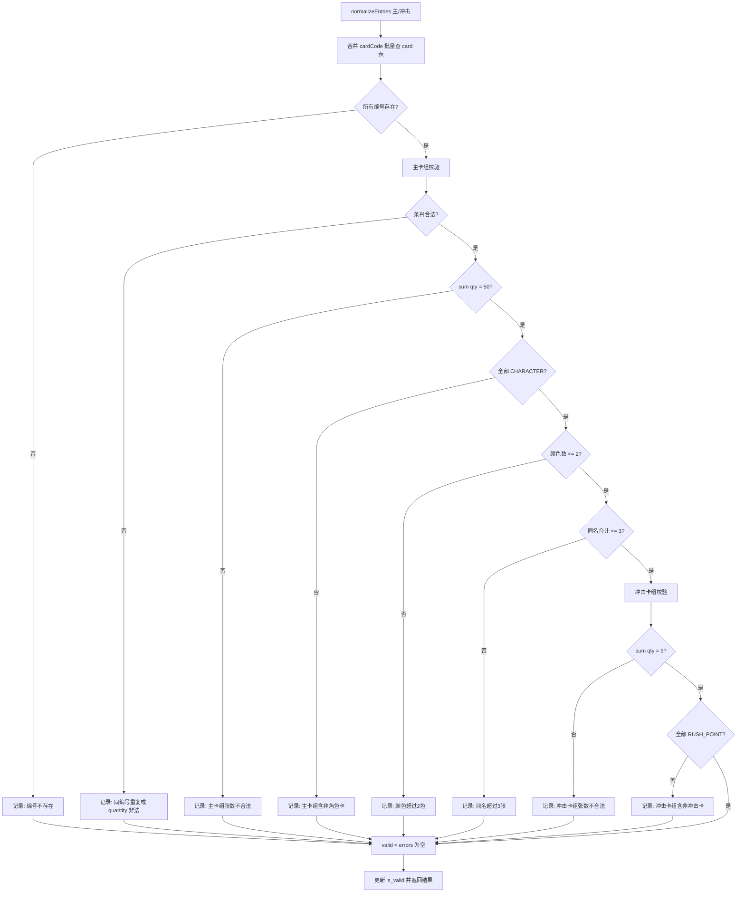
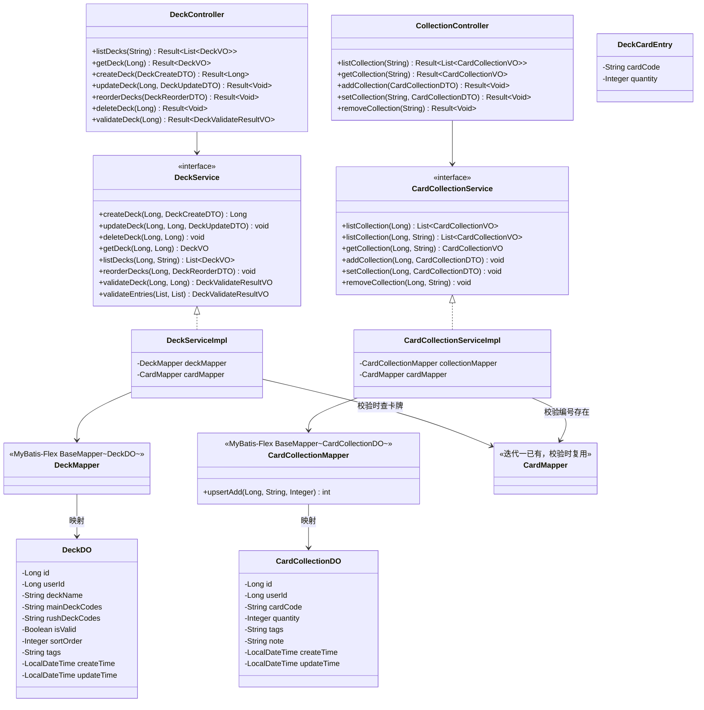

# 详细设计：迭代三 — 卡组构筑与卡牌收藏

> 项目：MTCG 后端程序
> 版本：v0.3.1
> 日期：2026-08-11
> 依据：[需求分析](./01-需求分析.md) FR2.1、FR2.2、FR2.3、FR2.5、FR5.5、[概要设计](./02-概要设计.md) §3 §5、[迭代二详细设计](./04-详细设计-迭代二-卡牌与产品管理.md)

---

## 1. 迭代目标

实现卡组构筑与卡牌收藏管理，跑通卡组 CRUD、卡组合法性校验、收藏 CRUD 全链路，并落实卡组归属用户（FR5.5：仅能操作自己的卡组）。

### 范围

| 包含 | 不包含 |
| --- | --- |
| deck 表建表 | 卡组导入/导出（FR2.4，未来） |
| card_collection 表建表 | 对战引擎 |
| DeckDO / CardCollectionDO 实体 | 对局 |
| DeckMapper / CardCollectionMapper | AI 辅助构筑（FR6.2，未来） |
| DeckService（CRUD + 校验） | 收藏感知构筑推荐 |
| CardCollectionService（CRUD） | |
| DeckController / CollectionController | 独立 tag 表 / 卡组目录树 |
| 卡组校验逻辑（50 / 2 色 / 同名 3 张 / 9 张） | 收藏分类字段（复用 tags） |
| 卡组归属校验（FR5.5） | |
| 卡组自定义排序（sort_order）+ 标签（tags） | |

> 建表脚本以 `sql/init-schema.sql` / `init-data.sql` 为准（历史文档中的 `init.sql` / `resources/db` 路径视为旧称）。
>
> **前置依赖**：迭代一的用户系统与鉴权。本迭代所有接口从安全上下文获取当前登录用户 ID，用于归属校验。

---

## 2. 数据库设计

### 2.1 建表 SQL

```sql
-- 卡组表
CREATE TABLE mtcg_deck (
    id                  BIGSERIAL       PRIMARY KEY,
    user_id             BIGINT          NOT NULL,                  -- 归属用户（应用层校验，无外键）
    deck_name           VARCHAR(64)     NOT NULL,                  -- 卡组名称
    main_deck_codes     TEXT            NOT NULL DEFAULT '[]',     -- 主卡组有序条目 JSON，如 [{"cardCode":"BP01-001","quantity":3},...]；数组顺序=卡组内排序；同编号仅一条
    rush_deck_codes     TEXT            NOT NULL DEFAULT '[]',     -- 冲击卡组有序条目 JSON，结构同上；总张数合计 9
    is_valid            BOOLEAN         NOT NULL DEFAULT FALSE,    -- 最近一次校验结果（缓存，列表展示用）
    sort_order          INTEGER         NOT NULL DEFAULT 0,        -- 用户自定义排序，同 user_id 内越小越靠前
    tags                VARCHAR(256),                               -- 用户自定义标签，逗号分隔，如 "排位,红黄,常用"
    create_time         TIMESTAMP       NOT NULL DEFAULT NOW(),
    update_time         TIMESTAMP       NOT NULL DEFAULT NOW()
);

CREATE INDEX idx_deck_user_id ON mtcg_deck (user_id);
CREATE INDEX idx_deck_user_sort ON mtcg_deck (user_id, sort_order);

-- 卡牌收藏表
CREATE TABLE mtcg_card_collection (
    id                  BIGSERIAL       PRIMARY KEY,
    user_id             BIGINT          NOT NULL,                  -- 归属用户
    card_code           VARCHAR(32)     NOT NULL,                  -- 卡牌编号（存编号不存 ID）
    quantity            INTEGER         NOT NULL DEFAULT 1,        -- 拥有数量
    tags                VARCHAR(256),                               -- 用户自定义标签，逗号分隔，如 "快攻用,交易备用"
    note                VARCHAR(256),                               -- 个人备注
    create_time         TIMESTAMP       NOT NULL DEFAULT NOW(),
    update_time         TIMESTAMP       NOT NULL DEFAULT NOW(),
    CONSTRAINT uk_collection_user_code UNIQUE (user_id, card_code),
    CONSTRAINT ck_collection_qty CHECK (quantity >= 0)
);

CREATE INDEX idx_collection_user_id ON mtcg_card_collection (user_id);

-- update_time 自动更新（复用迭代一已创建的 update_update_time() 函数，仅追加触发器）
CREATE TRIGGER trigger_deck_update_time
    BEFORE UPDATE ON mtcg_deck
    FOR EACH ROW
    EXECUTE FUNCTION update_update_time();

CREATE TRIGGER trigger_collection_update_time
    BEFORE UPDATE ON mtcg_card_collection
    FOR EACH ROW
    EXECUTE FUNCTION update_update_time();
```

### 2.2 设计说明

| 设计点 | 说明 |
| --- | --- |
| mtcg_deck 存有序条目 JSON 而非明细表 | 稳定、可读、导入导出友好；固定规模存 TEXT，无需独立卡组明细表。结构为 `[{cardCode, quantity}, ...]`：**数组下标即卡组内排序**；**同一 `cardCode` 只允许一条**，再次添加同编号只加 `quantity`，禁止再插一条 |
| 不使用外键 | `user_id`、`card_code` 仅作逻辑关联，关系完整性在应用层校验 |
| mtcg_card_collection 存 card_code | 与卡组条目一致，存编号不存 ID；为 AI 构筑辅助提供数据基础 |
| `(user_id, card_code)` 唯一约束 | 收藏按用户+卡牌去重，便于 upsert（ON CONFLICT） |
| `is_valid` 冗余字段 | 缓存最近一次校验结果，列表展示无需实时校验，提升性能 |
| `sort_order` 自定义排序 | **卡组列表**排序：`ORDER BY sort_order ASC, id ASC`；新建时取该用户当前 `MAX(sort_order)+1`（置底）；拖拽重排走批量接口。与卡组**内部**卡牌顺序（JSON 数组序）无关 |
| 卡组 `tags` 字段，不建 tag 表 | 与收藏同一套约定：逗号分隔、写入时规范化（去空白）；按标签筛选用边界匹配，避免 `LIKE '%红%'` 误伤「红黄」；每人卡组量小，独立 tag 表过重，后续若需标签统计/改名再拆表 |
| 收藏不加分类字段 | 分类需求用已有 `tags` 覆盖，避免与标签职责重叠；不做目录树 |
| 条目写入规范化 | 创建/更新时：按出现顺序保留首次位置，后续同 `cardCode` 合并累加 `quantity`；`quantity<=0` 的条目丢弃；规范化后再校验总张数 |

---

## 3. 实体类设计

### 3.1 DeckDO

```
包：com.aris.mtcg.domain.entity
表：mtcg_deck

字段：
- Long id
- Long userId
- String deckName
- String mainDeckCodes     // 有序条目 JSON，如 "[{\"cardCode\":\"BP01-001\",\"quantity\":3}]"
- String rushDeckCodes     // 同上
- Boolean isValid
- Integer sortOrder        // 用户自定义排序（卡组列表）
- String tags              // 用户自定义标签，逗号分隔
- LocalDateTime createTime
- LocalDateTime updateTime

注解：
- @Table("mtcg_deck")                       // MyBatis-Flex
- @Id(keyType = KeyType.Auto)
```

### 3.2 DeckCardEntry（卡组内卡牌条目）

```
包：com.aris.mtcg.domain.dto（创建/更新入参与 VO 复用同一结构）

字段：
- String cardCode                  // @NotBlank 卡牌编号
- Integer quantity                 // @NotNull @Min(1) 该编号张数

约定：
- 在 List 中的位置 = 卡组内展示/构筑顺序（可拖拽重排条目顺序）
- 同一 List 内同一 cardCode 最多一条；再次添加同编号只增加 quantity
```

### 3.3 CardCollectionDO

```
包：com.aris.mtcg.domain.entity
表：mtcg_card_collection

字段：
- Long id
- Long userId
- String cardCode
- Integer quantity
- String tags                    // 用户自定义标签
- String note                    // 个人备注
- LocalDateTime createTime
- LocalDateTime updateTime

注解：
- @Table("mtcg_card_collection")
- @Id(keyType = KeyType.Auto)
```

### 3.4 DeckCreateDTO（创建卡组）

```
包：com.aris.mtcg.domain.dto

字段：
- String deckName                  // @NotBlank @Size(max = 64)
- List<DeckCardEntry> mainDeck     // @NotNull 主卡组有序条目（同编号勿重复，服务端会合并）
- List<DeckCardEntry> rushDeck     // @NotNull 冲击卡组有序条目
- String tags                      // 可选，自定义标签（逗号分隔，服务端规范化）
```

### 3.5 DeckUpdateDTO（编辑卡组）

```
包：com.aris.mtcg.domain.dto

字段（全部可选，按需更新）：
- String deckName                  // @Size(max = 64)
- List<DeckCardEntry> mainDeck     // 非空时整表覆盖并重新校验（覆盖后的顺序即新顺序）
- List<DeckCardEntry> rushDeck     // 非空时整表覆盖并重新校验
- String tags                      // 非 null 时覆盖（空串表示清空标签）
```

### 3.6 DeckReorderDTO（批量重排卡组列表）

```
包：com.aris.mtcg.domain.dto

字段：
- List<DeckReorderItem> items      // @NotEmpty 重排项列表

DeckReorderItem：
- Long id                          // @NotNull 卡组 ID
- Integer sortOrder                // @NotNull @Min(0) 目标排序值
```

> 卡组**内部**卡牌顺序通过更新 `mainDeck` / `rushDeck` 列表顺序完成，不走本接口。

### 3.7 DeckVO（卡组返回视图）

```
包：com.aris.mtcg.domain.vo

字段：
- Long id
- Long userId
- String deckName
- List<DeckCardEntry> mainDeck     // 有序条目（DO JSON 反序列化）
- List<DeckCardEntry> rushDeck
- Boolean isValid
- Integer sortOrder                // 用户自定义排序（卡组列表）
- String tags                      // 用户自定义标签
- String coverImagePath            // 封面卡图（主卡组第一张，由卡牌表派生，非落库）
- Integer mainDeckSize             // 主卡组总张数 = sum(quantity)
- Integer rushDeckSize             // 冲击卡组总张数 = sum(quantity)
- String createTime                // 格式化 yyyy-MM-dd HH:mm:ss
- String updateTime
```

### 3.8 DeckValidateResultVO（校验结果视图）

```
包：com.aris.mtcg.domain.vo

字段：
- Boolean valid                    // 是否合法
- List<String> errors              // 不合法原因列表（空列表表示合法）
- Integer mainDeckCount            // 主卡组实际总张数（sum quantity）
- Integer rushDeckCount            // 冲击卡组实际总张数
- List<String> colors              // 主卡组涉及的颜色（code，如 ["RED","YELLOW"]）
- Map<String, Integer> nameCount   // 同名卡牌统计（卡名 → 张数，按 quantity 加权）
```

### 3.9 CardCollectionDTO（收藏登记）

```
包：com.aris.mtcg.domain.dto

字段：
- String cardCode                  // @NotBlank
- Integer quantity                 // @NotNull @Min(0)
- String tags                      // 可选，自定义标签
- String note                      // 可选，个人备注
```

### 3.10 CardCollectionVO（收藏返回视图）

```
包：com.aris.mtcg.domain.vo

字段：
- Long id
- Long userId
- String cardCode
- String cardName                  // 联查 card 表得到（可空，卡牌被删时为 null）
- Integer quantity
- String tags                      // 用户自定义标签
- String note                      // 个人备注
- String createTime                // 格式化 yyyy-MM-dd HH:mm:ss
- String updateTime
```

> **DO 与 DTO/VO 差异**：DO 的 `mainDeckCodes` / `rushDeckCodes` 存 `String`（JSON）；DTO/VO 用 `List<DeckCardEntry>`。Service 序列化/反序列化；写入前调用 `normalizeEntries` 合并同编号。

---

## 4. DAO 层设计

### 4.1 DeckMapper

```
包：com.aris.mtcg.dao
继承：BaseMapper<DeckDO>（MyBatis-Flex）

自带方法（无需手写 SQL）：
- insert(deckDO)
- updateById(deckDO)
- deleteById(id)
- selectOneById(id)
- selectListByQuery(QueryWrapper)    // 按 user_id 查询用 QueryWrapper

自定义方法：无
```

### 4.2 CardCollectionMapper

```
包：com.aris.mtcg.dao
继承：BaseMapper<CardCollectionDO>

自带方法：同上（按 user_id / card_code 查询用 QueryWrapper）

自定义方法：
// upsert 累加：存在则数量累加，不存在则插入（PostgreSQL ON CONFLICT）
@Insert("""
    INSERT INTO mtcg_card_collection(user_id, card_code, quantity, create_time, update_time)
    VALUES(#{userId}, #{cardCode}, #{quantity}, NOW(), NOW())
    ON CONFLICT (user_id, card_code)
    DO UPDATE SET quantity = mtcg_card_collection.quantity + #{quantity}, update_time = NOW()
""")
int upsertAdd(@Param("userId") Long userId,
              @Param("cardCode") String cardCode,
              @Param("quantity") Integer quantity)
```

---

## 5. Service 层设计

### 5.1 DeckService 接口

```
包：com.aris.mtcg.service

方法：
// CRUD（均需校验卡组归属当前用户）
- Long createDeck(Long userId, DeckCreateDTO dto)
- void updateDeck(Long userId, Long deckId, DeckUpdateDTO dto)
- void deleteDeck(Long userId, Long deckId)
- DeckVO getDeck(Long userId, Long deckId)
- List<DeckVO> listDecks(Long userId, String tag)   // tag 非空时按标签精确包含筛选
- void reorderDecks(Long userId, DeckReorderDTO dto) // 批量更新 sort_order

// 校验
- DeckValidateResultVO validateDeck(Long userId, Long deckId)
- DeckValidateResultVO validateEntries(List<DeckCardEntry> mainDeck, List<DeckCardEntry> rushDeck)
```

### 5.2 CardCollectionService 接口

```
包：com.aris.mtcg.service

方法：
- List<CardCollectionVO> listCollection(Long userId)
- List<CardCollectionVO> listCollection(Long userId, String tag) // 按标签筛选（精确包含，见 §5.3）
- CardCollectionVO getCollection(Long userId, String cardCode)
- void addCollection(Long userId, CardCollectionDTO dto)        // 累加数量（upsert），同步写入 tags/note
- void setCollection(Long userId, CardCollectionDTO dto)        // 设置数量（quantity=0 则删除），同步覆盖 tags/note
- void removeCollection(Long userId, String cardCode)           // 删除条目
```

### 5.3 业务逻辑

| 方法 | 逻辑 |
| --- | --- |
| createDeck | 1. 规范化 tags → 2. normalizeEntries(main/rush) → 3. validateEntries 算 is_valid → 4. 序列化 JSON 写入 DO → 5. sort_order = MAX+1 → 6. insert → 7. 返回 id |
| updateDeck | 1. 查 deck，校验归属 → 2. 非空字段覆盖（main/rush 先 normalizeEntries 再覆盖）→ 3. 若条目变更则重新校验并更新 is_valid → 4. updateById |
| deleteDeck | 1. 查 deck，校验归属 → 2. deleteById |
| getDeck | 1. selectOneById → 2. 校验归属 → 3. DO→VO（JSON→List\<DeckCardEntry\>） |
| listDecks | 1. QueryWrapper 按 user_id 查 → 2. tag 非空时追加标签边界匹配 → 3. `ORDER BY sort_order ASC, id ASC` → 4. 转 VO（读 is_valid，不实时校验） |
| reorderDecks | 1. 校验 items 非空 → 2. 逐条/批量校验归属 → 3. 按 id 更新 sort_order（事务内） |
| validateDeck | 1. 查 deck，校验归属 → 2. 解析条目 → 3. 调用 validateEntries → 4. 更新 is_valid → 5. 返回结果 |
| validateEntries | 见 §7；张数按 `sum(quantity)` 计算 |
| addCollection | 1. 校验 cardCode 在 card 表存在 → 2. 调用 upsertAdd 累加 → 3. 若 dto 含 tags/note 则 updateById 覆盖（tags 规范化） |
| setCollection | 1. 校验归属与 cardCode 存在 → 2. quantity=0 则 delete，否则 update（同步覆盖 tags/note，tags 规范化） |
| removeCollection | 1. 按 user_id + card_code 查，校验归属 → 2. deleteById |
| listCollection | 1. QueryWrapper 按 user_id 查 → 2. 批量联查 card 表补 cardName → 3. 转 VO |
| listCollection(userId, tag) | 1. QueryWrapper 按 user_id 查，tag 非空时追加标签边界匹配 → 2. 批量联查 card 表补 cardName → 3. 转 VO |
| getCollection | 1. 按 user_id + card_code 查 → 2. 联查 cardName → 3. 转 VO |

> **标签约定（卡组 / 收藏共用）**
>
> - 写入规范化：按逗号拆分 → trim → 去掉空段 → 用 `,` 重新拼接（如 `" 排位 , 红黄 "` → `"排位,红黄"`）
> - 筛选精确包含（边界匹配），禁止裸 `LIKE '%tag%'` 子串误伤：
>   - SQL：`(',' || COALESCE(tags, '') || ',') LIKE '%,{tag},%'`
>   - 或应用层：查出后 `Arrays.asList(tags.split(",")).contains(tag)`
> - 不建独立 tag 表；不做收藏「分类」字段 / 卡组目录树

> **卡组条目约定（mainDeck / rushDeck）**
>
> - 数组顺序 = 卡组内排序；前端拖拽条目即改 List 顺序后整表 PUT
> - 同编号只保留一条：`normalizeEntries` 按首次出现位置合并 `quantity`
> - 业务添加同编号卡牌：只 `quantity++`，不在列表别处再插一条
> - 总张数 = `entries.stream().mapToInt(DeckCardEntry::getQuantity).sum()`

### 5.4 归属校验（FR5.5）

所有 Deck / Collection 操作均强制校验资源归属当前登录用户：

```java
// DeckServiceImpl 内部方法
private DeckDO checkOwnership(Long userId, Long deckId) {
    DeckDO deck = deckMapper.selectOneById(deckId);
    if (deck == null) {
        throw new BusinessException("卡组不存在");
    }
    if (!Objects.equals(deck.getUserId(), userId)) {
        throw new BusinessException("无权操作该卡组");
    }
    return deck;
}
```

> 收藏按 `(user_id, card_code)` 查询，查不到即视为不存在或无权，统一抛 `BusinessException("收藏记录不存在")`。

### 5.5 异常定义

复用迭代一 `BusinessException`，新增场景：

```
- 卡组不存在
- 无权操作该卡组
- 卡牌编号不存在（card_code 在 card 表查不到）
- 收藏记录不存在
```

---

## 6. Controller 层设计

### 6.1 DeckController

```
包：com.aris.mtcg.controller
路径：/api/v1/decks
```

| 方法 | HTTP | 路径 | 入参 | 出参 | 说明 |
| --- | --- | --- | --- | --- | --- |
| listDecks | GET | `/decks` | @RequestParam(required=false) String tag | `Result<List<DeckVO>>` | 我的卡组列表（按 sort_order）；tag 非空时按标签精确包含筛选 |
| getDeck | GET | `/decks/{id}` | Long id | `Result<DeckVO>` | 卡组详情 |
| createDeck | POST | `/decks` | @RequestBody DeckCreateDTO | `Result<Long>` | 创建，返回 ID |
| updateDeck | POST | `/decks/{id}` | Long id, @RequestBody DeckUpdateDTO | `Result<Void>` | 编辑（仅 GET/POST，见后端编码规范） |
| reorderDecks | POST | `/decks/reorder` | @RequestBody DeckReorderDTO | `Result<Void>` | 批量更新 sort_order |
| deleteDeck | POST | `/decks/{id}/delete` | Long id | `Result<Void>` | 删除 |
| validateDeck | POST | `/decks/{id}/validate` | Long id | `Result<DeckValidateResultVO>` | 校验合法性 |

> **as-built**：实际类在 `controller.deck.DeckController`；完整 URL 为 `/api/decks...`（`context-path=/api`）。

### 6.2 CollectionController

```
包：com.aris.mtcg.controller
路径：/api/v1/collections
```

| 方法 | HTTP | 路径 | 入参 | 出参 | 说明 |
| --- | --- | --- | --- | --- | --- |
| listCollection | GET | `/collections` | @RequestParam(required=false) String tag | `Result<List<CardCollectionVO>>` | 收藏列表；tag 非空时按标签精确包含筛选 |
| getCollection | GET | `/collections/{cardCode}` | String cardCode | `Result<CardCollectionVO>` | 单卡收藏 |
| addCollection | POST | `/collections` | @RequestBody CardCollectionDTO | `Result<Void>` | 登记收藏（累加，可带 tags/note） |
| setCollection | POST | `/collections/{cardCode}` | String cardCode, @RequestBody CardCollectionDTO | `Result<Void>` | 设置数量，覆盖 tags/note（仅 GET/POST） |
| removeCollection | POST | `/collections/{cardCode}/delete` | String cardCode | `Result<Void>` | 移除条目 |

> **as-built**：实际类在 `controller.collection.CollectionController`；完整 URL 为 `/api/collections...`。

> 所有接口从安全上下文获取当前登录用户 ID（迭代一 JWT 拦截器），传入 Service 做归属校验。统一响应体 `Result<T>` 与全局异常处理复用迭代一实现。

---

## 7. 卡组校验逻辑详细设计

### 7.1 校验规则（FR2.2）

| 校验项 | 规则 | 失败示例 |
| --- | --- | --- |
| 主卡组总张数 | `sum(quantity)` 恰好 50 | 49 / 51 |
| 主卡组条目 | 同 `cardCode` 仅一条；`quantity >= 1` | 两条 BP01-001；quantity=0 |
| 主卡组卡牌类型 | 全部为角色卡（CHARACTER） | 含冲击卡 |
| 主卡组颜色数 | 最多 2 色 | 红+黄+蓝 |
| 主卡组同名卡 | 每个卡名最多 3 张（按 quantity 加权） | "钢铁侠" 合计 4 张 |
| 主卡组编号有效性 | 所有编号在 card 表存在 | 编号不存在 |
| 冲击卡组总张数 | `sum(quantity)` 恰好 9 | 8 / 10 |
| 冲击卡组条目 | 同 `cardCode` 仅一条；`quantity >= 1` | 同编号拆两条 |
| 冲击卡组卡牌类型 | 全部为冲击卡（RUSH_POINT） | 含角色卡 |
| 冲击卡组编号有效性 | 所有编号在 card 表存在 | 编号不存在 |

> **同名 vs 同编号**：规则为「同名最多 3 张」，按 `card_name` 分组、quantity 加权统计。不同编号的同名卡（如异画卡）合并计数。同编号在列表中不应出现两次（写入前 `normalizeEntries` 合并）。

### 7.2 校验流程



### 7.3 校验实现要点

```java
// 写入前合并同编号（保留首次顺序，累加 quantity）
private List<DeckCardEntry> normalizeEntries(List<DeckCardEntry> entries) {
    if (entries == null || entries.isEmpty()) {
        return List.of();
    }
    LinkedHashMap<String, Integer> merged = new LinkedHashMap<>();
    for (DeckCardEntry e : entries) {
        if (e == null || e.getCardCode() == null || e.getCardCode().isBlank()) {
            continue;
        }
        int qty = e.getQuantity() == null ? 0 : e.getQuantity();
        if (qty <= 0) {
            continue;
        }
        String code = e.getCardCode().trim();
        merged.merge(code, qty, Integer::sum);
    }
    return merged.entrySet().stream()
            .map(en -> {
                DeckCardEntry e = new DeckCardEntry();
                e.setCardCode(en.getKey());
                e.setQuantity(en.getValue());
                return e;
            })
            .toList();
}

private int totalQty(List<DeckCardEntry> entries) {
    return entries.stream().mapToInt(DeckCardEntry::getQuantity).sum();
}

// DeckServiceImpl#validateEntries
public DeckValidateResultVO validateEntries(List<DeckCardEntry> mainDeck, List<DeckCardEntry> rushDeck) {
    DeckValidateResultVO result = new DeckValidateResultVO();
    List<String> errors = new ArrayList<>();
    mainDeck = normalizeEntries(mainDeck);
    rushDeck = normalizeEntries(rushDeck);

    Set<String> allCodes = new HashSet<>();
    mainDeck.forEach(e -> allCodes.add(e.getCardCode()));
    rushDeck.forEach(e -> allCodes.add(e.getCardCode()));

    List<CardDO> cards = cardMapper.selectListByQuery(
            QueryWrapper.create().where(CARD.CARD_CODE.in(allCodes)));
    Map<String, CardDO> code2Card = cards.stream()
            .collect(Collectors.toMap(CardDO::getCardCode, c -> c));

    List<String> missing = allCodes.stream()
            .filter(c -> !code2Card.containsKey(c)).toList();
    if (!missing.isEmpty()) {
        errors.add("卡牌编号不存在: " + String.join(",", missing));
    }

    // 主卡组：总张数 = sum(quantity)
    int mainCount = totalQty(mainDeck);
    result.setMainDeckCount(mainCount);
    if (mainCount != 50) {
        errors.add("主卡组必须为 50 张，当前 " + mainCount + " 张");
    }
    // 按 quantity 展开参与类型/颜色/同名统计
    List<CardDO> mainCards = new ArrayList<>();
    for (DeckCardEntry e : mainDeck) {
        CardDO card = code2Card.get(e.getCardCode());
        if (card == null) continue;
        for (int i = 0; i < e.getQuantity(); i++) {
            mainCards.add(card);
        }
    }
    if (mainCards.stream().anyMatch(c -> c.getCardType() != CardType.CHARACTER)) {
        errors.add("主卡组只能包含角色卡");
    }
    Set<Color> colors = mainCards.stream()
            .map(CardDO::getColor).filter(Objects::nonNull).collect(Collectors.toSet());
    result.setColors(colors.stream().map(Color::getCode).toList());
    if (colors.size() > 2) {
        errors.add("主卡组颜色最多 2 色，当前 " + colors.size() + " 色");
    }
    Map<String, Long> nameCount = mainCards.stream()
            .collect(Collectors.groupingBy(CardDO::getCardName, Collectors.counting()));
    result.setNameCount(nameCount.entrySet().stream()
            .collect(Collectors.toMap(Map.Entry::getKey, e -> e.getValue().intValue())));
    List<String> overName = nameCount.entrySet().stream()
            .filter(e -> e.getValue() > 3).map(Map.Entry::getKey).toList();
    if (!overName.isEmpty()) {
        errors.add("同名卡牌超过 3 张: " + String.join(",", overName));
    }

    int rushCount = totalQty(rushDeck);
    result.setRushDeckCount(rushCount);
    if (rushCount != 9) {
        errors.add("冲击卡组必须为 9 张，当前 " + rushCount + " 张");
    }
    List<CardDO> rushCards = new ArrayList<>();
    for (DeckCardEntry e : rushDeck) {
        CardDO card = code2Card.get(e.getCardCode());
        if (card == null) continue;
        for (int i = 0; i < e.getQuantity(); i++) {
            rushCards.add(card);
        }
    }
    if (rushCards.stream().anyMatch(c -> c.getCardType() != CardType.RUSH_POINT)) {
        errors.add("冲击卡组只能包含冲击卡");
    }

    result.setValid(errors.isEmpty());
    result.setErrors(errors);
    return result;
}
```

### 7.4 is_valid 同步策略

| 时机 | 行为 |
| --- | --- |
| 创建卡组 | 规范化条目后调用 `validateEntries` 算 `is_valid` 再 insert |
| 编辑卡组（条目变更） | 重新校验并更新 `is_valid` |
| 显式校验 `POST /decks/{id}/validate` | 重新校验、更新 `is_valid`、返回详细结果 |
| 列表查询 | 直接读 `is_valid`，不实时校验（性能优先） |

---

## 8. 类关系图



---

## 9. 文件清单

| 文件 | 包 | 说明 |
| --- | --- | --- |
| `init.sql`（追加） | `resources/db` | deck / card_collection 建表 SQL |
| `DeckDO.java` | `domain.entity` | 卡组数据库实体 |
| `CardCollectionDO.java` | `domain.entity` | 收藏数据库实体 |
| `DeckMapper.java` | `dao` | 卡组 Mapper |
| `CardCollectionMapper.java` | `dao` | 收藏 Mapper（含 upsert） |
| `DeckService.java` | `service` | 卡组服务接口 |
| `DeckServiceImpl.java` | `service.impl` | 卡组服务实现（含校验） |
| `CardCollectionService.java` | `service` | 收藏服务接口 |
| `CardCollectionServiceImpl.java` | `service.impl` | 收藏服务实现 |
| `DeckCardEntry.java` | `domain.dto` | 卡组内有序条目（cardCode + quantity） |
| `DeckCreateDTO.java` | `domain.dto` | 创建卡组 DTO |
| `DeckUpdateDTO.java` | `domain.dto` | 编辑卡组 DTO |
| `DeckReorderDTO.java` | `domain.dto` | 卡组批量重排 DTO |
| `CardCollectionDTO.java` | `domain.dto` | 收藏登记 DTO |
| `DeckVO.java` | `domain.vo` | 卡组返回视图 |
| `DeckValidateResultVO.java` | `domain.vo` | 校验结果视图 |
| `CardCollectionVO.java` | `domain.vo` | 收藏返回视图 |
| `DeckController.java` | `controller` | 卡组 REST API |
| `CollectionController.java` | `controller` | 收藏 REST API |

> 共新增 18 个 Java 文件 + 1 段建表 SQL（追加至迭代一 `init.sql`）。统一响应体 `Result<T>`、全局异常处理、`BusinessException`、`CardMapper`、`CardDO`、`CardType` / `Color` 枚举均复用迭代一/迭代二已有实现。
