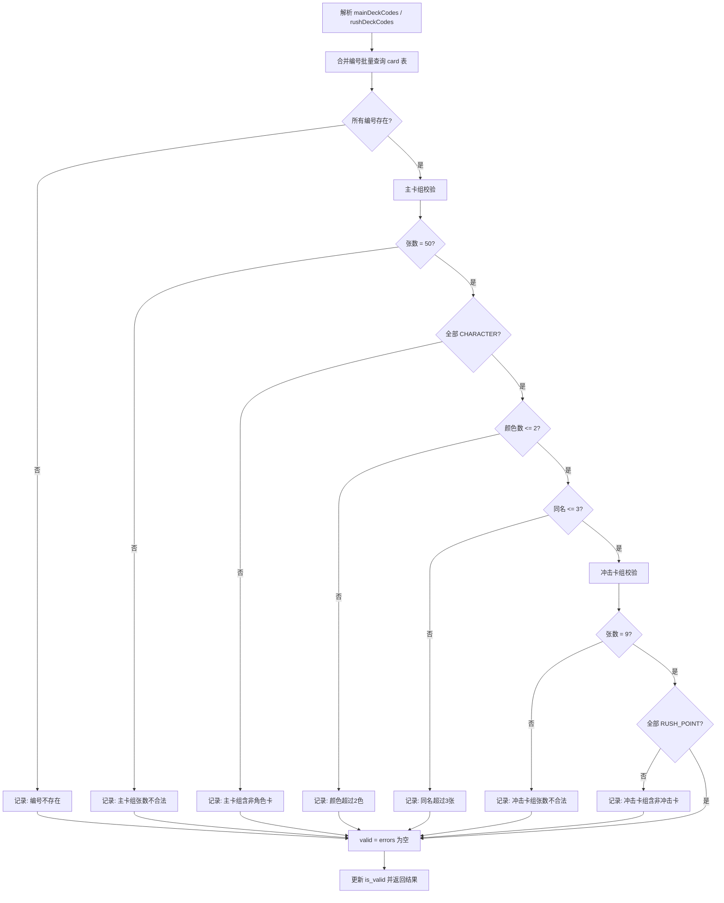
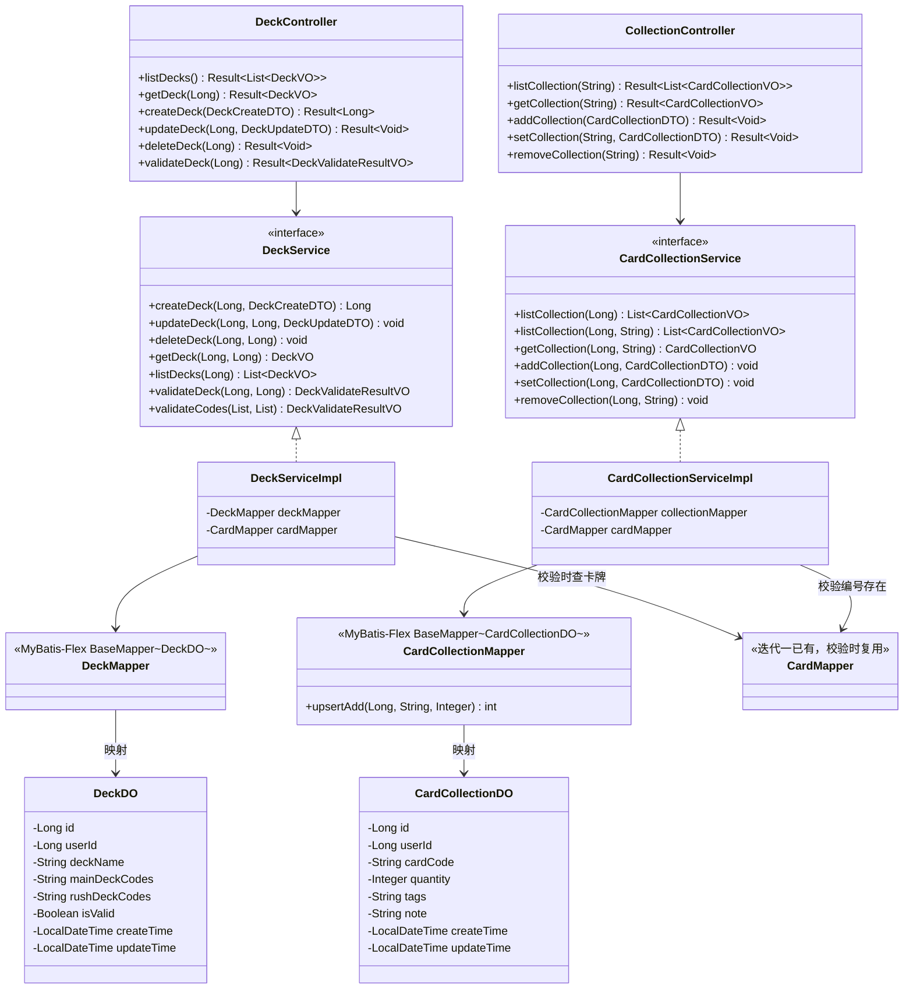

> **迭代规划调整说明（2026-08-03）**：本文档原对应旧迭代三，按 MVP 优先原则重新规划后，对应【新迭代三】。详见 [需求分析 §6](./01-需求分析.md#6-需求优先级与迭代规划)。文件名保留历史编号不变。
>
> ---

# 详细设计：迭代三 — 卡组构筑与卡牌收藏

> 项目：MTCG 后端程序
> 版本：v0.3
> 日期：2026-07-31
> 依据：[需求分析](./01-需求分析.md) FR2.1、FR2.2、FR2.3、FR2.5、FR5.5、[概要设计](./02-概要设计.md) §3 §5、[迭代一详细设计](./03-详细设计-迭代一-卡牌数据落地.md)

---

## 1. 迭代目标

实现卡组构筑与卡牌收藏管理，跑通卡组 CRUD、卡组合法性校验、收藏 CRUD 全链路，并落实卡组归属用户（FR5.5：仅能操作自己的卡组）。

### 范围

| 包含 | 不包含 |
| --- | --- |
| deck 表建表 | 卡组导入/导出（FR2.4，未来） |
| card_collection 表建表 | 对战引擎 |
| DeckDO / CardCollectionDO 实体 | 对局 |
| DeckMapper / CardCollectionMapper | AI 辅助构筑（FR6.2，未来） |
| DeckService（CRUD + 校验） | 收藏感知构筑推荐 |
| CardCollectionService（CRUD） | |
| DeckController / CollectionController | |
| 卡组校验逻辑（50 / 2 色 / 同名 3 张 / 9 张） | |
| 卡组归属校验（FR5.5） | |

> **前置依赖**：迭代二的用户系统与鉴权。本迭代所有接口从安全上下文获取当前登录用户 ID，用于归属校验。

---

## 2. 数据库设计

### 2.1 建表 SQL

```sql
-- 卡组表
CREATE TABLE mtcg_deck (
    id                  BIGSERIAL       PRIMARY KEY,
    user_id             BIGINT          NOT NULL,                  -- 归属用户（应用层校验，无外键）
    deck_name           VARCHAR(64)     NOT NULL,                  -- 卡组名称
    main_deck_codes     TEXT            NOT NULL DEFAULT '[]',     -- 主卡组卡牌编号 JSON 数组，如 ["BP01-001","BP01-005",...]
    rush_deck_codes     TEXT            NOT NULL DEFAULT '[]',     -- 冲击卡组卡牌编号 JSON 数组，9 张
    is_valid            BOOLEAN         NOT NULL DEFAULT FALSE,    -- 最近一次校验结果（缓存，列表展示用）
    create_time         TIMESTAMP       NOT NULL DEFAULT NOW(),
    update_time         TIMESTAMP       NOT NULL DEFAULT NOW()
);

CREATE INDEX idx_deck_user_id ON mtcg_deck (user_id);

-- 卡牌收藏表
CREATE TABLE mtcg_card_collection (
    id                  BIGSERIAL       PRIMARY KEY,
    user_id             BIGINT          NOT NULL,                  -- 归属用户
    card_code           VARCHAR(32)     NOT NULL,                  -- 卡牌编号（存编号不存 ID）
    quantity            INTEGER         NOT NULL DEFAULT 1,        -- 拥有数量
    tags                VARCHAR(256),                               -- 用户自定义标签，逗号分隔，如 "快攻用,交易备用"
    note                VARCHAR(256),                               -- 个人备注
    create_time         TIMESTAMP       NOT NULL DEFAULT NOW(),
    update_time         TIMESTAMP       NOT NULL DEFAULT NOW(),
    CONSTRAINT uk_collection_user_code UNIQUE (user_id, card_code),
    CONSTRAINT ck_collection_qty CHECK (quantity >= 0)
);

CREATE INDEX idx_collection_user_id ON mtcg_card_collection (user_id);

-- update_time 自动更新（复用迭代一已创建的 update_update_time() 函数，仅追加触发器）
CREATE TRIGGER trigger_deck_update_time
    BEFORE UPDATE ON mtcg_deck
    FOR EACH ROW
    EXECUTE FUNCTION update_update_time();

CREATE TRIGGER trigger_collection_update_time
    BEFORE UPDATE ON mtcg_card_collection
    FOR EACH ROW
    EXECUTE FUNCTION update_update_time();
```

### 2.2 设计说明

| 设计点 | 说明 |
| --- | --- |
| mtcg_deck 存卡牌编号而非 ID | 稳定、可读、导入导出友好（D1 决策）；50/9 张固定规模，JSON 数组存 TEXT 字段，无需独立卡组明细表 |
| 不使用外键 | `user_id`、`card_code` 仅作逻辑关联，关系完整性在应用层校验 |
| mtcg_card_collection 存 card_code | 与 mtcg_deck 一致，存编号不存 ID；为 AI 构筑辅助提供数据基础 |
| `(user_id, card_code)` 唯一约束 | 收藏按用户+卡牌去重，便于 upsert（ON CONFLICT） |
| `is_valid` 冗余字段 | 缓存最近一次校验结果，列表展示无需实时校验，提升性能 |

---

## 3. 实体类设计

### 3.1 DeckDO

```
包：com.aris.mtcg.domain.entity
表：mtcg_deck

字段：
- Long id
- Long userId
- String deckName
- String mainDeckCodes     // JSON 数组字符串，如 "[\"BP01-001\",\"BP01-005\"]"
- String rushDeckCodes     // JSON 数组字符串
- Boolean isValid
- LocalDateTime createTime
- LocalDateTime updateTime

注解：
- @Table("mtcg_deck")                       // MyBatis-Flex
- @Id(keyType = KeyType.Auto)
```

### 3.2 CardCollectionDO

```
包：com.aris.mtcg.domain.entity
表：mtcg_card_collection

字段：
- Long id
- Long userId
- String cardCode
- Integer quantity
- String tags                    // 用户自定义标签
- String note                    // 个人备注
- LocalDateTime createTime
- LocalDateTime updateTime

注解：
- @Table("mtcg_card_collection")
- @Id(keyType = KeyType.Auto)
```

### 3.3 DeckCreateDTO（创建卡组）

```
包：com.aris.mtcg.domain.dto

字段：
- String deckName                  // @NotBlank @Size(max = 64)
- List<String> mainDeckCodes       // @NotNull 主卡组编号列表
- List<String> rushDeckCodes       // @NotNull 冲击卡组编号列表
```

### 3.4 DeckUpdateDTO（编辑卡组）

```
包：com.aris.mtcg.domain.dto

字段（全部可选，按需更新）：
- String deckName                  // @Size(max = 64)
- List<String> mainDeckCodes       // 非空时覆盖并重新校验
- List<String> rushDeckCodes       // 非空时覆盖并重新校验
```

### 3.5 DeckVO（卡组返回视图）

```
包：com.aris.mtcg.domain.vo

字段：
- Long id
- Long userId
- String deckName
- List<String> mainDeckCodes       // 解析后的编号列表（DO 的 JSON 字符串反序列化）
- List<String> rushDeckCodes
- Boolean isValid
- Integer mainDeckSize             // 主卡组张数（便捷展示）
- Integer rushDeckSize             // 冲击卡组张数
- String createTime                // 格式化 yyyy-MM-dd HH:mm:ss
- String updateTime
```

### 3.6 DeckValidateResultVO（校验结果视图）

```
包：com.aris.mtcg.domain.vo

字段：
- Boolean valid                    // 是否合法
- List<String> errors              // 不合法原因列表（空列表表示合法）
- Integer mainDeckCount            // 主卡组实际张数
- Integer rushDeckCount            // 冲击卡组实际张数
- List<String> colors              // 主卡组涉及的颜色（code，如 ["RED","YELLOW"]）
- Map<String, Integer> nameCount   // 同名卡牌统计（卡名 → 张数）
```

### 3.7 CardCollectionDTO（收藏登记）

```
包：com.aris.mtcg.domain.dto

字段：
- String cardCode                  // @NotBlank
- Integer quantity                 // @NotNull @Min(0)
- String tags                      // 可选，自定义标签
- String note                      // 可选，个人备注
```

### 3.8 CardCollectionVO（收藏返回视图）

```
包：com.aris.mtcg.domain.vo

字段：
- Long id
- Long userId
- String cardCode
- String cardName                  // 联查 card 表得到（可空，卡牌被删时为 null）
- Integer quantity
- String tags                      // 用户自定义标签
- String note                      // 个人备注
- String createTime                // 格式化 yyyy-MM-dd HH:mm:ss
- String updateTime
```

> **DO 与 DTO/VO 的 codes 字段类型差异**：DO 存 `String`（JSON 字符串）以贴合数据库；DTO/VO 用 `List<String>` 便于前端交互。Service 层用 fastjson2（`JSON.toJSONString` / `JSON.parseArray`）完成互转。

---

## 4. DAO 层设计

### 4.1 DeckMapper

```
包：com.aris.mtcg.dao
继承：BaseMapper<DeckDO>（MyBatis-Flex）

自带方法（无需手写 SQL）：
- insert(deckDO)
- updateById(deckDO)
- deleteById(id)
- selectOneById(id)
- selectListByQuery(QueryWrapper)    // 按 user_id 查询用 QueryWrapper

自定义方法：无
```

### 4.2 CardCollectionMapper

```
包：com.aris.mtcg.dao
继承：BaseMapper<CardCollectionDO>

自带方法：同上（按 user_id / card_code 查询用 QueryWrapper）

自定义方法：
// upsert 累加：存在则数量累加，不存在则插入（PostgreSQL ON CONFLICT）
@Insert("""
    INSERT INTO mtcg_card_collection(user_id, card_code, quantity, create_time, update_time)
    VALUES(#{userId}, #{cardCode}, #{quantity}, NOW(), NOW())
    ON CONFLICT (user_id, card_code)
    DO UPDATE SET quantity = mtcg_card_collection.quantity + #{quantity}, update_time = NOW()
""")
int upsertAdd(@Param("userId") Long userId,
              @Param("cardCode") String cardCode,
              @Param("quantity") Integer quantity)
```

---

## 5. Service 层设计

### 5.1 DeckService 接口

```
包：com.aris.mtcg.service

方法：
// CRUD（均需校验卡组归属当前用户）
- Long createDeck(Long userId, DeckCreateDTO dto)
- void updateDeck(Long userId, Long deckId, DeckUpdateDTO dto)
- void deleteDeck(Long userId, Long deckId)
- DeckVO getDeck(Long userId, Long deckId)
- List<DeckVO> listDecks(Long userId)

// 校验
- DeckValidateResultVO validateDeck(Long userId, Long deckId)
- DeckValidateResultVO validateCodes(List<String> mainCodes, List<String> rushCodes)
```

### 5.2 CardCollectionService 接口

```
包：com.aris.mtcg.service

方法：
- List<CardCollectionVO> listCollection(Long userId)
- List<CardCollectionVO> listCollection(Long userId, String tag) // 按标签筛选（tag 非空时 tags LIKE '%tag%'）
- CardCollectionVO getCollection(Long userId, String cardCode)
- void addCollection(Long userId, CardCollectionDTO dto)        // 累加数量（upsert），同步写入 tags/note
- void setCollection(Long userId, CardCollectionDTO dto)        // 设置数量（quantity=0 则删除），同步覆盖 tags/note
- void removeCollection(Long userId, String cardCode)           // 删除条目
```

### 5.3 业务逻辑

| 方法 | 逻辑 |
| --- | --- |
| createDeck | 1. DTO 转 DO（List→JSON 字符串，fastjson2）→ 2. setUserId → 3. 调用 validateCodes 算 is_valid → 4. insert → 5. 返回 id |
| updateDeck | 1. 查 deck，校验归属 → 2. 非空字段覆盖 DO → 3. 若 codes 变更则重新校验并更新 is_valid → 4. updateById |
| deleteDeck | 1. 查 deck，校验归属 → 2. deleteById |
| getDeck | 1. selectOneById → 2. 校验归属 → 3. DO→VO（JSON→List） |
| listDecks | 1. QueryWrapper 按 user_id 查 → 2. 转 VO 列表（不实时校验，读 is_valid） |
| validateDeck | 1. 查 deck，校验归属 → 2. 解析 codes → 3. 调用 validateCodes → 4. 更新 is_valid → 5. 返回结果 |
| validateCodes | 见 §7 卡组校验逻辑详细设计 |
| addCollection | 1. 校验 cardCode 在 card 表存在 → 2. 调用 upsertAdd 累加 → 3. 若 dto 含 tags/note 则 updateById 覆盖 |
| setCollection | 1. 校验归属与 cardCode 存在 → 2. quantity=0 则 delete，否则 update（同步覆盖 tags/note） |
| removeCollection | 1. 按 user_id + card_code 查，校验归属 → 2. deleteById |
| listCollection | 1. QueryWrapper 按 user_id 查 → 2. 批量联查 card 表补 cardName → 3. 转 VO |
| listCollection(userId, tag) | 1. QueryWrapper 按 user_id 查，tag 非空时追加 `tags LIKE '%tag%'`（如 `LIKE '%快攻%'`）→ 2. 批量联查 card 表补 cardName → 3. 转 VO |
| getCollection | 1. 按 user_id + card_code 查 → 2. 联查 cardName → 3. 转 VO |

### 5.4 归属校验（FR5.5）

所有 Deck / Collection 操作均强制校验资源归属当前登录用户：

```java
// DeckServiceImpl 内部方法
private DeckDO checkOwnership(Long userId, Long deckId) {
    DeckDO deck = deckMapper.selectOneById(deckId);
    if (deck == null) {
        throw new BusinessException("卡组不存在");
    }
    if (!Objects.equals(deck.getUserId(), userId)) {
        throw new BusinessException("无权操作该卡组");
    }
    return deck;
}
```

> 收藏按 `(user_id, card_code)` 查询，查不到即视为不存在或无权，统一抛 `BusinessException("收藏记录不存在")`。

### 5.5 异常定义

复用迭代一 `BusinessException`，新增场景：

```
- 卡组不存在
- 无权操作该卡组
- 卡牌编号不存在（card_code 在 card 表查不到）
- 收藏记录不存在
```

---

## 6. Controller 层设计

### 6.1 DeckController

```
包：com.aris.mtcg.controller
路径：/api/v1/decks
```

| 方法 | HTTP | 路径 | 入参 | 出参 | 说明 |
| --- | --- | --- | --- | --- | --- |
| listDecks | GET | `/decks` | - | `Result<List<DeckVO>>` | 我的卡组列表 |
| getDeck | GET | `/decks/{id}` | Long id | `Result<DeckVO>` | 卡组详情 |
| createDeck | POST | `/decks` | @RequestBody DeckCreateDTO | `Result<Long>` | 创建，返回 ID |
| updateDeck | PUT | `/decks/{id}` | Long id, @RequestBody DeckUpdateDTO | `Result<Void>` | 编辑 |
| deleteDeck | DELETE | `/decks/{id}` | Long id | `Result<Void>` | 删除 |
| validateDeck | POST | `/decks/{id}/validate` | Long id | `Result<DeckValidateResultVO>` | 校验合法性 |

### 6.2 CollectionController

```
包：com.aris.mtcg.controller
路径：/api/v1/collections
```

| 方法 | HTTP | 路径 | 入参 | 出参 | 说明 |
| --- | --- | --- | --- | --- | --- |
| listCollection | GET | `/collections` | @RequestParam(required=false) String tag | `Result<List<CardCollectionVO>>` | 收藏列表；tag 非空时按标签筛选（`tags LIKE '%tag%'`） |
| getCollection | GET | `/collections/{cardCode}` | String cardCode | `Result<CardCollectionVO>` | 单卡收藏 |
| addCollection | POST | `/collections` | @RequestBody CardCollectionDTO | `Result<Void>` | 登记收藏（累加，可带 tags/note） |
| setCollection | PUT | `/collections/{cardCode}` | String cardCode, @RequestBody CardCollectionDTO | `Result<Void>` | 设置数量，覆盖 tags/note |
| removeCollection | DELETE | `/collections/{cardCode}` | String cardCode | `Result<Void>` | 移除条目 |

> 所有接口从 `SecurityContext` 获取当前登录用户 ID（迭代二实现），传入 Service 做归属校验。统一响应体 `Result<T>` 与全局异常处理复用迭代一实现。

---

## 7. 卡组校验逻辑详细设计

### 7.1 校验规则（FR2.2）

| 校验项 | 规则 | 失败示例 |
| --- | --- | --- |
| 主卡组张数 | 恰好 50 张 | 49 张 / 51 张 |
| 主卡组卡牌类型 | 全部为角色卡（CHARACTER） | 含冲击卡 |
| 主卡组颜色数 | 最多 2 色 | 红+黄+蓝 |
| 主卡组同名卡 | 每个卡名最多 3 张 | "钢铁侠" 4 张 |
| 主卡组编号有效性 | 所有编号在 card 表存在 | 编号不存在 |
| 冲击卡组张数 | 恰好 9 张 | 8 张 / 10 张 |
| 冲击卡组卡牌类型 | 全部为冲击卡（RUSH_POINT） | 含角色卡 |
| 冲击卡组编号有效性 | 所有编号在 card 表存在 | 编号不存在 |

> **同名 vs 同编号**：规则为「同名最多 3 张」，按 `card_name` 分组统计，而非按 `card_code`。不同编号的同名卡（如异画卡）合并计数。

### 7.2 校验流程



### 7.3 校验实现要点

```java
// DeckServiceImpl#validateCodes
public DeckValidateResultVO validateCodes(List<String> mainCodes, List<String> rushCodes) {
    DeckValidateResultVO result = new DeckValidateResultVO();
    List<String> errors = new ArrayList<>();

    // 1. 合并所有编号，批量查 card 表（避免 N+1）
    Set<String> allCodes = new HashSet<>();
    allCodes.addAll(mainCodes);
    allCodes.addAll(rushCodes);
    List<CardDO> cards = cardMapper.selectListByQuery(
            QueryWrapper.create().where(CARD.CARD_CODE.in(allCodes)));
    Map<String, CardDO> code2Card = cards.stream()
            .collect(Collectors.toMap(CardDO::getCardCode, c -> c));

    // 2. 找出不存在的编号
    List<String> missing = allCodes.stream()
            .filter(c -> !code2Card.containsKey(c)).toList();
    if (!missing.isEmpty()) {
        errors.add("卡牌编号不存在: " + String.join(",", missing));
    }

    // 3. 主卡组校验
    result.setMainDeckCount(mainCodes.size());
    // 3.1 张数 = 50
    if (mainCodes.size() != 50) {
        errors.add("主卡组必须为 50 张，当前 " + mainCodes.size() + " 张");
    }
    // 3.2 全部为角色卡
    List<CardDO> mainCards = mainCodes.stream()
            .map(code2Card::get).filter(Objects::nonNull).toList();
    if (mainCards.stream().anyMatch(c -> c.getCardType() != CardType.CHARACTER)) {
        errors.add("主卡组只能包含角色卡");
    }
    // 3.3 颜色数 <= 2
    Set<Color> colors = mainCards.stream()
            .map(CardDO::getColor).filter(Objects::nonNull).collect(Collectors.toSet());
    result.setColors(colors.stream().map(Color::getCode).toList());
    if (colors.size() > 2) {
        errors.add("主卡组颜色最多 2 色，当前 " + colors.size() + " 色");
    }
    // 3.4 同名 <= 3（按 card_name 分组）
    Map<String, Long> nameCount = mainCards.stream()
            .collect(Collectors.groupingBy(CardDO::getCardName, Collectors.counting()));
    result.setNameCount(nameCount.entrySet().stream()
            .collect(Collectors.toMap(Map.Entry::getKey, e -> e.getValue().intValue())));
    List<String> overName = nameCount.entrySet().stream()
            .filter(e -> e.getValue() > 3).map(Map.Entry::getKey).toList();
    if (!overName.isEmpty()) {
        errors.add("同名卡牌超过 3 张: " + String.join(",", overName));
    }

    // 4. 冲击卡组校验
    result.setRushDeckCount(rushCodes.size());
    if (rushCodes.size() != 9) {
        errors.add("冲击卡组必须为 9 张，当前 " + rushCodes.size() + " 张");
    }
    List<CardDO> rushCards = rushCodes.stream()
            .map(code2Card::get).filter(Objects::nonNull).toList();
    if (rushCards.stream().anyMatch(c -> c.getCardType() != CardType.RUSH_POINT)) {
        errors.add("冲击卡组只能包含冲击卡");
    }

    result.setValid(errors.isEmpty());
    result.setErrors(errors);
    return result;
}
```

### 7.4 is_valid 同步策略

| 时机 | 行为 |
| --- | --- |
| 创建卡组 | 自动调用 `validateCodes` 算 `is_valid` 后 insert |
| 编辑卡组（codes 变更） | 重新校验并更新 `is_valid` |
| 显式校验 `POST /decks/{id}/validate` | 重新校验、更新 `is_valid`、返回详细结果 |
| 列表查询 | 直接读 `is_valid`，不实时校验（性能优先） |

---

## 8. 类关系图



---

## 9. 文件清单

| 文件 | 包 | 说明 |
| --- | --- | --- |
| `init.sql`（追加） | `resources/db` | deck / card_collection 建表 SQL |
| `DeckDO.java` | `domain.entity` | 卡组数据库实体 |
| `CardCollectionDO.java` | `domain.entity` | 收藏数据库实体 |
| `DeckMapper.java` | `dao` | 卡组 Mapper |
| `CardCollectionMapper.java` | `dao` | 收藏 Mapper（含 upsert） |
| `DeckService.java` | `service` | 卡组服务接口 |
| `DeckServiceImpl.java` | `service.impl` | 卡组服务实现（含校验） |
| `CardCollectionService.java` | `service` | 收藏服务接口 |
| `CardCollectionServiceImpl.java` | `service.impl` | 收藏服务实现 |
| `DeckCreateDTO.java` | `domain.dto` | 创建卡组 DTO |
| `DeckUpdateDTO.java` | `domain.dto` | 编辑卡组 DTO |
| `CardCollectionDTO.java` | `domain.dto` | 收藏登记 DTO |
| `DeckVO.java` | `domain.vo` | 卡组返回视图 |
| `DeckValidateResultVO.java` | `domain.vo` | 校验结果视图 |
| `CardCollectionVO.java` | `domain.vo` | 收藏返回视图 |
| `DeckController.java` | `controller` | 卡组 REST API |
| `CollectionController.java` | `controller` | 收藏 REST API |

> 共新增 16 个 Java 文件 + 1 段建表 SQL（追加至迭代一 `init.sql`）。统一响应体 `Result<T>`、全局异常处理、`BusinessException`、`CardMapper`、`CardDO`、`CardType` / `Color` 枚举均复用迭代一/迭代二已有实现。
