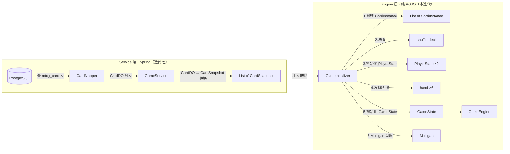
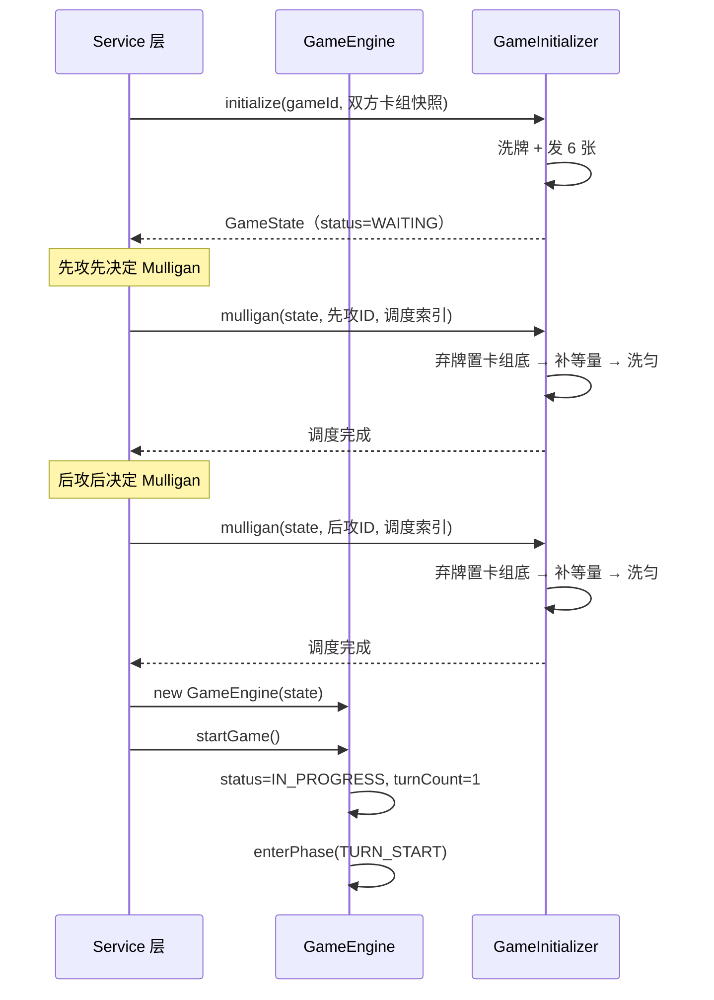
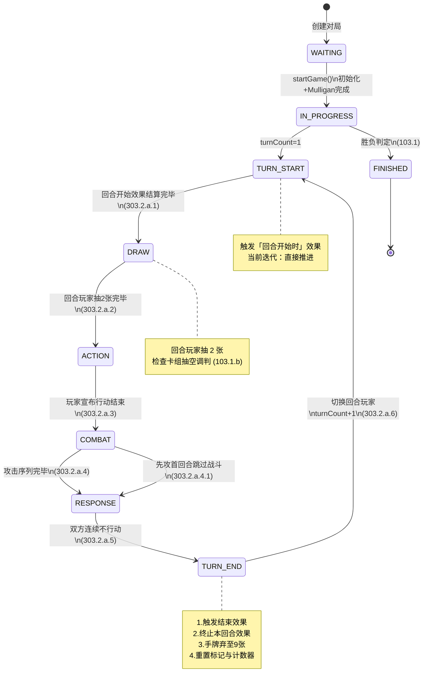
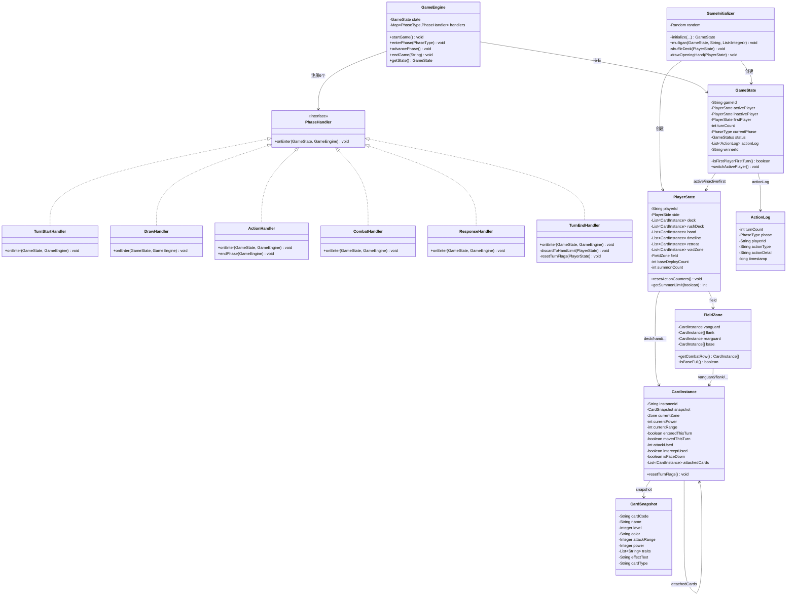
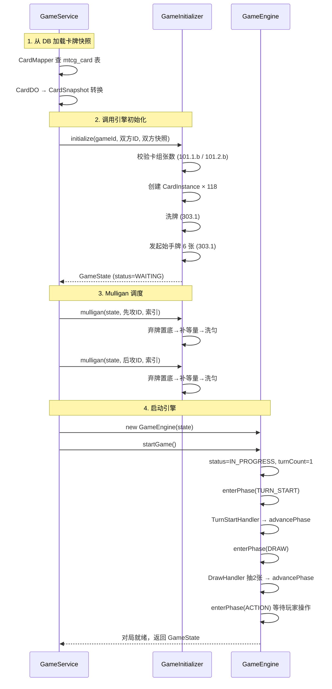

# 详细设计：迭代四 — 引擎状态模型与回合流程

> 项目：MTCG —《超英击战 / Hero Rush TCG》后端程序
> 版本：v0.1
> 日期：2026-07-31
> 依据：[需求分析](./01-需求分析.md) FR3.1–FR3.2、[概要设计](./02-概要设计.md) §4 §6、[区域模型与回合流程](../规则文档/04-区域模型与回合流程.md)、[综合规则书 v1.01](../规则文档/02-综合规则书-v1.01.md) 301 / 302 / 303.1 / 303.2.a.1–2

---

## 1. 概述

### 1.1 迭代目标

实现对战引擎的核心骨架：对局全局状态模型、玩家状态模型、场上区域模型、卡牌实例模型，以及 6 阶段回合流程状态机和对局初始化流程。本迭代聚焦"状态承载"与"阶段流转"，不涉及行动阶段内部操作（迭代五）、战斗判定（迭代五）、效果系统（迭代六）的完整实现。

### 1.2 范围

| 包含 | 不包含 |
| --- | --- |
| GameState / PlayerState / FieldZone 状态模型 | 行动阶段操作执行（基地部署/号召/移动/启动） |
| CardInstance / CardSnapshot 卡牌实例模型 | 战斗判定与距离计算（迭代五） |
| PhaseType / GameStatus / Zone / PlayerSide 枚举 | 效果系统与关键词能力（迭代六） |
| GameEngine 核心引擎 + 6 阶段 PhaseHandler | 对战 API 与对局持久化（迭代七） |
| 对局初始化流程（洗牌、发牌、Mulligan） | AI 决策（迭代八） |
| RuleConstants 规则常量 | |

### 1.3 设计约束

| 约束 | 说明 |
| --- | --- |
| 引擎纯 POJO | `com.aris.mtcg.engine` 包不依赖 Spring、不依赖 `common` 包、不依赖 MyBatis-Flex，可独立 `new` 单元测试（NFR1） |
| 枚举纯 Java | 引擎内枚举不实现 `EnumBase` 接口（因 `EnumBase` 在 `common` 包），仅保留纯枚举常量 + label |
| 规则可追溯 | 引擎代码注释标注规则条款编号（NFR5），如 `// 303.2.a.2` |
| 卡牌自包含 | 对局中不访问数据库，卡牌快照在初始化时一次性加载（概要设计 §6.1） |
| 阶段不可回退 | 6 阶段严格顺序执行，不可跳转回退（303.2.a） |

### 1.4 包结构

```
com.aris.mtcg.engine
├── GameEngine                      // 核心引擎，管理阶段流转
├── GameInitializer                 // 对局初始化（洗牌、发牌、Mulligan）
├── enums
│   ├── PhaseType                   // 回合阶段枚举（303.2.a）
│   ├── GameStatus                  // 对局状态枚举
│   ├── Zone                        // 区域枚举（102、302）
│   └── PlayerSide                  // 先后攻枚举
├── model
│   ├── GameState                   // 对局全局状态
│   ├── PlayerState                 // 玩家状态
│   ├── FieldZone                   // 场上区域（战区+基地）
│   ├── CardInstance                // 卡牌实例（快照+运行时状态）
│   ├── CardSnapshot                // 卡牌快照（不可变）
│   └── ActionLog                   // 操作流水记录
├── phase
│   ├── PhaseHandler                // 阶段处理器接口
│   ├── TurnStartHandler            // 回合开始处理器（303.2.a.1）
│   ├── DrawHandler                 // 抽卡处理器（303.2.a.2）
│   ├── ActionHandler               // 行动处理器（303.2.a.3）
│   ├── CombatHandler               // 战斗处理器（303.2.a.4）
│   ├── ResponseHandler             // 应对处理器（303.2.a.5）
│   └── TurnEndHandler              // 回合结束处理器（303.2.a.6）
└── rule
    └── RuleConstants               // 规则常量
```

---

## 2. 引擎状态模型

### 2.1 CardSnapshot — 卡牌快照（不可变）

卡牌快照在对局初始化时从数据库加载，对局全程不可变。引擎通过快照自包含运行，不再访问数据库。

```java
package com.aris.mtcg.engine.model;

import java.util.List;

/**
 * 卡牌快照（不可变）。
 * <p>对局初始化时从 DB 加载，对局中只读，不修改。
 * 引擎通过快照自包含运行，不访问数据库（概要设计 §6.1）。
 */
public final class CardSnapshot {

    /** 卡牌编号，如 BP01-020 */
    private final String cardCode;
    /** 卡牌名称（含称号） */
    private final String name;
    /** 等级 Lv（1-6），冲击卡为 null */
    private final Integer level;          // 201.6
    /** 颜色：RED/YELLOW/BLUE/GREEN/ORANGE/PURPLE，冲击卡为 null */
    private final String color;           // 201.5
    /** 攻击距离 R，冲击卡为 null */
    private final Integer attackRange;    // 201.11
    /** 战力（印刷值），冲击卡为 null */
    private final Integer power;          // 201.12
    /** 特征列表，如 ["人类","复仇者联盟"] */
    private final List<String> traits;    // 201.9
    /** 效果描述原文（当前阶段不解析，迭代六处理） */
    private final String effectText;      // 201.10
    /** 卡牌类型：CHARACTER / RUSH_POINT */
    private final String cardType;

    public CardSnapshot(String cardCode, String name, Integer level, String color,
                        Integer attackRange, Integer power, List<String> traits,
                        String effectText, String cardType) {
        this.cardCode = cardCode;
        this.name = name;
        this.level = level;
        this.color = color;
        this.attackRange = attackRange;
        this.power = power;
        this.traits = traits == null ? List.of() : List.copyOf(traits);  // 防御性拷贝
        this.effectText = effectText;
        this.cardType = cardType;
    }

    // 全部 getter，无 setter（不可变）
}
```

### 2.2 CardInstance — 卡牌实例

对局中所有卡牌（无论在手牌、卡组、场上、撤退区）统一用 `CardInstance` 表示。包含一个不可变的 `CardSnapshot` 引用 + 运行时状态。运行时状态仅场上卡牌使用，场外卡牌这些字段保持默认值。

```java
package com.aris.mtcg.engine.model;

import com.aris.mtcg.engine.enums.Zone;

import java.util.ArrayList;
import java.util.List;

/**
 * 卡牌实例：对局中所有卡牌的统一表示。
 * <p>= 不可变快照（CardSnapshot）+ 运行时状态。
 * 场外区域的卡牌运行时状态字段保持默认值；场上卡牌才使用这些标记。
 */
public class CardInstance {

    /** 实例唯一 ID（对局内唯一，用于区分同名卡） */
    private final String instanceId;
    /** 卡牌快照（不可变） */
    private final CardSnapshot snapshot;

    // === 运行时状态（仅场上卡牌使用） ===

    /** 当前所在区域 */
    private Zone currentZone;             // 302 区域
    /** 当前战力（受效果影响，301.41） */
    private int currentPower;             // 当前战力
    /** 当前攻击距离 R（受效果影响，301.41） */
    private int currentRange;            // 当前 R
    /** 本回合进场（影响战基移动限制，303.2.a.3.1.3） */
    private boolean enteredThisTurn;
    /** 本回合已战基移动（每角色每回合 1 次，303.2.a.3.1.3） */
    private boolean movedThisTurn;
    /** 本回合已攻击次数（连击=2，305.3） */
    private int attackUsed;
    /** 本回合已使用拦截（每回合 1 次，305.2） */
    private boolean interceptUsed;
    /** 是否盖卡（背面朝上，301.21） */
    private boolean isFaceDown;
    /** 结附卡列表（按结附顺序，不可改变，301.25.m） */
    private final List<CardInstance> attachedCards = new ArrayList<>();

    public CardInstance(String instanceId, CardSnapshot snapshot) {
        this.instanceId = instanceId;
        this.snapshot = snapshot;
        // 运行时状态默认值
        this.currentPower = snapshot.getPower() != null ? snapshot.getPower() : 0;
        this.currentRange = snapshot.getAttackRange() != null ? snapshot.getAttackRange() : 0;
    }

    /**
     * 回合结束时重置本回合标记（303.2.a.6）。
     * 由 TurnEndHandler 调用。
     */
    public void resetTurnFlags() {
        this.enteredThisTurn = false;
        this.movedThisTurn = false;
        this.attackUsed = 0;
        this.interceptUsed = false;
    }

    // getter / setter 省略
}
```

### 2.3 FieldZone — 场上区域

场上区域分战区（先锋 1 + 侧翼 2 + 后卫 1）和基地区（上限 6）。战区 6 个位置构成线性路径，用于距离计算（迭代五）。

```java
package com.aris.mtcg.engine.model;

/**
 * 场上区域（战区 + 基地区）。
 * <p>战区 4 个位置：先锋(1) + 侧翼(2) + 后卫(1)（302.2-302.5）。
 * 基地区上限 6（302.6）。
 */
public class FieldZone {

    /** 先锋区（上限 1，302.3） */
    private CardInstance vanguard;
    /** 侧翼区（2 格各 1，302.4）；flank[0]=左翼，flank[1]=右翼 */
    private final CardInstance[] flank = new CardInstance[2];
    /** 后卫区（上限 1，302.5） */
    private CardInstance rearguard;
    /** 基地区（角色+盖卡，上限 6，302.6） */
    private final CardInstance[] base = new CardInstance[6];  // 302.6 上限 6

    /**
     * 获取战区所有角色（含 null 占位，用于距离计算）。
     * 线性路径顺序：先锋 → 侧翼左 → 侧翼右 → 后卫
     */
    public CardInstance[] getCombatRow() {
        return new CardInstance[]{vanguard, flank[0], flank[1], rearguard};
    }

    /**
     * 统计基地区已占用数量。
     */
    public int getBaseCount() {
        int count = 0;
        for (CardInstance c : base) {
            if (c != null) count++;
        }
        return count;
    }

    /**
     * 基地区是否已满（302.6）。
     */
    public boolean isBaseFull() {
        return getBaseCount() >= 6;  // 302.6
    }

    // getter / setter 省略
}
```

### 2.4 PlayerState — 玩家状态

```java
package com.aris.mtcg.engine.model;

import com.aris.mtcg.engine.enums.PlayerSide;

import java.util.ArrayList;
import java.util.List;

/**
 * 玩家状态。
 * <p>包含该玩家的所有区域（场外 + 场上）及行动阶段计数器。
 */
public class PlayerState {

    /** 玩家 ID */
    private final String playerId;
    /** 先后攻：FIRST / SECOND */
    private PlayerSide side;

    // === 场外区域 ===
    /** 主卡组（50 张，101.1.b） */
    private final List<CardInstance> deck = new ArrayList<>();
    /** 冲击卡组（9 张，101.2.b） */
    private final List<CardInstance> rushDeck = new ArrayList<>();
    /** 手牌（无上限，302.13） */
    private final List<CardInstance> hand = new ArrayList<>();
    /** 时间线（冲击卡，达 9 张获胜，103.1.a） */
    private final List<CardInstance> timeline = new ArrayList<>();
    /** 撤退区（无上限，302.8） */
    private final List<CardInstance> retreat = new ArrayList<>();
    /** 虚空区（无上限，302.9） */
    private final List<CardInstance> voidZone = new ArrayList<>();

    // === 场上区域 ===
    /** 场上（战区+基地） */
    private final FieldZone field = new FieldZone();

    // === 行动阶段计数器（303.2.a.3） ===
    /** 基地部署次数（每阶段上限 1，303.2.a.3.1.1） */
    private int baseDeployCount;
    /** 行动号召次数（每阶段上限 3，先攻首回合 1，303.2.a.3.1.2） */
    private int summonCount;

    public PlayerState(String playerId) {
        this.playerId = playerId;
    }

    /**
     * 回合结束时重置行动计数器（303.2.a.6）。
     * 由 TurnEndHandler 调用。
     */
    public void resetActionCounters() {
        this.baseDeployCount = 0;
        this.summonCount = 0;
    }

    /**
     * 本回合行动号召上限（303.2.a.3.1.2）。
     * 先攻首回合 1 次，其余 3 次。
     *
     * @param isFirstTurnOfGame 是否为先攻玩家首回合
     */
    public int getSummonLimit(boolean isFirstTurnOfGame) {
        if (side == PlayerSide.FIRST && isFirstTurnOfGame) {
            return 1;  // 303.2.a.3.1.2 先攻首回合 1 次
        }
        return 3;      // 303.2.a.3.1.2 每阶段最多 3 次
    }

    // getter / setter 省略
}
```

### 2.5 GameState — 对局全局状态

```java
package com.aris.mtcg.engine.model;

import com.aris.mtcg.engine.enums.GameStatus;
import com.aris.mtcg.engine.enums.PhaseType;

import java.util.ArrayList;
import java.util.List;

/**
 * 对局全局状态。
 * <p>引擎运行时唯一的状态根对象，所有操作读写此对象。
 */
public class GameState {

    /** 对局 ID */
    private String gameId;
    /** 当前回合玩家（行动方） */
    private PlayerState activePlayer;
    /** 非当前回合玩家（防守方） */
    private PlayerState inactivePlayer;
    /** 回合计数（从 1 开始） */
    private int turnCount;
    /** 当前阶段（303.2.a） */
    private PhaseType currentPhase;
    /** 对局状态 */
    private GameStatus status;  // WAITING / IN_PROGRESS / FINISHED

    /** 先攻玩家（引用 active 或 inactive，用于判断先攻首回合跳过战斗） */
    private PlayerState firstPlayer;

    /** 操作流水（复盘用，概要设计 D2） */
    private final List<ActionLog> actionLog = new ArrayList<>();

    /** 胜利者玩家 ID（对局结束时设置） */
    private String winnerId;

    public GameState(String gameId) {
        this.gameId = gameId;
        this.status = GameStatus.WAITING;
        this.turnCount = 0;
        this.currentPhase = null;
    }

    /**
     * 判断是否为先攻玩家的首个回合。
     * <p>用于判断先攻首回合跳过战斗阶段（303.2.a.4.1）及号召上限（303.2.a.3.1.2）。
     */
    public boolean isFirstPlayerFirstTurn() {
        return turnCount == 1 && activePlayer == firstPlayer;
    }

    /**
     * 切换回合玩家（回合结束时调用）。
     */
    public void switchActivePlayer() {
        PlayerState tmp = activePlayer;
        activePlayer = inactivePlayer;
        inactivePlayer = tmp;
    }

    /**
     * 追加操作流水。
     */
    public void logAction(ActionLog log) {
        actionLog.add(log);
    }

    // getter / setter 省略
}
```

### 2.6 ActionLog — 操作流水

```java
package com.aris.mtcg.engine.model;

import com.aris.mtcg.engine.enums.PhaseType;

/**
 * 操作流水记录（复盘回放用，概要设计 D2）。
 * <p>每次操作追加一条，轻量存储。回合快照由 Service 层负责持久化。
 */
public class ActionLog {

    /** 回合数 */
    private int turnCount;
    /** 操作时所在阶段 */
    private PhaseType phase;
    /** 操作方玩家 ID */
    private String playerId;
    /** 操作类型（如 SUMMON / ATTACK / MULLIGAN） */
    private String actionType;
    /** 操作详情（JSON 字符串，含源/目标/参数） */
    private String actionDetail;
    /** 时间戳 */
    private long timestamp;

    public ActionLog(int turnCount, PhaseType phase, String playerId,
                     String actionType, String actionDetail) {
        this.turnCount = turnCount;
        this.phase = phase;
        this.playerId = playerId;
        this.actionType = actionType;
        this.actionDetail = actionDetail;
        this.timestamp = System.currentTimeMillis();
    }

    // getter 省略
}
```

---

## 3. 枚举设计

> **设计说明**：引擎枚举为纯 Java 枚举，不实现 `EnumBase` 接口（因 `EnumBase` 位于 `common` 包，引擎不依赖 common）。枚举仅保留常量 + `label`（用于日志/调试），不涉及 DB 持久化（DB 持久化由 Service 层处理，迭代七）。

### 3.1 PhaseType — 回合阶段

```java
package com.aris.mtcg.engine.enums;

/**
 * 回合阶段枚举（303.2.a）。
 * <p>6 阶段严格顺序执行，不可回退。
 */
public enum PhaseType {

    /** 回合开始（303.2.a.1） */
    TURN_START("回合开始"),
    /** 抽卡阶段（303.2.a.2） */
    DRAW("抽卡阶段"),
    /** 行动阶段（303.2.a.3） */
    ACTION("行动阶段"),
    /** 战斗阶段（303.2.a.4） */
    COMBAT("战斗阶段"),
    /** 应对阶段（303.2.a.5） */
    RESPONSE("应对阶段"),
    /** 回合结束（303.2.a.6） */
    TURN_END("回合结束");

    private final String label;

    PhaseType(String label) {
        this.label = label;
    }

    public String getLabel() {
        return label;
    }

    /**
     * 获取下一个阶段（不可回退，303.2.a）。
     * TURN_END 的下一个是 TURN_START（下一回合）。
     */
    public PhaseType next() {
        PhaseType[] values = values();
        int nextIndex = (this.ordinal() + 1) % values.length;
        return values[nextIndex];
    }
}
```

### 3.2 GameStatus — 对局状态

```java
package com.aris.mtcg.engine.enums;

/**
 * 对局状态枚举。
 */
public enum GameStatus {

    /** 等待中（初始化前） */
    WAITING("等待中"),
    /** 进行中 */
    IN_PROGRESS("进行中"),
    /** 已结束 */
    FINISHED("已结束");

    private final String label;

    GameStatus(String label) {
        this.label = label;
    }

    public String getLabel() {
        return label;
    }
}
```

### 3.3 Zone — 区域

```java
package com.aris.mtcg.engine.enums;

/**
 * 区域枚举（102、302）。
 * <p>涵盖场上区域（战区+基地）和场外区域。
 */
public enum Zone {

    // === 战区（302.2-302.5） ===
    /** 先锋区（302.3，上限 1） */
    VANGUARD("先锋区"),
    /** 左侧翼区（302.4，上限 1） */
    FLANK_LEFT("左侧翼区"),
    /** 右侧翼区（302.4，上限 1） */
    FLANK_RIGHT("右侧翼区"),
    /** 后卫区（302.5，上限 1） */
    REARGUARD("后卫区"),

    // === 基地区（302.6） ===
    /** 基地区（上限 6，角色+盖卡） */
    BASE("基地区"),

    // === 场外区域（302.7） ===
    /** 主卡组（302.11，不可查看） */
    DECK("卡组"),
    /** 冲击卡组（302.12，不可查看） */
    RUSH_DECK("冲击卡组"),
    /** 手牌（302.13，非公开） */
    HAND("手牌"),
    /** 时间线（302.10，冲击卡） */
    TIMELINE("时间线"),
    /** 撤退区（302.8，公开） */
    RETREAT("撤退区"),
    /** 虚空区（302.9，公开） */
    VOID("虚空区");

    private final String label;

    Zone(String label) {
        this.label = label;
    }

    public String getLabel() {
        return label;
    }

    /** 是否为战区 */
    public boolean isCombatZone() {
        return this == VANGUARD || this == FLANK_LEFT || this == FLANK_RIGHT || this == REARGUARD;
    }

    /** 是否为场上区域（战区+基地，302.1） */
    public boolean isOnField() {
        return isCombatZone() || this == BASE;
    }
}
```

### 3.4 PlayerSide — 先后攻

```java
package com.aris.mtcg.engine.enums;

/**
 * 先后攻枚举。
 */
public enum PlayerSide {

    /** 先攻 */
    FIRST("先攻"),
    /** 后攻 */
    SECOND("后攻");

    private final String label;

    PlayerSide(String label) {
        this.label = label;
    }

    public String getLabel() {
        return label;
    }

    public PlayerSide opposite() {
        return this == FIRST ? SECOND : FIRST;
    }
}
```

---

## 4. 回合流程状态机

### 4.1 GameEngine — 核心引擎

`GameEngine` 是纯 POJO，管理 `GameState` 和阶段流转。通过 `PhaseHandler` 实现类处理各阶段逻辑，阶段不可回退。

```java
package com.aris.mtcg.engine;

import com.aris.mtcg.engine.enums.GameStatus;
import com.aris.mtcg.engine.enums.PhaseType;
import com.aris.mtcg.engine.model.GameState;
import com.aris.mtcg.engine.phase.*;

import java.util.EnumMap;
import java.util.Map;

/**
 * 对战引擎核心。
 * <p>纯 POJO，不依赖 Spring。通过 new 创建，管理 GameState 和阶段流转。
 * <p>阶段流转不可回退（303.2.a），按 TURN_START → DRAW → ACTION → COMBAT → RESPONSE → TURN_END 顺序执行。
 */
public class GameEngine {

    private final GameState state;
    private final Map<PhaseType, PhaseHandler> handlers = new EnumMap<>(PhaseType.class);

    public GameEngine(GameState state) {
        this.state = state;
        registerHandlers();
    }

    /**
     * 注册 6 个阶段处理器。
     */
    private void registerHandlers() {
        handlers.put(PhaseType.TURN_START, new TurnStartHandler());
        handlers.put(PhaseType.DRAW, new DrawHandler());
        handlers.put(PhaseType.ACTION, new ActionHandler());
        handlers.put(PhaseType.COMBAT, new CombatHandler());
        handlers.put(PhaseType.RESPONSE, new ResponseHandler());
        handlers.put(PhaseType.TURN_END, new TurnEndHandler());
    }

    /**
     * 开始对局：设置状态为进行中，进入第一回合的回合开始阶段（303.2.a.1）。
     */
    public void startGame() {
        state.setStatus(GameStatus.IN_PROGRESS);
        state.setTurnCount(1);
        enterPhase(PhaseType.TURN_START);
    }

    /**
     * 进入指定阶段并执行该阶段的进入逻辑。
     */
    public void enterPhase(PhaseType phase) {
        state.setCurrentPhase(phase);
        PhaseHandler handler = handlers.get(phase);
        handler.onEnter(state, this);
    }

    /**
     * 推进到下一阶段（不可回退，303.2.a）。
     * <p>由当前阶段的 handler 在完成本阶段逻辑后调用。
     */
    public void advancePhase() {
        PhaseType next = state.getCurrentPhase().next();
        enterPhase(next);
    }

    /**
     * 结束对局（胜负判定或认输）。
     *
     * @param winnerId 胜利者玩家 ID
     */
    public void endGame(String winnerId) {
        state.setStatus(GameStatus.FINISHED);
        state.setWinnerId(winnerId);
    }

    public GameState getState() {
        return state;
    }
}
```

### 4.2 PhaseHandler 接口

```java
package com.aris.mtcg.engine.phase;

import com.aris.mtcg.engine.GameEngine;
import com.aris.mtcg.engine.model.GameState;

/**
 * 阶段处理器接口。
 * <p>每个阶段对应一个实现类，负责该阶段的进入逻辑和阶段结束判定。
 * <p>阶段完成后调用 engine.advancePhase() 推进到下一阶段（不可回退，303.2.a）。
 */
public interface PhaseHandler {

    /**
     * 进入该阶段时执行的逻辑。
     *
     * @param state  对局状态
     * @param engine 引擎（用于推进阶段）
     */
    void onEnter(GameState state, GameEngine engine);
}
```

### 4.3 TurnStartHandler — 回合开始（303.2.a.1）

```java
package com.aris.mtcg.engine.phase;

import com.aris.mtcg.engine.GameEngine;
import com.aris.mtcg.engine.model.GameState;

/**
 * 回合开始处理器（303.2.a.1）。
 * <p>触发「回合开始时」效果 → 结算完毕 → 进入抽卡阶段。
 * <p>当前迭代不实现效果系统，直接推进到抽卡阶段。
 */
public class TurnStartHandler implements PhaseHandler {

    @Override
    public void onEnter(GameState state, GameEngine engine) {
        // 303.2.a.1 触发「回合开始时」效果
        // TODO 迭代六：触发并结算回合开始效果

        // 效果结算完毕 → 进入抽卡阶段
        engine.advancePhase();  // → DRAW
    }
}
```

### 4.4 DrawHandler — 抽卡阶段（303.2.a.2）

```java
package com.aris.mtcg.engine.phase;

import com.aris.mtcg.engine.GameEngine;
import com.aris.mtcg.engine.model.CardInstance;
import com.aris.mtcg.engine.model.GameState;
import com.aris.mtcg.engine.model.PlayerState;
import com.aris.mtcg.engine.rule.RuleConstants;

import java.util.List;

/**
 * 抽卡处理器（303.2.a.2）。
 * <p>回合玩家抽 2 张 → 结算完毕 → 进入行动阶段。
 */
public class DrawHandler implements PhaseHandler {

    @Override
    public void onEnter(GameState state, GameEngine engine) {
        PlayerState active = state.getActivePlayer();

        // 303.2.a.2 回合玩家抽 2 张
        drawCards(active, RuleConstants.DRAW_PER_TURN);  // 303.2.a.2

        // 抽卡后检查胜负：对方卡组为 0（103.1.b 由对方抽卡时判定，
        // 这里检查当前玩家卡组是否抽空——若需抽但卡组不足，触发胜负判定）
        checkWinByDeck(state, engine);

        // 结算完毕 → 进入行动阶段
        engine.advancePhase();  // → ACTION
    }

    /**
     * 从卡组顶抽 n 张到手牌。
     */
    private void drawCards(PlayerState player, int n) {
        List<CardInstance> deck = player.getDeck();
        List<CardInstance> hand = player.getHand();
        int drawCount = Math.min(n, deck.size());  // 302.13.f 抽 X 张 = 卡组顶 X 张
        for (int i = 0; i < drawCount; i++) {
            hand.add(deck.remove(deck.size() - 1));  // 卡组顶 = 列表末尾
        }
    }

    /**
     * 检查因卡组抽空导致的胜负（103.1.b）。
     */
    private void checkWinByDeck(GameState state, GameEngine engine) {
        // 103.1.b 敌方卡组为 0 张 → 敌方败
        PlayerState inactive = state.getInactivePlayer();
        if (inactive.getDeck().isEmpty()) {
            engine.endGame(state.getActivePlayer().getPlayerId());
        }
    }
}
```

### 4.5 ActionHandler — 行动阶段（303.2.a.3）

行动阶段允许玩家执行 4 种行动（基地部署/行动号召/战基移动/启动效果），任意顺序交替。本迭代仅搭建阶段框架，具体操作在迭代五实现。

```java
package com.aris.mtcg.engine.phase;

import com.aris.mtcg.engine.GameEngine;
import com.aris.mtcg.engine.model.GameState;

/**
 * 行动处理器（303.2.a.3）。
 * <p>行动阶段允许 4 种行动任意顺序交替：
 * <ul>
 *   <li>基地部署（303.2.a.3.1.1，每阶段上限 1）</li>
 *   <li>行动号召（303.2.a.3.1.2，每阶段上限 3，先攻首回合 1）</li>
 *   <li>战基移动（303.2.a.3.1.3，每角色每回合 1，本回合进场者不能）</li>
 *   <li>启动效果（303.2.a.3.1.4）</li>
 * </ul>
 * 玩家宣布结束 → 进入战斗阶段。
 * <p>当前迭代仅搭建框架，操作执行在迭代五实现。
 */
public class ActionHandler implements PhaseHandler {

    @Override
    public void onEnter(GameState state, GameEngine engine) {
        // 行动阶段进入后等待玩家操作
        // 玩家通过 engine 执行操作（迭代五实现）
        // 玩家宣布结束 → engine.advancePhase() → COMBAT
        // 当前迭代：框架占位，不实现具体操作
    }

    /**
     * 玩家宣布行动阶段结束（303.2.a.3）。
     * <p>由 GameEngine 在收到 END_PHASE 操作时调用。
     */
    public void endPhase(GameEngine engine) {
        engine.advancePhase();  // → COMBAT
    }
}
```

### 4.6 CombatHandler — 战斗阶段（303.2.a.4）

```java
package com.aris.mtcg.engine.phase;

import com.aris.mtcg.engine.GameEngine;
import com.aris.mtcg.engine.model.GameState;

/**
 * 战斗处理器（303.2.a.4）。
 * <p>先攻第一回合跳过战斗阶段（303.2.a.4.1）。
 * <p>战斗阶段内部：调整位置 → 按行攻击序列。
 * 当前迭代仅实现跳过逻辑，战斗判定在迭代五实现。
 */
public class CombatHandler implements PhaseHandler {

    @Override
    public void onEnter(GameState state, GameEngine engine) {
        // 303.2.a.4.1 先攻第一回合跳过
        if (state.isFirstPlayerFirstTurn()) {
            engine.advancePhase();  // → RESPONSE，跳过战斗
            return;
        }

        // 303.2.a.4.2 战斗阶段流程：
        // 1. 调整位置（最多 4 张互换，不算移动）
        // 2. 按先锋→侧翼→后卫攻击序列
        // TODO 迭代五：实现战斗判定与距离计算

        // 战斗结束 → 进入应对阶段
        engine.advancePhase();  // → RESPONSE
    }
}
```

### 4.7 ResponseHandler — 应对阶段（303.2.a.5）

```java
package com.aris.mtcg.engine.phase;

import com.aris.mtcg.engine.GameEngine;
import com.aris.mtcg.engine.model.GameState;

/**
 * 应对处理器（303.2.a.5）。
 * <p>独立于战斗的应对阶段：敌方先选 → 三选一（应对号召各 1 次/阶段、应对·启动、不行动）→ 双方连续 pass 结束。
 * 当前迭代仅搭建框架，具体操作在迭代五/六实现。
 */
public class ResponseHandler implements PhaseHandler {

    @Override
    public void onEnter(GameState state, GameEngine engine) {
        // 303.2.a.5 应对阶段
        // 敌方先选 → 我方后选，轮流三选一
        // 双方连续不行动 → 阶段结束
        // TODO 迭代五/六：实现应对号召与应对·启动

        // 当前迭代：直接推进到回合结束
        engine.advancePhase();  // → TURN_END
    }
}
```

### 4.8 TurnEndHandler — 回合结束（303.2.a.6）

```java
package com.aris.mtcg.engine.phase;

import com.aris.mtcg.engine.GameEngine;
import com.aris.mtcg.engine.enums.GameStatus;
import com.aris.mtcg.engine.model.CardInstance;
import com.aris.mtcg.engine.model.GameState;
import com.aris.mtcg.engine.model.PlayerState;
import com.aris.mtcg.engine.rule.RuleConstants;

import java.util.List;

/**
 * 回合结束处理器（303.2.a.6）。
 * <p>执行顺序：
 * <ol>
 *   <li>触发「回合结束时」效果</li>
 *   <li>终止「仅本回合有效」效果</li>
 *   <li>手牌 > 9 → 舍弃至 9（301.15）</li>
 *   <li>重置回合标记与计数器</li>
 *   <li>切换回合玩家，进入下一回合</li>
 * </ol>
 */
public class TurnEndHandler implements PhaseHandler {

    @Override
    public void onEnter(GameState state, GameEngine engine) {
        PlayerState active = state.getActivePlayer();

        // 303.2.a.6.1 触发「回合结束时」效果
        // TODO 迭代六：触发并结算回合结束效果

        // 303.2.a.6.2 终止「仅本回合有效」效果
        // TODO 迭代六：终止本回合效果

        // 303.2.a.6.3 手牌 > 9 → 舍弃至 9（301.15 舍弃 = 移至撤退区）
        discardToHandLimit(active);

        // 重置场上卡牌的本回合标记
        resetTurnFlags(active);
        resetTurnFlags(state.getInactivePlayer());

        // 重置行动计数器
        active.resetActionCounters();

        // 检查胜负（效果可能导致胜利）
        if (state.getStatus() == GameStatus.FINISHED) {
            return;  // 对局已结束，不进入下一回合
        }

        // 切换回合玩家
        state.switchActivePlayer();
        state.setTurnCount(state.getTurnCount() + 1);

        // 进入下一回合的回合开始阶段
        engine.advancePhase();  // → TURN_START（下一回合）
    }

    /**
     * 手牌超限时舍弃至 9 张（303.2.a.6.3）。
     * <p>舍弃 = 手牌移至撤退区（301.15）。
     * 当前迭代：简单丢弃末尾卡牌，具体选择策略由玩家操作（迭代七 API）。
     */
    private void discardToHandLimit(PlayerState player) {
        List<CardInstance> hand = player.getHand();
        while (hand.size() > RuleConstants.MAX_HAND_END_TURN) {  // 303.2.a.6.3 上限 9
            CardInstance discarded = hand.remove(hand.size() - 1);
            player.getRetreat().add(discarded);  // 301.15 舍弃至撤退区
        }
    }

    /**
     * 重置玩家场上所有卡牌的本回合标记（303.2.a.6）。
     */
    private void resetTurnFlags(PlayerState player) {
        resetCardFlags(player.getField().getVanguard());
        resetCardFlags(player.getField().getFlank()[0]);
        resetCardFlags(player.getField().getFlank()[1]);
        resetCardFlags(player.getField().getRearguard());
        for (CardInstance c : player.getField().getBase()) {
            resetCardFlags(c);
        }
    }

    private void resetCardFlags(CardInstance card) {
        if (card != null) {
            card.resetTurnFlags();
        }
    }
}
```

### 4.9 阶段流转规则

| 当前阶段 | 完成条件 | 下一阶段 |
| --- | --- | --- |
| TURN_START | 回合开始效果结算完毕（303.2.a.1） | DRAW |
| DRAW | 回合玩家抽 2 张完毕（303.2.a.2） | ACTION |
| ACTION | 玩家宣布结束（303.2.a.3） | COMBAT |
| COMBAT | 攻击序列完毕 / 先攻首回合跳过（303.2.a.4） | RESPONSE |
| RESPONSE | 双方连续不行动（303.2.a.5） | TURN_END |
| TURN_END | 结束效果结算+手牌丢弃完毕（303.2.a.6） | TURN_START（下一回合） |

> **不可回退**：阶段只能按顺序推进，`PhaseType.next()` 通过 `ordinal() + 1` 保证顺序，无回退路径（303.2.a）。

---

## 5. 对局初始化

### 5.1 初始化流程

对局初始化分为两层：Service 层（Spring，迭代七）负责从 DB 加载卡牌数据，引擎层（纯 POJO）负责洗牌、发牌、调度、构建状态。



### 5.2 GameInitializer — 引擎初始化器

```java
package com.aris.mtcg.engine;

import com.aris.mtcg.engine.enums.GameStatus;
import com.aris.mtcg.engine.enums.PlayerSide;
import com.aris.mtcg.engine.enums.Zone;
import com.aris.mtcg.engine.model.*;
import com.aris.mtcg.engine.rule.RuleConstants;

import java.util.*;

/**
 * 对局初始化器（纯 POJO）。
 * <p>接收双方卡牌快照，完成：创建实例 → 洗牌 → 发牌 → 构建 GameState。
 * <p>DB 加载由 Service 层完成，引擎不访问数据库。
 */
public class GameInitializer {

    private final Random random;

    public GameInitializer() {
        this(new Random());
    }

    /** 测试时可注入固定种子 Random */
    public GameInitializer(Random random) {
        this.random = random;
    }

    /**
     * 初始化对局。
     *
     * @param gameId           对局 ID
     * @param firstPlayerId    先攻玩家 ID
     * @param secondPlayerId   后攻玩家 ID
     * @param firstSnapshots   先攻玩家主卡组快照（50 张，101.1.b）
     * @param firstRushSnapshots 先攻玩家冲击卡组快照（9 张，101.2.b）
     * @param secondSnapshots  后攻玩家主卡组快照
     * @param secondRushSnapshots 后攻玩家冲击卡组快照
     * @return 初始化完成的 GameState
     */
    public GameState initialize(String gameId,
                                String firstPlayerId,
                                String secondPlayerId,
                                List<CardSnapshot> firstSnapshots,
                                List<CardSnapshot> firstRushSnapshots,
                                List<CardSnapshot> secondSnapshots,
                                List<CardSnapshot> secondRushSnapshots) {
        // 校验卡组张数（101.1.b / 101.2.b）
        validateDeckSize(firstSnapshots, secondSnapshots);
        validateRushDeckSize(firstRushSnapshots, secondRushSnapshots);

        // 创建玩家状态
        PlayerState firstPlayer = createPlayer(firstPlayerId, PlayerSide.FIRST,
                firstSnapshots, firstRushSnapshots);
        PlayerState secondPlayer = createPlayer(secondPlayerId, PlayerSide.SECOND,
                secondSnapshots, secondRushSnapshots);

        // 洗牌（303.1）
        shuffleDeck(firstPlayer);
        shuffleDeck(secondPlayer);

        // 发起始手牌（303.1 抽 6 张）
        drawOpeningHand(firstPlayer);  // 303.1 起始手牌 6 张
        drawOpeningHand(secondPlayer);

        // 构建 GameState
        GameState state = new GameState(gameId);
        state.setFirstPlayer(firstPlayer);
        state.setActivePlayer(firstPlayer);    // 先攻为先手回合玩家
        state.setInactivePlayer(secondPlayer);
        state.setStatus(GameStatus.WAITING);   // 等待 Mulligan 完成后改为 IN_PROGRESS
        state.setTurnCount(0);                 // startGame() 时设为 1

        return state;
    }

    /**
     * 执行调度（Mulligan）。
     * <p>规则 303.1：先攻先决定，后攻后决定。
     * 弃牌置卡组底 → 补等量 → 洗匀。
     *
     * @param state      对局状态
     * @param playerId   执行调度的玩家 ID
     * @param cardIndices 要调度（弃掉重抽）的手牌索引列表
     */
    public void mulligan(GameState state, String playerId, List<Integer> cardIndices) {
        PlayerState player = findPlayer(state, playerId);
        if (player == null) {
            throw new IllegalStateException("玩家不存在: " + playerId);
        }

        List<CardInstance> hand = player.getHand();
        List<CardInstance> deck = player.getDeck();

        // 303.1 弃牌置卡组底
        List<CardInstance> discarded = new ArrayList<>();
        // 按索引降序移除，避免索引偏移
        cardIndices.stream().sorted(Comparator.reverseOrder()).forEach(idx -> {
            discarded.add(hand.remove(idx.intValue()));
        });
        deck.addAll(0, discarded);  // 卡组底 = 列表头部

        // 303.1 补等量
        int drawCount = discarded.size();
        for (int i = 0; i < drawCount; i++) {
            hand.add(deck.remove(deck.size() - 1));  // 卡组顶 = 列表末尾
        }

        // 303.1 洗匀
        shuffleDeck(player);
    }

    // === 私有方法 ===

    private void validateDeckSize(List<CardSnapshot> d1, List<CardSnapshot> d2) {
        // 101.1.b 主卡组 50 张
        if (d1.size() != RuleConstants.MAIN_DECK_SIZE
                || d2.size() != RuleConstants.MAIN_DECK_SIZE) {
            throw new IllegalArgumentException(
                    "主卡组必须为 " + RuleConstants.MAIN_DECK_SIZE + " 张");  // 101.1.b
        }
    }

    private void validateRushDeckSize(List<CardSnapshot> r1, List<CardSnapshot> r2) {
        // 101.2.b 冲击卡组 9 张
        if (r1.size() != RuleConstants.RUSH_DECK_SIZE
                || r2.size() != RuleConstants.RUSH_DECK_SIZE) {
            throw new IllegalArgumentException(
                    "冲击卡组必须为 " + RuleConstants.RUSH_DECK_SIZE + " 张");  // 101.2.b
        }
    }

    private PlayerState createPlayer(String playerId, PlayerSide side,
                                     List<CardSnapshot> snapshots,
                                     List<CardSnapshot> rushSnapshots) {
        PlayerState player = new PlayerState(playerId);
        player.setSide(side);

        // 主卡组 → CardInstance
        int idx = 0;
        for (CardSnapshot snapshot : snapshots) {
            String instanceId = playerId + "-D" + String.format("%03d", idx++);
            CardInstance instance = new CardInstance(instanceId, snapshot);
            instance.setCurrentZone(Zone.DECK);
            player.getDeck().add(instance);
        }

        // 冲击卡组 → CardInstance
        idx = 0;
        for (CardSnapshot snapshot : rushSnapshots) {
            String instanceId = playerId + "-R" + String.format("%03d", idx++);
            CardInstance instance = new CardInstance(instanceId, snapshot);
            instance.setCurrentZone(Zone.RUSH_DECK);
            player.getRushDeck().add(instance);
        }

        return player;
    }

    /** 洗牌（303.1 洗匀卡组） */
    private void shuffleDeck(PlayerState player) {
        Collections.shuffle(player.getDeck(), random);  // 303.1
    }

    /** 发起始手牌（303.1 抽 6 张） */
    private void drawOpeningHand(PlayerState player) {
        List<CardInstance> deck = player.getDeck();
        List<CardInstance> hand = player.getHand();
        for (int i = 0; i < RuleConstants.OPENING_HAND; i++) {  // 303.1 起始 6 张
            if (deck.isEmpty()) break;
            CardInstance card = deck.remove(deck.size() - 1);
            card.setCurrentZone(Zone.HAND);
            hand.add(card);
        }
    }

    private PlayerState findPlayer(GameState state, String playerId) {
        if (state.getActivePlayer().getPlayerId().equals(playerId)) {
            return state.getActivePlayer();
        }
        if (state.getInactivePlayer().getPlayerId().equals(playerId)) {
            return state.getInactivePlayer();
        }
        return null;
    }
}
```

### 5.3 Mulligan 时序

Mulligan 遵循"先攻先决定，后攻后决定"的顺序（303.1）。双方各自独立调度，互不影响。



> **Mulligan 要点**（303.1）：
> - 先攻玩家先决定，后攻玩家后决定
> - 弃掉的手牌放置到卡组**底部**
> - 从卡组顶补抽等量手牌
> - 补完后**洗匀**整个卡组
> - 玩家可选择不调度（传入空索引列表）

---

## 6. 规则常量

### 6.1 RuleConstants

```java
package com.aris.mtcg.engine.rule;

/**
 * 规则常量。
 * <p>集中管理引擎用到的规则数值，注释标注对应规则条款编号。
 * 修改常量时需同步检查对应规则条款。
 */
public final class RuleConstants {

    private RuleConstants() {}

    /** 主卡组张数（101.1.b） */
    public static final int MAIN_DECK_SIZE = 50;           // 101.1.b

    /** 冲击卡组张数（101.2.b） */
    public static final int RUSH_DECK_SIZE = 9;            // 101.2.b

    /** 起始手牌张数（303.1） */
    public static final int OPENING_HAND = 6;              // 303.1

    /** 每回合抽卡张数（303.2.a.2） */
    public static final int DRAW_PER_TURN = 2;             // 303.2.a.2

    /** 回合结束时手牌上限（303.2.a.6） */
    public static final int MAX_HAND_END_TURN = 9;         // 303.2.a.6

    /** 时间线胜利张数（103.1.a） */
    public static final int WIN_TIMELINE = 9;              // 103.1.a

    /** 基地区上限（302.6） */
    public static final int MAX_BASE = 6;                  // 302.6

    /** 行动号召每阶段上限（303.2.a.3.1.2） */
    public static final int MAX_SUMMON = 3;                // 303.2.a.3.1.2

    /** 先攻首回合行动号召上限（303.2.a.3.1.2） */
    public static final int MAX_SUMMON_FIRST = 1;          // 303.2.a.3.1.2

    /** 基地部署每阶段上限（303.2.a.3.1.1） */
    public static final int MAX_BASE_DEPLOY = 1;           // 303.2.a.3.1.1

    /** 战区角色上限：先锋区（302.3） */
    public static final int MAX_VANGUARD = 1;              // 302.3

    /** 战区角色上限：每格侧翼区（302.4） */
    public static final int MAX_FLANK_PER_SLOT = 1;        // 302.4

    /** 战区角色上限：后卫区（302.5） */
    public static final int MAX_REARGUARD = 1;             // 302.5

    /** 战斗阶段调整位置上限（303.2.a.4.2） */
    public static final int MAX_COMBAT_ADJUST = 4;         // 303.2.a.4.2
}
```

### 6.2 常量与规则条款对照

| 常量 | 值 | 规则条款 | 说明 |
| --- | --- | --- | --- |
| MAIN_DECK_SIZE | 50 | 101.1.b | 主卡组固定 50 张 |
| RUSH_DECK_SIZE | 9 | 101.2.b | 冲击卡组固定 9 张 |
| OPENING_HAND | 6 | 303.1 | 起始手牌 6 张 |
| DRAW_PER_TURN | 2 | 303.2.a.2 | 每回合抽 2 张 |
| MAX_HAND_END_TURN | 9 | 303.2.a.6 | 回合结束手牌上限 9 |
| WIN_TIMELINE | 9 | 103.1.a | 时间线达 9 张获胜 |
| MAX_BASE | 6 | 302.6 | 基地区上限 6 |
| MAX_SUMMON | 3 | 303.2.a.3.1.2 | 行动号召每阶段上限 3 |
| MAX_SUMMON_FIRST | 1 | 303.2.a.3.1.2 | 先攻首回合号召上限 1 |
| MAX_BASE_DEPLOY | 1 | 303.2.a.3.1.1 | 基地部署每阶段上限 1 |
| MAX_VANGUARD | 1 | 302.3 | 先锋区上限 1 |
| MAX_FLANK_PER_SLOT | 1 | 302.4 | 侧翼区每格上限 1 |
| MAX_REARGUARD | 1 | 302.5 | 后卫区上限 1 |
| MAX_COMBAT_ADJUST | 4 | 303.2.a.4.2 | 战斗阶段调整位置上限 4 |

---

## 7. 状态图与类关系图

### 7.1 回合流程状态图



### 7.2 引擎核心类关系图



### 7.3 对局初始化时序图



---

## 8. 文件清单

| 文件 | 包 | 说明 |
| --- | --- | --- |
| `PhaseType.java` | `engine.enums` | 回合阶段枚举（303.2.a） |
| `GameStatus.java` | `engine.enums` | 对局状态枚举 |
| `Zone.java` | `engine.enums` | 区域枚举（102、302） |
| `PlayerSide.java` | `engine.enums` | 先后攻枚举 |
| `CardSnapshot.java` | `engine.model` | 卡牌快照（不可变） |
| `CardInstance.java` | `engine.model` | 卡牌实例（快照+运行时状态） |
| `FieldZone.java` | `engine.model` | 场上区域（战区+基地） |
| `PlayerState.java` | `engine.model` | 玩家状态 |
| `GameState.java` | `engine.model` | 对局全局状态 |
| `ActionLog.java` | `engine.model` | 操作流水记录 |
| `PhaseHandler.java` | `engine.phase` | 阶段处理器接口 |
| `TurnStartHandler.java` | `engine.phase` | 回合开始处理器（303.2.a.1） |
| `DrawHandler.java` | `engine.phase` | 抽卡处理器（303.2.a.2） |
| `ActionHandler.java` | `engine.phase` | 行动处理器（303.2.a.3） |
| `CombatHandler.java` | `engine.phase` | 战斗处理器（303.2.a.4） |
| `ResponseHandler.java` | `engine.phase` | 应对处理器（303.2.a.5） |
| `TurnEndHandler.java` | `engine.phase` | 回合结束处理器（303.2.a.6） |
| `RuleConstants.java` | `engine.rule` | 规则常量 |
| `GameEngine.java` | `engine` | 核心引擎，管理阶段流转 |
| `GameInitializer.java` | `engine` | 对局初始化（洗牌、发牌、Mulligan） |

共 20 个文件。
