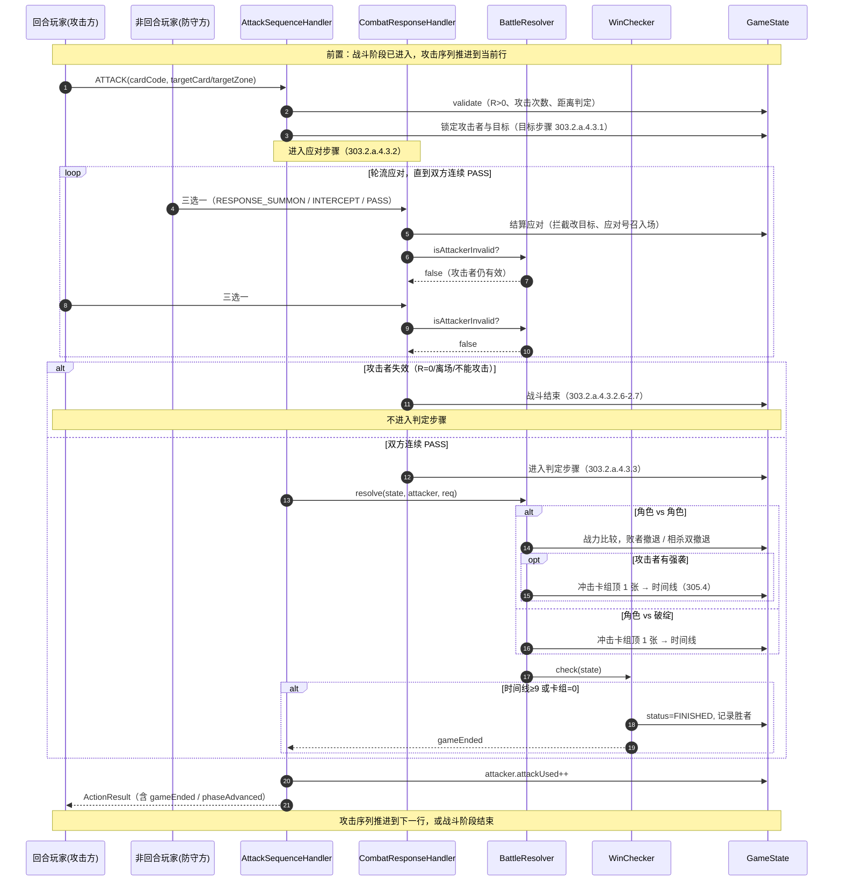
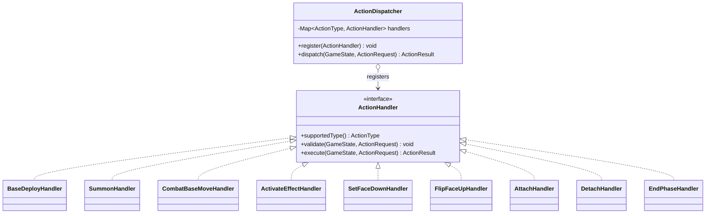
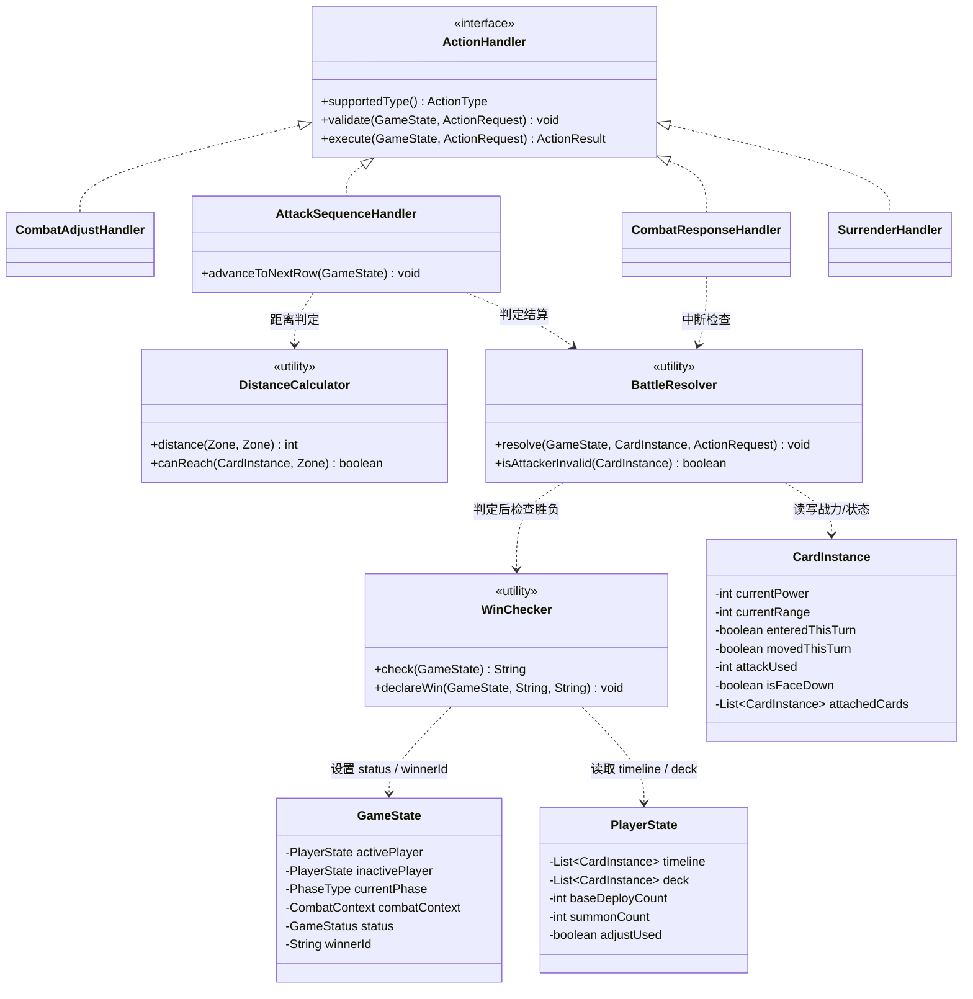

# 详细设计：迭代四 — 引擎行动与战斗

> 项目：MTCG 后端程序
> 版本：v0.1
> 日期：2026-07-31
> 依据：[需求分析](./01-需求分析.md) FR3.3 / FR3.4 / FR3.7、[概要设计](./02-概要设计.md) §4 §6、[综合规则书 v1.01](../规则文档/02-综合规则书-v1.01.md) 301.12–301.26 / 301.45 / 303.2.a.3 / 303.2.a.4、[区域模型与回合流程](../规则文档/04-区域模型与回合流程.md)
> 前置：[迭代四](#) — `GameState`、`PlayerState`、`FieldZone`、`CardInstance`、`PhaseType`、`Zone` 等状态模型与回合流程已就绪

---

## 1. 概述

### 1.1 迭代目标

在迭代四的状态模型与回合流程骨架之上，实现引擎核心的第二部分：**行动阶段操作处理**、**战斗阶段攻击流程**、**胜负判定**。完成后引擎可在无效果系统的前提下跑通「调度 → 抽卡 → 行动 → 战斗 → 胜负」一整套基础对局。

### 1.2 范围

| 包含 | 不包含 |
| --- | --- |
| `ActionType` 操作类型枚举（16 种） | 效果系统（FR3.5，迭代六） |
| `ActionHandler` 统一操作处理接口 | 关键词能力的具体实现（迭代六） |
| 行动阶段 7 个 Handler（部署/号召/移动/启动框架/盖卡/翻开/结附/解除/结束） | 触发型/常驻型效果的结算 |
| 战斗阶段 4 个 Handler（调整/攻击序列/应对/判定） | AI 决策（迭代八） |
| `DistanceCalculator` 距离计算 | 对战 API 与持久化（迭代七） |
| `WinChecker` 胜负判定 | WebSocket 推送 |
| `ActivateEffectHandler` 仅留接口骨架，效果系统在迭代六实现 | |

### 1.3 设计原则

| 原则 | 说明 |
| --- | --- |
| 纯 POJO | `engine` 包零 Spring 依赖，所有 Handler 通过 `new` 或工厂创建 |
| 规则可追溯 | 代码注释标注规则条款编号，如 `// 303.2.a.3.1.1` |
| 操作幂等校验 | 每个 Handler 在执行前先校验操作合法性，不合法抛 `EngineException` |
| 状态机驱动 | 所有 Handler 共享同一 `GameState`，操作通过 `ActionDispatcher` 路由 |
| 渐进式 | 效果相关 Handler 留骨架，关键词能力仅做基础判定钩子 |

### 1.4 前置依赖

迭代四已交付的模型与枚举（位于 `com.aris.mtcg.engine.model` / `com.aris.mtcg.engine.phase`）：

| 类型 | 说明 |
| --- | --- |
| `GameState` | 对局全局状态，含 `activePlayer` / `inactivePlayer` / `currentPhase` / `turnCount` / `status` |
| `PlayerState` | 玩家状态，含 `deck` / `rushDeck` / `hand` / `timeline` / `retreat` / `voidZone` / `field`，及行动阶段计数器 `baseDeployCount` / `summonCount` |
| `FieldZone` | 场上区域，含 `vanguard` / `flank[2]` / `rearguard` / `base` |
| `CardInstance` | 卡牌实例，含快照字段与运行时状态（`enteredThisTurn` / `movedThisTurn` / `attackUsed` / `interceptUsed` / `isFaceDown` / `attachedCards` / `currentPower` / `currentRange`） |
| `PhaseType` | 阶段枚举：`TURN_START` / `DRAW` / `ACTION` / `COMBAT` / `RESPONSE` / `TURN_END` |
| `Zone` | 区域枚举：`VANGUARD` / `FLANK_LEFT` / `FLANK_RIGHT` / `REARGUARD` / `BASE` / `DECK` / `RUSH_DECK` / `HAND` / `TIMELINE` / `RETREAT` / `VOID` |

---

## 2. 操作类型枚举

### 2.1 ActionType

`ActionType` 枚举覆盖 FR4.3 列出的全部对战操作，是操作 API 与引擎 Handler 之间的契约。

```java
package com.aris.mtcg.engine.action;

/**
 * 对战操作类型枚举。
 * 对应需求 FR4.3：调度、基地部署、行动号召、战基移动、启动效果、
 * 盖卡/翻开、结附/解除、调整位置、攻击、应对号召、拦截、不行动、宣布结束、认输。
 */
public enum ActionType {

    MULLIGAN,            // 调度（迭代四已实现，此处仅登记）
    BASE_DEPLOY,         // 基地部署       303.2.a.3.1.1
    SUMMON,              // 行动号召       303.2.a.3.1.2 / 301.19
    COMBAT_BASE_MOVE,    // 战基移动       303.2.a.3.1.3 / 301.24
    ACTIVATE_EFFECT,     // 启动效果       303.2.a.3.1.4（迭代六填实）
    SET_FACE_DOWN,       // 盖卡           301.21 / 301.12-301.14
    FLIP_FACE_UP,        // 翻开盖卡       301.22
    ATTACH,              // 结附           301.25
    DETACH,              // 解除结附       301.26
    COMBAT_ADJUST,       // 调整位置       303.2.a.4.2.1
    ATTACK,              // 攻击           303.2.a.4.3
    RESPONSE_SUMMON,     // 应对号召       303.2.a.4.3.2.3.1 / 303.2.a.5.2.1
    INTERCEPT,           // 拦截           305.2
    PASS,                // 不行动         303.2.a.4.3.2.4 / 303.2.a.5.3
    END_PHASE,           // 宣布结束（阶段或行动阶段）
    SURRENDER;           // 认输           FR4.4
}
```

### 2.2 ActionRequest / ActionResult

操作入参与回参的统一容器：

```java
package com.aris.mtcg.engine.action;

/**
 * 操作请求（由 API 层装配，引擎不感知 HTTP）。
 * 所有可选参数通过 Map 传递，由各 Handler 自行解析，避免子类爆炸。
 */
public class ActionRequest {
    private String gameId;
    private String playerId;          // 操作发起者
    private ActionType type;          // 操作类型
    private String cardCode;          // 主体卡编号（手牌/场上卡），可空
    private Zone sourceZone;          // 源区域，可空
    private int sourceIndex;          // 源区域下标（侧翼/基地多格），可空
    private Zone targetZone;          // 目标区域，可空
    private int targetIndex;          // 目标区域下标，可空
    private String targetCardCode;    // 目标卡编号（如结附父卡、攻击目标），可空
    private java.util.Map<String, Object> extras;  // 扩展参数（如调整位置的互换对列表）
}

/**
 * 操作结果。
 */
public class ActionResult {
    private boolean success;
    private String message;           // 失败原因或附加说明
    private boolean phaseAdvanced;    // 是否触发了阶段推进
    private boolean gameEnded;        // 是否触发游戏结束
    private String winnerId;          // 游戏结束时胜者 playerId
}
```

### 2.3 ActionHandler 接口

统一的操作处理接口，所有 Handler 实现该接口，由 `ActionDispatcher` 按 `ActionType` 路由。

```java
package com.aris.mtcg.engine.action;

import com.aris.mtcg.engine.model.GameState;

/**
 * 操作处理器统一接口。
 * 设计要点：
 * 1. 每个 Handler 只处理一种 ActionType；
 * 2. 校验与执行分离——validate 抛 EngineException，execute 返回 ActionResult；
 * 3. Handler 无状态，可单例复用，所有状态读写均通过 GameState。
 */
public interface ActionHandler {

    /** 该 Handler 处理的操作类型。 */
    ActionType supportedType();

    /** 校验操作合法性，不通过抛 EngineException。 */
    void validate(GameState state, ActionRequest request);

    /** 执行操作，返回结果。调用前必须先通过 validate。 */
    ActionResult execute(GameState state, ActionRequest request);
}
```

### 2.4 ActionDispatcher

操作路由器，按 `ActionType` 分发到对应 Handler。

```java
package com.aris.mtcg.engine.action;

import com.aris.mtcg.engine.model.GameState;
import java.util.EnumMap;
import java.util.Map;

/**
 * 操作分发器：注册 Handler 并按 ActionType 路由。
 * 由 GameEngine（迭代四）在构造时装配，运行时调用 dispatch。
 */
public class ActionDispatcher {

    private final Map<ActionType, ActionHandler> handlers = new EnumMap<>(ActionType.class);

    public void register(ActionHandler handler) {
        handlers.put(handler.supportedType(), handler);
    }

    public ActionResult dispatch(GameState state, ActionRequest request) {
        ActionHandler handler = handlers.get(request.getType());
        if (handler == null) {
            throw new EngineException("未注册的操作类型: " + request.getType());
        }
        handler.validate(state, request);
        return handler.execute(state, request);
    }
}
```

### 2.5 EngineException

引擎内部统一异常，承载规则条款编号便于追溯。

```java
package com.aris.mtcg.engine.action;

public class EngineException extends RuntimeException {
    private final String ruleRef;   // 规则条款编号，如 "303.2.a.3.1.1"
    public EngineException(String message, String ruleRef) {
        super(message + " [规则: " + ruleRef + "]");
        this.ruleRef = ruleRef;
    }
    public String getRuleRef() { return ruleRef; }
}
```

---

## 3. 行动阶段处理器

行动阶段（`PhaseType.ACTION`）下，回合玩家可任意顺序执行 4 种行动（规则 303.2.a.3），各自独立计数。处理器位于 `com.aris.mtcg.engine.action.handler` 子包。

### 3.1 BaseDeployHandler — 基地部署

**规则 303.2.a.3.1.1**：手牌 1 张角色卡盖入基地区 → 抽 1 张；每阶段最多 1 次。

```java
package com.aris.mtcg.engine.action.handler;

public class BaseDeployHandler implements ActionHandler {

    @Override public ActionType supportedType() { return ActionType.BASE_DEPLOY; }

    @Override
    public void validate(GameState state, ActionRequest req) {
        // 303.2.a.3.1.1 仅回合玩家可在行动阶段执行
        assertActivePlayer(state, req);
        assertPhase(state, PhaseType.ACTION);

        PlayerState ap = state.getActivePlayer();
        // 每阶段最多 1 次
        if (ap.getBaseDeployCount() >= 1) {
            throw new EngineException("本阶段基地部署次数已用尽", "303.2.a.3.1.1");
        }
        // 基地区上限 6（角色+盖卡），规则 302.6
        if (ap.getField().getBase().size() >= 6) {
            throw new EngineException("基地区已满（上限 6）", "302.6");
        }
        // 主体卡必须在手牌
        CardInstance card = findInHand(ap, req.getCardCode());
        if (card == null) {
            throw new EngineException("手牌中不存在该卡", "303.2.a.3.1.1");
        }
        if (card.getCardType() != CardType.CHARACTER) {
            throw new EngineException("仅角色卡可基地部署", "303.2.a.3.1.1");
        }
    }

    @Override
    public ActionResult execute(GameState state, ActionRequest req) {
        PlayerState ap = state.getActivePlayer();
        CardInstance card = removeFromHand(ap, req.getCardCode());

        // 301.12-301.14：盖放 = 背面朝上置入指定区域
        card.setFaceDown(true);
        card.setCurrentZone(Zone.BASE);
        card.setEnteredThisTurn(true);   // 本回合进场
        ap.getField().getBase().add(card);

        // 抽 1 张（303.2.a.3.1.1）
        drawFromDeck(ap, 1);

        ap.setBaseDeployCount(ap.getBaseDeployCount() + 1);
        state.appendActionLog(new ActionLog(req.getType(), req.getPlayerId(), "基地部署 " + card.getCardCode()));
        return ActionResult.success();
    }
}
```

### 3.2 SummonHandler — 行动号召

**规则 303.2.a.3.1.2 + 301.19**：

- 每阶段最多 3 次，先攻首回合最多 1 次；
- Lv3 及以下直接放置；Lv4+ 须先撤退场上合计 Lv 的角色（盖卡每张计 Lv1）；
- 可号召到战区空位或基地区。

```java
public class SummonHandler implements ActionHandler {

    @Override public ActionType supportedType() { return ActionType.SUMMON; }

    @Override
    public void validate(GameState state, ActionRequest req) {
        assertActivePlayer(state, req);
        assertPhase(state, PhaseType.ACTION);

        PlayerState ap = state.getActivePlayer();
        int limit = computeSummonLimit(state, ap);   // 3 或先攻首回合 1
        if (ap.getSummonCount() >= limit) {
            throw new EngineException("本阶段行动号召次数已用尽", "303.2.a.3.1.2");
        }

        CardInstance card = findInHand(ap, req.getCardCode());
        if (card == null || card.getCardType() != CardType.CHARACTER) {
            throw new EngineException("手牌中不存在可号召的角色卡", "301.19");
        }

        // 目标区域空位校验
        assertSummonTargetFree(ap, req.getTargetZone(), req.getTargetIndex());

        // 301.19：Lv4+ 须先撤退合计 Lv 的角色
        if (card.getLevel() >= 4) {
            int need = card.getLevel();
            int available = computeRetrivableLevel(ap);  // 场上角色 Lv 之和 + 盖卡数（每张计 1）
            if (available < need) {
                throw new EngineException(
                    "Lv4+ 号召需撤退合计 Lv=" + need + " 的角色，当前可撤退 " + available,
                    "301.19");
            }
            // 退出参数：撤退清单（extras 里传 cardCode 列表，长度足够且合计 Lv 满足）
            List<String> retreatCodes = (List<String>) req.getExtras().get("retreatCodes");
            if (retreatCodes == null || sumRetreatLevel(ap, retreatCodes) < need) {
                throw new EngineException("未指定足够的撤退角色", "301.19");
            }
        }

        // 唯一关键词（305.6）—— 我方场上不能有同名卡
        if (card.getKeywords().contains(Keyword.UNIQUE)
                && hasSameNameOnField(ap, card.getCardName())) {
            throw new EngineException("唯一关键词：场上已有同名卡", "305.6");
        }
    }

    @Override
    public ActionResult execute(GameState state, ActionRequest req) {
        PlayerState ap = state.getActivePlayer();
        CardInstance card = removeFromHand(ap, req.getCardCode());

        // Lv4+ 先撤退（301.19）
        if (card.getLevel() >= 4) {
            List<String> retreatCodes = (List<String>) req.getExtras().get("retreatCodes");
            for (String code : retreatCodes) {
                retreatFromField(ap, code);   // 移至撤退区，刷新状态
            }
        }

        // 放置到目标区域（301.12 放置 = 正面朝上）
        card.setFaceDown(false);
        placeOnField(ap, card, req.getTargetZone(), req.getTargetIndex());
        card.setEnteredThisTurn(true);
        card.setCurrentZone(req.getTargetZone());

        ap.setSummonCount(ap.getSummonCount() + 1);
        return ActionResult.success();
    }

    /** 303.2.a.3.1.2：先攻首回合 1 次，其余 3 次。 */
    private int computeSummonLimit(GameState state, PlayerState ap) {
        boolean firstPlayerFirstTurn = state.getTurnCount() == 1 && ap.isFirstPlayer();
        return firstPlayerFirstTurn ? 1 : 3;
    }
}
```

### 3.3 CombatBaseMoveHandler — 战基移动

**规则 303.2.a.3.1.3 + 301.24**：

- 战区 ↔ 基地区移动；
- 每角色每回合 1 次（`movedThisTurn` 标记）；
- 本回合进场者（`enteredThisTurn`）不能移动。

```java
public class CombatBaseMoveHandler implements ActionHandler {

    @Override public ActionType supportedType() { return ActionType.COMBAT_BASE_MOVE; }

    @Override
    public void validate(GameState state, ActionRequest req) {
        assertActivePlayer(state, req);
        assertPhase(state, PhaseType.ACTION);

        PlayerState ap = state.getActivePlayer();
        CardInstance card = findOnField(ap, req.getCardCode());
        if (card == null) {
            throw new EngineException("场上不存在该角色", "303.2.a.3.1.3");
        }
        // 本回合进场者不能移动
        if (card.isEnteredThisTurn()) {
            throw new EngineException("本回合进场的角色不能战基移动", "303.2.a.3.1.3");
        }
        // 每角色每回合 1 次
        if (card.isMovedThisTurn()) {
            throw new EngineException("该角色本回合已战基移动", "303.2.a.3.1.3");
        }
        // 源区域与目标区域必须一为战区一为基地（301.24）
        if (!isOneCombatOneBase(req.getSourceZone(), req.getTargetZone())) {
            throw new EngineException("战基移动须在战区与基地之间", "301.24");
        }
        // 目标位置空位校验
        assertTargetFree(ap, req.getTargetZone(), req.getTargetIndex());
        // 基地区上限校验（302.6）
        if (req.getTargetZone() == Zone.BASE && ap.getField().getBase().size() >= 6) {
            throw new EngineException("基地区已满", "302.6");
        }
    }

    @Override
    public ActionResult execute(GameState state, ActionRequest req) {
        PlayerState ap = state.getActivePlayer();
        CardInstance card = findOnField(ap, req.getCardCode());

        removeFromCurrentZone(ap, card);
        placeOnField(ap, card, req.getTargetZone(), req.getTargetIndex());
        card.setMovedThisTurn(true);
        card.setCurrentZone(req.getTargetZone());

        // 301.25：父卡移动时结附卡跟随
        moveAttachedCards(ap, card, req.getTargetZone(), req.getTargetIndex());
        return ActionResult.success();
    }
}
```

### 3.4 ActivateEffectHandler — 启动效果（骨架）

**规则 303.2.a.3.1.4 + 304.2**：本阶段只做框架，效果系统在迭代六实现。

```java
public class ActivateEffectHandler implements ActionHandler {

    @Override public ActionType supportedType() { return ActionType.ACTIVATE_EFFECT; }

    @Override
    public void validate(GameState state, ActionRequest req) {
        assertActivePlayer(state, req);
        assertPhase(state, PhaseType.ACTION);

        // 304.2：须存在可结算效果才能启动；含「如此做后」时须能完成前置动作
        CardInstance card = findOnField(state.getActivePlayer(), req.getCardCode());
        if (card == null) {
            throw new EngineException("场上不存在该角色", "303.2.a.3.1.4");
        }
        if (!hasActivatableEffect(card)) {
            throw new EngineException("该卡无启动型效果或无可结算内容", "304.2");
        }
        // 具体效果合法性交由迭代六 EffectResolver 校验
    }

    @Override
    public ActionResult execute(GameState state, ActionRequest req) {
        // 迭代六：交由 EffectResolver 结算
        // 当前阶段仅记录操作流水，不实际结算
        state.appendActionLog(new ActionLog(req.getType(), req.getPlayerId(),
            "启动效果（骨架）" + req.getCardCode()));
        return ActionResult.success();
    }

    private boolean hasActivatableEffect(CardInstance card) {
        // 迭代六接入 EffectResolver 后实现
        return false;
    }
}
```

### 3.5 SetFaceDownHandler / FlipFaceUpHandler — 盖卡与翻开

**规则 301.12–301.14 / 301.21 / 301.22**：

- 盖放：背面朝上置入指定区域；
- 盖伏：基地角色因效果翻面至背面，状态刷新，已作用效果结束；
- 翻开：盖卡因效果翻开 → 变回角色卡，**不存在「本回合放置进场」状态**。

```java
public class SetFaceDownHandler implements ActionHandler {
    @Override public ActionType supportedType() { return ActionType.SET_FACE_DOWN; }

    @Override
    public void validate(GameState state, ActionRequest req) {
        assertActivePlayer(state, req);
        // 盖放可发生在行动阶段（基地部署已含）或效果结算中
        CardInstance card = findOnField(state.getActivePlayer(), req.getCardCode());
        if (card == null) {
            throw new EngineException("场上不存在该卡", "301.21");
        }
    }

    @Override
    public ActionResult execute(GameState state, ActionRequest req) {
        PlayerState ap = state.getActivePlayer();
        CardInstance card = findOnField(ap, req.getCardCode());
        // 301.13 盖伏：状态刷新，已作用效果结束
        card.setFaceDown(true);
        card.setCurrentPower(card.getPower());   // 重置为原本战力
        card.setCurrentRange(card.getAttackRange());
        card.getAttachedCards().clear();         // 已作用效果结束（迭代六细化）
        return ActionResult.success();
    }
}

public class FlipFaceUpHandler implements ActionHandler {
    @Override public ActionType supportedType() { return ActionType.FLIP_FACE_UP; }

    @Override
    public void validate(GameState state, ActionRequest req) {
        CardInstance card = findOnField(state.getActivePlayer(), req.getCardCode());
        if (card == null || !card.isFaceDown()) {
            throw new EngineException("目标不是盖卡", "301.22");
        }
    }

    @Override
    public ActionResult execute(GameState state, ActionRequest req) {
        CardInstance card = findOnField(state.getActivePlayer(), req.getCardCode());
        card.setFaceDown(false);
        // 301.22：翻开盖卡变回角色卡，不存在「本回合放置进场」状态
        card.setEnteredThisTurn(false);
        return ActionResult.success();
    }
}
```

### 3.6 AttachHandler / DetachHandler — 结附与解除

**规则 301.25 / 301.26**：

- 结附卡按结附顺序叠放，后结附的在下（301.25.m），玩家不能改变顺序（301.25.n）；
- 父卡移动时结附卡跟随；结附卡移动时父卡不跟随；
- 父卡非角色卡时结附卡撤退；
- 解除属于移动，结附卡变回角色卡。

```java
public class AttachHandler implements ActionHandler {
    @Override public ActionType supportedType() { return ActionType.ATTACH; }

    @Override
    public void validate(GameState state, ActionRequest req) {
        assertActivePlayer(state, req);
        PlayerState ap = state.getActivePlayer();
        CardInstance child = findOnField(ap, req.getCardCode());        // 待结附卡
        CardInstance parent = findOnField(ap, req.getTargetCardCode()); // 父卡
        if (child == null || parent == null) {
            throw new EngineException("结附双方须均在场上", "301.25");
        }
        // 301.25：不能对已结附的父卡再次结附
        if (parent.getAttachedCards() != null && !parent.getAttachedCards().isEmpty()) {
            throw new EngineException("父卡已结附，不能再结附", "301.25");
        }
        if (parent.isFaceDown() || parent.getCardType() != CardType.CHARACTER) {
            throw new EngineException("父卡须为正面角色卡", "301.25");
        }
    }

    @Override
    public ActionResult execute(GameState state, ActionRequest req) {
        PlayerState ap = state.getActivePlayer();
        CardInstance child = findOnField(ap, req.getCardCode());
        CardInstance parent = findOnField(ap, req.getTargetCardCode());
        removeFromCurrentZone(ap, child);
        if (parent.getAttachedCards() == null) parent.setAttachedCards(new ArrayList<>());
        parent.getAttachedCards().add(child);   // 301.25.m：按结附顺序叠放
        child.setCurrentZone(parent.getCurrentZone());
        return ActionResult.success();
    }
}

public class DetachHandler implements ActionHandler {
    @Override public ActionType supportedType() { return ActionType.DETACH; }

    @Override
    public void validate(GameState state, ActionRequest req) {
        assertActivePlayer(state, req);
        CardInstance child = findAttached(state.getActivePlayer(), req.getCardCode());
        if (child == null) {
            throw new EngineException("目标不是结附卡", "301.26");
        }
        assertTargetFree(state.getActivePlayer(), req.getTargetZone(), req.getTargetIndex());
    }

    @Override
    public ActionResult execute(GameState state, ActionRequest req) {
        PlayerState ap = state.getActivePlayer();
        CardInstance child = findAttached(ap, req.getCardCode());
        removeFromParent(ap, child);
        // 301.26：解除属于移动，变回角色卡
        child.setFaceDown(false);
        placeOnField(ap, child, req.getTargetZone(), req.getTargetIndex());
        child.setCurrentZone(req.getTargetZone());
        return ActionResult.success();
    }
}
```

### 3.7 EndPhaseHandler — 宣布结束

回合玩家宣布行动阶段结束 → 推进到战斗阶段；宣布战斗阶段结束 → 推进到应对阶段。

```java
public class EndPhaseHandler implements ActionHandler {
    @Override public ActionType supportedType() { return ActionType.END_PHASE; }

    @Override
    public void validate(GameState state, ActionRequest req) {
        assertActivePlayer(state, req);
        // END_PHASE 可在 ACTION / COMBAT 阶段使用
        PhaseType phase = state.getCurrentPhase();
        if (phase != PhaseType.ACTION && phase != PhaseType.COMBAT) {
            throw new EngineException("当前阶段不能宣布结束", "303.2.a");
        }
    }

    @Override
    public ActionResult execute(GameState state, ActionRequest req) {
        ActionResult r = new ActionResult();
        r.setSuccess(true);
        r.setPhaseAdvanced(true);
        // ACTION → COMBAT；COMBAT → RESPONSE
        state.setCurrentPhase(state.getCurrentPhase() == PhaseType.ACTION
            ? PhaseType.COMBAT : PhaseType.RESPONSE);
        return r;
    }
}
```

---

## 4. 战斗阶段处理器

战斗阶段（`PhaseType.COMBAT`）流程（规则 303.2.a.4）：

1. **调整步骤**：最多 4 张战区角色互换位置（不计为移动）；
2. **攻击序列**：先锋 → 侧翼 → 后卫，逐行发起单次战斗；
3. **单次战斗**：目标步骤 → 应对步骤 → 判定步骤。

> **先攻首回合跳过战斗阶段**（303.2.a.4.1），由回合流程控制器在进入 COMBAT 阶段时直接推进到 RESPONSE。

### 4.1 CombatAdjustHandler — 调整位置

**规则 303.2.a.4.2.1**：最多 4 张战区角色互换位置，不计为移动，每回合 1 次。

```java
public class CombatAdjustHandler implements ActionHandler {

    @Override public ActionType supportedType() { return ActionType.COMBAT_ADJUST; }

    @Override
    public void validate(GameState state, ActionRequest req) {
        assertActivePlayer(state, req);
        assertPhase(state, PhaseType.COMBAT);

        PlayerState ap = state.getActivePlayer();
        if (ap.isAdjustUsed()) {
            throw new EngineException("本回合已使用调整位置", "303.2.a.4.2.1");
        }
        // extras 中传 adjustPairs：[{from: Zone, to: Zone}, ...]
        List<AdjustPair> pairs = (List<AdjustPair>) req.getExtras().get("adjustPairs");
        if (pairs == null || pairs.isEmpty() || pairs.size() > 4) {
            throw new EngineException("调整数量须 1-4 对", "303.2.a.4.2.1");
        }
        // 涉及位置必须均在战区
        for (AdjustPair p : pairs) {
            if (!isCombatZone(p.from) || !isCombatZone(p.to)) {
                throw new EngineException("调整位置仅限战区", "303.2.a.4.2.1");
            }
        }
    }

    @Override
    public ActionResult execute(GameState state, ActionRequest req) {
        PlayerState ap = state.getActivePlayer();
        List<AdjustPair> pairs = (List<AdjustPair>) req.getExtras().get("adjustPairs");
        for (AdjustPair p : pairs) {
            swapPositions(ap.getField(), p.from, p.to);   // 互换位置，不设置 movedThisTurn
        }
        ap.setAdjustUsed(true);
        return ActionResult.success();
    }
}
```

### 4.2 AttackSequenceHandler — 攻击序列

**规则 303.2.a.4.2 / 303.2.a.4.8–4.10**：

- 先锋 → 侧翼 → 后卫，逐行推进；
- 侧翼两翼各有角色时可自选顺序（303.2.a.4.9.1）；
- 当前行无角色 / 无攻击机会 / 角色不能攻击 → 进入下一行或结束阶段；
- 每角色每回合 1 次攻击（连击 2 次，迭代六接入）。

```java
public class AttackSequenceHandler implements ActionHandler {

    @Override public ActionType supportedType() { return ActionType.ATTACK; }

    @Override
    public void validate(GameState state, ActionRequest req) {
        assertActivePlayer(state, req);
        assertPhase(state, PhaseType.COMBAT);

        PlayerState ap = state.getActivePlayer();
        CardInstance attacker = findOnField(ap, req.getCardCode());
        if (attacker == null) {
            throw new EngineException("场上不存在攻击者", "303.2.a.4.3");
        }
        // 303.2.a.4.5：R=0 不能攻击
        if (attacker.getCurrentRange() <= 0) {
            throw new EngineException("攻击者 R=0，不能攻击", "303.2.a.4.5");
        }
        // 每角色每回合 1 次（连击 2 次）
        int attackLimit = attacker.getKeywords().contains(Keyword.COMBO) ? 2 : 1;
        if (attacker.getAttackUsed() >= attackLimit) {
            throw new EngineException("该角色本回合攻击次数已用尽", "303.2.a.4.4");
        }
        // 距离判定（5.2 节）
        Zone targetZone = req.getTargetZone();
        if (req.getTargetCardCode() == null) {
            // 攻击破绽：目标战区位置须空置（或空袭关键词，迭代六）
            assertVulnerable(state.getInactivePlayer(), targetZone, attacker);
        } else {
            CardInstance target = findOnField(state.getInactivePlayer(), req.getTargetCardCode());
            int dist = DistanceCalculator.distance(attacker.getCurrentZone(), targetZone);
            if (dist > attacker.getCurrentRange()) {
                throw new EngineException("距离 " + dist + " 超过攻击者 R=" + attacker.getCurrentRange(),
                    "303.2.a.4.3.1.1");
            }
        }
    }

    @Override
    public ActionResult execute(GameState state, ActionRequest req) {
        PlayerState ap = state.getActivePlayer();
        CardInstance attacker = findOnField(ap, req.getCardCode());

        // 1. 目标步骤（303.2.a.4.3.1）——已锁定
        // 2. 应对步骤（303.2.a.4.3.2）——交由 CombatResponseHandler 在外部循环驱动
        //    本 Handler 仅发起攻击声明，应对步骤由 AttackSequenceHandler 与 CombatResponseHandler 协作完成
        // 3. 判定步骤（303.2.a.4.3.3）——交由 BattleResolver
        BattleResolver.resolve(state, attacker, req);

        attacker.setAttackUsed(attacker.getAttackUsed() + 1);

        // 中断检查（303.2.a.4.3.1.4-1.5 / 4.3.2.6-2.7）
        if (isAttackerInvalid(attacker)) {
            return ActionResult.builder()
                .success(true)
                .phaseAdvanced(false)
                .message("攻击者失效，战斗结束")
                .build();
        }
        return ActionResult.success();
    }

    /** 推进到下一行 / 下一阶段（由 PhaseController 调用）。 */
    public void advanceToNextRow(GameState state) {
        // 303.2.a.4.8-4.10：先锋 → 侧翼 → 后卫 → 阶段结束
        // 实现细节：维护 currentRow 状态（VANGUARD/FLANK/REARGUARD）
        // 当前行无角色/无攻击机会/不能攻击 → 推进
        state.getCombatContext().advanceRow();
        if (state.getCombatContext().getRow() == CombatRow.FINISHED) {
            state.setCurrentPhase(PhaseType.RESPONSE);
        }
    }
}
```

### 4.3 CombatResponseHandler — 应对步骤

**规则 303.2.a.4.3.2**：

- 敌方先选 → 我方后选，轮流；
- 三选一：① 应对号召（双方各 1 次/本步骤）② 应对·启动 ③ 不行动；
- 双方连续不行动 → 步骤结束；
- 目标不符 → 返回目标步骤；
- 攻击者 R=0 / 离场 / 不能攻击 → 战斗结束。

```java
public class CombatResponseHandler implements ActionHandler {

    @Override public ActionType supportedType() { return ActionType.PASS; }  // 不行动走 PASS

    /** 本 Handler 同时处理 RESPONSE_SUMMON / INTERCEPT / PASS 三类应对操作，
     *  通过 supportedType 仅声明 PASS，另两类由独立 Handler 转入本流程。 */

    @Override
    public void validate(GameState state, ActionRequest req) {
        assertPhase(state, PhaseType.COMBAT);
        // 须在应对步骤中
        if (state.getCombatContext().getStep() != CombatStep.COMBAT_RESPONSE) {
            throw new EngineException("当前不在战斗应对步骤", "303.2.a.4.3.2");
        }
    }

    @Override
    public ActionResult execute(GameState state, ActionRequest req) {
        CombatContext ctx = state.getCombatContext();
        // 三选一路由
        switch (req.getType()) {
            case RESPONSE_SUMMON:
                // 303.2.a.4.3.2.3.1：双方各 1 次/本步骤
                if (ctx.isResponseSummonUsed(req.getPlayerId())) {
                    throw new EngineException("本步骤应对号召已用", "303.2.a.4.3.2.3.1");
                }
                doResponseSummon(state, req);
                ctx.markResponseSummonUsed(req.getPlayerId());
                break;
            case INTERCEPT:
                // 305.2：拦截改攻击目标为此卡，每回合 1 次
                doIntercept(state, req);
                break;
            case PASS:
            default:
                ctx.recordPass(req.getPlayerId());
                // 双方连续不行动 → 步骤结束
                if (ctx.isBothPassedConsecutively()) {
                    ctx.setStep(CombatStep.RESOLUTION);
                }
        }
        // 303.2.a.4.3.2.6-2.7：攻击者失效 → 战斗结束
        if (isAttackerInvalid(ctx.getAttacker())) {
            ctx.endCombat();
        }
        return ActionResult.success();
    }
}
```

### 4.4 BattleResolver — 判定结算

**规则 303.2.a.4.3.3**：

- 角色 vs 角色：战力大者胜，败者撤退；相等 → 相杀，双方撤退；
- 角色 vs 破绽：成功攻击破绽 → 冲击卡组顶 1 张 → 时间线；
- 强袭：因攻击战胜时视为成功攻击破绽（305.4）。

```java
package com.aris.mtcg.engine.combat;

public class BattleResolver {

    /**
     * 结算单次战斗判定。
     * @param state    全局状态
     * @param attacker 攻击者
     * @param req      攻击请求（含目标卡或破绽位置）
     */
    public static void resolve(GameState state, CardInstance attacker, ActionRequest req) {
        PlayerState defender = state.getInactivePlayer();
        PlayerState attackerPlayer = state.getActivePlayer();

        if (req.getTargetCardCode() == null) {
            // 角色 vs 破绽（303.2.a.4.3.3.2）
            resolveVsVulnerable(attackerPlayer, defender, attacker, req.getTargetZone());
        } else {
            // 角色 vs 角色（303.2.a.4.3.3.1）
            CardInstance target = findOnField(defender, req.getTargetCardCode());
            resolveVsCharacter(attacker, target, attackerPlayer, defender);
        }

        // 判定后检查胜负（103.1.a）
        WinChecker.check(state);
    }

    /** 角色 vs 角色：战力比较，大者胜败者撤退；相等相杀。 */
    private static void resolveVsCharacter(CardInstance attacker, CardInstance target,
                                           PlayerState attackerPlayer, PlayerState defender) {
        int ap = attacker.getCurrentPower();
        int tp = target.getCurrentPower();
        if (ap > tp) {
            retreatTo(defender, target);
            // 强袭关键词：战胜时视为成功攻击破绽（305.4）
            if (attacker.getKeywords().contains(Keyword.ASSAULT)) {
                drawRushToTimeline(attackerPlayer);
            }
        } else if (ap < tp) {
            retreatTo(attackerPlayer, attacker);
        } else {
            // 相杀：双方撤退
            retreatTo(defender, target);
            retreatTo(attackerPlayer, attacker);
        }
    }

    /** 角色 vs 破绽：冲击卡组顶 1 张 → 时间线（303.2.a.4.3.3.2）。 */
    private static void resolveVsVulnerable(PlayerState attackerPlayer, PlayerState defender,
                                            CardInstance attacker, Zone targetZone) {
        // 空袭关键词：有角色也可攻破绽（305.5），迭代六细化
        drawRushToTimeline(attackerPlayer);
    }

    private static void drawRushToTimeline(PlayerState p) {
        if (p.getRushDeck().isEmpty()) {
            return;  // 理论上不会发生，卡组为 0 已先判负
        }
        CardInstance rush = p.getRushDeck().remove(0);
        p.getTimeline().add(rush);
    }

    /** 中断条件（303.2.a.4.3.1.4-1.5 / 4.3.2.6-2.7）。 */
    public static boolean isAttackerInvalid(CardInstance attacker) {
        if (attacker == null) return true;                      // 离场
        if (attacker.getCurrentZone() == null) return true;     // 离场
        if (attacker.getCurrentRange() <= 0) return true;       // R=0
        if (attacker.isFaceDown()) return true;                 // 不能攻击（盖卡）
        return false;
    }
}
```

### 4.5 中断处理

中断条件统一封装在 `BattleResolver.isAttackerInvalid`，由 `AttackSequenceHandler` 与 `CombatResponseHandler` 在关键节点调用：

| 触发点 | 规则 | 处理 |
| --- | --- | --- |
| 目标步骤开始 | 303.2.a.4.3.1.4-1.5 | 攻击者 R=0/离场/不能攻击 → 结算未结效果后战斗结束 |
| 应对步骤每次操作后 | 303.2.a.4.3.2.6-2.7 | 同上 |
| 判定步骤后 | 303.2.a.4.3.3 | 效果结算完毕 → 战斗结束 |

---

## 5. 距离计算

### 5.1 DistanceCalculator

**规则 303.2.a.4.3.1.1.1–5**：6 个战区位置构成线性路径，相邻位置距离均为 1。

```
己后卫 ─1─ 己侧翼 ─1─ 己先锋 ─1─ 敌先锋 ─1─ 敌侧翼 ─1─ 敌后卫
```

```java
package com.aris.mtcg.engine.combat;

import com.aris.mtcg.engine.model.Zone;

/**
 * 攻击距离计算器。
 * 规则 303.2.a.4.3.1.1.1-5：6 位置线性路径，相邻距离=1。
 * 位置索引：0=己后卫, 1=己侧翼(左右均计), 2=己先锋, 3=敌先锋, 4=敌侧翼, 5=敌后卫
 */
public final class DistanceCalculator {

    /** 战区位置在线性路径上的下标。 */
    private static int indexOf(Zone zone) {
        return switch (zone) {
            case REARGUARD    -> 0;   // 己后卫
            case FLANK_LEFT,
                 FLANK_RIGHT  -> 1;   // 己侧翼（两翼同距）
            case VANGUARD     -> 2;   // 己先锋
            // 敌方位置：通过反向映射实现，调用方须区分敌我
            default -> throw new IllegalArgumentException("非战区位置: " + zone);
        };
    }

    /**
     * 计算攻击方到目标的距离。
     * @param attackerZone 攻击者区域（己方战区位置）
     * @param targetZone   目标区域（敌方战区位置）
     * @return 距离值（1-5）
     */
    public static int distance(Zone attackerZone, Zone targetZone) {
        int a = indexOfSelf(attackerZone);   // 0/1/2
        int t = indexOfEnemy(targetZone);    // 3/4/5
        return Math.abs(a - t);
    }

    private static int indexOfSelf(Zone zone) {
        return switch (zone) {
            case REARGUARD    -> 0;
            case FLANK_LEFT, FLANK_RIGHT -> 1;
            case VANGUARD     -> 2;
            default -> throw new IllegalArgumentException("攻击者非己方战区: " + zone);
        };
    }

    private static int indexOfEnemy(Zone zone) {
        return switch (zone) {
            case VANGUARD     -> 3;   // 敌先锋
            case FLANK_LEFT, FLANK_RIGHT -> 4;  // 敌侧翼
            case REARGUARD    -> 5;   // 敌后卫
            default -> throw new IllegalArgumentException("目标非敌方战区: " + zone);
        };
    }

    /** 判断攻击者是否可攻击目标（距离 ≤ R）。 */
    public static boolean canReach(CardInstance attacker, Zone targetZone) {
        int dist = distance(attacker.getCurrentZone(), targetZone);
        return dist <= attacker.getCurrentRange();
    }
}
```

### 5.2 距离矩阵

| 攻击方 ＼ 目标 | 敌先锋 | 敌侧翼 | 敌后卫 |
| --- | --- | --- | --- |
| **己先锋** | 1 | 2 | 3 |
| **己侧翼** | 2 | 3 | 4 |
| **己后卫** | 3 | 4 | 5 |

### 5.3 R 值与可攻击目标

| R 值 | 己先锋可攻击 | 己侧翼可攻击 | 己后卫可攻击 |
| --- | --- | --- | --- |
| R-0 | 不能攻击 | 不能攻击 | 不能攻击 |
| R-1 | 敌先锋 | 无 | 无 |
| R-2 | 敌先锋、敌侧翼 | 敌先锋 | 无 |
| R-3 | 敌先锋、敌侧翼、敌后卫 | 敌先锋、敌侧翼 | 敌先锋 |
| R-4 | 全部 | 敌先锋、敌侧翼、敌后卫 | 敌先锋、敌侧翼 |
| R-5+ | 全部 | 全部 | 全部 |

---

## 6. 胜负判定

### 6.1 WinChecker

**规则 103.1**：满足任一条件即胜，对方败，游戏结束。

```java
package com.aris.mtcg.engine.combat;

import com.aris.mtcg.engine.model.GameState;
import com.aris.mtcg.engine.model.PlayerState;

/**
 * 胜负判定器。
 * 规则 103.1：满足任一条件即胜。
 * 触发时机：每次操作后、每次效果结算后、每次战斗判定后。
 */
public final class WinChecker {

    /**
     * 检查胜负，若分出胜负则设置 GameState.status=FINISHED 并记录胜者。
     * @return 胜者 playerId，未分胜负返回 null
     */
    public static String check(GameState state) {
        // 103.1.a：时间线 ≥ 9 张冲击卡
        String timelineWinner = checkTimeline(state);
        if (timelineWinner != null) {
            finishGame(state, timelineWinner, "时间线达到 9 张");
            return timelineWinner;
        }
        // 103.1.b：对方卡组 = 0
        String deckWinner = checkDeckEmpty(state);
        if (deckWinner != null) {
            finishGame(state, deckWinner, "对方卡组耗尽");
            return deckWinner;
        }
        // 103.1.c：效果宣布获胜 —— 由 EffectResolver 在迭代六调用 declareWin
        return null;
    }

    /** 103.1.c：效果宣布获胜。 */
    public static void declareWin(GameState state, String winnerId, String reason) {
        finishGame(state, winnerId, "效果宣布获胜: " + reason);
    }

    /** 103.1.a：时间线 ≥ 9。 */
    private static String checkTimeline(GameState state) {
        if (state.getActivePlayer().getTimeline().size() >= 9) {
            return state.getActivePlayer().getPlayerId();
        }
        if (state.getInactivePlayer().getTimeline().size() >= 9) {
            return state.getInactivePlayer().getPlayerId();
        }
        return null;
    }

    /** 103.1.b：对方卡组 = 0。注意「对方」——A 卡组为 0 则 B 胜。 */
    private static String checkDeckEmpty(GameState state) {
        if (state.getActivePlayer().getDeck().isEmpty()) {
            return state.getInactivePlayer().getPlayerId();
        }
        if (state.getInactivePlayer().getDeck().isEmpty()) {
            return state.getActivePlayer().getPlayerId();
        }
        return null;
    }

    private static void finishGame(GameState state, String winnerId, String reason) {
        state.setStatus(GameStatus.FINISHED);
        state.setWinnerId(winnerId);
        state.appendActionLog(new ActionLog(ActionType.SURRENDER, winnerId, reason));
    }
}
```

### 6.2 触发时机

| 时机 | 调用 |
| --- | --- |
| `ActionDispatcher.dispatch` 之后 | `WinChecker.check(state)` |
| `BattleResolver.resolve` 之后 | `WinChecker.check(state)`（已内置） |
| 抽卡阶段后 | `WinChecker.check(state)`（卡组可能为 0） |
| 效果结算后（迭代六） | `WinChecker.check(state)` + 可能的 `declareWin` |

### 6.3 SurrenderHandler — 认输

玩家主动认输，对应 FR4.4。

```java
public class SurrenderHandler implements ActionHandler {
    @Override public ActionType supportedType() { return ActionType.SURRENDER; }

    @Override
    public void validate(GameState state, ActionRequest req) {
        if (state.getStatus() != GameStatus.IN_PROGRESS) {
            throw new EngineException("对局未进行中", "FR4.4");
        }
    }

    @Override
    public ActionResult execute(GameState state, ActionRequest req) {
        String winnerId = state.getActivePlayer().getPlayerId().equals(req.getPlayerId())
            ? state.getInactivePlayer().getPlayerId()
            : state.getActivePlayer().getPlayerId();
        state.setStatus(GameStatus.FINISHED);
        state.setWinnerId(winnerId);
        ActionResult r = new ActionResult();
        r.setSuccess(true);
        r.setGameEnded(true);
        r.setWinnerId(winnerId);
        return r;
    }
}
```

---

## 7. 时序图与类关系图

### 7.1 单次战斗流程时序图



### 7.2 行动阶段操作类关系图



### 7.3 战斗阶段与胜负判定类关系图



---

## 8. 文件清单

| 文件 | 包 | 说明 |
| --- | --- | --- |
| `ActionType.java` | `engine.action` | 操作类型枚举（16 种） |
| `ActionRequest.java` | `engine.action` | 操作请求统一容器 |
| `ActionResult.java` | `engine.action` | 操作结果统一容器 |
| `ActionHandler.java` | `engine.action` | 操作处理器统一接口 |
| `ActionDispatcher.java` | `engine.action` | 操作分发器，按 ActionType 路由 |
| `EngineException.java` | `engine.action` | 引擎异常（含规则条款编号） |
| `BaseDeployHandler.java` | `engine.action.handler` | 基地部署 303.2.a.3.1.1 |
| `SummonHandler.java` | `engine.action.handler` | 行动号召 303.2.a.3.1.2 / 301.19 |
| `CombatBaseMoveHandler.java` | `engine.action.handler` | 战基移动 303.2.a.3.1.3 / 301.24 |
| `ActivateEffectHandler.java` | `engine.action.handler` | 启动效果骨架 303.2.a.3.1.4（迭代六填实） |
| `SetFaceDownHandler.java` | `engine.action.handler` | 盖卡 301.21 / 301.12-301.14 |
| `FlipFaceUpHandler.java` | `engine.action.handler` | 翻开盖卡 301.22 |
| `AttachHandler.java` | `engine.action.handler` | 结附 301.25 |
| `DetachHandler.java` | `engine.action.handler` | 解除结附 301.26 |
| `EndPhaseHandler.java` | `engine.action.handler` | 宣布结束（行动/战斗阶段） |
| `SurrenderHandler.java` | `engine.action.handler` | 认输 FR4.4 |
| `CombatAdjustHandler.java` | `engine.action.handler` | 调整位置 303.2.a.4.2.1 |
| `AttackSequenceHandler.java` | `engine.action.handler` | 攻击序列 303.2.a.4.2-4.10 |
| `CombatResponseHandler.java` | `engine.action.handler` | 应对步骤 303.2.a.4.3.2 |
| `DistanceCalculator.java` | `engine.combat` | 距离计算 303.2.a.4.3.1.1.1-5 |
| `BattleResolver.java` | `engine.combat` | 战斗判定 + 中断检查 303.2.a.4.3.3 |
| `WinChecker.java` | `engine.combat` | 胜负判定 103.1 |

共 22 个文件（迭代四已有的 `GameState` / `PlayerState` / `FieldZone` / `CardInstance` / `PhaseType` / `Zone` / `ActionLog` 等不在本清单内）。

---

## 9. Q&A 判例补充

> 以下判例来自 [规则 Q&A 第一期](../规则文档/05-规则Q&A-第1期.md)，影响本迭代的行动与战斗处理器设计，实现时需覆盖。

### 9.1 应对号召可放置到基地区（Q&A Q1）

**判例要点**：应对号召时即使战区已满，角色卡仍可放置于基地区（102.2 场上含战区和基地区）。

**影响点**：`SummonHandler` 与 `ResponseSummonHandler`（应对号召）的 `assertSummonTargetFree()` 校验需接受 `Zone.BASE` 作为合法目标区域。若目标为基地区，校验 `FieldZone.isBaseFull()`（302.6 上限 6）而非战区空位。应对号召 Lv4+ 角色时，同样可撤退战区角色进行应对（见 Q&A 示例：撤退先锋区角色，应对号召后放置于先锋区或基地区）。

### 9.2 Lv4+ 号召撤退角色可混合战区与基地区（Q&A Q7）

**判例要点**：Lv4+ 号召时，撤退角色可混合使用战区角色和基地区角色（含盖卡，每张盖卡计 Lv1）。

**影响点**：`SummonHandler.computeRetrivableLevel()` 需遍历**整个 `FieldZone`**：

```java
// Q&A Q7：撤退角色可来自战区和基地区
private int computeRetrivableLevel(PlayerState ap) {
    FieldZone field = ap.getField();
    int total = 0;
    // 战区角色（按实际 Lv 计）
    total += getCardLevel(field.getVanguard());
    total += getCardLevel(field.getFlank()[0]);
    total += getCardLevel(field.getFlank()[1]);
    total += getCardLevel(field.getRearguard());
    // 基地区角色（按实际 Lv 计）+ 盖卡（每张计 Lv1，301.21）
    for (CardInstance c : field.getBase()) {
        if (c != null) {
            total += c.isFaceDown() ? 1 : c.getLevel();  // 301.21 盖卡计 Lv1
        }
    }
    return total;
}
```

### 9.3 从手牌结附不占用号召次数（Q&A Q8）

**判例要点**：从手牌结附到场上角色卡**不会占用号召次数**。

**影响点**：`AttachHandler.validate()` 不检查 `summonCount`，与 `SummonHandler` 独立。结附操作走 `ActionType.ATTACH`，不递增 `PlayerState.summonCount`。当前设计已满足此要求（`AttachHandler` 未调用 `summonCount` 相关逻辑），实现时确保不误加计数。

### 9.4 应对后攻击目标不符应返回目标步骤重选（Q&A Q9）

**判例要点**：应对步骤中若原攻击目标不再符合攻击规则（如应对号召后先锋区不再空置），须在未结算完的效果全部结算完毕后，**返回目标步骤重新选择攻击目标**，但**不可取消本次攻击**。

**影响点**：`CombatResponseHandler.execute()` 中，每次应对操作后需检查攻击目标是否仍有效：

```java
// Q&A Q9：应对后检查攻击目标是否仍符合规则
if (!isTargetStillValid(ctx, req)) {
    // 303.2.a.4.3.2.2：返回目标步骤重选，不取消攻击
    ctx.setStep(CombatStep.TARGET);  // 回退到目标步骤
    // 攻击者可选择 R 范围内的其他合法目标（含破绽或角色）
    // 但不可取消本次攻击
}
```

**注意**：返回目标步骤后，攻击者须在 `currentRange` 范围内重新选择目标。如 Q&A 示例中 R-2 的攻击者可变更为侧翼区目标，但不能取消攻击。

### 9.5 结附卡不失去卡牌效果（Q&A Q3）

**判例要点**：角色卡成为结附卡后**不会失去其卡牌效果**，仍可在应对步骤/应对阶段使用【应对·启动】效果。

**影响点**：`AttachHandler.execute()` 将卡牌移入 `attachedCards` 列表后，不应清除其效果定义或标记为"失去效果"。结附卡的 `Effect` 仍可通过 `EffectResolver.activate()` 启动（迭代六接入）。当前 `SetFaceDownHandler` 会清空 `attachedCards`（盖伏时效果结束），但 `AttachHandler` 不应做此操作。
