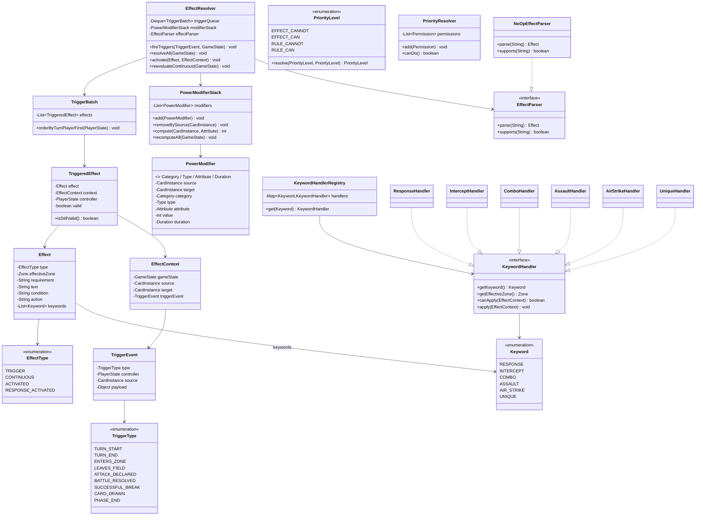
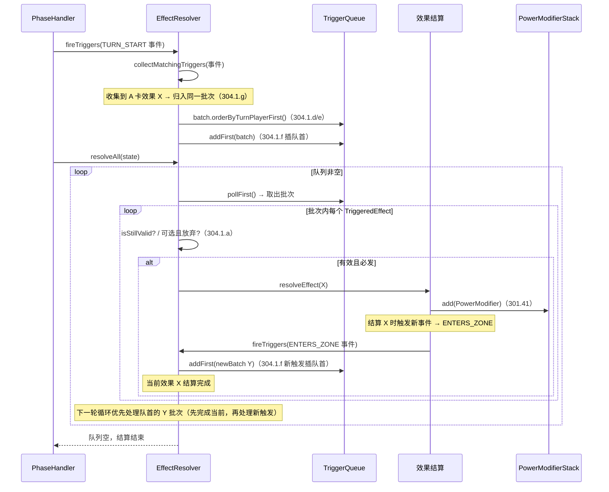
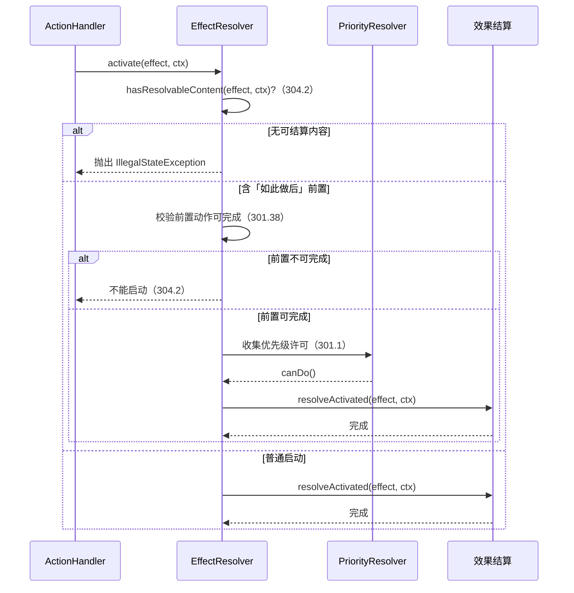

# 详细设计：迭代六 — 效果系统与关键词能力

> 项目：MTCG 后端程序
> 版本：v0.1
> 日期：2026-07-31
> 依据：[需求分析](./01-需求分析.md) FR3.5、FR3.6；[概要设计](./02-概要设计.md) §4.2；[综合规则书 v1.01](../规则文档/02-综合规则书-v1.01.md) 201.10、301.1、301.31–301.44、304、305；[术语表与关键词速查](../规则文档/03-术语表与关键词速查.md)
> 前置依赖：迭代四（状态模型 + 回合流程）、迭代五（行动/战斗处理器）已就绪

***

## 1. 概述

### 1.1 迭代目标

在已就绪的状态模型、回合流程与行动/战斗处理器之上，构建引擎核心的第三部分——**效果系统**与**关键词能力**，使卡牌效果能够按规则书 v1.01 第 304、305 章结算。

### 1.2 范围

| 包含                                                              | 不包含                           |
| --------------------------------------------------------------- | ----------------------------- |
| EffectType 枚举（TRIGGER/CONTINUOUS/ACTIVATED/RESPONSE\_ACTIVATED） | 效果文本的结构化解析（仅预留接口）             |
| Effect / EffectContext / EffectResolver 模型                      | 卡牌效果数据录入（迭代一已落地 effect\_text） |
| 触发时序管理（304.1）                                                   | AI 决策（迭代八）                    |
| 优先级系统（301.1）                                                    | 对战 API 暴露（迭代七）                |
| 战力变更规则（301.41）                                                  | <br />                        |
| 6 个关键词能力处理器（305.1–305.6）                                        | <br />                        |
| EffectParser 空壳框架                                               | <br />                        |

### 1.3 设计原则

| 原则    | 说明                                                                                       |
| ----- | ---------------------------------------------------------------------------------------- |
| 引擎独立性 | 效果系统位于 `com.aris.mtcg.engine.effect` / `com.aris.mtcg.engine.keyword`，纯 POJO，零 Spring 依赖 |
| 规则可追溯 | 所有公开方法与关键字段注释标注规则条款编号（如 `// 304.1`）                                                      |
| 渐进式   | 当前 `effect_json` 留空，效果文本仅作原文存储；EffectParser 为空壳，后续迭代填充                                   |
| 与前置解耦 | 效果系统只依赖迭代四/五的状态模型接口（`GameState`/`CardInstance` 等），不反向修改其结构                               |
| 不可变快照 | Effect 定义一旦从卡牌加载即不可变；运行时变更全部记录在 PowerModifier 等可变状态中                                     |

### 1.4 前置依赖（迭代四/五产物，视为已就绪）

| 依赖                                                                              | 所属迭代 | 本设计引用点                    |
| ------------------------------------------------------------------------------- | ---- | ------------------------- |
| `GameState` / `PlayerState` / `FieldZone`                                       | 迭代四  | EffectContext、效果源头/目标定位   |
| `CardInstance`（含 `currentPower`/`keywords`/`attackUsed`/`interceptUsed` 等运行时标记） | 迭代四  | 关键词校验、战力变更落点              |
| `Zone` / `PhaseType` 枚举                                                         | 迭代四  | 有效区域判定、可启动时点判定            |
| `ActionHandler`（行动阶段）                                                           | 迭代五  | 启动型效果入口（ACTIVATE\_EFFECT） |
| `BattleResolver` / 攻击流程                                                         | 迭代五  | 拦截/强袭/空袭/连击挂接点            |

***

## 2. 效果类型与模型

### 2.1 EffectType 枚举

对应规则 201.10.d–f。枚举存名称字符串（遵循迭代一枚举规范，不存下标）。

```java
package com.aris.mtcg.engine.effect;

/**
 * 效果类型（规则 201.10.d–f）
 * <pre>
 * 201.10.d 触发型：红底白字，满足条件自动触发
 * 201.10.e 常驻型：绿底白字，在对应区域持续生效
 * 201.10.f 启动型：蓝底白字，行动阶段可启动
 *           含「应对·启动」变体：行动/应对阶段/战斗应对步骤可启动
 * </pre>
 */
public enum EffectType {
    TRIGGER,             // 触发型（201.10.d）
    CONTINUOUS,          // 常驻型（201.10.e）
    ACTIVATED,           // 启动型（201.10.f）
    RESPONSE_ACTIVATED   // 应对·启动（201.10.f 变体）
}
```

**可启动时点速查**（与术语表一致）：

| 类型                  | 标记色  | 可启动时点                | 规则                                    |
| ------------------- | ---- | -------------------- | ------------------------------------- |
| TRIGGER             | 红    | 自动（满足条件即触发）          | 304.1                                 |
| CONTINUOUS          | 绿    | 被动（持续生效，不"启动"）       | 201.10.e                              |
| ACTIVATED           | 蓝    | 行动阶段                 | 303.2.a.3.1.4、304.2                   |
| RESPONSE\_ACTIVATED | 蓝+应对 | 行动阶段 / 应对阶段 / 战斗应对步骤 | 303.2.a.3.1.4、303.2.a.4.3.2、303.2.a.5 |

### 2.2 Effect（效果定义）

卡牌效果的定义模型，从 `CardDO.effectText` / `effectJson` 加载。当前 `effectJson` 留空，仅 `text` 有值；`condition` / `action` 为预留字段，由 EffectParser（第 7 节）后续填充。

```java
package com.aris.mtcg.engine.effect;

import com.aris.mtcg.engine.model.Zone;          // 迭代四产物
import com.aris.mtcg.engine.keyword.Keyword;     // 本迭代产物

import java.util.List;

/**
 * 卡牌效果定义（规则 201.10）。
 * <p>不可变：从卡牌快照加载后不再修改；运行时变更记录在 {@link PowerModifier}。</p>
 *
 * 字段对照规则 201.10：
 * <ul>
 *   <li>type      → 效果类型（201.10.d–f）</li>
 *   <li>zone      → 有效区域/要求（黑底白字，斜杠分隔，201.10.d）</li>
 *   <li>requirement → 触发要求文本（如「此卡号召时」「回合开始时」）</li>
 *   <li>text      → 效果文本原文（结算内容，201.10）</li>
 *   <li>condition → 触发条件（预留，待解析器填充）</li>
 *   <li>action    → 结算动作（预留，待解析器填充）</li>
 *   <li>keywords  → 能力（201.10.g，黑底白字标记）</li>
 * </ul>
 */
public class Effect {
    private EffectType type;            // 效果类型
    private Zone effectiveZone;         // 有效区域（如 HAND / VANGUARD / BASE）
    private String requirement;         // 触发要求文本（原文，如"此卡号召时"）
    private String text;                // 效果文本原文
    private String condition;           // 结构化触发条件（预留，当前为 null）
    private String action;              // 结构化结算动作（预留，当前为 null）
    private List<Keyword> keywords;     // 能力列表（201.10.g）

    // 构造、getter 略
}
```

> **说明**：`effectiveZone` 与 `requirement` 共同对应卡面"黑底白字斜杠分隔"的区域/要求标记（201.10.d）。常驻型效果在 `effectiveZone` 持续生效；触发型在满足 `requirement` 且处于 `effectiveZone` 时触发。

### 2.3 EffectContext（效果结算上下文）

每次效果结算（触发或启动）都构造一个上下文，封装结算所需的全部运行时信息。

```java
package com.aris.mtcg.engine.effect;

import com.aris.mtcg.engine.model.CardInstance;   // 迭代四产物
import com.aris.mtcg.engine.model.GameState;      // 迭代四产物

/**
 * 效果结算上下文。
 * <p>每次触发或启动时构造；贯穿条件校验 → 动作结算 → 战力变更全流程。</p>
 */
public class EffectContext {
    private GameState gameState;           // 对局全局状态
    private CardInstance source;           // 效果源头（【此卡】，规则 301.7）
    private CardInstance target;           // 目标卡（无目标则为 null，301.7.b 源头作用时不存在目标指定）
    private TriggerEvent triggerEvent;     // 触发事件（启动型为 null）

    // 构造、getter 略
}
```

### 2.4 TriggerEvent / TriggerType（触发事件）

触发型效果由游戏事件驱动。TriggerEvent 封装事件类型与载荷，供 EffectResolver 收集匹配的触发效果。

```java
package com.aris.mtcg.engine.effect;

import com.aris.mtcg.engine.model.CardInstance;
import com.aris.mtcg.engine.model.PlayerState;

/**
 * 触发事件（规则 304.1）。同一动作同时触发的多个效果视为同时（304.1 末条）。
 */
public class TriggerEvent {
    private TriggerType type;             // 事件类型
    private PlayerState controller;       // 事件发生时点的控制者（用于双方同时→回合玩家先）
    private CardInstance source;          // 事件源头卡（如号召进场的那张卡）
    private Object payload;               // 事件附加数据（如攻击距离、战斗结果）

    // 构造、getter 略
}
```

```java
package com.aris.mtcg.engine.effect;

/**
 * 触发事件类型（对应规则书中常见触发时点）。
 * <p>当前为最小集合，后续随卡牌效果录入扩充。</p>
 */
public enum TriggerType {
    TURN_START,            // 回合开始时（303.2.a.1）
    TURN_END,              // 回合结束时（303.2.a.6）
    ENTERS_ZONE,           // 进入指定区域时（号召/放置/移动）
    LEAVES_FIELD,          // 离场时（301.45）
    ATTACK_DECLARED,       // 宣告攻击时（303.2.a.4.3.1）
    BATTLE_RESOLVED,       // 战斗判定完成时（303.2.a.4.3.3）
    SUCCESSFUL_BREAK,      // 成功攻击破绽时（303.2.a.4.3.3）
    CARD_DRAWN,            // 抽卡时（303.2.a.2）
    PHASE_END              // 阶段结束时
}
```

### 2.5 TriggeredEffect / TriggerBatch（触发效果与批次）

- `TriggeredEffect`：一次待结算的触发，绑定 Effect + Context + 控制者 + 有效性标记。
- `TriggerBatch`：同一事件同时触发的效果集合，按规则 304.1 排序（回合玩家先，同方自选顺序）。

```java
package com.aris.mtcg.engine.effect;

import com.aris.mtcg.engine.model.PlayerState;

/**
 * 待结算的触发型效果实例。
 */
public class TriggeredEffect {
    private final Effect effect;          // 触发的效果定义
    private final EffectContext context;  // 结算上下文
    private final PlayerState controller; // 效果控制者（拥有此卡的玩家）
    private boolean valid;                // 结算前校验：源头未离场、未失效等

    public boolean isStillValid() { return valid; }
    // 其余略
}
```

```java
package com.aris.mtcg.engine.effect;

import com.aris.mtcg.engine.model.PlayerState;

import java.util.ArrayList;
import java.util.List;

/**
 * 同一事件同时触发的效果批次（规则 304.1）。
 * <p>同一规则动作/效果同时触发多个 → 视为同时（304.1 末条）。</p>
 */
public class TriggerBatch {
    private final List<TriggeredEffect> effects = new ArrayList<>();

    /** 按 304.1 排序：双方同时→回合玩家先；同一玩家多个→自选顺序（由玩家选择 API 注入）。 */
    public void orderByTurnPlayerFirst(PlayerState turnPlayer) {
        // 回合玩家的效果置前；回合玩家内部 / 非回合玩家内部保持玩家自选顺序
        effects.sort((a, b) -> {
            boolean aTurn = a.getController().equals(turnPlayer);
            boolean bTurn = b.getController().equals(turnPlayer);
            return Boolean.compare(bTurn, aTurn); // turnPlayer 的效果排前
        });
    }

    public List<TriggeredEffect> getEffects() { return effects; }
    public boolean isEmpty() { return effects.isEmpty(); }
}
```

> **自选顺序的实现**：当同一玩家有多个待排序触发时，引擎不替玩家决定顺序，而是通过 `EffectResolver` 暴露 `pendingOrderChoices` 给上层（API/AI），由玩家显式给出顺序后再继续结算。当前迭代先实现"按入队顺序"的默认策略，并预留玩家选择接口。

***

## 3. 触发时序管理

### 3.1 规则映射（304.1）

| 规则条款    | 要求                        | 引擎实现                                                       |
| ------- | ------------------------- | ---------------------------------------------------------- |
| 304.1.a | 含「可以」= 可选；否则必发            | `Effect.text` 含"可以"→ optional 标记；EffectResolver 跳过可选且玩家放弃的 |
| 304.1.b | 触发后立即结算；尽量完全结算            | `resolveEffect` 同步执行至无法继续                                  |
| 304.1.c | 多个触发逐个结算；未结算的保持待处理        | 触发队列（3.2）                                                  |
| 304.1.d | 同一玩家同时多个 → 自选顺序           | `TriggerBatch.orderByTurnPlayerFirst` + 玩家选择接口             |
| 304.1.e | 双方同时 → 回合玩家先（自选顺序），再非回合玩家 | 同上，回合玩家效果整体置前                                              |
| 304.1.f | 结算中再触发 → 先完成当前，再处理新触发     | 队列 LIFO：新批次插队首，当前效果结算完即处理新批次                               |
| 304.1.g | 同一动作/效果同时触发多个 → 视为同时      | 同一 TriggerEvent 收集的效果归入同一 TriggerBatch                     |

### 3.2 触发队列设计

采用**双端队列 + 批次 LIFO** 模型：新触发的批次插入队首，确保"先完成当前效果，再处理新触发"且新触发优先于更早等待的批次。

```java
package com.aris.mtcg.engine.effect;

import com.aris.mtcg.engine.model.GameState;
import com.aris.mtcg.engine.model.PlayerState;

import java.util.ArrayDeque;
import java.util.Deque;

/**
 * 效果结算器（规则 304）。
 * <p>管理触发队列、结算顺序、优先级；常驻效果通过 {@link #reevaluateContinuous} 重算。</p>
 */
public class EffectResolver {

    /** 触发队列：批次为粒度，新批次插队首（LIFO，304.1.f）。 */
    private final Deque<TriggerBatch> triggerQueue = new ArrayDeque<>();

    /** 战力修改器集合（301.41），由第 5 节详述。 */
    private final PowerModifierStack modifierStack;

    private final EffectParser effectParser;

    public EffectResolver(PowerModifierStack modifierStack, EffectParser effectParser) {
        this.modifierStack = modifierStack;
        this.effectParser = effectParser;
    }

    /**
     * 触发入口：游戏某事件发生时调用。
     * 收集所有匹配的触发效果 → 归入同一批次（视为同时，304.1.g）→ 排序 → 插队首。
     */
    public void fireTriggers(TriggerEvent event, GameState state) {
        TriggerBatch batch = collectMatchingTriggers(event, state);
        if (batch.isEmpty()) {
            return;
        }
        batch.orderByTurnPlayerFirst(state.getActivePlayer()); // 304.1.d/e
        triggerQueue.addFirst(batch);                          // 304.1.f：插队首
    }

    /**
     * 结算队列直至空。
     * <p>逐个弹出队首批次 → 逐个结算效果；结算中产生的新触发已插队首，下一轮优先处理。</p>
     */
    public void resolveAll(GameState state) {
        while (!triggerQueue.isEmpty()) {
            TriggerBatch batch = triggerQueue.pollFirst();
            for (TriggeredEffect te : batch.getEffects()) {
                if (!te.isStillValid()) {          // 结算前校验：源头离场/失效则跳过
                    continue;
                }
                if (isOptionalAndDeclined(te)) {   // 304.1.a：可选且玩家放弃
                    continue;
                }
                resolveEffect(te, state);          // 可能产生新 TriggerEvent → fireTriggers → 新批次入队首
            }
        }
    }

    /** 启动型效果入口（行动/应对阶段/战斗应对步骤，304.2）。 */
    public void activate(Effect effect, EffectContext ctx) {
        // 304.2：须存在可结算内容才能启动；含"如此做后"须能完成前置动作（301.38）
        if (!hasResolvableContent(effect, ctx)) {
            throw new IllegalStateException("无可结算效果，不能启动（304.2）");
        }
        resolveActivated(effect, ctx);
    }

    /** 常驻型效果重算入口（区域变化、离场时调用，201.10.e）。 */
    public void reevaluateContinuous(GameState state) {
        modifierStack.recomputeAll(state);         // 见第 5 节
    }

    // —— 私有方法签名略：collectMatchingTriggers / resolveEffect / resolveActivated
    //     / hasResolvableContent / isOptionalAndDeclined ——
}
```

### 3.3 结算顺序示意

```
事件发生
  │
  ▼
fireTriggers ── 收集匹配触发 ── 同一批次（视为同时，304.1.g）
  │
  ▼
批次排序 ── 回合玩家效果置前，同方自选顺序（304.1.d/e）
  │
  ▼
批次插队首 ── addFirst（304.1.f）
  │
  ▼
resolveAll 循环：
  ├─ 弹出队首批次
  ├─ 逐个结算效果
  │    └─ 若产生新触发 → fireTriggers → 新批次插队首
  └─ 当前效果结算完 → 下一轮循环先处理新批次（先完成当前，再处理新触发）
  │
  ▼
队列空 → 结算结束
```

### 3.4 关键决策

| 编号   | 决策                    | 理由                                                              |
| ---- | --------------------- | --------------------------------------------------------------- |
| D6-1 | 触发队列采用批次 LIFO（新批次插队首） | 契合 304.1.f"先完成当前效果，再处理新触发"；新触发紧随当前效果之后、优先于更早等待的批次，与主流 TCG 触发栈一致 |
| D6-2 | 同方多触发的"自选顺序"先按入队顺序默认  | 玩家选择需经 API 交互，当前迭代先跑通基础流程；预留 `pendingOrderChoices` 接口供迭代七接入     |
| D6-3 | 可选触发（含"可以"）默认放弃       | 必发型自动结算；可选型等待玩家确认，当前迭代无 API 交互，默认跳过避免阻塞（迭代七补齐）                  |

***

## 4. 优先级系统

### 4.1 PriorityLevel 枚举（规则 301.1）

```
效果文本【不能】 > 效果文本【能】 > 规则文本【不能】 > 规则文本【能】
```

```java
package com.aris.mtcg.engine.effect;

/**
 * 优先级层级（规则 301.1）。
 * <p>层级越高越优先；冲突时取最高层级裁定。</p>
 */
public enum PriorityLevel {
    EFFECT_CANNOT(4),   // 效果文本【不能】
    EFFECT_CAN(3),      // 效果文本【能】
    RULE_CANNOT(2),     // 规则文本【不能】
    RULE_CAN(1);        // 规则文本【能】

    private final int rank;
    PriorityLevel(int rank) { this.rank = rank; }
    public int getRank() { return rank; }

    /** 两个层级冲突时返回胜出的层级（高者胜，301.1）。 */
    public static PriorityLevel resolve(PriorityLevel a, PriorityLevel b) {
        return a.rank >= b.rank ? a : b;
    }
}
```

### 4.2 优先级裁定器

将"某件事能否做"的判定抽象为 `Permission`（许可），每个许可带一个层级。规则处理器与效果处理器分别注入 `RULE_CANNOT`/`RULE_CAN` 与 `EFFECT_CANNOT`/`EFFECT_CAN`，最终取最高层级裁定。

```java
package com.aris.mtcg.engine.effect;

import java.util.ArrayList;
import java.util.List;

/**
 * 优先级裁定（规则 301.1）。
 * <p>收集所有相关许可（来自规则与效果），取最高层级决定最终能否执行。</p>
 */
public class PriorityResolver {

    /** 单条许可：某来源对某动作的裁定。 */
    public static final class Permission {
        public final PriorityLevel level;   // 层级
        public final String source;         // 来源描述（规则条款号或效果源头卡名，便于调试）
        public Permission(PriorityLevel level, String source) {
            this.level = level; this.source = source;
        }
    }

    private final List<Permission> permissions = new ArrayList<>();

    public void add(Permission p) { permissions.add(p); }
    public void clear() { permissions.clear(); }

    /**
     * 最终裁定：存在任意 EFFECT_CANNOT / RULE_CANNOT 且无更高层级覆盖时 → 不能。
     * 取所有许可中最高层级，若该层级为 *CANNOT 系列 → false。
     */
    public boolean canDo() {
        if (permissions.isEmpty()) {
            return true; // 默认规则【能】
        }
        Permission top = permissions.stream()
                .max((x, y) -> Integer.compare(x.level.getRank(), y.level.getRank()))
                .orElseThrow();
        // EFFECT_CANNOT / RULE_CANNOT → 不能；EFFECT_CAN / RULE_CAN → 能
        return top.level != PriorityLevel.EFFECT_CANNOT
            && top.level != PriorityLevel.RULE_CANNOT;
    }
}
```

### 4.3 使用示例

以"R=0 不能攻击（规则 303.2.a.4.6）vs 效果【能】攻击"为例：

```java
// 规则层注入：R=0 → RULE_CANNOT
priorityResolver.add(new Permission(PriorityLevel.RULE_CANNOT, "303.2.a.4.6"));
// 效果层注入：某卡效果"此卡可以攻击" → EFFECT_CAN
priorityResolver.add(new Permission(PriorityLevel.EFFECT_CAN, "BP01-020 效果"));
// 裁定：EFFECT_CAN(3) > RULE_CANNOT(2) → 可以攻击
boolean canAttack = priorityResolver.canDo(); // true
```

若另有效果"对方不能攻击"（EFFECT\_CANNOT）：

```java
priorityResolver.add(new Permission(PriorityLevel.EFFECT_CANNOT, "BP02-007 效果"));
// EFFECT_CANNOT(4) 最高 → 不能攻击
canAttack = priorityResolver.canDo(); // false
```

***

## 5. 战力变更规则

### 5.1 规则映射（301.41）

| 规则条款     | 变更组合               | 结果                 |
| -------- | ------------------ | ------------------ |
| 301.41.a | 触发/启动变更 vs 触发/启动增减 | 变更结束，增减生效          |
| 301.41.b | 常驻变更 vs 常驻变更       | 前者（旧）结束            |
| 301.41.c | 常驻变更 vs 触发/启动变更    | 触发/启动变更结束，以常驻变更为最终 |
| 301.41.d | 常驻变更 + 常驻增减        | 以变更为基础叠加增减         |
| 301.41.e | Lv/R/战力互相替换        | 属于变更               |

> **术语**：
>
> - **变更（CHANGE）**：将属性设为某绝对值，或 Lv/R/战力互相替换（301.41.e）。
> - **增减（INCREMENT）**：属性 ±X。

### 5.2 PowerModifier 模型

```java
package com.aris.mtcg.engine.effect;

import com.aris.mtcg.engine.model.CardInstance;

/**
 * 属性修改器（规则 301.40–301.41）。
 * <p>作用于 Lv / R / 战力；记录来源、类别、类型、值、持续时间。</p>
 */
public class PowerModifier {
    /** 修改器类别：来自触发/启动效果，还是常驻效果（决定 301.41 叠加规则）。 */
    public enum Category { TRIGGER_ACTIVATED, CONTINUOUS }
    /** 修改器类型：变更（设绝对值/替换）还是增减（±）。 */
    public enum Type { CHANGE, INCREMENT }
    /** 作用属性。 */
    public enum Attribute { POWER, LEVEL, ATTACK_RANGE }
    /** 持续时间。 */
    public enum Duration {
        THIS_TURN,                 // 仅本回合（回合结束终止，303.2.a.6）
        WHILE_SOURCE_ON_FIELD,    // 来源在场期间（常驻型/离场即终）
        PERMANENT                 // 永久
    }

    private final CardInstance source;        // 来源卡（【此卡】）
    private final CardInstance target;        // 被修改的卡
    private final Category category;          // 类别
    private final Type type;                  // 类型
    private final Attribute attribute;        // 作用属性
    private final int value;                  // CHANGE=绝对值；INCREMENT=带符号(+/-)
    private final Duration duration;          // 持续时间

    // 构造、getter 略
}
```

### 5.3 PowerModifierStack（修改器栈与重算）

集中管理某张卡的所有修改器，并按 301.41 规则计算当前属性。

```java
package com.aris.mtcg.engine.effect;

import com.aris.mtcg.engine.model.CardInstance;
import com.aris.mtcg.engine.model.GameState;

import java.util.ArrayList;
import java.util.Iterator;
import java.util.List;

/**
 * 战力修改器栈（规则 301.41）。
 * <p>所有修改器按目标卡分组存储；重算时按 301.41.a–e 叠加/覆盖。</p>
 */
public class PowerModifierStack {

    private final List<PowerModifier> modifiers = new ArrayList<>();

    /** 新增修改器；若触发 301.41 覆盖规则，移除被结束的旧修改器。 */
    public void add(PowerModifier m) {
        applyOverrideRules(m);   // 301.41.a–c
        modifiers.add(m);
    }

    /** 来源离场 / 回合结束 / 失去效果时移除。 */
    public void removeBySource(CardInstance source) {
        modifiers.removeIf(m -> m.getSource().equals(source));
    }

    public void removeExpiredThisTurn() {
        modifiers.removeIf(m -> m.getDuration() == PowerModifier.Duration.THIS_TURN);
    }

    /** 重算指定卡的指定属性当前值。 */
    public int compute(CardInstance card, PowerModifier.Attribute attr) {
        int original = readOriginal(card, attr);                 // 印刷值（301.6 原本）
        List<PowerModifier> relevant = filterByTarget(card, attr);

        // 1. 常驻变更（CONTINUOUS + CHANGE）：仅保留最新，其余常驻变更结束（301.41.b）
        PowerModifier contChange = latestContinuousChange(relevant);
        // 2. 触发/启动变更在存在常驻变更时结束（301.41.c）；无常驻变更且存在触发/启动增减时，触发/启动变更结束（301.41.a）
        boolean hasTaIncrement = relevant.stream().anyMatch(
                m -> m.getCategory() == PowerModifier.Category.TRIGGER_ACTIVATED
                  && m.getType() == PowerModifier.Type.INCREMENT);

        int base;
        if (contChange != null) {
            base = contChange.getValue();                        // 常驻变更为最终（301.41.c）
        } else if (!hasTaIncrement) {
            // 无常驻变更、无触发/启动增减 → 触发/启动变更可生效（取最新）
            PowerModifier taChange = latestTriggerActivatedChange(relevant);
            base = taChange != null ? taChange.getValue() : original;
        } else {
            // 301.41.a：触发/启动变更 vs 触发/启动增减 → 变更结束，回退印刷值
            base = original;
        }

        // 3. 增减叠加：
        //    - 常驻增减叠在常驻变更之上（301.41.d）
        //    - 触发/启动增减叠加
        int delta = relevant.stream()
                .filter(m -> m.getType() == PowerModifier.Type.INCREMENT)
                .mapToInt(PowerModifier::getValue)
                .sum();
        return Math.max(0, base + delta);                        // 301.8 战力最小值 0
    }

    /** 全局重算（常驻效果重算入口，201.10.e）。 */
    public void recomputeAll(GameState state) {
        // 遍历场上所有卡，重写 currentPower / currentRange / currentLevel
    }

    // —— 私有方法：applyOverrideRules / filterByTarget / latestContinuousChange
    //     / latestTriggerActivatedChange / readOriginal ——
}
```

### 5.4 叠加规则决策表

| 新增修改器          | 已有修改器         | 处理（对应条款）                       |
| -------------- | ------------- | ------------------------------ |
| T/A-CHANGE     | T/A-INCREMENT | 变更与增减共存：重算时变更结束、增减生效（301.41.a） |
| T/A-CHANGE     | T/A-CHANGE    | 各自保留，重算取最新生效（无显式条款，按"后发优先"惯例）  |
| CONT-CHANGE    | CONT-CHANGE   | 旧的常驻变更结束（301.41.b），重算用最新       |
| CONT-CHANGE    | T/A-CHANGE    | T/A-变更结束，常驻变更为最终（301.41.c）     |
| CONT-INCREMENT | CONT-CHANGE   | 以变更为基础叠加（301.41.d）             |
| 任意             | Lv/R/战力替换     | 视为变更（301.41.e），走变更分支           |

> **边界**：战力减至 0 → 触发锁定撤退（301.16）；超出最小值的部分仍"存在"（301.8）。

***

## 6. 关键词能力处理器

### 6.1 Keyword 枚举（规则 305）

```java
package com.aris.mtcg.engine.keyword;

/**
 * 关键词能力（规则 305）。
 */
public enum Keyword {
    RESPONSE,      // 应对（305.1）
    INTERCEPT,     // 拦截（305.2）
    COMBO,         // 连击（305.3）
    ASSAULT,       // 强袭（305.4）
    AIR_STRIKE,    // 空袭（305.5）
    UNIQUE         // 唯一（305.6）
}
```

### 6.2 KeywordHandler 接口

```java
package com.aris.mtcg.engine.keyword;

import com.aris.mtcg.engine.effect.EffectContext;
import com.aris.mtcg.engine.model.Zone;

/**
 * 关键词能力处理器接口。
 * <p>每个关键词一个实现；由 {@link KeywordHandlerRegistry} 注册并按 Keyword 查找。</p>
 */
public interface KeywordHandler {

    /** 所处理的关键词。 */
    Keyword getKeyword();

    /** 生效区域（手牌/战区/场上）。 */
    Zone getEffectiveZone();

    /** 是否可应用/可启动（条件校验）。 */
    boolean canApply(EffectContext ctx);

    /** 应用关键词效果（修改状态或挂接战斗流程）。 */
    void apply(EffectContext ctx);
}
```

### 6.3 KeywordHandlerRegistry

```java
package com.aris.mtcg.engine.keyword;

import java.util.EnumMap;
import java.util.Map;

/**
 * 关键词处理器注册表。
 */
public class KeywordHandlerRegistry {
    private final Map<Keyword, KeywordHandler> handlers = new EnumMap<>(Keyword.class);

    public KeywordHandlerRegistry() {
        register(new ResponseHandler());
        register(new InterceptHandler());
        register(new ComboHandler());
        register(new AssaultHandler());
        register(new AirStrikeHandler());
        register(new UniqueHandler());
    }

    public void register(KeywordHandler h) { handlers.put(h.getKeyword(), h); }
    public KeywordHandler get(Keyword k) { return handlers.get(k); }
}
```

### 6.4 六个处理器实现

#### 6.4.1 ResponseHandler（应对，305.1）

**常驻·手牌**：可应对号召。

```java
package com.aris.mtcg.engine.keyword;

import com.aris.mtcg.engine.effect.EffectContext;
import com.aris.mtcg.engine.model.Zone;

/**
 * 应对（规则 305.1）：手牌常驻；可在应对阶段/战斗应对步骤执行应对号召。
 */
public class ResponseHandler implements KeywordHandler {
    @Override public Keyword getKeyword() { return Keyword.RESPONSE; }
    @Override public Zone getEffectiveZone() { return Zone.HAND; }

    @Override
    public boolean canApply(EffectContext ctx) {
        // 305.1：源头在手牌；当前为应对阶段或战斗应对步骤；本步骤/阶段应对号召次数未用尽
        return ctx.getSource() != null
            && ctx.getSource().getCurrentZone() == Zone.HAND
            && isResponseWindow(ctx)            // 303.2.a.4.3.2 / 303.2.a.5
            && !responseQuotaExhausted(ctx);    // 每步骤/阶段双方各 1 次
    }

    @Override
    public void apply(EffectContext ctx) {
        // 标记此卡可作为应对号召对象；实际号召流程由 ActionHandler（RESPONSE_SUMMON）执行
        // 号召本身仍受 301.19 Lv 规则约束
        markEligibleForResponseSummon(ctx.getSource());
    }
    // 私有方法略
}
```

#### 6.4.2 InterceptHandler（拦截，305.2）

**应对·启动·战区 / 每回合 1 次**：将攻击目标改为此卡。

```java
package com.aris.mtcg.engine.keyword;

import com.aris.mtcg.engine.effect.EffectContext;
import com.aris.mtcg.engine.model.Zone;

/**
 * 拦截（规则 305.2）：应对·启动；战区常驻生效；可被敌方选为攻击目标时，
 * 将该次攻击目标改为此卡；每回合 1 次。
 */
public class InterceptHandler implements KeywordHandler {
    @Override public Keyword getKeyword() { return Keyword.INTERCEPT; }
    @Override public Zone getEffectiveZone() { return Zone.COMBAT_ZONE; }

    @Override
    public boolean canApply(EffectContext ctx) {
        // 305.2：此卡在战区；处于战斗应对步骤；本回合未使用拦截（interceptUsed==false）
        //        存在尚未判定的攻击，且此卡可被敌方选为攻击目标
        return ctx.getSource() != null
            && isInCombatZone(ctx.getSource())
            && !ctx.getSource().isInterceptUsed()           // 每回合 1 次（305.2）
            && hasPendingAttack(ctx);
    }

    @Override
    public void apply(EffectContext ctx) {
        // 将当前攻击的目标改为此卡；标记本回合已拦截
        redirectAttackTarget(ctx.getTriggerEvent(), ctx.getSource());
        ctx.getSource().setInterceptUsed(true);
    }
    // 私有方法略
}
```

> **说明**：`Zone.COMBAT_ZONE` 为战区统称（先锋+侧翼+后卫），实际取自迭代四 Zone 枚举的战区成员；若迭代四未定义此别名，处理器内用 `isInCombatZone()` 判定。

#### 6.4.3 ComboHandler（连击，305.3）

**常驻·战区**：获得第 2 次攻击机会。

```java
package com.aris.mtcg.engine.keyword;

import com.aris.mtcg.engine.effect.EffectContext;
import com.aris.mtcg.engine.model.Zone;

/**
 * 连击（规则 305.3）：战区常驻；获得第 2 次攻击机会。
 */
public class ComboHandler implements KeywordHandler {
    /** 连击角色每回合最大攻击次数。 */
    public static final int MAX_ATTACKS_WITH_COMBO = 2;

    @Override public Keyword getKeyword() { return Keyword.COMBO; }
    @Override public Zone getEffectiveZone() { return Zone.COMBAT_ZONE; }

    @Override
    public boolean canApply(EffectContext ctx) {
        // 305.3：此卡在战区且拥有连击
        return ctx.getSource() != null
            && isInCombatZone(ctx.getSource())
            && ctx.getSource().getKeywords().contains(Keyword.COMBO);
    }

    @Override
    public void apply(EffectContext ctx) {
        // 将此卡本回合最大攻击次数设为 2（迭代四 attackUsed 阈值）
        ctx.getSource().setMaxAttacksThisTurn(MAX_ATTACKS_WITH_COMBO);
    }
    // 私有方法略
}
```

#### 6.4.4 AssaultHandler（强袭，305.4）

**常驻·战区**：因攻击战胜时，判定为成功攻击破绽。

```java
package com.aris.mtcg.engine.keyword;

import com.aris.mtcg.engine.effect.EffectContext;
import com.aris.mtcg.engine.model.Zone;

/**
 * 强袭（规则 305.4）：战区常驻；若因攻击战胜对方角色，
 * 判定为「成功攻击破绽」（冲击卡组顶 1 张放入时间线）。
 */
public class AssaultHandler implements KeywordHandler {
    @Override public Keyword getKeyword() { return Keyword.ASSAULT; }
    @Override public Zone getEffectiveZone() { return Zone.COMBAT_ZONE; }

    @Override
    public boolean canApply(EffectContext ctx) {
        // 305.4：此卡在战区；触发事件为 BATTLE_RESOLVED；此卡为攻击方且战胜
        return ctx.getSource() != null
            && isInCombatZone(ctx.getSource())
            && isAttackerAndWon(ctx);
    }

    @Override
    public void apply(EffectContext ctx) {
        // 在正常战斗判定（败者撤退）之外，额外触发一次成功攻击破绽
        // 即从冲击卡组顶取 1 张放入时间线（103.1.a）
        successfulBreakAttack(ctx.getGameState(), ctx.getGameState().getActivePlayer());
    }
    // 私有方法略：successfulBreakAttack 复用迭代五 BattleResolver 的破绽奖励逻辑
}
```

#### 6.4.5 AirStrikeHandler（空袭，305.5）

**常驻·战区**：敌方战区有角色也可将该战区作为破绽攻击。

```java
package com.aris.mtcg.engine.keyword;

import com.aris.mtcg.engine.effect.EffectContext;
import com.aris.mtcg.engine.model.Zone;

/**
 * 空袭（规则 305.5）：战区常驻；即便敌方战区有角色，
 * 也可把该战区作为破绽攻击。
 */
public class AirStrikeHandler implements KeywordHandler {
    @Override public Keyword getKeyword() { return Keyword.AIR_STRIKE; }
    @Override public Zone getEffectiveZone() { return Zone.COMBAT_ZONE; }

    @Override
    public boolean canApply(EffectContext ctx) {
        // 305.5：此卡在战区且拥有空袭；处于目标步骤（攻击宣告时）
        return ctx.getSource() != null
            && isInCombatZone(ctx.getSource())
            && ctx.getSource().getKeywords().contains(Keyword.AIR_STRIKE);
    }

    @Override
    public void apply(EffectContext ctx) {
        // 放宽目标校验：允许将"有角色的敌方战区位置"视为破绽目标
        // 实际攻击流程仍受 R 距离约束（303.2.a.4.3.1.1）
        enableAttackOccupiedZoneAsBreak(ctx.getSource());
    }
    // 私有方法略：挂接到 BattleResolver 的目标校验钩子
}
```

#### 6.4.6 UniqueHandler（唯一，305.6）

**常驻·场上**：我方场上不能有其他同名卡；效果不能失去。

```java
package com.aris.mtcg.engine.keyword;

import com.aris.mtcg.engine.effect.EffectContext;
import com.aris.mtcg.engine.model.Zone;

/**
 * 唯一（规则 305.6）：场上常驻；我方场上不能有其他同名卡；
 * 唯一的效果不能失去（不受"失去效果"影响，301.33）。
 */
public class UniqueHandler implements KeywordHandler {
    @Override public Keyword getKeyword() { return Keyword.UNIQUE; }
    @Override public Zone getEffectiveZone() { return Zone.FIELD; }

    @Override
    public boolean canApply(EffectContext ctx) {
        // 305.6：此卡在场且拥有唯一
        return ctx.getSource() != null
            && ctx.getSource().getCurrentZone() != null
            && ctx.getSource().getKeywords().contains(Keyword.UNIQUE);
    }

    @Override
    public void apply(EffectContext ctx) {
        // 1. 进场校验：若我方场上已有同名卡 → 阻止放置（由号召流程前置校验调用）
        enforceUnique(ctx);
        // 2. 标记唯一效果不可失去（301.33 例外），供"失去效果"处理器跳过
        ctx.getSource().setEffectUnlosable(true);
    }

    /** 进场前校验：我方场上是否已存在同名卡。 */
    public static boolean wouldViolateUnique(/* controller, cardName */) {
        // 遍历控制者场上所有卡，比对 cardName（201.7 同名即同卡）
        return false; // 实现略
    }
    // 私有方法略
}
```

### 6.5 关键词与战斗流程挂接点

| 关键词         | 挂接点（迭代五）                 | 作用                              |
| ----------- | ------------------------ | ------------------------------- |
| RESPONSE    | 应对阶段/战斗应对步骤入口            | 放行 RESPONSE\_SUMMON 操作          |
| INTERCEPT   | 战斗应对步骤（COMBAT\_RESPONSE） | 改写攻击目标                          |
| COMBO       | 攻击序列推进（303.2.a.4.4）      | 放宽 `attackUsed < maxAttacks` 阈值 |
| ASSAULT     | 判定步骤（RESOLUTION）后        | 战胜时额外触发破绽奖励                     |
| AIR\_STRIKE | 目标步骤（TARGET）校验           | 放宽"破绽=空置战区"约束                   |
| UNIQUE      | 号召/放置进场前校验               | 同名唯一性约束                         |

***

## 7. 效果解析框架（预留）

### 7.1 设计意图

当前阶段 `effect_json` 留空（决策 Q4），引擎先跑通基础流程。EffectParser 仅定义接口与空壳实现，后续迭代按卡牌效果文本结构化时填充，不影响本迭代其它组件。

### 7.2 EffectParser 接口

```java
package com.aris.mtcg.engine.effect;

/**
 * 效果文本解析器（预留）。
 * <p>将卡牌 effect_text 原文解析为结构化 {@link Effect}（填充 condition / action）。</p>
 * <p>当前迭代不实现具体解析逻辑，仅返回仅含 text 的 Effect。</p>
 */
public interface EffectParser {

    /**
     * 解析效果文本。
     * @param effectText 效果原文（可能含"可以""如此做后"等关键字）
     * @return 解析后的 Effect；不支持时返回仅含原文的 Effect
     */
    Effect parse(String effectText);

    /** 是否支持解析该文本（按标记色/关键字判断）。 */
    boolean supports(String effectText);
}
```

### 7.3 空壳实现

```java
package com.aris.mtcg.engine.effect;

import java.util.Collections;

/**
 * EffectParser 空壳实现（当前迭代）。
 * <p>不解析 condition / action，仅承载原文；后续迭代替换为真实解析器。</p>
 */
public class NoOpEffectParser implements EffectParser {

    @Override
    public Effect parse(String effectText) {
        Effect e = new Effect();
        e.setText(effectText);
        e.setCondition(null);   // 预留
        e.setAction(null);      // 预留
        e.setKeywords(Collections.emptyList());
        // type / effectiveZone 由卡牌录入侧另行标注，当前默认 null
        return e;
    }

    @Override
    public boolean supports(String effectText) {
        return false;           // 当前不声称支持任何解析
    }
}
```

> **接入方式**：`EffectResolver` 构造时注入 `EffectParser`；当前由上层（GameService）注入 `NoOpEffectParser`。后续迭代提供 DSL/JSON 解析器实现并替换注入即可，无需改动 Resolver。

***

## 8. 类关系图与时序图

### 8.1 类关系图



### 8.2 触发效果结算时序图

以"回合开始时，A 卡触发效果 X，结算中又触发 B 卡效果 Y"为例（规则 304.1）：



### 8.3 启动型效果结算时序图（规则 304.2）



***

## 9. 文件清单

| 文件                            | 包                | 说明                                                |
| ----------------------------- | ---------------- | ------------------------------------------------- |
| `EffectType.java`             | `engine.effect`  | 效果类型枚举（201.10.d–f）                                |
| `Effect.java`                 | `engine.effect`  | 效果定义（type/zone/requirement/text/condition/action） |
| `EffectContext.java`          | `engine.effect`  | 效果结算上下文                                           |
| `TriggerEvent.java`           | `engine.effect`  | 触发事件                                              |
| `TriggerType.java`            | `engine.effect`  | 触发事件类型枚举                                          |
| `TriggeredEffect.java`        | `engine.effect`  | 待结算触发实例                                           |
| `TriggerBatch.java`           | `engine.effect`  | 同时触发的批次（304.1 排序）                                 |
| `EffectResolver.java`         | `engine.effect`  | 效果结算器（触发队列/启动/常驻重算）                               |
| `PriorityLevel.java`          | `engine.effect`  | 优先级层级枚举（301.1）                                    |
| `PriorityResolver.java`       | `engine.effect`  | 优先级裁定器                                            |
| `PowerModifier.java`          | `engine.effect`  | 属性修改器（含 Category/Type/Attribute/Duration 内嵌枚举）    |
| `PowerModifierStack.java`     | `engine.effect`  | 修改器栈与重算（301.41）                                   |
| `EffectParser.java`           | `engine.effect`  | 效果解析接口（预留）                                        |
| `NoOpEffectParser.java`       | `engine.effect`  | 解析空壳实现                                            |
| `Keyword.java`                | `engine.keyword` | 关键词能力枚举（305）                                      |
| `KeywordHandler.java`         | `engine.keyword` | 关键词处理器接口                                          |
| `KeywordHandlerRegistry.java` | `engine.keyword` | 处理器注册表                                            |
| `ResponseHandler.java`        | `engine.keyword` | 应对（305.1）                                         |
| `InterceptHandler.java`       | `engine.keyword` | 拦截（305.2）                                         |
| `ComboHandler.java`           | `engine.keyword` | 连击（305.3）                                         |
| `AssaultHandler.java`         | `engine.keyword` | 强袭（305.4）                                         |
| `AirStrikeHandler.java`       | `engine.keyword` | 空袭（305.5）                                         |
| `UniqueHandler.java`          | `engine.keyword` | 唯一（305.6）                                         |

共 23 个文件，均位于 `com.aris.mtcg.engine.effect` 与 `com.aris.mtcg.engine.keyword` 包下，纯 POJO，零 Spring 依赖。

***

## 附录：与规则条款对照

| 规则条款                      | 本设计落点                                    |
| ------------------------- | ---------------------------------------- |
| 201.10.d–f                | EffectType 枚举                            |
| 201.10.g                  | Effect.keywords                          |
| 301.1                     | PriorityLevel / PriorityResolver         |
| 301.7                     | EffectContext.source（【此卡】）               |
| 301.8                     | PowerModifierStack.compute 最小值 0         |
| 301.16                    | 战力归零触发撤退（PowerModifierStack 重算后由调用方判定）   |
| 301.33                    | UniqueHandler.setEffectUnlosable         |
| 301.38                    | EffectResolver.activate 前置校验             |
| 301.40–301.41             | PowerModifier / PowerModifierStack       |
| 303.2.a.3.1.4             | ACTIVATED 启动入口                           |
| 303.2.a.4.3.2 / 303.2.a.5 | RESPONSE\_ACTIVATED 启动入口、ResponseHandler |
| 304.1                     | EffectResolver 触发队列与排序                   |
| 304.2                     | EffectResolver.activate                  |
| 305.1–305.6               | 六个 KeywordHandler 实现                     |

---

## 附录 B：Q&A 判例补充

> 以下判例来自 [规则 Q&A 第一期](../规则文档/05-规则Q&A-第1期.md)，影响本迭代的效果系统与关键词能力设计，实现时需覆盖。

### B.1 战力降至 0 立即触发锁定撤退（Q&A Q2）

**判例要点**：角色卡受效果影响战力减至 0 时，根据 301.16.b 锁定撤退结果；且该效果不会带进对方回合（303.2.a.6.1.2 本回合效果结束）。

**影响点**：`PowerModifierStack.compute()` 返回值后，调用方需检查是否为 0 并触发撤退：

```java
// Q&A Q2：战力重算后检查是否归零
int power = modifierStack.compute(card, PowerModifier.Attribute.POWER);
card.setCurrentPower(power);
if (power == 0) {
    // 301.16.b：战力为 0 -> 锁定撤退
    retreatTo(player, card);
}
```

回合结束时，`PowerModifierStack.removeExpiredThisTurn()` 清理 `Duration.THIS_TURN` 的修改器，确保效果不带进对方回合（303.2.a.6.1.2）。当前设计已在 `PowerModifierStack.removeExpiredThisTurn()` 中覆盖此逻辑。

### B.2 结附卡不失去效果，可使用【应对·启动】（Q&A Q3）

**判例要点**：角色卡成为结附卡后**不会失去其卡牌效果**，若本回合未使用过【应对·启动】效果，仍可在应对步骤/应对阶段使用。

**影响点**：`EffectResolver.activate()` 与 `KeywordHandler.canApply()` 校验效果源头时，不能因 `CardInstance` 在 `attachedCards` 列表中就判定效果失效。结附卡的有效区域应跟随父卡（301.25），但仍可被独立选择为效果源头：

```java
// Q&A Q3：结附卡效果有效性校验
public boolean isEffectActive(CardInstance card) {
    // 盖卡失去效果（301.21），但结附卡不失去
    if (card.isFaceDown()) return false;
    // 结附卡仍保留效果，不在 attachedCards 中时正常判定
    // 在 attachedCards 中时同样有效（Q&A Q3 判例）
    return true;
}
```

### B.3 进场时不能触发自身效果（Q&A Q4）

**判例要点**：BP01-070「时间引导！洛基」自己进场时**不可以**触发效果，只有**其他蓝色卡牌**放置到场上时才可以触发。

**影响点**：`EffectResolver.fireTriggers()` 收集 `ENTERS_ZONE` 触发效果时，需排除**产生触发事件的那张卡自身**的效果：

```java
// Q&A Q4：进场触发排除自身
TriggerBatch batch = new TriggerBatch();
for (CardInstance card : getRelevantCards(state)) {
    for (Effect effect : card.getEffects()) {
        if (effect.getType() == EffectType.TRIGGER
            && matchesTrigger(effect, event)) {
            // 排除：触发事件源头 == 效果源头（自身进场不触发自身）
            if (event.getSource() != null
                && event.getSource().equals(card)
                && isSelfTriggerEffect(effect)) {
                continue;  // Q&A Q4：自身进场不触发自身效果
            }
            batch.add(new TriggeredEffect(effect, ctx, controller));
        }
    }
}
```

**注意**：此排除逻辑仅适用于"自身进场触发自身"的场景。若效果文本为「其他卡进场时触发」，则天然不收集自身。需根据 `Effect.requirement` 文本判断是否为自身触发型。

### B.4 同一行动中多效果可互相选择对象（Q&A Q5）

**判例要点**：同一次号召行动中，撤退「援助打击！黑寡妇」并放置新的黄色角色进场，新进场的角色可成为黑寡妇 +2000 战力效果的对象（304.1.1 同一时点触发多效果视为同时）。

**影响点**：`TriggerBatch` 收集同一 `TriggerEvent` 产生的多个效果时，已按 304.1.g 归入同一批次。但效果结算时，**后结算的效果可选择前序效果产生的新状态作为对象**（如新进场的角色）。`EffectResolver.resolveEffect()` 执行效果时，效果对象的选择范围应包含**当前最新场上状态**，而非触发时点的快照：

```java
// Q&A Q5：效果对象基于最新场上状态选择
private void resolveEffect(TriggeredEffect te, GameState state) {
    // 效果结算时读取最新 state（前序效果可能已修改场上状态）
    // 如：前序效果撤退了黑寡妇并放置新角色，后序效果可选新角色为对象
    EffectContext ctx = te.getContext();
    ctx.setGameState(state);  // 更新为最新状态
    // 效果对象选择基于当前 state 中的合法目标
}
```

### B.5 常驻效果立即生效，优先于进场触发效果（Q&A Q6）

**判例要点**：角色号召进入先锋区时，**立即受到**对方「先祖领域！新黑豹」的常驻效果影响（战力 -500），若战力因此降至 0 则直接进入撤退区，**先于**该角色自身的获得战力效果。

**影响点**：`EffectResolver` 在 `ENTERS_ZONE` 事件触发时，须先重算常驻效果（`reevaluateContinuous()`），再处理触发型效果。即常驻效果的生效不需要等待触发队列结算，而是**进场即生效**：

```java
// Q&A Q6：进场时先结算常驻效果，再处理触发
public void onCardEntersZone(CardInstance card, GameState state) {
    // 1. 立即重算常驻效果（新进场的卡可能受对方常驻效果影响）
    reevaluateContinuous(state);  // 201.10.e 常驻型即时生效
    // 检查是否战力归零（301.16.b）
    if (card.getCurrentPower() == 0) {
        retreatTo(state.getActivePlayer(), card);
        return;  // 已撤退，不再触发其进场效果
    }
    // 2. 再触发进场效果（304.1）
    fireTriggers(new TriggerEvent(TriggerType.ENTERS_ZONE, ...), state);
    resolveAll(state);
}
```

**决策**：常驻效果不走触发队列，作为**即时状态修改**在 `reevaluateContinuous()` 中直接计算。触发型效果走队列按 304.1 排序结算。这确保常驻效果（如新黑豹的 -500）在触发型效果（如美国队长的获得战力）之前生效。

