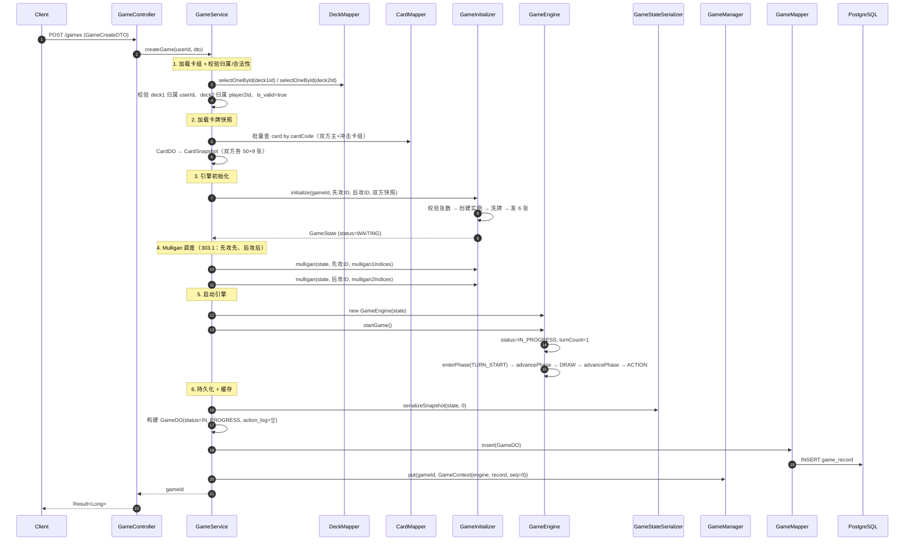
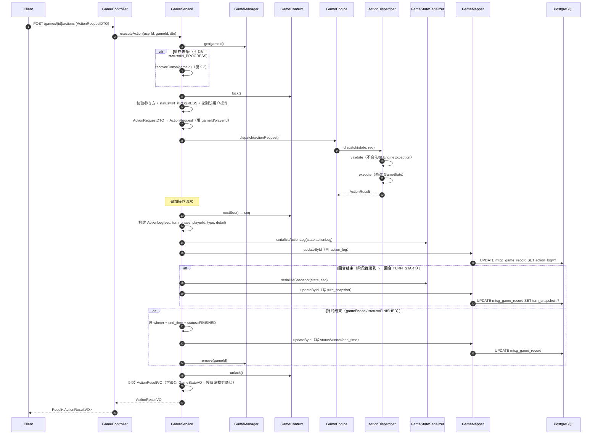
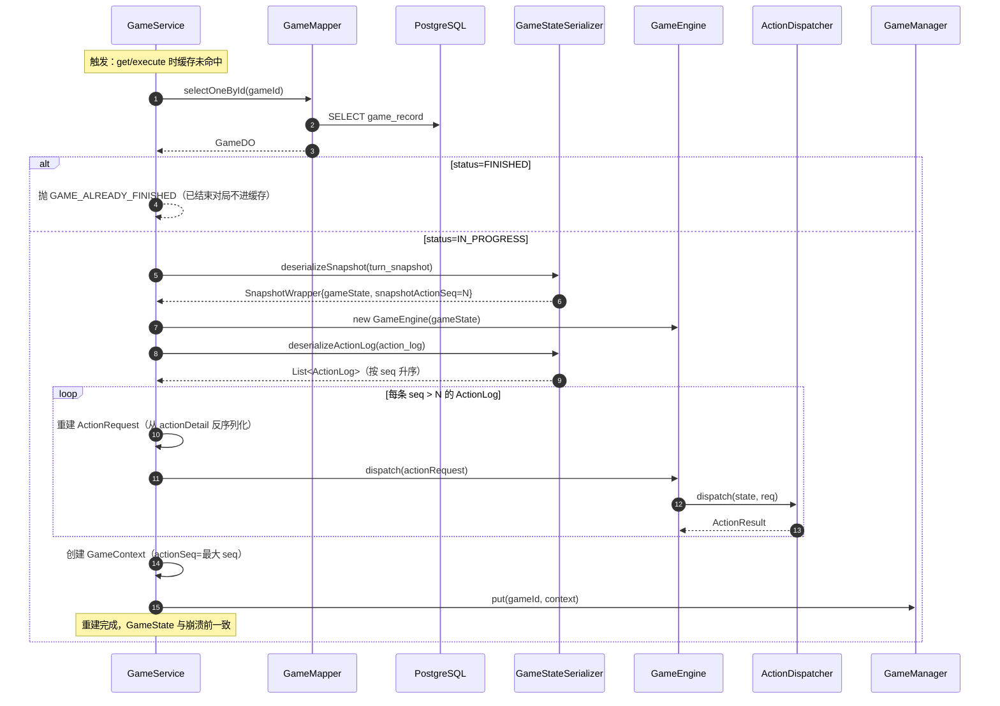

# 详细设计：迭代七 — 对战 API 与对局持久化

> 项目：MTCG 后端程序
> 版本：v0.1
> 日期：2026-07-31
> 依据：[需求分析](./01-需求分析.md) FR4.1–FR4.5、FR5.4、FR5.6；[概要设计](./02-概要设计.md) §3 §5 §6；[迭代四](./06-详细设计-迭代四-引擎状态模型与回合流程.md)、[迭代四](./07-详细设计-迭代四-引擎行动与战斗.md)、[迭代六](./09-详细设计-迭代六-效果系统与关键词能力.md) 引擎产物
> 前置依赖：迭代一（卡牌数据）、迭代二（用户系统 + JWT 鉴权）、迭代三（卡组数据）、迭代四（状态模型 + 回合流程）、迭代五（行动与战斗处理器 ActionDispatcher）、迭代六（效果系统）

---

## 1. 概述

### 1.1 迭代目标

将已就绪的对战引擎封装为 REST API，并落地对局持久化方案，完成「创建对局 → 查询局面 → 执行操作 → 认输/结束 → 复盘回放 + 历史统计」全链路。本迭代是引擎与外部通信的桥接层，不修改引擎内部规则逻辑。

### 1.2 范围

| 包含 | 不包含 |
| --- | --- |
| `mtcg_game_record` 表建表（JSONB + TEXT 混合持久化） | WebSocket 实时推送（FR4.6，未来） |
| GameDO / DTO / VO 实体 | AI 自动决策（迭代八） |
| GameMapper（MyBatis-Flex） | 排位积分变更（迭代九） |
| GameManager（内存对局缓存 + 并发控制） | 模块化拆分（未来） |
| GameStateSerializer（GameState ↔ JSONB） | |
| GameService（创建/查询/操作/认输/复盘/历史/统计） | |
| GameController（REST API） | |
| 崩溃恢复（快照 + 操作流水重放） | |

### 1.3 设计原则

| 原则 | 说明 |
| --- | --- |
| 引擎零侵入 | 引擎层（`com.aris.mtcg.engine`）不感知 HTTP 与持久化，所有桥接在 Service/Manager 层完成（NFR1、NFR6） |
| 混合持久化（D2） | `action_log` 每次操作追加一条（轻量）；`turn_snapshot` 每回合结束存完整状态（JSONB）。崩溃恢复 = 最近快照 + 重放后续流水；复盘 = 全量流水逐条回放 |
| 缓存优先 | 进行中对局状态常驻内存（GameManager），操作直接读写内存，异步/按需落库，满足 NFR8（对局操作 < 100ms） |
| 对局隔离 | 每个对局独立锁，串行化同对局操作，跨对局无锁竞争 |
| 隐私分级 | 局面 VO 对手牌等非公开信息按归属裁剪，仅本人可见己方手牌 |
| 归属校验 | 对局关联双方用户（FR5.6），所有操作校验调用方为对局参与方 |

### 1.4 前置依赖（视为已就绪）

| 依赖 | 所属迭代 | 本设计引用点 |
| --- | --- | --- |
| `GameState` / `PlayerState` / `FieldZone` / `CardInstance` / `CardSnapshot` / `ActionLog` | 迭代四 | 状态序列化、局面 VO 组装 |
| `PhaseType` / `GameStatus` / `Zone` / `PlayerSide` 枚举 | 迭代四 | 序列化枚举名、阶段判定 |
| `ActionType` / `ActionRequest` / `ActionResult` / `ActionDispatcher` | 迭代五 | 操作 DTO → 引擎请求转换、操作路由 |
| `GameEngine`（含 `dispatch`）/ `GameInitializer` | 迭代四 | 创建对局、执行操作、崩溃恢复重放 |
| `DeckMapper` / `DeckDO` / 卡组校验 | 迭代三 | 加载双方卡组、校验合法性与归属 |
| `CardMapper` / `CardDO` | 迭代一 | 按 cardCode 批量加载卡牌快照 |
| JWT 鉴权 + 当前用户上下文 | 迭代二 | Controller 获取 `userId`、归属校验 |
| `Result<T>` / `ErrorCode` / `BusinessException` / `GlobalExceptionHandler` | 迭代一、二 | 统一响应与异常 |

---

## 2. 数据库设计

### 2.1 建表 SQL

```sql
-- 对局记录表（操作流水 + 回合快照混合持久化，D2 决策）
CREATE TABLE mtcg_game_record (
    id                  BIGSERIAL       PRIMARY KEY,
    player1_id          BIGINT          NOT NULL,                  -- 先攻/发起方用户 ID（应用层校验，无外键）
    player2_id          BIGINT          NOT NULL,                  -- 后攻/对手方用户 ID
    deck1_id            BIGINT          NOT NULL,                  -- player1 使用的卡组 ID
    deck2_id            BIGINT          NOT NULL,                  -- player2 使用的卡组 ID
    winner              VARCHAR(16),                               -- 胜方：PLAYER1 / PLAYER2 / DRAW；进行中为 NULL
    game_mode           VARCHAR(16)     NOT NULL,                  -- 对局模式：CASUAL / RANKED / AI
    status              VARCHAR(16)     NOT NULL,                  -- 对局状态：IN_PROGRESS / FINISHED
    turn_snapshot       JSONB,                                     -- 最近一次回合结束的完整状态快照（含 snapshotActionSeq）
    action_log          TEXT            NOT NULL DEFAULT '[]',     -- 操作流水 JSON 数组，每次操作追加一条
    create_time         TIMESTAMP       NOT NULL DEFAULT NOW(),
    end_time            TIMESTAMP,                                 -- 对局结束时间，进行中为 NULL
    -- 枚举字段 CHECK 约束
    CONSTRAINT ck_game_winner   CHECK (winner IS NULL OR winner IN ('PLAYER1','PLAYER2','DRAW')),
    CONSTRAINT ck_game_mode     CHECK (game_mode IN ('CASUAL','RANKED','AI')),
    CONSTRAINT ck_game_status   CHECK (status IN ('IN_PROGRESS','FINISHED'))
);

-- 历史查询索引（FR5.4 个人对局历史）
CREATE INDEX idx_game_player1     ON mtcg_game_record (player1_id);
CREATE INDEX idx_game_player2     ON mtcg_game_record (player2_id);
CREATE INDEX idx_game_create_time ON mtcg_game_record (create_time DESC);
-- 复盘/崩溃恢复按 id 直查，主键索引即可

-- update_time 自动更新（复用迭代一已创建的 update_update_time() 函数）
CREATE TRIGGER trigger_game_record_update_time
    BEFORE UPDATE ON mtcg_game_record
    FOR EACH ROW
    EXECUTE FUNCTION update_update_time();
```

### 2.2 字段说明

| 字段 | 类型 | 说明 |
| --- | --- | --- |
| id | BIGSERIAL | 对局 ID，主键自增；对外转换为字符串作为 `gameId` 传入引擎 |
| player1_id / player2_id | BIGINT | 双方用户 ID，无外键，关系完整性在应用层校验（FR5.6） |
| deck1_id / deck2_id | BIGINT | 双方卡组 ID，对局创建时快照卡牌数据，后续卡组变更不影响进行中对局 |
| winner | VARCHAR(16) | `PLAYER1` / `PLAYER2` / `DRAW`；结合 player1_id/player2_id 可定位胜者用户，便于胜败统计 |
| game_mode | VARCHAR(16) | `CASUAL`（休闲）/ `RANKED`（排位，积分变更在迭代九）/ `AI`（人机） |
| status | VARCHAR(16) | `IN_PROGRESS`（进行中，常驻缓存）/ `FINISHED`（已结束，可清缓存） |
| turn_snapshot | JSONB | 最近一次回合结束时的完整 `GameState` 快照 + `snapshotActionSeq`（快照已应用的最后操作序号） |
| action_log | TEXT | 全量操作流水 JSON 数组，每条含 `seq`/`turnCount`/`phase`/`playerId`/`actionType`/`actionDetail`/`timestamp` |
| create_time | TIMESTAMP | 创建时间 |
| end_time | TIMESTAMP | 结束时间，进行中为 NULL |

### 2.3 持久化策略（D2 决策落地）

| 时机 | 落库内容 | 字段 |
| --- | --- | --- |
| 创建对局 | 初始 `turn_snapshot`（WAITING/首回合前）+ 空 `action_log` + status=IN_PROGRESS | insert |
| 每次操作 | 追加一条 ActionLog 到 `action_log`（内存累加后整体写回） | update action_log |
| 回合结束（TURN_END 处理完成） | 序列化当前 `GameState` → `turn_snapshot`（含 snapshotActionSeq=当前最大 seq） | update turn_snapshot |
| 对局结束（胜负/认输） | status=FINISHED + winner + end_time | update status/winner/end_time |

> **为何 `action_log` 用 TEXT 而非 JSONB**：操作流水为追加型整体写回，TEXT 足够且兼容性好；JSONB 适合字段级查询，对局流水无需按字段检索。复盘按数组顺序读取即可。

---

## 3. 实体类设计

### 3.1 GameDO

```java
包：com.aris.mtcg.domain.entity
表：mtcg_game_record

字段：
- Long id
- Long player1Id
- Long player2Id
- Long deck1Id
- Long deck2Id
- String winner            // PLAYER1 / PLAYER2 / DRAW / null
- String gameMode          // CASUAL / RANKED / AI
- String status            // IN_PROGRESS / FINISHED
- String turnSnapshot      // JSONB 字段，MyBatis-Flex 默认以 String 读写
- String actionLog         // 操作流水 JSON 数组字符串
- LocalDateTime createTime
- LocalDateTime endTime

注解：
- @Table("mtcg_game_record")
- @Id(keyType = KeyType.Auto)
```

> `turn_snapshot` / `action_log` 在 DO 层统一用 `String` 承载，序列化/反序列化由 `GameStateSerializer` 负责，避免在 DO 上耦合 JSON 框架注解。

### 3.2 GameCreateDTO（创建对局）

```java
包：com.aris.mtcg.domain.dto

字段：
- Long deck1Id                       // @NotNull 发起方卡组 ID
- Long deck2Id                       // @NotNull 对手方卡组 ID
- Long player2Id                     // 对手方用户 ID（可空：AI 对局或自由匹配时由系统填）
- String gameMode                    // @NotNull CASUAL / RANKED / AI
- String firstPlayer                 // 可空：PLAYER1 / PLAYER2；空则随机决定先攻
- List<Integer> mulligan1Indices     // 可空：player1 调度手牌索引；空表示不调度
- List<Integer> mulligan2Indices     // 可空：player2 调度手牌索引
```

> 发起方 `player1Id` 从安全上下文获取，不暴露在 DTO 中。调度（Mulligan）在创建时一次性提交，简化交互；双方各自独立调度，遵循「先攻先决定，后攻后决定」（303.1）。

### 3.3 ActionRequestDTO（执行操作）

```java
包：com.aris.mtcg.domain.dto

字段：
- String actionType                  // @NotNull ActionType 枚举名，如 SUMMON / ATTACK
- String cardCode                    // 主体卡编号，可空
- String sourceZone                  // 源区域枚举名，可空
- Integer sourceIndex                // 源区域下标（侧翼/基地多格），可空
- String targetZone                  // 目标区域枚举名，可空
- Integer targetIndex                // 目标区域下标，可空
- String targetCardCode              // 目标卡编号（结附父卡、攻击目标），可空
- Map<String, Object> extras         // 扩展参数（如调整位置互换对、Lv4+ 撤退清单）
```

> `playerId` 不在 DTO 中，由 Service 根据当前登录用户 + 对局归属确定操作方。DTO 字段与引擎 `ActionRequest`（迭代五 §2.2）一一对应，Service 负责装配 `gameId` / `playerId`。

### 3.4 GameStateVO（对局状态视图）

```java
包：com.aris.mtcg.domain.vo

字段：
- String gameId
- String status                       // IN_PROGRESS / FINISHED
- Integer turnCount
- String currentPhase                 // PhaseType 枚举名
- String activePlayerId               // 当前回合玩家 ID
- String winner                       // 对局结束时 PLAYER1 / PLAYER2 / DRAW
- PlayerStateVO player1
- PlayerStateVO player2
- List<String> availableActions       // 当前操作方可执行的 ActionType 列表（驱动前端按钮）
```

### 3.5 PlayerStateVO / FieldZoneVO / CardInstanceVO

```java
包：com.aris.mtcg.domain.vo

PlayerStateVO：
- String playerId
- String side                         // FIRST / SECOND
- Integer deckCount                   // 卡组剩余张数（不暴露具体卡牌）
- Integer rushDeckCount               // 冲击卡组剩余张数
- List<CardInstanceVO> hand           // 手牌：本人返回完整卡牌，对手返回空列表（仅靠 handCount 暴露数量）
- Integer handCount                   // 手牌数量（对手也可见）
- List<CardInstanceVO> timeline       // 时间线（公开）
- List<CardInstanceVO> retreat        // 撤退区（公开）
- List<CardInstanceVO> voidZone       // 虚空区（公开）
- FieldZoneVO field                   // 场上区域（公开）
- Integer baseDeployCount             // 行动计数器（仅本人可见，对手返回 null）
- Integer summonCount

FieldZoneVO：
- CardInstanceVO vanguard
- List<CardInstanceVO> flank          // 长度 2，null 占位
- CardInstanceVO rearguard
- List<CardInstanceVO> base           // 基地区，长度 ≤ 6

CardInstanceVO：
- String instanceId                   // 对局内唯一实例 ID
- String cardCode
- String cardName
- Integer level
- String color
- Integer currentPower                // 当前战力（受效果影响）
- Integer currentRange                // 当前 R
- Boolean isFaceDown                  // 是否盖卡（盖卡时仅本人可见卡牌信息）
- Boolean enteredThisTurn
- Boolean movedThisTurn
- Integer attackUsed
- Boolean interceptUsed
- List<CardInstanceVO> attachedCards  // 结附卡
```

> **隐私规则**：手牌、盖卡、己方行动计数器为非公开信息，`GameService` 在组装 VO 时按请求方归属裁剪：请求方为本人则返回完整信息，为对手则手牌返回空列表 + handCount、盖卡隐藏 cardCode/cardName（仅保留 instanceId + isFaceDown=true）、行动计数器返回 null。

### 3.6 ActionResultVO（操作结果）

```java
包：com.aris.mtcg.domain.vo

字段：
- Boolean success
- String message                      // 失败原因或附加说明
- Boolean phaseAdvanced               // 是否触发阶段推进
- Boolean gameEnded                   // 是否触发对局结束
- String winner                       // 对局结束时胜方
- GameStateVO gameState               // 操作后的最新局面（便于前端刷新）
```

### 3.7 GameHistoryVO（对局历史条目，FR5.4）

```java
包：com.aris.mtcg.domain.vo

字段：
- Long gameId
- String opponentName                 // 对手昵称（联查 user 表）
- String selfSide                     // 本人方：PLAYER1 / PLAYER2
- String result                       // 本人结果：WIN / LOSE / DRAW / UNFINISHED
- String winner                       // PLAYER1 / PLAYER2 / DRAW / null
- String gameMode
- String status
- String deckName                     // 本人使用的卡组名（联查 deck 表）
- String createTime                   // yyyy-MM-dd HH:mm:ss
- String endTime                      // 可空
```

### 3.8 GameStatsVO（胜败统计，FR5.4）

```java
包：com.aris.mtcg.domain.vo

字段：
- Integer totalGames                  // 已结束对局总数
- Integer wins
- Integer losses
- Integer draws
- Double winRate                      // 胜率 = wins / totalGames
```

### 3.9 ReplayVO / ActionReplayEntryVO（复盘回放，FR4.5）

```java
包：com.aris.mtcg.domain.vo

ReplayVO：
- Long gameId
- Long player1Id
- Long player2Id
- String winner
- String gameMode
- String createTime
- String endTime
- List<ActionReplayEntryVO> actions   // 按时序排列的操作流水

ActionReplayEntryVO：
- Long seq                            // 操作序号
- Integer turnCount
- String phase
- String playerId
- String actionType
- String actionDetail                 // 操作详情 JSON 字符串（前端按 actionType 解析）
- Long timestamp
```

> 复盘回放由前端按 `actions` 逐条驱动引擎回放，或后端提供逐步回放接口（本迭代返回全量流水，前端自行回放；逐步回放接口留待未来）。

---

## 4. DAO 层设计

### 4.1 GameMapper

```java
包：com.aris.mtcg.dao
继承：BaseMapper<GameDO>（MyBatis-Flex）
注解：@Mapper

自带方法（无需手写 SQL）：
- insert(gameDO)
- updateById(gameDO)                  // 更新 status / winner / turn_snapshot / action_log 等
- selectOneById(id)
- selectListByQuery(QueryWrapper)     // 按 player1_id / player2_id 查历史

自定义方法：
// 个人对局历史（FR5.4）：player1_id = userId OR player2_id = userId，按 create_time 倒序
@Select("""
    SELECT * FROM mtcg_game_record
    WHERE player1_id = #{userId} OR player2_id = #{userId}
    ORDER BY create_time DESC
    LIMIT #{limit} OFFSET #{offset}
""")
List<GameDO> selectHistory(@Param("userId") Long userId,
                           @Param("offset") int offset,
                           @Param("limit") int limit);

// 胜败统计（FR5.4）：按本人所在方与 winner 计算胜负
@Select("""
    SELECT
        COUNT(*) AS total,
        SUM(CASE WHEN (player1_id = #{userId} AND winner = 'PLAYER1')
                  OR (player2_id = #{userId} AND winner = 'PLAYER2')
             THEN 1 ELSE 0 END) AS wins,
        SUM(CASE WHEN (player1_id = #{userId} AND winner = 'PLAYER2')
                  OR (player2_id = #{userId} AND winner = 'PLAYER1')
             THEN 1 ELSE 0 END) AS losses,
        SUM(CASE WHEN winner = 'DRAW' THEN 1 ELSE 0 END) AS draws
    FROM mtcg_game_record
    WHERE (player1_id = #{userId} OR player2_id = #{userId}) AND status = 'FINISHED'
""")
Map<String, Object> selectStats(@Param("userId") Long userId);

// 历史总数（分页用）
@Select("""
    SELECT COUNT(*) FROM mtcg_game_record
    WHERE player1_id = #{userId} OR player2_id = #{userId}
""")
long countHistory(@Param("userId") Long userId);
```

> JSONB 字段 `turn_snapshot` 在 MyBatis-Flex 中默认以 `String` 读写，无需特殊 TypeHandler；序列化逻辑上移至 `GameStateSerializer`，保持 DAO 层纯粹。

---

## 5. Manager 层（对局缓存）

### 5.1 GameManager

`GameManager` 是 Spring 管理的单例组件，内存中维护进行中对局的 `GameContext`，提供缓存读写与并发控制。进行中对局状态常驻内存，避免每次操作都反序列化快照。

```java
package com.aris.mtcg.manager;

import com.aris.mtcg.engine.GameEngine;
import com.aris.mtcg.domain.entity.GameDO;
import org.springframework.stereotype.Component;

import java.util.concurrent.ConcurrentHashMap;

/**
 * 对局缓存管理器。
 * <p>内存中维护进行中的对局上下文（GameEngine + 元数据 + 操作序号 + 锁）。
 * 进行中对局常驻内存，操作直接读写内存；结束对局从缓存移除，状态已落库。
 * <p>崩溃恢复：缓存未命中但 DB 中 status=IN_PROGRESS 时，由 GameService 触发恢复重建 GameContext。
 */
@Component
public class GameManager {

    /** gameId → GameContext，对局隔离 */
    private final ConcurrentHashMap<String, GameContext> games = new ConcurrentHashMap<>();

    /** 缓存对局上下文 */
    public void put(String gameId, GameContext context) {
        games.put(gameId, context);
    }

    /** 获取对局上下文，不存在返回 null */
    public GameContext get(String gameId) {
        return games.get(gameId);
    }

    /** 是否在缓存中 */
    public boolean contains(String gameId) {
        return games.containsKey(gameId);
    }

    /** 移除对局上下文（对局结束时调用） */
    public GameContext remove(String gameId) {
        return games.remove(gameId);
    }

    /** 当前缓存对局数（监控指标，NFR10） */
    public int activeCount() {
        return games.size();
    }
}
```

### 5.2 GameContext

每个进行中对局一个 `GameContext`，持有引擎实例、DB 元数据、操作序号计数器与对局级锁。同对局操作通过锁串行化，跨对局无竞争。

```java
package com.aris.mtcg.manager;

import com.aris.mtcg.engine.GameEngine;
import com.aris.mtcg.domain.entity.GameDO;
import lombok.Data;

import java.util.concurrent.locks.ReentrantLock;

/**
 * 对局上下文（非 Spring 管理，由 GameService 创建后放入 GameManager）。
 * <p>持有引擎实例与对局元数据，操作序号单调递增，对局级锁串行化操作。
 */
@Data
public class GameContext {

    /** 对局 ID（字符串形式，与 GameState.gameId 一致） */
    private final String gameId;
    /** 引擎实例（含 GameState，操作直接读写） */
    private final GameEngine engine;
    /** DB 元数据（含 player1Id/player2Id/status 等，落库时更新） */
    private GameDO record;
    /** 操作序号，单调递增，用于 action_log 排序与快照水位标记 */
    private long actionSeq;
    /** 对局级锁，串行化同对局操作 */
    private final ReentrantLock lock = new ReentrantLock();

    public GameContext(String gameId, GameEngine engine, GameDO record) {
        this.gameId = gameId;
        this.engine = engine;
        this.record = record;
        this.actionSeq = 0L;
    }

    /** 加锁 */
    public void lock() { lock.lock(); }

    /** 解锁 */
    public void unlock() { lock.unlock(); }

    /** 递增并返回下一个操作序号 */
    public long nextSeq() { return ++actionSeq; }
}
```

### 5.3 GameStateSerializer

负责 `GameState` ↔ JSON 字符串互转，供 `turn_snapshot`（JSONB）与 `action_log`（TEXT）使用。位于 Manager 层，可依赖 fastjson2，但不污染引擎 POJO。

```java
package com.aris.mtcg.manager;

import com.aris.mtcg.engine.model.*;
import com.alibaba.fastjson2.JSON;
import com.alibaba.fastjson2.JSONReader;
import com.alibaba.fastjson2.JSONWriter;
import org.springframework.stereotype.Component;

import java.util.List;

/**
 * GameState 序列化器。
 * <p>负责 GameState ↔ JSON 互转，支撑 turn_snapshot 持久化与崩溃恢复。
 * <p>使用 fastjson2，枚举按 name() 序列化；CardSnapshot 不可变，通过构造器反序列化。
 */
@Component
public class GameStateSerializer {

    /**
     * 序列化 GameState 为 turn_snapshot JSON。
     * <p>包裹 { snapshotActionSeq, snapshotTurn, gameState } 结构，记录快照水位。
     */
    public String serializeSnapshot(GameState state, long snapshotActionSeq) {
        SnapshotWrapper wrapper = new SnapshotWrapper();
        wrapper.setSnapshotActionSeq(snapshotActionSeq);
        wrapper.setSnapshotTurn(state.getTurnCount());
        wrapper.setGameState(state);
        return JSON.toJSONString(wrapper,
                JSONWriter.Feature.WriteClassName,
                JSONWriter.Feature.FieldBased,
                JSONWriter.Feature.EnumUsingToString);
    }

    /** 反序列化 turn_snapshot JSON 为 GameState。 */
    public SnapshotWrapper deserializeSnapshot(String json) {
        if (json == null || json.isBlank()) return null;
        return JSON.parseObject(json, SnapshotWrapper.class,
                JSONReader.Feature.FieldBased,
                JSONReader.Feature.SupportAutoType);
    }

    /** 序列化操作流水列表为 action_log JSON 数组字符串。 */
    public String serializeActionLog(List<ActionLog> logs) {
        return JSON.toJSONString(logs,
                JSONWriter.Feature.EnumUsingToString);
    }

    /** 反序列化 action_log JSON 数组字符串为操作流水列表。 */
    public List<ActionLog> deserializeActionLog(String json) {
        if (json == null || json.isBlank()) return List.of();
        return JSON.parseArray(json, ActionLog.class,
                JSONReader.Feature.SupportAutoType);
    }

    /** 快照包装器：记录水位 + 完整状态 */
    @lombok.Data
    public static class SnapshotWrapper {
        private long snapshotActionSeq;   // 快照已应用的最后操作序号
        private int snapshotTurn;         // 快照对应回合计数
        private GameState gameState;      // 完整对局状态
    }
}
```

> **CardSnapshot 不可变处理**：`CardSnapshot` 为 final 字段 + 构造器，fastjson2 的 `FieldBased` 特性可访问私有 final 字段完成反序列化；若后续引擎调整构造方式，可在 `GameStateSerializer` 中增加自定义 `ObjectReader`。本设计将 JSON 注解隔离在序列化器内，引擎 POJO 保持纯净。

---

## 6. Service 层设计

### 6.1 GameService 接口

```java
包：com.aris.mtcg.service

方法：
// 创建对局（FR4.1）
- Long createGame(Long userId, GameCreateDTO dto)

// 查询对局状态（FR4.2）
- GameStateVO getGameState(Long userId, Long gameId)

// 执行操作（FR4.3）
- ActionResultVO executeAction(Long userId, Long gameId, ActionRequestDTO dto)

// 认输（FR4.4）
- void surrender(Long userId, Long gameId)

// 复盘数据（FR4.5）
- ReplayVO getReplay(Long gameId)

// 个人对局历史（FR5.4）
- PageVO<GameHistoryVO> listHistory(Long userId, int page, int size)

// 胜败统计（FR5.4）
- GameStatsVO getStats(Long userId)
```

### 6.2 业务逻辑

#### 6.2.1 createGame（创建对局）

| 步骤 | 逻辑 |
| --- | --- |
| 1. 加载卡组 | `deckMapper.selectOneById(deck1Id)` / `selectOneById(deck2Id)`；校验 deck1 归属当前用户、deck2 归属 player2Id（若提供）；校验双方 `is_valid=true` |
| 2. 加载卡牌快照 | 解析双方 `main_deck_codes` / `rush_deck_codes`，合并编号批量 `cardMapper` 查询，转 `CardDO → CardSnapshot`（迭代四 §2.1） |
| 3. 决定先攻 | `firstPlayer` 为空则随机；映射为 player1/player2 的先后攻 |
| 4. 引擎初始化 | `gameInitializer.initialize(gameId, firstPlayerId, secondPlayerId, 双方快照)` → GameState（status=WAITING） |
| 5. Mulligan 调度 | 按「先攻先决定，后攻后决定」依次调用 `gameInitializer.mulligan(state, playerId, indices)`（303.1）；索引为空则跳过 |
| 6. 启动引擎 | `new GameEngine(state)` → `engine.startGame()`（status=IN_PROGRESS, turnCount=1, 进入 TURN_START→DRAW→ACTION） |
| 7. 持久化 | 构建 GameDO（status=IN_PROGRESS），序列化初始 `turn_snapshot`（snapshotActionSeq=0），`action_log='[]'`，`gameMapper.insert` |
| 8. 缓存 | 创建 `GameContext`，`gameManager.put(gameId, context)` |
| 9. 返回 | 返回 gameId（Long） |

#### 6.2.2 getGameState（查询对局状态）

| 步骤 | 逻辑 |
| --- | --- |
| 1. 取缓存 | `gameManager.get(gameId)`；为空则 `recoverGame(gameId)` 重建 |
| 2. 校验参与方 | 当前用户须为 player1 或 player2，否则抛 `BusinessException(NOT_FOUND, "对局不存在或无权查看")` |
| 3. 组装 VO | 从 `engine.getState()` 组装 `GameStateVO`，按请求方归属裁剪隐私信息（手牌/盖卡/计数器） |
| 4. 计算可执行操作 | 根据当前 phase + 回合玩家 + 引擎校验逻辑，列出当前用户可执行的 `ActionType`（如 ACTION 阶段本人可 BASE_DEPLOY/SUMMON/.../END_PHASE；对手仅 SURRENDER） |

#### 6.2.3 executeAction（执行操作）

| 步骤 | 逻辑 |
| --- | --- |
| 1. 取缓存 | `gameManager.get(gameId)`；为空则 `recoverGame(gameId)` |
| 2. 校验参与方 + 状态 | 当前用户为参与方；status=IN_PROGRESS；非认输操作须校验是否轮到该用户操作（回合玩家 + 阶段匹配） |
| 3. DTO → ActionRequest | 装配 `gameId` / `playerId`（当前用户对应方）/ 各字段；`actionType` 字符串转 `ActionType` 枚举 |
| 4. 加锁 + 派发 | `context.lock()`；`engine.dispatch(actionRequest)` → ActionResult（引擎内部 `ActionDispatcher` 路由 + validate + execute） |
| 5. 追加流水 | `seq = context.nextSeq()`；构建 `ActionLog(seq, turnCount, phase, playerId, actionType, actionDetail)`；加入 `state.actionLog` |
| 6. 持久化流水 | 序列化全量 `actionLog` → `gameMapper.updateById` 写 `action_log` |
| 7. 回合结束判定 | 若操作触发阶段推进到下一回合 TURN_START（即上一回合 TURN_END 处理完成），序列化 `turn_snapshot`（snapshotActionSeq=seq）并落库 |
| 8. 对局结束判定 | 若 `result.gameEnded` 或 `state.status=FINISHED`：设置 winner（根据 state.winnerId 映射 PLAYER1/PLAYER2）+ end_time + status=FINISHED，落库，`gameManager.remove(gameId)` |
| 9. 组装结果 | `ActionResultVO`（含最新 `GameStateVO`） |
| 10. 解锁 | `context.unlock()`（finally 块） |

> **异常处理**：引擎 `EngineException` 捕获后转换为 `BusinessException(ILLEGAL_GAME_ACTION, message)`，不落库（操作未生效）。

#### 6.2.4 surrender（认输）

封装为 `ActionType.SURRENDER` 的 `executeAction`：校验参与方 + status=IN_PROGRESS → 派发 → 落库 → 移除缓存。胜者为另一方。

#### 6.2.5 getReplay（复盘回放）

| 步骤 | 逻辑 |
| --- | --- |
| 1. 加载 | `gameMapper.selectOneById(gameId)` |
| 2. 解析流水 | `serializer.deserializeActionLog(record.getActionLog())` → `List<ActionLog>` |
| 3. 组装 | 转 `List<ActionReplayEntryVO>`，填充元数据 → `ReplayVO` |

> 复盘直接返回全量操作流水，前端按序回放；无需加载 GameState。进行中/已结束对局均可复盘（进行中可见已发生的操作）。

#### 6.2.6 listHistory / getStats（历史与统计）

- `listHistory`：`gameMapper.selectHistory(userId, offset, limit)` → 联查 user 表补对手昵称、deck 表补卡组名 → 转 `GameHistoryVO`；`countHistory` 提供总数。
- `getStats`：`gameMapper.selectStats(userId)` → 转 `GameStatsVO`（winRate = wins / totalGames）。

### 6.3 崩溃恢复 recoverGame（私有）

缓存未命中但 DB 中对局 status=IN_PROGRESS 时触发（服务重启后或缓存被驱逐）。

| 步骤 | 逻辑 |
| --- | --- |
| 1. 加载 | `gameMapper.selectOneById(gameId)`；不存在或 status=FINISHED 抛异常（已结束对局不进缓存，直接查 DB） |
| 2. 反序列化快照 | `serializer.deserializeSnapshot(record.getTurnSnapshot())` → `SnapshotWrapper`（含 GameState + snapshotActionSeq） |
| 3. 重建引擎 | `new GameEngine(state)` |
| 4. 重放流水 | `serializer.deserializeActionLog(record.getActionLog())` → 过滤 `seq > snapshotActionSeq` 的条目，按 seq 升序逐条重建 `ActionRequest` 并 `engine.dispatch` |
| 5. 缓存 | 创建 `GameContext`（actionSeq = 最大 seq），`gameManager.put` |
| 6. 返回 | GameContext |

> **重放幂等性**：重放的流水均为已校验通过的历史操作，重放时不再校验（直接 execute）；若重放过程中出现异常，说明快照或流水损坏，记日志并标记对局异常，阻止后续操作。

### 6.4 异常定义

复用 `BusinessException` + `ErrorCode`，新增 `ErrorCode` 常量：

```java
// ErrorCode 新增（迭代七）
GAME_NOT_FOUND(1003, "对局不存在"),
NOT_GAME_PARTICIPANT(1004, "非对局参与方"),
GAME_ALREADY_FINISHED(1005, "对局已结束"),
NOT_YOUR_TURN(1006, "当前不是你的操作回合"),
DECK_INVALID(1007, "卡组未通过合法性校验"),
```

> 引擎层 `EngineException`（迭代五 §2.5）在 Service 层捕获并转换为 `BusinessException(ILLEGAL_GAME_ACTION, message)`，保留规则条款编号信息。

---

## 7. Controller 层设计

### 7.1 GameController

```java
包：com.aris.mtcg.controller
路径：/api/v1/games（context-path 已含 /api/v1）
```

| 方法 | HTTP | 路径 | 入参 | 出参 | 说明 |
| --- | --- | --- | --- | --- | --- |
| createGame | POST | `/games` | @RequestBody GameCreateDTO | `Result<Long>` | 创建对局，返回 gameId（FR4.1） |
| getGameState | GET | `/games/{id}` | Long id | `Result<GameStateVO>` | 查询对局状态（FR4.2） |
| executeAction | POST | `/games/{id}/actions` | Long id, @RequestBody ActionRequestDTO | `Result<ActionResultVO>` | 执行操作（FR4.3） |
| surrender | POST | `/games/{id}/surrender` | Long id | `Result<Void>` | 认输（FR4.4） |
| getReplay | GET | `/games/{id}/replay` | Long id | `Result<ReplayVO>` | 复盘数据（FR4.5） |
| listHistory | GET | `/games/history` | int page, int size | `Result<PageVO<GameHistoryVO>>` | 个人对局历史（FR5.4） |
| getStats | GET | `/games/stats` | - | `Result<GameStatsVO>` | 胜败统计（FR5.4） |

> 所有接口从安全上下文（迭代二）获取当前登录 `userId`，传入 Service 做归属与参与方校验。统一响应体 `Result<T>` 与全局异常处理（`GlobalExceptionHandler`）复用已有实现。

### 7.2 当前用户获取

```java
// GameController 内部
private Long currentUserId() {
    return SecurityUtils.getCurrentUserId();   // 迭代二提供，从 SecurityContext 取
}
```

---

## 8. 状态序列化与操作流水

### 8.1 GameState ↔ JSONB 转换方案

```
┌─────────────┐  serializeSnapshot    ┌──────────────────────────┐
│  GameState  │ ─────────────────────▶│ turn_snapshot (JSONB)    │
│ (内存对象)   │ ◀─────────────────────│ {snapshotActionSeq,      │
└─────────────┘  deserializeSnapshot  │  snapshotTurn,           │
                                      │  gameState:{...}}        │
                                      └──────────────────────────┘
```

**序列化要点**：

| 要点 | 方案 |
| --- | --- |
| 枚举（PhaseType/Zone/GameStatus/PlayerSide） | fastjson2 `EnumUsingToString`，按 `name()` 序列化为字符串，反序列化按名称还原 |
| CardInstance 引用关系 | 结附卡 `attachedCards` 为同一对象引用，序列化时 fastjson2 自动处理引用（`WriteClassName` + `SupportAutoType`）；崩溃恢复重放流水时由引擎重建引用，快照反序列化时引用也自动恢复 |
| CardSnapshot 不可变 | `FieldBased` 特性直接读写 final 字段，无需在引擎 POJO 加 JSON 注解 |
| 快照水位 | `SnapshotWrapper` 包裹 `snapshotActionSeq`，标记快照已应用到的操作序号，崩溃恢复据此过滤待重放流水 |
| 状态根 | 序列化整个 `GameState`（含双方 PlayerState、所有区域、计数器、actionLog），不拆分子表 |

**何时序列化**：
- 创建对局后：存初始快照（snapshotActionSeq=0）
- 每回合 TURN_END 处理完成进入下一回合 TURN_START 时：存最新快照（snapshotActionSeq=当前最大 seq）

### 8.2 操作流水 ActionLog JSON 结构

`action_log` 字段为 JSON 数组，每条操作流水结构如下：

```json
[
  {
    "seq": 1,
    "turnCount": 1,
    "phase": "ACTION",
    "playerId": "1001",
    "actionType": "BASE_DEPLOY",
    "actionDetail": "{\"cardCode\":\"BP01-020\",\"targetZone\":\"BASE\"}",
    "timestamp": 1722400000000
  },
  {
    "seq": 2,
    "turnCount": 1,
    "phase": "ACTION",
    "playerId": "1001",
    "actionType": "SUMMON",
    "actionDetail": "{\"cardCode\":\"BP01-005\",\"targetZone\":\"VANGUARD\",\"retreatCodes\":[]}",
    "timestamp": 1722400000123
  },
  {
    "seq": 3,
    "turnCount": 1,
    "phase": "ACTION",
    "playerId": "1001",
    "actionType": "END_PHASE",
    "actionDetail": "{}",
    "timestamp": 1722400000200
  },
  {
    "seq": 4,
    "turnCount": 1,
    "phase": "COMBAT",
    "playerId": "1001",
    "actionType": "ATTACK",
    "actionDetail": "{\"cardCode\":\"BP01-005\",\"targetCardCode\":\"BP02-010\",\"targetZone\":\"VANGUARD\"}",
    "timestamp": 1722400000300
  }
]
```

**字段说明**：

| 字段 | 类型 | 说明 |
| --- | --- | --- |
| seq | number | 操作序号，对局内单调递增，用于排序与快照水位 |
| turnCount | number | 操作发生时的回合计数 |
| phase | string | 操作发生时的阶段（PhaseType 枚举名） |
| playerId | string | 操作方用户 ID（字符串） |
| actionType | string | 操作类型（ActionType 枚举名） |
| actionDetail | string | 操作详情 JSON 字符串（与 `ActionRequestDTO` 字段对应，复盘/重放时解析） |
| timestamp | number | 操作时间戳（毫秒） |

**actionDetail 与 ActionRequestDTO 的对应**：`actionDetail` 即 `ActionRequestDTO` 去掉 `actionType` 后的 JSON 序列化（含 cardCode/sourceZone/targetZone/extras 等），崩溃恢复时反序列化为 `ActionRequest` 重新派发。

### 8.3 崩溃恢复与复盘的关系

| 场景 | 数据来源 | 流程 |
| --- | --- | --- |
| 崩溃恢复 | `turn_snapshot`（最近快照）+ `action_log`（seq > snapshotActionSeq 的子集） | 反序列化快照 → 重放后续流水 → 重建 GameState |
| 复盘回放 | `action_log`（全量） | 前端按 seq 逐条解析 actionDetail 回放，或后端从初始状态逐条重放（本迭代返回全量流水，前端回放） |

---

## 9. 时序图（Mermaid）

### 9.1 创建对局



### 9.2 执行操作



### 9.3 崩溃恢复



---

## 10. 文件清单

| 文件 | 包 | 说明 |
| --- | --- | --- |
| `init.sql`（追加） | `resources/sql` | game_record 建表 SQL |
| `GameDO.java` | `domain.entity` | 对局记录数据库实体 |
| `GameMapper.java` | `dao` | 对局 Mapper（含历史/统计自定义 SQL） |
| `GameCreateDTO.java` | `domain.dto` | 创建对局 DTO |
| `ActionRequestDTO.java` | `domain.dto` | 执行操作 DTO |
| `GameStateVO.java` | `domain.vo` | 对局状态视图 |
| `PlayerStateVO.java` | `domain.vo` | 玩家状态视图（含隐私裁剪字段） |
| `FieldZoneVO.java` | `domain.vo` | 场上区域视图 |
| `CardInstanceVO.java` | `domain.vo` | 卡牌实例视图 |
| `ActionResultVO.java` | `domain.vo` | 操作结果视图（含最新局面） |
| `GameHistoryVO.java` | `domain.vo` | 对局历史条目视图（FR5.4） |
| `GameStatsVO.java` | `domain.vo` | 胜败统计视图（FR5.4） |
| `ReplayVO.java` | `domain.vo` | 复盘回放视图（FR4.5，内嵌 ActionReplayEntryVO） |
| `GameContext.java` | `manager` | 对局上下文（引擎+元数据+锁+序号） |
| `GameManager.java` | `manager` | 对局缓存管理（内存维护进行中对局） |
| `GameStateSerializer.java` | `manager` | GameState ↔ JSON 序列化器 |
| `GameService.java` | `service` | 对局服务接口 |
| `GameServiceImpl.java` | `service.impl` | 对局服务实现（创建/查询/操作/认输/复盘/历史/统计/崩溃恢复） |
| `GameController.java` | `controller` | 对战 REST API |
| `ErrorCode.java`（追加常量） | `common.result` | 新增 GAME_NOT_FOUND / NOT_GAME_PARTICIPANT 等 |

> 共新增 18 个 Java 文件 + 1 段建表 SQL（追加至 `init.sql`）+ ErrorCode 追加常量。
>
> 复用已有：`Result<T>` / `PageVO` / `BusinessException` / `GlobalExceptionHandler`（迭代一、二）、`DeckMapper` / `DeckDO`（迭代三）、`CardMapper` / `CardDO`（迭代一）、安全上下文（迭代二）、引擎全套（`GameEngine` / `GameInitializer` / `GameState` / `ActionDispatcher` / `ActionType` 等，迭代四~六）。

---

## 11. 前置依赖接口约定

> 以下接口由本迭代交付，供后续迭代（迭代六~九）调用者使用。

| 公开方法 | 签名 | 调用方 | 用途 |
| --- | --- | --- | --- |
| `GameService.createGame(userId, dto)` | `Result<GameStateVO>` | 迭代六（AI对战）/ 迭代七（AI Manager） | 创建对局 |
| `GameService.executeAction(userId, dto)` | `Result<ActionResultVO>` | 迭代六（AI Manager） | 执行操作 |
| `GameService.getGameState(gameId)` | `Result<GameStateVO>` | 迭代六（AI Manager） | 读取局面 |
| `GameService.surrender(userId, gameId)` | `Result<Void>` | 迭代六（AI Manager） | 认输 |
| `GameManager.put(gameId, ctx)` | `void` | 迭代六（AI Manager） | 注册对局到缓存 |
| `GameManager.get(gameId)` | `GameContext` | 迭代六（AI Manager） | 获取对局上下文 |
| `GameManager.remove(gameId)` | `void` | 迭代六（AI Manager） | 移除对局 |
| `GameContext.engine` | `GameEngine` | 迭代六（AI Manager） | 驱动 AI 行棋 |
| `GameContext.state` | `GameState` | 迭代六（AI Manager） | 读取局面 |
| `GameContext.lock()` / `unlock()` | `void` | 迭代六（AI Manager） | 对局并发控制 |
| `GameService.getReplay(gameId)` | `Result<ReplayVO>` | 迭代七（排行榜展示） | 复盘数据 |

> **挂接约定**：对局结束时 `GameService.endGame()` 在持久化后，调用 `RankService.settleRank(gameId)`（迭代八）与 `PlayerStatsService.updateStats(gameId)`（迭代八）。休闲模式（`game_mode=CASUAL`）跳过 `settleRank`，但仍执行 `updateStats`。

---

## 12. 验收要点

| 需求 | 验收项 |
| --- | --- |
| FR4.1 | 创建对局：`POST /games` → 返回 GameStateVO，status=IN_PROGRESS，局面含双方手牌（各人仅见己方） |
| FR4.1 | 执行操作：`POST /games/{id}/actions` → 返回 ActionResultVO，局面更新正确 |
| FR4.1 | 查询局面：`GET /games/{id}` → 归属正确裁剪（非己方手牌不返回） |
| FR4.1 | 认输：`POST /games/{id}/surrender` → status=FINISHED，winner 正确 |
| FR4.2 | 对局历史：`GET /games/history` → 仅返回当前用户参与的对局，分页正确 |
| FR4.2 | 胜败统计：`GET /games/stats` → 胜/负/平次数正确 |
| FR4.2 | 复盘：`GET /games/{id}/replay` → 返回全量 action_log，按 seq 升序 |
| FR4.2 | 崩溃恢复：重启后 `GET /games/{id}` → 返回崩溃前的 GameState（快照+流水重放） |
| FR4.3 | 非对局参与方执行操作 → 403 无权操作 |
| FR4.3 | 对局已结束时执行操作 → 400 对局已结束 |
| FR4.3 | 操作合法性校验：不合规操作 → 400 参数错误（如 ACTION 阶段执行 ATTACK） |
| FR5.6 | 局面隐私：非己方手牌不暴露；action_log 中不含对手手牌内容 |
| NFR8 | 对局操作 < 100ms（内存操作，无 DB 查询） |
| NFR6 | 引擎代码中不含 Spring/MyBatis 注解或 import |
| NFR6 | `GameService` 中不含引擎规则逻辑，仅做生命周期管理 |
