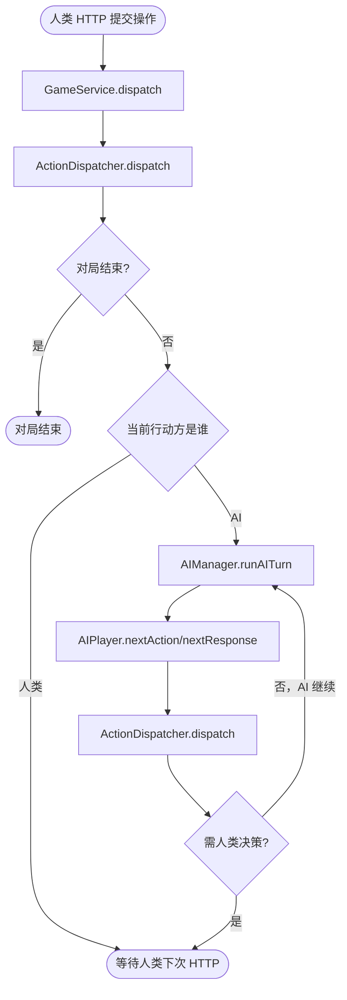
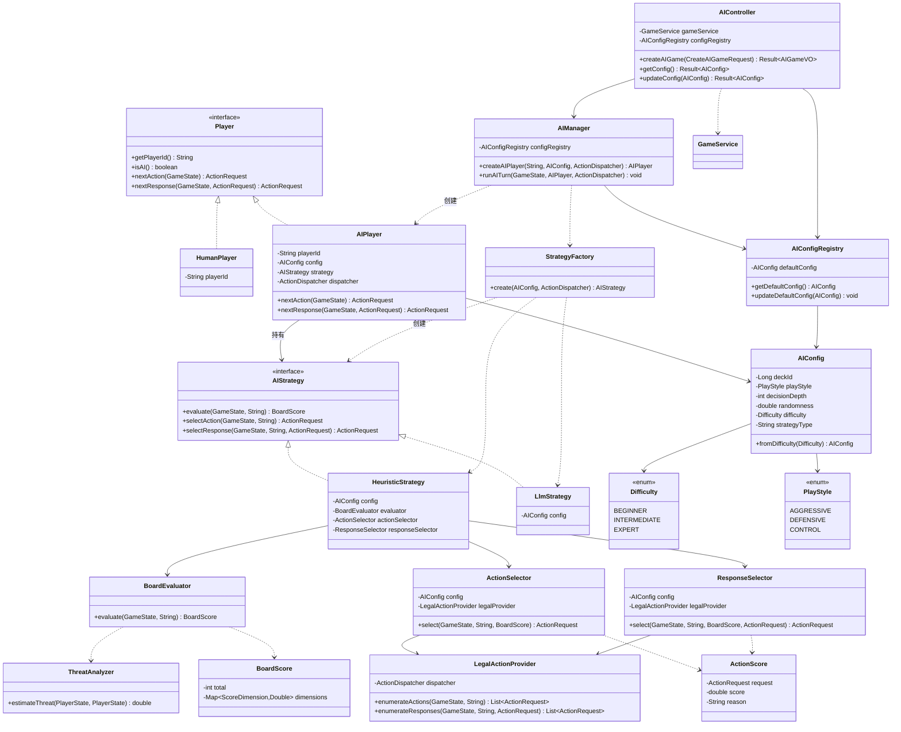
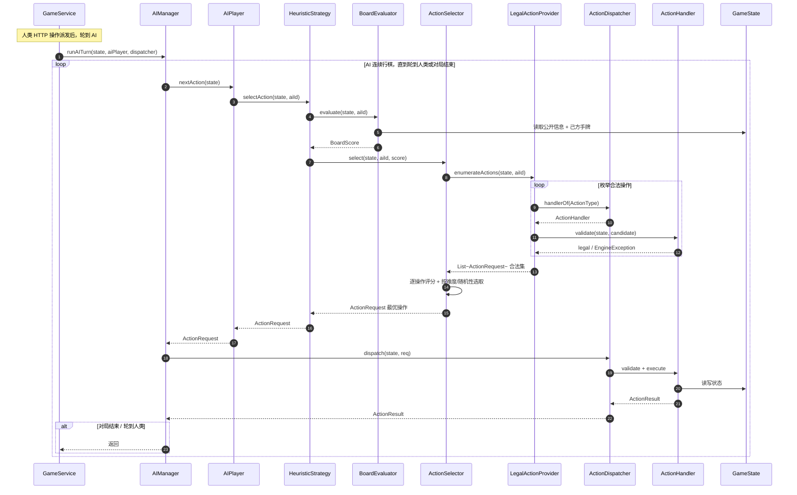
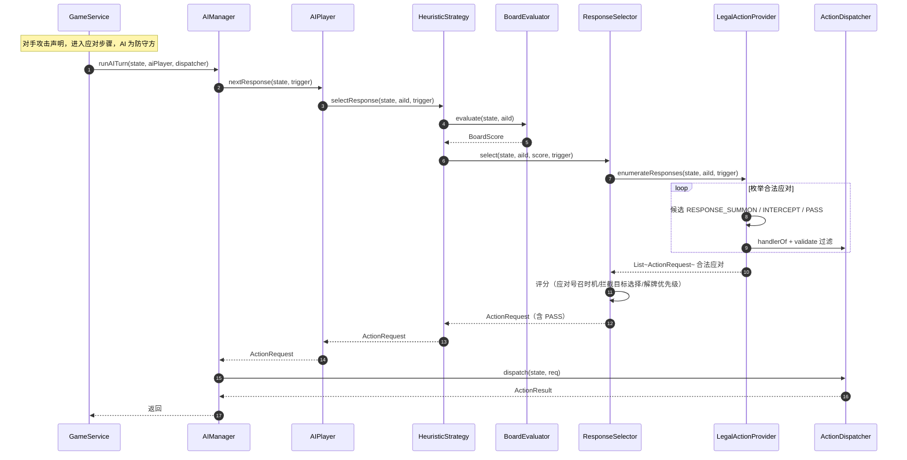
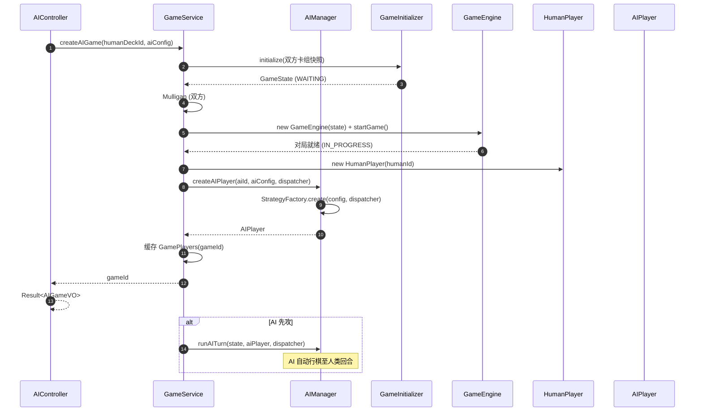

# 详细设计：迭代八 — AI 对战

> 项目：MTCG 后端程序
> 版本：v0.1
> 日期：2026-07-31
> 依据：[需求分析](./01-需求分析.md) FR6.1.1–FR6.1.5、[概要设计](./02-概要设计.md) §2 §5 §6 §9（D3）、[迭代四](./06-详细设计-迭代四-引擎状态模型与回合流程.md)、[迭代五](./07-详细设计-迭代五-引擎行动与战斗.md)
> 前置：迭代七 — 对战 API（FR4.1–FR4.5）、对局管理（FR5.4 / FR5.6）已完成；引擎（状态模型 + 行动 + 战斗 + 效果 + 关键词）完整可用

---

## 1. 概述

### 1.1 迭代目标

在引擎与对战 API 之上，引入 AI 玩家，使其能以"自动决策"替代人类对手完成完整对局。本迭代交付一套**启发式策略 AI**：可量化评估局面、按打牌倾向选择最优操作、在应对步骤做出反应、并支持三档难度与可配置属性。同时为未来引入 LLM（Spring AI）预留策略接口。

### 1.2 范围

| 包含 | 不包含 |
| --- | --- |
| `Player` 玩家接口（人类与 AI 统一抽象） | LLM 策略的具体实现（仅留接口与骨架） |
| `AIPlayer` AI 玩家（策略驱动） | 卡组构筑辅助（FR6.2，未来） |
| `AIStrategy` 策略接口 + `HeuristicStrategy` 启发式实现 | 对局分析与复盘（FR6.3，未来） |
| `LlmStrategy` 预留骨架（Spring AI） | 规则问答（FR6.4，未来） |
| `BoardEvaluator` 局面评估 + `BoardScore` | 自对弈强化学习（远期） |
| `ActionSelector` / `ResponseSelector` 决策选择器 | WebSocket 实时推送 |
| `LegalActionProvider` 合法操作枚举器 | 排位系统中的 AI 填补（迭代九） |
| `Difficulty` / `PlayStyle` / `AIConfig` 配置模型 | |
| `AIManager` Manager 层封装 | |
| `AIController` REST API（创建 AI 对局、查询/设置配置） | |
| AI 与游戏循环的同步自动行棋集成 | |

### 1.3 设计约束

| 约束 | 说明 |
| --- | --- |
| 同进程调用（D3） | AI 代码与引擎在同一 Spring 进程内，直接调用引擎 POJO（`GameEngine` / `ActionDispatcher` / `GameState`），不走 HTTP/RPC，不引入消息中间件 |
| 引擎保持纯 POJO | AI 决策代码位于 `manager` 层（Spring Component），不反向污染 `engine` 包；引擎不知道"对手是 AI" |
| AI 不作弊 | AI 仅读取**公开信息** + **己方手牌**；严禁读取对手手牌内容、卡组顺序、盖卡内容。仅可统计对手手牌张数、卡组剩余张数等公开量 |
| 操作合法优先 | AI 产出的每个 `ActionRequest` 必须能通过 `ActionHandler.validate`；不合法操作由 `LegalActionProvider` 提前过滤，不依赖引擎异常兜底 |
| 决策可观测 | AI 每次决策记录评估分、候选操作、最终选择，写入对局流水，便于调参与复盘 |
| 渐进式 | 启发式策略先行；LLM 策略仅留接口与空实现，待 Spring AI 接入再填实 |

### 1.4 前置依赖

迭代七已交付（本设计引用其产物，不重复定义）：

| 产物 | 说明 |
| --- | --- |
| `GameService` | 对局创建、操作执行、状态查询、持久化的业务编排 |
| `GameController` | `/api/v1/games` 对战 API（FR4.1–FR4.5） |
| `mtcg_game_record` 持久化 | 操作流水 + 回合快照（D2），AI 对局同样落库 |
| 卡组加载 | `GameService` 根据 deckId 加载卡牌快照注入引擎 |

引擎已交付（迭代四/五/六）：

| 产物 | AI 调用方式 |
| --- | --- |
| `GameState` / `PlayerState` / `FieldZone` / `CardInstance` | AI 读取局面 |
| `ActionDispatcher.dispatch(state, ActionRequest)` | AI 提交操作 |
| `ActionHandler.validate(state, request)` | AI 枚举合法操作时复用 |
| `ActionType` / `ActionRequest` / `ActionResult` | AI 装配操作 |
| `PhaseType` / `Zone` / `Keyword` | AI 阶段判断与关键词识别 |

---

## 2. AI 架构设计

### 2.1 包结构

AI 模块位于 `manager` 层，符合概要设计 §2 分层（Controller → Service → Manager → Engine）。

```
com.aris.mtcg.manager.ai
├── player
│   ├── Player                     // 玩家接口（人类与AI统一抽象）
│   ├── HumanPlayer                // 人类玩家适配器（HTTP驱动）
│   └── AIPlayer                   // AI玩家（策略驱动）
├── strategy
│   ├── AIStrategy                 // 策略接口（评估→选择→应对）
│   ├── HeuristicStrategy          // 启发式策略实现（基于规则）
│   ├── LlmStrategy                // LLM策略骨架（预留，Spring AI）
│   └── StrategyFactory            // 策略工厂（按配置创建策略）
├── eval
│   ├── BoardEvaluator             // 局面评估器
│   ├── BoardScore                 // 局面评分（-100~+100）
│   ├── ScoreDimension             // 评分维度枚举
│   └── ThreatAnalyzer             // 威胁分析器
├── selector
│   ├── LegalActionProvider        // 合法操作枚举器
│   ├── ActionSelector             // 主动操作选择器
│   ├── ResponseSelector           // 应对操作选择器
│   └── ActionScore                // 单操作评分
├── config
│   ├── AIConfig                   // AI配置
│   ├── Difficulty                 // 难度枚举
│   ├── PlayStyle                  // 打牌倾向枚举
│   └── AIConfigRegistry           // 默认配置注册表（Spring Bean）
├── log
│   └── AIDecisionLog              // AI决策日志（评估分/候选/选择）
└── AIManager                      // AI管理器（Spring Component）
```

Controller 层：

```
com.aris.mtcg.controller
├── AIController                   // AI对战API（/api/v1/ai/*）
├── dto
│   ├── CreateAIGameRequest        // 创建AI对局请求
│   └── AIConfigVO                 // AI配置视图
└── vo
    └── AIGameVO                   // AI对局返回视图
```

### 2.2 Player 接口 — 人类与 AI 的统一抽象

`Player` 是对"操作来源"的抽象：无论是人类（通过 HTTP 提交）还是 AI（通过策略生成），对引擎而言都是"产生下一个 `ActionRequest`"。引擎层不感知此接口，由 `AIManager` / `GameService` 在 Manager/Service 层驱动。

```java
package com.aris.mtcg.manager.ai.player;

import com.aris.mtcg.engine.action.ActionRequest;
import com.aris.mtcg.engine.model.GameState;

/**
 * 玩家接口。
 * <p>统一人类玩家与 AI 玩家的操作来源：引擎只接收 ActionRequest，
 * 不关心操作是人点的还是 AI 算出来的。
 * <p>引擎层不依赖此接口；由 AIManager / GameService 在上层驱动。
 */
public interface Player {

    /** 玩家 ID（对局内唯一，对应 PlayerState.playerId）。 */
    String getPlayerId();

    /** 是否为 AI。 */
    boolean isAI();

    /**
     * 主动阶段（ACTION / COMBAT）产生下一个操作。
     * <p>AI：由策略计算返回；人类：返回 null 表示等待外部 HTTP 输入，
     * 由 GameService 直接将 HTTP 请求转为 ActionRequest 派发。
     *
     * @param state 当前对局状态
     * @return 下一个操作；返回 null 表示本轮不再自动行动
     */
    ActionRequest nextAction(GameState state);

    /**
     * 应对步骤产生应对操作（RESPONSE_SUMMON / INTERCEPT / PASS）。
     *
     * @param state   当前对局状态
     * @param trigger 触发应对的对方操作（如攻击声明），可空
     * @return 应对操作；返回 null 表示等待外部输入
     */
    ActionRequest nextResponse(GameState state, ActionRequest trigger);
}
```

### 2.3 HumanPlayer — 人类玩家适配器

`HumanPlayer` 是 HTTP 驱动的薄适配器：`nextAction` / `nextResponse` 均返回 `null`，表示"等待人类通过 HTTP 提交"。实际操作由 `GameService` 将 HTTP 请求装配为 `ActionRequest` 直接派发。保留此类是为了接口对称与未来 WebSocket 异步推送（人类操作通过队列投递）。

```java
package com.aris.mtcg.manager.ai.player;

import com.aris.mtcg.engine.action.ActionRequest;
import com.aris.mtcg.engine.model.GameState;

/**
 * 人类玩家适配器。
 * <p>当前 REST 同步模式下不主动产出操作（返回 null），
 * 由 GameService 直接派发 HTTP 请求。
 * <p>未来 WebSocket 模式下可改为阻塞队列消费：HTTP 请求入队，nextAction 出队。
 */
public class HumanPlayer implements Player {

    private final String playerId;

    public HumanPlayer(String playerId) {
        this.playerId = playerId;
    }

    @Override public String getPlayerId() { return playerId; }
    @Override public boolean isAI() { return false; }
    @Override public ActionRequest nextAction(GameState state) { return null; }
    @Override public ActionRequest nextResponse(GameState state, ActionRequest trigger) { return null; }
}
```

### 2.4 AIPlayer — AI 玩家

`AIPlayer` 持有 `AIStrategy` 与配置，在需要行动时调用策略产出 `ActionRequest`。它还持有引擎引用（`ActionDispatcher`），使策略在评估时可复用 `validate` 枚举合法操作（D3 同进程直接调用）。

```java
package com.aris.mtcg.manager.ai.player;

import com.aris.mtcg.engine.action.ActionDispatcher;
import com.aris.mtcg.engine.action.ActionRequest;
import com.aris.mtcg.engine.model.GameState;
import com.aris.mtcg.manager.ai.config.AIConfig;
import com.aris.mtcg.manager.ai.strategy.AIStrategy;

/**
 * AI 玩家。
 * <p>决策由内部 {@link AIStrategy} 完成；与引擎同进程，直接读写 GameState、
 * 复用 ActionDispatcher 派发操作（D3）。
 */
public class AIPlayer implements Player {

    private final String playerId;
    private final AIConfig config;
    private final AIStrategy strategy;
    private final ActionDispatcher dispatcher;

    public AIPlayer(String playerId, AIConfig config, AIStrategy strategy, ActionDispatcher dispatcher) {
        this.playerId = playerId;
        this.config = config;
        this.strategy = strategy;
        this.dispatcher = dispatcher;
    }

    @Override public String getPlayerId() { return playerId; }
    @Override public boolean isAI() { return true; }

    @Override
    public ActionRequest nextAction(GameState state) {
        // 委托策略：评估局面 → 选择最优主动操作
        return strategy.selectAction(state, playerId);
    }

    @Override
    public ActionRequest nextResponse(GameState state, ActionRequest trigger) {
        // 委托策略：评估局面 → 选择应对操作
        return strategy.selectResponse(state, playerId, trigger);
    }

    public AIConfig getConfig() { return config; }
    public AIStrategy getStrategy() { return strategy; }
    ActionDispatcher getDispatcher() { return dispatcher; }
}
```

### 2.5 AIStrategy 接口

策略接口定义 AI 决策的三个核心能力：评估局面、选择主动操作、选择应对操作。不同实现（启发式 / LLM）各有一套评估与选择逻辑。

```java
package com.aris.mtcg.manager.ai.strategy;

import com.aris.mtcg.engine.action.ActionRequest;
import com.aris.mtcg.engine.model.GameState;
import com.aris.mtcg.manager.ai.eval.BoardScore;

/**
 * AI 策略接口。
 * <p>定义 AI 决策的三步：评估局面 → 选择主动操作 / 选择应对操作。
 * 实现：{@link HeuristicStrategy}（规则启发式）、{@link LlmStrategy}（LLM，预留）。
 */
public interface AIStrategy {

    /**
     * 评估当前局面，从 AI 视角量化优劣势。
     *
     * @param state    对局状态
     * @param aiPlayerId AI 玩家 ID
     * @return 局面评分（-100 劣势 ~ +100 优势）
     */
    BoardScore evaluate(GameState state, String aiPlayerId);

    /**
     * 主动阶段选择最优操作（ACTION / COMBAT 阶段）。
     * <p>返回 null 表示不再行动（如宣布 END_PHASE 已由前序操作产出）。
     */
    ActionRequest selectAction(GameState state, String aiPlayerId);

    /**
     * 应对步骤选择应对操作（RESPONSE_SUMMON / INTERCEPT / PASS）。
     */
    ActionRequest selectResponse(GameState state, String aiPlayerId, ActionRequest trigger);
}
```

### 2.6 HeuristicStrategy — 启发式策略

基于规则的启发式实现，组合 `BoardEvaluator` + `ActionSelector` + `ResponseSelector`。是本迭代的主力策略。

```java
package com.aris.mtcg.manager.ai.strategy;

import com.aris.mtcg.engine.action.ActionDispatcher;
import com.aris.mtcg.engine.action.ActionRequest;
import com.aris.mtcg.engine.model.GameState;
import com.aris.mtcg.manager.ai.config.AIConfig;
import com.aris.mtcg.manager.ai.eval.BoardEvaluator;
import com.aris.mtcg.manager.ai.eval.BoardScore;
import com.aris.mtcg.manager.ai.selector.ActionSelector;
import com.aris.mtcg.manager.ai.selector.ResponseSelector;

/**
 * 启发式策略：基于规则的决策。
 * <p>决策流程：
 * <ol>
 *   <li>{@link BoardEvaluator} 量化局面 → BoardScore</li>
 *   <li>{@link ActionSelector} 根据 BoardScore + 合法操作 + 打牌倾向 → 最优主动操作</li>
 *   <li>{@link ResponseSelector} 根据 BoardScore + 对方操作 → 应对操作</li>
 * </ol>
 * 难度通过 {@link AIConfig} 的随机性 / 决策深度影响选择（见 §6）。
 */
public class HeuristicStrategy implements AIStrategy {

    private final AIConfig config;
    private final BoardEvaluator evaluator;
    private final ActionSelector actionSelector;
    private final ResponseSelector responseSelector;

    public HeuristicStrategy(AIConfig config, ActionDispatcher dispatcher) {
        this.config = config;
        this.evaluator = new BoardEvaluator();
        this.actionSelector = new ActionSelector(config, dispatcher);
        this.responseSelector = new ResponseSelector(config, dispatcher);
    }

    @Override
    public BoardScore evaluate(GameState state, String aiPlayerId) {
        return evaluator.evaluate(state, aiPlayerId);
    }

    @Override
    public ActionRequest selectAction(GameState state, String aiPlayerId) {
        BoardScore score = evaluate(state, aiPlayerId);
        return actionSelector.select(state, aiPlayerId, score);
    }

    @Override
    public ActionRequest selectResponse(GameState state, String aiPlayerId, ActionRequest trigger) {
        BoardScore score = evaluate(state, aiPlayerId);
        return responseSelector.select(state, aiPlayerId, score, trigger);
    }
}
```

### 2.7 LlmStrategy — LLM 策略骨架（预留）

为未来 Spring AI 接入预留。当前仅留接口与空实现，构造时抛出"未实现"以防止误用。

```java
package com.aris.mtcg.manager.ai.strategy;

import com.aris.mtcg.engine.action.ActionRequest;
import com.aris.mtcg.engine.model.GameState;
import com.aris.mtcg.manager.ai.config.AIConfig;
import com.aris.mtcg.manager.ai.eval.BoardScore;

/**
 * LLM 策略（预留）。
 * <p>未来通过 Spring AI 将局面描述喂给大模型，由模型产出操作。
 * 当前仅留骨架，调用时抛出 UnsupportedOperationException。
 * <p>演进路线见需求分析 FR6 末尾：先用启发式跑通，再引入 LLM 增强局面理解与决策推理。
 */
public class LlmStrategy implements AIStrategy {

    private final AIConfig config;

    public LlmStrategy(AIConfig config) {
        this.config = config;
        // TODO 接入 Spring AI ChatClient
    }

    @Override
    public BoardScore evaluate(GameState state, String aiPlayerId) {
        throw new UnsupportedOperationException("LlmStrategy 尚未实现，当前迭代使用 HeuristicStrategy");
    }

    @Override
    public ActionRequest selectAction(GameState state, String aiPlayerId) {
        throw new UnsupportedOperationException("LlmStrategy 尚未实现");
    }

    @Override
    public ActionRequest selectResponse(GameState state, String aiPlayerId, ActionRequest trigger) {
        throw new UnsupportedOperationException("LlmStrategy 尚未实现");
    }
}
```

### 2.8 StrategyFactory — 策略工厂

按 `AIConfig` 创建对应策略实例。

```java
package com.aris.mtcg.manager.ai.strategy;

import com.aris.mtcg.engine.action.ActionDispatcher;
import com.aris.mtcg.manager.ai.config.AIConfig;

/**
 * 策略工厂：按配置创建策略。
 */
public final class StrategyFactory {

    private StrategyFactory() {}

    public static AIStrategy create(AIConfig config, ActionDispatcher dispatcher) {
        // 当前迭代仅支持启发式；LLM 由配置项显式开启（预留）
        if ("LLM".equalsIgnoreCase(config.getStrategyType())) {
            return new LlmStrategy(config);
        }
        return new HeuristicStrategy(config, dispatcher);
    }
}
```

### 2.9 AI 与游戏循环的集成

AI 对局采用**同步自动行棋**：人类通过 HTTP 提交一个操作后，`AIManager` 检查后续是否轮到 AI 行动；若是，循环调用 `AIPlayer.nextAction` / `nextResponse` 并派发，直到再次轮到人类、阶段切换需人类决策、或对局结束。



**轮到 AI 行动的判定**：

| 场景 | 行动方 | 处理 |
| --- | --- | --- |
| AI 是 activePlayer，且处于 ACTION / COMBAT 主动阶段 | AI | 循环 `nextAction` |
| 战斗应对步骤，AI 是防守方 | AI | `nextResponse` |
| 应对阶段（RESPONSE），轮到 AI 选 | AI | `nextResponse` |
| AI 是 activePlayer 但阶段需人类先动（如人类是防守方应对） | 人类 | 等待 HTTP |

> **说明**：`AIManager.runAITurn` 内部设有安全上限（如单回合最多 50 次 AI 操作），防止策略死循环导致请求超时。

---

## 3. 局面评估

### 3.1 BoardScore — 局面评分

```java
package com.aris.mtcg.manager.ai.eval;

import java.util.Map;

/**
 * 局面评分。
 * <p>总分范围 -100 ~ +100：正数表示 AI 优势，负数表示劣势，0 为均势。
 * <p>总分 = 各维度加权归一化，便于策略层统一比较与决策树评估。
 */
public class BoardScore {

    /** 总分（-100 ~ +100，正数=AI 优势） */
    private final int total;
    /** 各维度原始得分（key=维度，value=该维度贡献分） */
    private final Map<ScoreDimension, Double> dimensions;

    public BoardScore(int total, Map<ScoreDimension, Double> dimensions) {
        this.total = total;
        this.dimensions = dimensions;
    }

    public int getTotal() { return total; }
    public Map<ScoreDimension, Double> getDimensions() { return dimensions; }

    /** 是否处于优势（total > 20）。 */
    public boolean isWinning() { return total > 20; }
    /** 是否处于劣势（total < -20）。 */
    public boolean isLosing() { return total < -20; }
}
```

### 3.2 ScoreDimension — 评分维度

```java
package com.aris.mtcg.manager.ai.eval;

/**
 * 局面评估维度（FR6.1.1）。
 */
public enum ScoreDimension {
    /** 战力总和对比：己方场上战力 - 对方场上战力 */
    POWER_COMPARISON,
    /** 手牌资源：手牌张数差 + 手牌质量（Lv/效果） */
    HAND_RESOURCE,
    /** 区域控制率：己方战区占用位置数 vs 对方 */
    ZONE_CONTROL,
    /** 威胁等级：对方下一回合可对我方造成的伤害/破绽威胁 */
    THREAT_LEVEL,
    /** 时间线进度：己方冲击卡数 vs 对方，临近 9 张加权 */
    TIMELINE_PROGRESS,
    /** 卡组续航：剩余卡组张数（耗尽风险） */
    DECK_ENDURANCE
}
```

### 3.3 BoardEvaluator — 局面评估器

```java
package com.aris.mtcg.manager.ai.eval;

import com.aris.mtcg.engine.enums.Zone;
import com.aris.mtcg.engine.model.*;

import java.util.EnumMap;
import java.util.Map;

/**
 * 局面评估器。
 * <p>量化当前局面 AI 的优劣势，输出 {@link BoardScore}。
 * <p>评估只读取公开信息 + 己方手牌：
 * <ul>
 *   <li>己方：手牌、场上、时间线、卡组张数、撤退区</li>
 *   <li>对方：场上、时间线、卡组张数、撤退区、手牌张数（不读内容）</li>
 * </ul>
 */
public class BoardEvaluator {

    // 各维度权重（可被 PlayStyle 调整，见 §4.4）
    private static final double W_POWER = 0.30;
    private static final double W_HAND = 0.15;
    private static final double W_ZONE = 0.15;
    private static final double W_THREAT = 0.20;
    private static final double W_TIMELINE = 0.15;
    private static final double W_DECK = 0.05;

    /**
     * 评估局面。
     *
     * @param state      对局状态
     * @param aiPlayerId AI 玩家 ID
     */
    public BoardScore evaluate(GameState state, String aiPlayerId) {
        boolean aiIsActive = state.getActivePlayer().getPlayerId().equals(aiPlayerId);
        PlayerState ai = aiIsActive ? state.getActivePlayer() : state.getInactivePlayer();
        PlayerState opp = aiIsActive ? state.getInactivePlayer() : state.getActivePlayer();

        Map<ScoreDimension, Double> dims = new EnumMap<>(ScoreDimension.class);
        dims.put(ScoreDimension.POWER_COMPARISON, evalPower(ai, opp));
        dims.put(ScoreDimension.HAND_RESOURCE, evalHand(ai, opp));
        dims.put(ScoreDimension.ZONE_CONTROL, evalZoneControl(ai, opp));
        dims.put(ScoreDimension.THREAT_LEVEL, evalThreat(ai, opp));
        dims.put(ScoreDimension.TIMELINE_PROGRESS, evalTimeline(ai, opp));
        dims.put(ScoreDimension.DECK_ENDURANCE, evalDeck(ai, opp));

        // 加权归一化到 -100 ~ +100
        double raw = dims.values().stream().mapToDouble(Double::doubleValue).sum();
        int total = clamp((int) Math.round(raw * 100), -100, 100);
        return new BoardScore(total, dims);
    }

    /** 战力对比：己方场上战力和 - 对方场上战力和，归一化到 [-1, 1]。 */
    private double evalPower(PlayerState ai, PlayerState opp) {
        int aiPower = sumFieldPower(ai);
        int oppPower = sumFieldPower(opp);
        return normalize(aiPower - oppPower, 30);  // 差 30 战力视为满格
    }

    /** 手牌资源：张数差 + 高Lv卡占比。 */
    private double evalHand(PlayerState ai, PlayerState opp) {
        double countDiff = (ai.getHand().size() - opp.getHand().size()) / 9.0;  // 上限 9
        return clamp(countDiff, -1, 1);
    }

    /** 区域控制率：己方战区占用数 / 4 - 对方占用数 / 4。 */
    private double evalZoneControl(PlayerState ai, PlayerState opp) {
        double aiCtrl = countCombatOccupied(ai) / 4.0;
        double oppCtrl = countCombatOccupied(opp) / 4.0;
        return clamp(aiCtrl - oppCtrl, -1, 1);
    }

    /** 威胁等级：对方下一回合可攻击我方破绽/角色的潜力。负值（威胁越高越劣势）。 */
    private double evalThreat(PlayerState ai, PlayerState opp) {
        // 委托 ThreatAnalyzer 量化对方攻击距离内我方目标数
        double threat = ThreatAnalyzer.estimateThreat(opp, ai);
        return -threat;  // 威胁越高，对 AI 越不利
    }

    /** 时间线进度：己方冲击卡数 - 对方，临近 9 张加权。 */
    private double evalTimeline(PlayerState ai, PlayerState opp) {
        int aiT = ai.getTimeline().size();
        int oppT = opp.getTimeline().size();
        // 临近胜利（≥6）加权
        double aiScore = aiT >= 6 ? (aiT - 5) * 0.5 : aiT * 0.05;
        double oppScore = oppT >= 6 ? (oppT - 5) * 0.5 : oppT * 0.05;
        return clamp(aiScore - oppScore, -1, 1);
    }

    /** 卡组续航：剩余卡组张数，低于阈值扣分。 */
    private double evalDeck(PlayerState ai, PlayerState opp) {
        double aiRisk = ai.getDeck().size() < 10 ? (10 - ai.getDeck().size()) / 10.0 : 0;
        double oppRisk = opp.getDeck().size() < 10 ? (10 - opp.getDeck().size()) / 10.0 : 0;
        return clamp(oppRisk - aiRisk, -1, 1);  // 对方续航差 = 我方优势
    }

    // === 工具方法 ===

    private int sumFieldPower(PlayerState p) {
        int sum = 0;
        FieldZone f = p.getField();
        sum += powerOf(f.getVanguard());
        sum += powerOf(f.getFlank()[0]);
        sum += powerOf(f.getFlank()[1]);
        sum += powerOf(f.getRearguard());
        return sum;
    }

    private int powerOf(CardInstance c) {
        return c == null || c.isFaceDown() ? 0 : c.getCurrentPower();
    }

    private int countCombatOccupied(PlayerState p) {
        FieldZone f = p.getField();
        int n = 0;
        if (f.getVanguard() != null) n++;
        if (f.getFlank()[0] != null) n++;
        if (f.getFlank()[1] != null) n++;
        if (f.getRearguard() != null) n++;
        return n;
    }

    private static double normalize(int diff, int scale) {
        return clamp((double) diff / scale, -1, 1);
    }

    private static double clamp(double v, double min, double max) {
        return Math.max(min, Math.min(max, v));
    }

    private static int clamp(int v, int min, int max) {
        return Math.max(min, Math.min(max, v));
    }
}
```

### 3.4 评估维度对照

| 维度 | FR6.1.1 对应 | 计算口径 | 权重 |
| --- | --- | --- | --- |
| POWER_COMPARISON | 战力对比 | 己方场上战力和 − 对方场上战力和（盖卡不计） | 0.30 |
| HAND_RESOURCE | 手牌资源 | 手牌张数差（己方可见内容，对方仅张数） | 0.15 |
| ZONE_CONTROL | 区域控制 | 己方战区占位数 − 对方占位数 | 0.15 |
| THREAT_LEVEL | 威胁判断 | 对方下回合可攻击到的我方目标数 + 破绽暴露度 | 0.20 |
| TIMELINE_PROGRESS | （综合） | 己方时间线数 − 对方，≥6 时加权 | 0.15 |
| DECK_ENDURANCE | （综合） | 剩余卡组张数，<10 张续航风险 | 0.05 |

> **公平性约束**：`evalHand` 中对方手牌**仅计张数**，不读取 `CardInstance` 内容；`evalThreat` 中对方盖卡按"未知角色"处理，仅按位置占位估算距离威胁。

### 3.5 ThreatAnalyzer — 威胁分析

```java
package com.aris.mtcg.manager.ai.eval;

import com.aris.mtcg.engine.combat.DistanceCalculator;
import com.aris.mtcg.engine.enums.Zone;
import com.aris.mtcg.engine.model.*;

/**
 * 威胁分析器。
 * <p>量化对方下一回合可对我方造成的威胁：
 * <ul>
 *   <li>对方场上角色在我方战区的攻击距离内可命中的我方角色数</li>
 *   <li>我方暴露的破绽（空置战区位置）数量</li>
 *   <li>对方具备强袭/空袭/连击等关键词的威胁加权</li>
 * </ul>
 * 返回 [0, 1]，0 无威胁，1 极高威胁。
 */
public final class ThreatAnalyzer {

    private ThreatAnalyzer() {}

    public static double estimateThreat(PlayerState attacker, PlayerState defender) {
        FieldZone atkField = attacker.getField();
        FieldZone defField = defender.getField();

        int reachableTargets = 0;
        int vulnerabilities = countVulnerabilities(defField);

        // 遍历攻击方战区角色，统计可命中的防守方目标
        reachableTargets += countReachable(atkField.getVanguard(), Zone.VANGUARD, defField);
        reachableTargets += countReachable(atkField.getFlank()[0], Zone.FLANK_LEFT, defField);
        reachableTargets += countReachable(atkField.getFlank()[1], Zone.FLANK_RIGHT, defField);
        reachableTargets += countReachable(atkField.getRearguard(), Zone.REARGUARD, defField);

        // 破绽威胁：每个空置战区位置都可被攻击冲击卡
        double vulnScore = vulnerabilities * 0.15;
        double targetScore = reachableTargets * 0.10;
        return Math.min(1.0, vulnScore + targetScore);
    }

    private static int countReachable(CardInstance attacker, Zone attackerZone, FieldZone defField) {
        if (attacker == null || attacker.isFaceDown() || attacker.getCurrentRange() <= 0) {
            return 0;
        }
        int count = 0;
        // 可命中的敌方角色
        if (canReach(attacker, attackerZone, Zone.VANGUARD) && defField.getVanguard() != null) count++;
        if (canReach(attacker, attackerZone, Zone.FLANK_LEFT) && defField.getFlank()[0] != null) count++;
        if (canReach(attacker, attackerZone, Zone.FLANK_RIGHT) && defField.getFlank()[1] != null) count++;
        if (canReach(attacker, attackerZone, Zone.REARGUARD) && defField.getRearguard() != null) count++;
        return count;
    }

    private static boolean canReach(CardInstance attacker, Zone from, Zone to) {
        return DistanceCalculator.canReach(attacker, to) && from.isCombatZone();
    }

    private static int countVulnerabilities(FieldZone f) {
        int n = 0;
        if (f.getVanguard() == null) n++;
        if (f.getFlank()[0] == null) n++;
        if (f.getFlank()[1] == null) n++;
        if (f.getRearguard() == null) n++;
        return n;
    }
}
```

---

## 4. 策略决策

### 4.1 LegalActionProvider — 合法操作枚举器

策略选择的前提是枚举当前阶段所有合法操作。`LegalActionProvider` 复用引擎 `ActionHandler.validate` 进行过滤，避免在 AI 侧重复规则逻辑（NFR5 规则可追溯）。

```java
package com.aris.mtcg.manager.ai.selector;

import com.aris.mtcg.engine.action.ActionDispatcher;
import com.aris.mtcg.engine.action.ActionHandler;
import com.aris.mtcg.engine.action.ActionRequest;
import com.aris.mtcg.engine.action.ActionType;
import com.aris.mtcg.engine.action.EngineException;
import com.aris.mtcg.engine.enums.PhaseType;
import com.aris.mtcg.engine.enums.Zone;
import com.aris.mtcg.engine.model.*;

import java.util.ArrayList;
import java.util.List;

/**
 * 合法操作枚举器。
 * <p>针对当前阶段，枚举 AI 可执行的全部合法 ActionRequest。
 * <p>实现方式：按 ActionType 生成候选请求 → 调用 handler.validate 过滤 → 收集合法集。
 * 避免在 AI 侧重复规则判定，统一走引擎校验（NFR5）。
 */
public class LegalActionProvider {

    private final ActionDispatcher dispatcher;

    public LegalActionProvider(ActionDispatcher dispatcher) {
        this.dispatcher = dispatcher;
    }

    /**
     * 枚举当前阶段 AI 的合法主动操作。
     */
    public List<ActionRequest> enumerateActions(GameState state, String aiPlayerId) {
        List<ActionRequest> legal = new ArrayList<>();
        PhaseType phase = state.getCurrentPhase();

        if (phase == PhaseType.ACTION) {
            addSummonCandidates(state, aiPlayerId, legal);
            addBaseDeployCandidates(state, aiPlayerId, legal);
            addCombatBaseMoveCandidates(state, aiPlayerId, legal);
            addActivateEffectCandidates(state, aiPlayerId, legal);
            legal.add(build(aiPlayerId, ActionType.END_PHASE));  // 宣布结束始终合法
        } else if (phase == PhaseType.COMBAT) {
            addAttackCandidates(state, aiPlayerId, legal);
            addCombatAdjustCandidates(state, aiPlayerId, legal);
            legal.add(build(aiPlayerId, ActionType.END_PHASE));
        }
        return legal;
    }

    /**
     * 枚举应对步骤的合法应对操作（RESPONSE_SUMMON / INTERCEPT / PASS）。
     */
    public List<ActionRequest> enumerateResponses(GameState state, String aiPlayerId, ActionRequest trigger) {
        List<ActionRequest> legal = new ArrayList<>();
        addResponseSummonCandidates(state, aiPlayerId, legal);
        addInterceptCandidates(state, aiPlayerId, legal);
        legal.add(build(aiPlayerId, ActionType.PASS));  // 不行动始终合法
        return legal;
    }

    // === 候选生成（示例：号召）===

    private void addSummonCandidates(GameState state, String aiPlayerId, List<ActionRequest> out) {
        PlayerState ai = playerOf(state, aiPlayerId);
        for (CardInstance card : ai.getHand()) {
            if (card.getSnapshot().getCardType() == null
                    || !card.getSnapshot().getCardType().equals("CHARACTER")) {
                continue;
            }
            // 候选目标：4 个战区空位 + 基地区空位
            tryTarget(state, aiPlayerId, ActionType.SUMMON, card, Zone.VANGUARD, 0, out);
            tryTarget(state, aiPlayerId, ActionType.SUMMON, card, Zone.FLANK_LEFT, 0, out);
            tryTarget(state, aiPlayerId, ActionType.SUMMON, card, Zone.FLANK_RIGHT, 0, out);
            tryTarget(state, aiPlayerId, ActionType.SUMMON, card, Zone.REARGUARD, 0, out);
            tryTarget(state, aiPlayerId, ActionType.SUMMON, card, Zone.BASE, 0, out);
        }
    }

    /** 装配候选请求并校验合法性，合法则加入结果。 */
    private void tryTarget(GameState state, String pid, ActionType type, CardInstance card,
                           Zone targetZone, int targetIndex, List<ActionRequest> out) {
        ActionRequest req = new ActionRequest();
        req.setGameId(state.getGameId());
        req.setPlayerId(pid);
        req.setType(type);
        req.setCardCode(card.getSnapshot().getCardCode());
        req.setTargetZone(targetZone);
        req.setTargetIndex(targetIndex);
        if (isLegal(state, req)) {
            out.add(req);
        }
    }

    /** 复用引擎 validate：不抛异常即合法。 */
    private boolean isLegal(GameState state, ActionRequest req) {
        try {
            ActionHandler handler = dispatcher.handlerOf(req.getType());
            if (handler == null) return false;
            handler.validate(state, req);
            return true;
        } catch (EngineException e) {
            return false;
        }
    }

    private ActionRequest build(String pid, ActionType type) {
        ActionRequest req = new ActionRequest();
        req.setPlayerId(pid);
        req.setType(type);
        return req;
    }

    // 其他候选生成方法（基地部署/移动/启动/攻击/调整/应对号召/拦截）实现类似，
    // 按 ActionType 遍历己方资源 × 目标位置，逐一 validate 过滤。
    private void addBaseDeployCandidates(GameState s, String p, List<ActionRequest> o) {}
    private void addCombatBaseMoveCandidates(GameState s, String p, List<ActionRequest> o) {}
    private void addActivateEffectCandidates(GameState s, String p, List<ActionRequest> o) {}
    private void addAttackCandidates(GameState s, String p, List<ActionRequest> o) {}
    private void addCombatAdjustCandidates(GameState s, String p, List<ActionRequest> o) {}
    private void addResponseSummonCandidates(GameState s, String p, List<ActionRequest> o) {}
    private void addInterceptCandidates(GameState s, String p, List<ActionRequest> o) {}

    private PlayerState playerOf(GameState state, String pid) {
        return state.getActivePlayer().getPlayerId().equals(pid)
                ? state.getActivePlayer() : state.getInactivePlayer();
    }
}
```

> **性能说明**：合法操作枚举最坏情况约 O(手牌数 × 目标位置数 × ActionType 数)，对典型局面（手牌 ≤9、目标 ≤6、类型 ≤16）约数百次 `validate`，单次决策耗时可控在毫秒级。如需优化可加缓存，当前迭代不做。

> **前置假设**：`ActionDispatcher` 提供 `handlerOf(ActionType)` 暴露注册的 Handler 供 AI 复用 `validate`。若迭代七未暴露此方法，需在 `ActionDispatcher` 补一个只读访问器（不改变分发语义）。

### 4.2 ActionScore — 单操作评分

```java
package com.aris.mtcg.manager.ai.selector;

import com.aris.mtcg.engine.action.ActionRequest;

/**
 * 单个候选操作评分。
 */
public class ActionScore {

    private final ActionRequest request;
    private final double score;          // 综合得分
    private final String reason;         // 评分理由（决策日志用）

    public ActionScore(ActionRequest request, double score, String reason) {
        this.request = request;
        this.score = score;
        this.reason = reason;
    }

    public ActionRequest getRequest() { return request; }
    public double getScore() { return score; }
    public String getReason() { return reason; }
}
```

### 4.3 ActionSelector — 主动操作选择器

决策树：枚举合法操作 → 评估每个操作得分 → 按难度/随机性选最优。

```java
package com.aris.mtcg.manager.ai.selector;

import com.aris.mtcg.engine.action.ActionDispatcher;
import com.aris.mtcg.engine.action.ActionRequest;
import com.aris.mtcg.engine.action.ActionType;
import com.aris.mtcg.engine.enums.PhaseType;
import com.aris.mtcg.engine.model.GameState;
import com.aris.mtcg.manager.ai.config.AIConfig;
import com.aris.mtcg.manager.ai.config.PlayStyle;
import com.aris.mtcg.manager.ai.eval.BoardScore;

import java.util.Comparator;
import java.util.List;
import java.util.concurrent.ThreadLocalRandom;

/**
 * 主动操作选择器。
 * <p>决策树：合法操作枚举 → 逐个评分 → 按难度与随机性选取。
 * <p>评分受 {@link PlayStyle} 影响：不同倾向对各 ActionType 赋不同权重。
 */
public class ActionSelector {

    private final AIConfig config;
    private final LegalActionProvider legalProvider;

    public ActionSelector(AIConfig config, ActionDispatcher dispatcher) {
        this.config = config;
        this.legalProvider = new LegalActionProvider(dispatcher);
    }

    /**
     * 选择最优主动操作。
     *
     * @return 最优操作；若无可选（如阶段无合法操作）返回 END_PHASE
     */
    public ActionRequest select(GameState state, String aiPlayerId, BoardScore score) {
        List<ActionRequest> candidates = legalProvider.enumerateActions(state, aiPlayerId);
        if (candidates.isEmpty()) {
            return buildEndPhase(aiPlayerId, state.getGameId());
        }

        // 1. 逐个评分
        List<ActionScore> scored = candidates.stream()
                .map(req -> scoreAction(req, state, score))
                .sorted(Comparator.comparingDouble(ActionScore::getScore).reversed())
                .toList();

        // 2. 按难度+随机性选取
        return pickByDifficulty(scored);
    }

    /** 单操作评分 = 基础分 + PlayStyle 权重 + 局面修正。 */
    private ActionScore scoreAction(ActionRequest req, GameState state, BoardScore boardScore) {
        double base = baseScore(req.getType());
        double styleBonus = styleWeight(req.getType(), config.getPlayStyle());
        double boardAdjust = boardAdjustment(req, state, boardScore);

        double total = base + styleBonus + boardAdjust;
        return new ActionScore(req, total, describe(req, base, styleBonus, boardAdjust));
    }

    /** 基础分：不同操作类型的固有价值。 */
    private double baseScore(ActionType type) {
        return switch (type) {
            case ATTACK -> 50;            // 攻击是推进时间线/解场的主要手段
            case SUMMON -> 40;            // 号召扩展场面
            case ACTIVATE_EFFECT -> 35;   // 启动效果
            case COMBAT_ADJUST -> 25;     // 调整位置优化攻击/防守
            case COMBAT_BASE_MOVE -> 20;  // 战基移动
            case BASE_DEPLOY -> 15;       // 基地部署（资源积累）
            case END_PHASE -> 5;          // 宣布结束最低
            default -> 10;
        };
    }

    /** 打牌倾向权重：AGGRESSIVE/DEFENSIVE/CONTROL 对各操作加权不同。 */
    private double styleWeight(ActionType type, PlayStyle style) {
        if (style == null) return 0;
        return switch (style) {
            case AGGRESSIVE -> switch (type) {
                case ATTACK, SUMMON, COMBAT_ADJUST -> 15;
                case BASE_DEPLOY, COMBAT_BASE_MOVE -> -5;
                default -> 0;
            };
            case DEFENSIVE -> switch (type) {
                case BASE_DEPLOY, COMBAT_BASE_MOVE, ACTIVATE_EFFECT -> 15;
                case ATTACK -> -5;
                default -> 0;
            };
            case CONTROL -> switch (type) {
                case ACTIVATE_EFFECT, COMBAT_ADJUST, COMBAT_BASE_MOVE -> 15;
                case BASE_DEPLOY -> 5;
                default -> 0;
            };
        };
    }

    /** 局面修正：根据 BoardScore 调整。劣势时偏防守，优势时偏进攻。 */
    private double boardAdjustment(ActionRequest req, GameState state, BoardScore score) {
        if (score.isLosing() && req.getType() == ActionType.ATTACK) {
            return -15;  // 劣势时盲目攻击扣分
        }
        if (score.isWinning() && req.getType() == ActionType.BASE_DEPLOY) {
            return -10;  // 优势时不再保守铺基地
        }
        return 0;
    }

    /** 按难度与随机性从已排序候选中选取。 */
    private ActionRequest pickByDifficulty(List<ActionScore> scored) {
        double randomness = config.getRandomness();  // 0~1
        int depth = config.getDecisionDepth();

        // 决策深度：只考虑前 N 个候选
        int consider = Math.min(depth, scored.size());
        List<ActionScore> pool = scored.subList(0, consider);

        // 随机性：以 randomness 概率从 pool 随机选，否则选最优
        if (randomness > 0 && ThreadLocalRandom.current().nextDouble() < randomness) {
            return pool.get(ThreadLocalRandom.current().nextInt(pool.size())).getRequest();
        }
        return pool.get(0).getRequest();
    }

    private ActionRequest buildEndPhase(String pid, String gameId) {
        ActionRequest req = new ActionRequest();
        req.setGameId(gameId);
        req.setPlayerId(pid);
        req.setType(ActionType.END_PHASE);
        return req;
    }

    private String describe(ActionRequest req, double base, double style, double board) {
        return req.getType() + " base=" + base + " style=" + style + " board=" + board;
    }
}
```

### 4.4 决策树与各阶段决策

```
当前阶段合法操作列表（LegalActionProvider）
        │
        ▼
逐操作评分（ActionSelector.scoreAction）
  = 基础分(baseScore) + 倾向权重(styleWeight) + 局面修正(boardAdjustment)
        │
        ▼
按决策深度取前 N 候选 → 按随机性选最终操作（pickByDifficulty）
```

| 阶段 | 决策重点 | 主要候选 ActionType |
| --- | --- | --- |
| ACTION | 资源调度：号召铺场 / 基地部署 / 战基移动 / 启动效果 | SUMMON、BASE_DEPLOY、COMBAT_BASE_MOVE、ACTIVATE_EFFECT、END_PHASE |
| COMBAT（攻击方） | 攻击目标选择 / 调整位置优化攻击 | ATTACK、COMBAT_ADJUST、END_PHASE |

### 4.5 打牌倾向权重对照

| ActionType | AGGRESSIVE | DEFENSIVE | CONTROL |
| --- | --- | --- | --- |
| ATTACK | +15 | -5 | 0 |
| SUMMON | +15 | 0 | 0 |
| COMBAT_ADJUST | +15 | 0 | +15 |
| COMBAT_BASE_MOVE | -5 | +15 | +15 |
| BASE_DEPLOY | -5 | +15 | +5 |
| ACTIVATE_EFFECT | 0 | +15 | +15 |
| END_PHASE | 0 | 0 | 0 |

> **决策深度**：`decisionDepth` 控制只考虑评分前 N 个候选。`BEGINNER` 取较大 N（视野浅、可选次优），`EXPERT` 取 N=1（只选最优）。

---

## 5. 应对策略

### 5.1 ResponseSelector — 应对操作选择器

面对对手操作（攻击声明 / 应对阶段）时，AI 需决定：是否应对号召、是否拦截、解牌优先级如何。`ResponseSelector` 在 `CombatResponseHandler` 的应对步骤与 `RESPONSE` 阶段被调用。

```java
package com.aris.mtcg.manager.ai.selector;

import com.aris.mtcg.engine.action.ActionDispatcher;
import com.aris.mtcg.engine.action.ActionRequest;
import com.aris.mtcg.engine.action.ActionType;
import com.aris.mtcg.engine.model.GameState;
import com.aris.mtcg.manager.ai.config.AIConfig;
import com.aris.mtcg.manager.ai.eval.BoardScore;

import java.util.Comparator;
import java.util.List;

/**
 * 应对操作选择器（FR6.1.3）。
 * <p>面对对手操作时决策：
 * <ul>
 *   <li>应对号召时机：是否用手中【应对】关键词卡响应号召</li>
 *   <li>拦截目标选择：多张可拦截卡中选哪张拦截</li>
 *   <li>解牌优先级：面对威胁时优先解哪些牌</li>
 * </ul>
 */
public class ResponseSelector {

    private final AIConfig config;
    private final LegalActionProvider legalProvider;

    public ResponseSelector(AIConfig config, ActionDispatcher dispatcher) {
        this.config = config;
        this.legalProvider = new LegalActionProvider(dispatcher);
    }

    /**
     * 选择应对操作。
     *
     * @param trigger 触发应对的对方操作（攻击声明等），可空
     */
    public ActionRequest select(GameState state, String aiPlayerId, BoardScore score, ActionRequest trigger) {
        List<ActionRequest> candidates = legalProvider.enumerateResponses(state, aiPlayerId, trigger);
        if (candidates.isEmpty()) {
            return buildPass(aiPlayerId, state.getGameId());
        }

        // 评分：应对号召 / 拦截 / 不行动
        List<ActionScore> scored = candidates.stream()
                .map(req -> scoreResponse(req, state, score, trigger))
                .sorted(Comparator.comparingDouble(ActionScore::getScore).reversed())
                .toList();

        // 劣势且威胁高时倾向应对；优势时可 PASS 保留资源
        return scored.get(0).getRequest();
    }

    /** 应对操作评分。 */
    private ActionScore scoreResponse(ActionRequest req, GameState state, BoardScore score, ActionRequest trigger) {
        double base = switch (req.getType()) {
            case RESPONSE_SUMMON -> scoreResponseSummon(req, state, score, trigger);
            case INTERCEPT -> scoreIntercept(req, state, score, trigger);
            case PASS -> scorePass(state, score, trigger);
            default -> 0;
        };
        return new ActionScore(req, base, req.getType() + "=" + base);
    }

    // === 应对号召时机判断 ===

    /**
     * 应对号召评分（FR6.1.3 应对号召时机）。
     * <p>触发时机：对手攻击我方破绽或关键角色时，用手中【应对】关键词卡号召入场拦截。
     * <p>评分要素：
     * <ul>
     *   <li>被攻击目标价值（关键角色 / 破绽暴露度）</li>
     *   <li>手中应对卡号召后的战力能否击败攻击者</li>
     *   <li>号召成本（Lv4+ 需撤退的代价）</li>
     * </ul>
     */
    private double scoreResponseSummon(ActionRequest req, GameState state, BoardScore score, ActionRequest trigger) {
        if (trigger == null || trigger.getType() != ActionType.ATTACK) {
            return 10;  // 非攻击触发，保留应对号召权
        }
        // 被攻击目标价值越高、应对卡越能解场，评分越高
        double targetValue = estimateTargetValue(state, trigger);
        double canResolve = estimateResolvePower(req, state, trigger);
        double cost = estimateSummonCost(req, state);
        return targetValue + canResolve - cost;
    }

    // === 拦截目标选择 ===

    /**
     * 拦截评分（FR6.1.3 拦截目标选择）。
     * <p>当对手攻击我方角色时，可启动【拦截】关键词改攻击目标为此卡。
     * <p>评分要素：
     * <ul>
     *   <li>拦截卡战力 vs 攻击者战力：能战胜则高分（反杀）</li>
     *   <li>原被攻击目标的价值：保护关键角色</li>
     *   <li>拦截卡本身的价值：低价值卡拦截高价值目标更划算</li>
     * </ul>
     */
    private double scoreIntercept(ActionRequest req, GameState state, BoardScore score, ActionRequest trigger) {
        if (trigger == null || trigger.getType() != ActionType.ATTACK) {
            return 5;
        }
        double protectValue = estimateTargetValue(state, trigger);
        double interceptSurvival = estimateInterceptSurvival(req, state, trigger);
        double selfValue = estimateSelfValue(req, state);
        return protectValue + interceptSurvival - selfValue;
    }

    // === 不行动评分 ===

    /**
     * 不行动评分：优势/无威胁时保留资源，劣势高威胁时低分。
     */
    private double scorePass(GameState state, BoardScore score, ActionRequest trigger) {
        if (score.isWinning()) return 30;   // 优势保留资源
        if (score.isLosing()) return 5;     // 劣势应尽量应对
        return 20;                          // 均势倾向保留
    }

    // === 估值工具方法（简化实现，可按卡牌价值表细化）===

    private double estimateTargetValue(GameState state, ActionRequest trigger) {
        // 被攻击目标的战力/关键词价值；破绽被攻则按时间线威胁计
        return 20;  // 简化：固定估值
    }

    private double estimateResolvePower(ActionRequest req, GameState state, ActionRequest trigger) {
        // 应对卡号召后战力 vs 攻击者战力
        return 15;
    }

    private double estimateSummonCost(ActionRequest req, GameState state) {
        // Lv4+ 撤退代价
        return 5;
    }

    private double estimateInterceptSurvival(ActionRequest req, GameState state, ActionRequest trigger) {
        // 拦截卡能否战胜攻击者
        return 10;
    }

    private double estimateSelfValue(ActionRequest req, GameState state) {
        // 拦截卡自身价值（损失代价）
        return 8;
    }

    private ActionRequest buildPass(String pid, String gameId) {
        ActionRequest req = new ActionRequest();
        req.setGameId(gameId);
        req.setPlayerId(pid);
        req.setType(ActionType.PASS);
        return req;
    }
}
```

### 5.2 应对决策对照

| 应对场景 | FR6.1.3 对应 | 评分要素 | 倾向 |
| --- | --- | --- | --- |
| 对手攻击我方破绽 | 应对号召时机 | 破绽暴露度 + 应对卡能否反杀 + 号召成本 | 高威胁时应对号召 |
| 对手攻击我方角色 | 拦截目标选择 | 保护目标价值 + 拦截卡生存率 − 拦截卡自身价值 | 多张可拦截时选反杀概率最高者 |
| 对手铺出威胁角色 | 解牌优先级 | 威胁角色战力/关键词 + 我方解牌可用性 | 优先解高威胁（连击/强袭/高战力） |
| 无威胁/优势局面 | （综合） | 保留资源 | 倾向 PASS |

### 5.3 解牌优先级

`ResponseSelector` 在评估应对时对"威胁角色"按以下优先级排序，决定是否动用解牌（启动效果/应对号召）：

| 优先级 | 威胁类型 | 理由 |
| --- | --- | --- |
| P0 | 具备【连击】且战力 > 我方全场 | 一回合可造成两次伤害 |
| P1 | 具备【强袭】且可达我方破绽 | 战胜即推时间线 |
| P2 | 战力 ≥ 我方场上最高战力 | 难以正面对换 |
| P3 | 具备【空袭】 | 可无视我方角色攻破绽 |
| P4 | 普通高战力角色 | 常规威胁 |

---

## 6. 难度分级与配置

### 6.1 Difficulty — 难度枚举

```java
package com.aris.mtcg.manager.ai.config;

/**
 * AI 难度枚举（FR6.1.4）。
 * <p>不同难度通过默认的随机性与决策深度配置 AI 行为：
 * <ul>
 *   <li>BEGINNER：高随机性、决策浅，常出次优甚至随机操作</li>
 *   <li>INTERMEDIATE：中等随机性、中等深度</li>
 *   <li>EXPERT：低随机性、决策深，几乎始终选最优</li>
 * </ul>
 */
public enum Difficulty {

    /** 新手：随机性 0.5，决策深度 4（前 4 候选随机选） */
    BEGINNER(0.5, 4, "新手"),
    /** 进阶：随机性 0.2，决策深度 2 */
    INTERMEDIATE(0.2, 2, "进阶"),
    /** Expert：随机性 0.02，决策深度 1（只选最优） */
    EXPERT(0.02, 1, "Expert");

    private final double defaultRandomness;
    private final int defaultDecisionDepth;
    private final String label;

    Difficulty(double defaultRandomness, int defaultDecisionDepth, String label) {
        this.defaultRandomness = defaultRandomness;
        this.defaultDecisionDepth = defaultDecisionDepth;
        this.label = label;
    }

    public double getDefaultRandomness() { return defaultRandomness; }
    public int getDefaultDecisionDepth() { return defaultDecisionDepth; }
    public String getLabel() { return label; }
}
```

### 6.2 PlayStyle — 打牌倾向枚举

```java
package com.aris.mtcg.manager.ai.config;

/**
 * AI 打牌倾向枚举（FR6.1.5）。
 * <p>影响 {@link com.aris.mtcg.manager.ai.selector.ActionSelector} 对各操作的权重。
 */
public enum PlayStyle {
    /** 激进：偏好攻击/号召铺场，尽快推进时间线 */
    AGGRESSIVE("激进"),
    /** 防守：偏好基地部署/战基移动/启动效果，稳健积累 */
    DEFENSIVE("防守"),
    /** 控制：偏好启动效果/调整位置，通过解场与位置控制局面 */
    CONTROL("控制");

    private final String label;

    PlayStyle(String label) { this.label = label; }
    public String getLabel() { return label; }
}
```

### 6.3 AIConfig — AI 配置

```java
package com.aris.mtcg.manager.ai.config;

/**
 * AI 配置（FR6.1.5）。
 * <p>可量化配置 AI 玩家属性：卡组、打牌倾向、决策深度、操作随机性、难度、策略类型。
 */
public class AIConfig {

    /** AI 使用的卡组 ID（FR6.1.5 指定卡组） */
    private Long deckId;
    /** 打牌倾向（FR6.1.5） */
    private PlayStyle playStyle = PlayStyle.AGGRESSIVE;
    /** 决策深度：只考虑评分前 N 个候选（FR6.1.5） */
    private int decisionDepth = 2;
    /** 操作随机性 0~1：0=始终最优，1=完全随机（FR6.1.5） */
    private double randomness = 0.2;
    /** 难度（FR6.1.4） */
    private Difficulty difficulty = Difficulty.INTERMEDIATE;
    /** 策略类型：HEURISTIC（默认）/ LLM（预留） */
    private String strategyType = "HEURISTIC";

    public AIConfig() {}

    /** 按难度填充默认值（未显式指定的字段继承难度默认值）。 */
    public static AIConfig fromDifficulty(Difficulty difficulty) {
        AIConfig c = new AIConfig();
        c.difficulty = difficulty;
        c.randomness = difficulty.getDefaultRandomness();
        c.decisionDepth = difficulty.getDefaultDecisionDepth();
        return c;
    }

    // getter / setter 省略
    public Long getDeckId() { return deckId; }
    public void setDeckId(Long deckId) { this.deckId = deckId; }
    public PlayStyle getPlayStyle() { return playStyle; }
    public void setPlayStyle(PlayStyle playStyle) { this.playStyle = playStyle; }
    public int getDecisionDepth() { return decisionDepth; }
    public void setDecisionDepth(int decisionDepth) { this.decisionDepth = decisionDepth; }
    public double getRandomness() { return randomness; }
    public void setRandomness(double randomness) { this.randomness = randomness; }
    public Difficulty getDifficulty() { return difficulty; }
    public void setDifficulty(Difficulty difficulty) { this.difficulty = difficulty; }
    public String getStrategyType() { return strategyType; }
    public void setStrategyType(String strategyType) { this.strategyType = strategyType; }
}
```

### 6.4 难度对决策的影响

| 难度 | randomness | decisionDepth | 行为表现 |
| --- | --- | --- | --- |
| BEGINNER | 0.5 | 4 | 50% 概率从前 4 候选随机选，常出次优/意外操作 |
| INTERMEDIATE | 0.2 | 2 | 20% 概率从前 2 候选随机选，多数情况选次优或最优 |
| EXPERT | 0.02 | 1 | 几乎始终选评分最高操作，仅 2% 概率引入微小扰动 |

> **决策深度与随机性的关系**：`decisionDepth` 决定候选池大小（前 N），`randomness` 决定从池中随机选的概率。EXPERT 深度=1 时池中仅最优，随机性几乎无效；BEGINNER 深度=4 + 随机性=0.5 时行为最不可预测。

### 6.5 AIConfigRegistry — 默认配置注册表

`AIConfigRegistry` 是 Spring Bean，持有全局默认 AI 配置，支撑 `GET/PUT /ai/config`。默认值来源于 `application.yml`，运行时可被覆盖；创建对局时可传入 `AIConfig` 覆盖默认值。

```java
package com.aris.mtcg.manager.ai.config;

import org.springframework.stereotype.Component;

/**
 * AI 默认配置注册表。
 * <p>持有全局默认配置，供 GET/PUT /ai/config 使用。
 * 默认值从 application.yml 读取，运行时可覆盖。
 */
@Component
public class AIConfigRegistry {

    private volatile AIConfig defaultConfig;

    public AIConfigRegistry() {
        // 初始化默认配置（实际从 yml 注入）
        this.defaultConfig = AIConfig.fromDifficulty(Difficulty.INTERMEDIATE);
    }

    /** 获取默认配置（返回拷贝，防止外部直接修改）。 */
    public AIConfig getDefaultConfig() {
        AIConfig copy = new AIConfig();
        copy.setDeckId(defaultConfig.getDeckId());
        copy.setPlayStyle(defaultConfig.getPlayStyle());
        copy.setDecisionDepth(defaultConfig.getDecisionDepth());
        copy.setRandomness(defaultConfig.getRandomness());
        copy.setDifficulty(defaultConfig.getDifficulty());
        copy.setStrategyType(defaultConfig.getStrategyType());
        return copy;
    }

    /** 更新默认配置。 */
    public void updateDefaultConfig(AIConfig newConfig) {
        this.defaultConfig = newConfig;
    }
}
```

`application.yml` 追加：

```yaml
mtcg:
  ai:
    default-difficulty: INTERMEDIATE
    default-play-style: AGGRESSIVE
    default-randomness: 0.2
    default-decision-depth: 2
    strategy-type: HEURISTIC
```

---

## 7. Manager 层与 Controller 层

### 7.1 AIManager — AI 管理器

`AIManager` 是 Manager 层的 Spring Component，封装 AI 玩家的创建、配置、决策调用与自动行棋。它桥接 `GameService`（对局管理）与 AI 策略层。

```java
package com.aris.mtcg.manager.ai;

import com.aris.mtcg.engine.action.ActionDispatcher;
import com.aris.mtcg.engine.action.ActionRequest;
import com.aris.mtcg.engine.action.ActionType;
import com.aris.mtcg.engine.model.GameState;
import com.aris.mtcg.engine.model.PlayerState;
import com.aris.mtcg.manager.ai.config.AIConfig;
import com.aris.mtcg.manager.ai.config.AIConfigRegistry;
import com.aris.mtcg.manager.ai.player.AIPlayer;
import com.aris.mtcg.manager.ai.player.Player;
import com.aris.mtcg.manager.ai.strategy.AIStrategy;
import com.aris.mtcg.manager.ai.strategy.StrategyFactory;
import org.springframework.stereotype.Component;

/**
 * AI 管理器（Manager 层）。
 * <p>封装 AI 玩家的创建、配置、决策调用与同步自动行棋。
 * <p>与引擎同进程（D3），直接持有 ActionDispatcher 派发 AI 操作。
 */
@Component
public class AIManager {

    /** 单回合 AI 自动行棋安全上限，防止策略死循环 */
    private static final int MAX_AI_ACTIONS_PER_TURN = 50;

    private final AIConfigRegistry configRegistry;

    public AIManager(AIConfigRegistry configRegistry) {
        this.configRegistry = configRegistry;
    }

    /**
     * 创建 AI 玩家。
     *
     * @param aiPlayerId AI 玩家 ID（对局内唯一）
     * @param config     AI 配置（null 时用默认配置）
     * @param dispatcher 对局专属 ActionDispatcher
     */
    public AIPlayer createAIPlayer(String aiPlayerId, AIConfig config, ActionDispatcher dispatcher) {
        AIConfig cfg = config != null ? config : configRegistry.getDefaultConfig();
        AIStrategy strategy = StrategyFactory.create(cfg, dispatcher);
        return new AIPlayer(aiPlayerId, cfg, strategy, dispatcher);
    }

    /**
     * AI 自动行棋：循环调用 AI 决策并派发，直到再次轮到人类、需人类应对、或对局结束。
     * <p>在人类每次 HTTP 操作后由 GameService 调用。
     *
     * @param state      对局状态
     * @param aiPlayer   AI 玩家
     * @param dispatcher 对局专属 ActionDispatcher
     */
    public void runAITurn(GameState state, AIPlayer aiPlayer, ActionDispatcher dispatcher) {
        int actionCount = 0;
        while (actionCount++ < MAX_AI_ACTIONS_PER_TURN) {
            if (state.getStatus() != com.aris.mtcg.engine.enums.GameStatus.IN_PROGRESS) {
                return;  // 对局已结束
            }
            // 判断当前是否轮到 AI 行动
            if (!isAITurn(state, aiPlayer.getPlayerId())) {
                return;  // 轮到人类，等待 HTTP
            }
            ActionRequest req = decideNext(state, aiPlayer);
            if (req == null) {
                return;  // AI 无操作可产出（理论上不发生）
            }
            dispatcher.dispatch(state, req);
        }
    }

    /** 判断当前是否轮到 AI 主动行动或应对。 */
    private boolean isAITurn(GameState state, String aiPlayerId) {
        PlayerState active = state.getActivePlayer();
        PlayerState inactive = state.getInactivePlayer();
        // AI 是回合玩家：ACTION/COMBAT 主动阶段由 AI 行动
        if (active.getPlayerId().equals(aiPlayerId)) {
            return true;
        }
        // AI 是防守方：战斗应对步骤 / 应对阶段由 AI 应对
        // 具体由 GameService 根据阶段上下文判定，此处简化为：非 AI 回合时若处于应对步骤则 AI 行动
        return false;
    }

    /** 按当前阶段决定调用主动决策还是应对决策。 */
    private ActionRequest decideNext(GameState state, AIPlayer aiPlayer) {
        com.aris.mtcg.engine.enums.PhaseType phase = state.getCurrentPhase();
        if (phase == com.aris.mtcg.engine.enums.PhaseType.RESPONSE
                || isCombatResponseStep(state)) {
            return aiPlayer.nextResponse(state, null);  // trigger 由上层传入，简化
        }
        return aiPlayer.nextAction(state);
    }

    private boolean isCombatResponseStep(GameState state) {
        // 依赖 CombatContext 的步骤标记（迭代五），若未暴露则返回 false
        return false;
    }
}
```

> **说明**：`runAITurn` 的应对步骤判定依赖迭代五 `CombatContext` 的步骤标记。若迭代七在 `GameState` 上暴露了 `CombatContext`，此处直接读取；否则 `GameService` 在应对步骤显式调用 `aiPlayer.nextResponse`。

### 7.2 AIManager 与 GameService 的集成

`GameService` 在 AI 对局中承担编排：创建对局 → 装配双方 Player → 人类操作后触发 AI 行棋。

```java
// GameService 中 AI 对局相关方法（迭代七已有 GameService，此处补充 AI 集成）

/**
 * 创建 AI 对局。
 * 1. 用人类 deckId + AI deckId 初始化 GameState（复用迭代七创建对局逻辑）
 * 2. 装配 HumanPlayer + AIPlayer
 * 3. 若 AI 先攻，立即触发 AI 行棋
 */
public String createAIGame(Long humanDeckId, AIConfig aiConfig) {
    // 1. 初始化对局（复用现有逻辑：加载卡组快照、GameInitializer、Mulligan、startGame）
    GameState state = initGameState(humanDeckId, aiConfig.getDeckId());
    GameEngine engine = new GameEngine(state);
    ActionDispatcher dispatcher = engine.getDispatcher();

    // 2. 装配 Player
    String humanId = state.getActivePlayer().getPlayerId();   // 简化：人类先攻
    String aiId = state.getInactivePlayer().getPlayerId();
    Player human = new HumanPlayer(humanId);
    AIPlayer ai = aiManager.createAIPlayer(aiId, aiConfig, dispatcher);

    // 3. 缓存 Player 关联（gameId → players），便于后续人类操作后触发 AI
    playerRegistry.put(state.getGameId(), new GamePlayers(engine, dispatcher, human, ai));

    // 4. 若 AI 先攻则立即行棋（此处假设人类先攻，省略）
    return state.getGameId();
}

/**
 * 人类执行操作后，若轮到 AI 则自动行棋。
 */
public ActionResult executeAction(String gameId, ActionRequest req) {
    GamePlayers ctx = playerRegistry.get(gameId);
    ActionResult result = ctx.dispatcher.dispatch(ctx.engine.getState(), req);
    // 人类操作后触发 AI
    if (ctx.engine.getState().getStatus() == GameStatus.IN_PROGRESS) {
        aiManager.runAITurn(ctx.engine.getState(), ctx.ai, ctx.dispatcher);
    }
    return result;
}
```

> **`GamePlayers`** 是 GameService 内部的对局上下文持有者（引擎 + dispatcher + 双方 Player），生命周期与对局一致。迭代七已存在类似结构，本迭代补充 Player 装配。

### 7.3 AIController — REST API

```java
package com.aris.mtcg.controller;

import com.aris.mtcg.common.result.Result;
import com.aris.mtcg.controller.dto.CreateAIGameRequest;
import com.aris.mtcg.controller.vo.AIGameVO;
import com.aris.mtcg.manager.ai.config.AIConfig;
import com.aris.mtcg.manager.ai.config.AIConfigRegistry;
import com.aris.mtcg.manager.ai.config.Difficulty;
import com.aris.mtcg.service.GameService;
import org.springframework.web.bind.annotation.*;

/**
 * AI 对战 API。
 * <p>路径前缀 /api/v1/ai（由 context-path 统一加 /api/v1）。
 */
@RestController
@RequestMapping("/ai")
public class AIController {

    private final GameService gameService;
    private final AIConfigRegistry configRegistry;

    public AIController(GameService gameService, AIConfigRegistry configRegistry) {
        this.gameService = gameService;
        this.configRegistry = configRegistry;
    }

    /**
     * 创建 AI 对局（FR6.1）。
     * <p>请求体指定人类卡组 + AI 配置（难度/卡组/倾向/随机性/决策深度）。
     */
    @PostMapping("/games")
    public Result<AIGameVO> createAIGame(@RequestBody CreateAIGameRequest request) {
        AIConfig aiConfig = buildConfig(request);
        String gameId = gameService.createAIGame(request.getHumanDeckId(), aiConfig);
        return Result.success(new AIGameVO(gameId, aiConfig.getDifficulty()));
    }

    /**
     * 查询 AI 默认配置（FR6.1.5）。
     */
    @GetMapping("/config")
    public Result<AIConfig> getConfig() {
        return Result.success(configRegistry.getDefaultConfig());
    }

    /**
     * 设置 AI 默认配置（FR6.1.5）。
     */
    @PutMapping("/config")
    public Result<AIConfig> updateConfig(@RequestBody AIConfig config) {
        configRegistry.updateDefaultConfig(config);
        return Result.success(configRegistry.getDefaultConfig());
    }

    private AIConfig buildConfig(CreateAIGameRequest req) {
        AIConfig cfg = req.getAiConfig() != null ? req.getAiConfig() : AIConfig.fromDifficulty(req.getDifficulty());
        if (req.getAiDeckId() != null) {
            cfg.setDeckId(req.getAiDeckId());
        }
        return cfg;
    }
}
```

### 7.4 Controller 层 DTO/VO

```java
package com.aris.mtcg.controller.dto;

import com.aris.mtcg.manager.ai.config.AIConfig;
import com.aris.mtcg.manager.ai.config.Difficulty;

/**
 * 创建 AI 对局请求。
 */
public class CreateAIGameRequest {
    /** 人类玩家卡组 ID */
    private Long humanDeckId;
    /** AI 卡组 ID（可选，缺省用默认卡组） */
    private Long aiDeckId;
    /** AI 难度（与 aiConfig 二选一，简化调用） */
    private Difficulty difficulty;
    /** 完整 AI 配置（与 difficulty 二选一，优先级更高） */
    private AIConfig aiConfig;

    // getter / setter 省略
}
```

```java
package com.aris.mtcg.controller.vo;

import com.aris.mtcg.manager.ai.config.Difficulty;

/**
 * AI 对局返回视图。
 */
public class AIGameVO {
    private String gameId;
    private Difficulty difficulty;

    public AIGameVO(String gameId, Difficulty difficulty) {
        this.gameId = gameId;
        this.difficulty = difficulty;
    }
    // getter / setter 省略
}
```

### 7.5 API 接口清单

| 方法 | HTTP | 路径 | 入参 | 出参 | 需求 |
| --- | --- | --- | --- | --- | --- |
| createAIGame | POST | `/ai/games` | CreateAIGameRequest | `Result<AIGameVO>` | FR6.1 |
| getConfig | GET | `/ai/config` | — | `Result<AIConfig>` | FR6.1.5 |
| updateConfig | PUT | `/ai/config` | AIConfig | `Result<AIConfig>` | FR6.1.5 |

> **对局内操作**：AI 对局中人类执行操作仍走迭代七的 `POST /games/{id}/actions`（`GameController`），无需另建端点。`GameService.executeAction` 内部自动触发 AI 行棋。

---

## 8. 类关系图与时序图

### 8.1 AI 类关系图



### 8.2 AI 决策时序图（主动行棋）



### 8.3 AI 应对时序图



### 8.4 创建 AI 对局时序图



---

## 9. 文件清单

| 文件 | 包 | 说明 |
| --- | --- | --- |
| `Player.java` | `manager.ai.player` | 玩家接口（人类与 AI 统一抽象） |
| `HumanPlayer.java` | `manager.ai.player` | 人类玩家适配器（HTTP 驱动） |
| `AIPlayer.java` | `manager.ai.player` | AI 玩家（策略驱动） |
| `AIStrategy.java` | `manager.ai.strategy` | 策略接口（评估→选择→应对） |
| `HeuristicStrategy.java` | `manager.ai.strategy` | 启发式策略实现 |
| `LlmStrategy.java` | `manager.ai.strategy` | LLM 策略骨架（预留，Spring AI） |
| `StrategyFactory.java` | `manager.ai.strategy` | 策略工厂 |
| `BoardEvaluator.java` | `manager.ai.eval` | 局面评估器（FR6.1.1） |
| `BoardScore.java` | `manager.ai.eval` | 局面评分（-100~+100） |
| `ScoreDimension.java` | `manager.ai.eval` | 评分维度枚举 |
| `ThreatAnalyzer.java` | `manager.ai.eval` | 威胁分析器（FR6.1.1 威胁判断） |
| `LegalActionProvider.java` | `manager.ai.selector` | 合法操作枚举器（复用引擎 validate） |
| `ActionSelector.java` | `manager.ai.selector` | 主动操作选择器（FR6.1.2） |
| `ResponseSelector.java` | `manager.ai.selector` | 应对操作选择器（FR6.1.3） |
| `ActionScore.java` | `manager.ai.selector` | 单操作评分 |
| `AIConfig.java` | `manager.ai.config` | AI 配置（FR6.1.5） |
| `Difficulty.java` | `manager.ai.config` | 难度枚举（FR6.1.4） |
| `PlayStyle.java` | `manager.ai.config` | 打牌倾向枚举（FR6.1.5） |
| `AIConfigRegistry.java` | `manager.ai.config` | 默认配置注册表（Spring Bean） |
| `AIDecisionLog.java` | `manager.ai.log` | AI 决策日志（评估分/候选/选择） |
| `AIManager.java` | `manager.ai` | AI 管理器（Manager 层，D3 同进程） |
| `AIController.java` | `controller` | AI 对战 REST API |
| `CreateAIGameRequest.java` | `controller.dto` | 创建 AI 对局请求 DTO |
| `AIGameVO.java` | `controller.vo` | AI 对局返回视图 |

共 24 个文件。

### 引擎侧补充（若迭代七未提供）

| 文件 | 包 | 说明 |
| --- | --- | --- |
| `ActionDispatcher.handlerOf` 方法 | `engine.action` | 暴露按 ActionType 获取 Handler 的只读访问器，供 `LegalActionProvider` 复用 `validate` |

> 该补充不改变分发语义，仅为 AI 复用校验逻辑提供入口；若迭代七已实现则无需新增。

### 配置变更

| 文件 | 变更 |
| --- | --- |
| `application.yml` | 追加 `mtcg.ai.*` 默认配置项 |

### 不涉及

- 不新增数据库表（AI 配置为运行时内存态，由 `AIConfigRegistry` 持有；持久化留待未来需求）
- 不修改引擎核心规则逻辑（仅在 `ActionDispatcher` 增加只读访问器，若需要）
- 不引入新外部依赖（Spring AI 待 LLM 策略实现时再引入）
