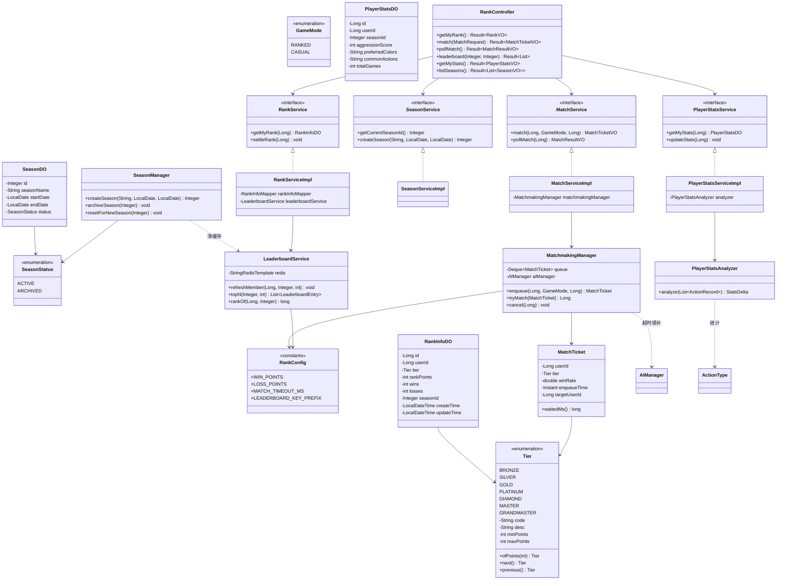
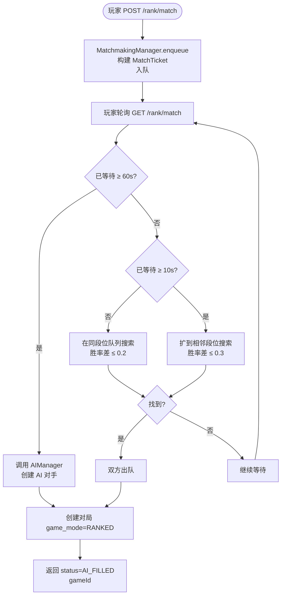
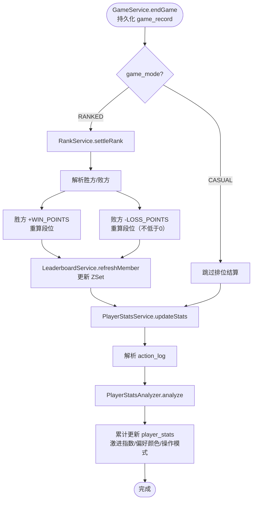
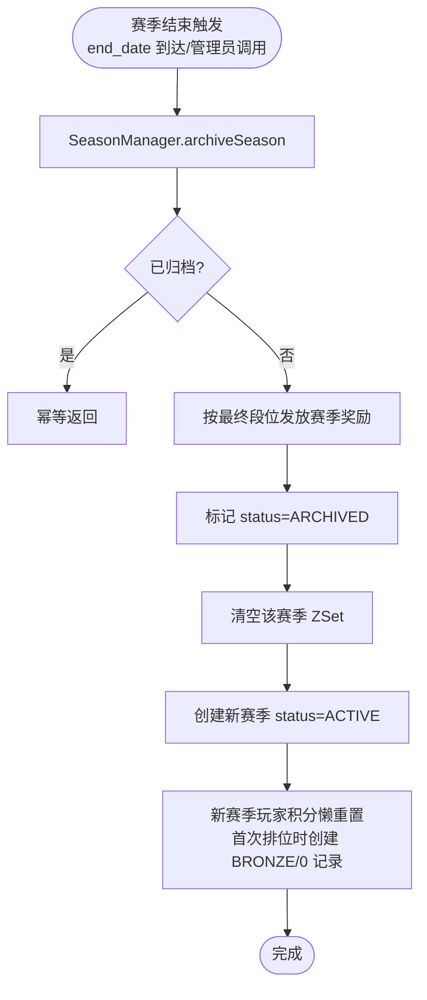

# 详细设计：迭代九 — 排位系统与打牌习惯分析

> 项目：MTCG 后端程序
> 版本：v0.1
> 日期：2026-07-31
> 依据：[需求分析](./01-需求分析.md) FR9.1–FR9.5、FR5.7；[概要设计](./02-概要设计.md) §3（rank_info 表）、§5.2（排位 API 清单）、§4.2（ActionType 枚举）
> 前置依赖：迭代七（对战 API + 对局持久化，game_record.action_log 已落地）、迭代八（AI 对战，可用于匹配超时填补）已就绪

---

## 1. 概述

### 1.1 迭代目标

在已就绪的对战 API 与 AI 对战能力之上，构建竞技对战的**排位系统**与**打牌习惯分析**模块，使玩家能够按段位匹配对手、查看全服排行榜、参与定期赛季，并量化自身打牌倾向。本迭代为玩家提供持续的竞技激励，同时为 AI 辅助与匹配算法提供玩家画像数据。

### 1.2 范围

| 包含 | 不包含 |
| --- | --- |
| 段位系统（7 段位 + 积分升降） | 段位内细分小段位（如黄金Ⅲ/Ⅱ/Ⅰ） |
| 排位匹配队列 + AI 超时填补 | WebSocket 实时匹配推送（当前用轮询/阻塞返回） |
| 全服排行榜（Redis ZSet + DB 持久化） | 跨赛季综合积分 |
| 赛季机制（创建/重置/归档/奖励） | 赛季奖励实物发放（仅记录奖励清单） |
| 休闲模式（不计排位） | 休闲模式的独立匹配池 |
| 打牌习惯分析（激进指数/偏好颜色/操作模式） | AI 自适应对手画像（后续迭代） |

### 1.3 设计原则

| 原则 | 说明 |
| --- | --- |
| 分层规范 | Controller → Service → Manager → DAO，匹配队列与赛季调度下沉到 Manager 层 |
| 应用层校验 | 不使用数据库外键，user_id / season_id 的关联完整性在 Service 层校验 |
| 缓存优先 | 排行榜读多写少，用 Redis ZSet 缓存热点排名，DB 作为持久化兜底 |
| 配置驱动 | 段位积分区间、胜负加减分、匹配超时阈值等均抽为常量/配置，便于调优 |
| 幂等结算 | 赛季结算与段位归档支持重试，按 (user_id, season_id) 幂等 |
| 不污染引擎 | 排位/匹配/统计均为 Spring 层逻辑，不侵入 `engine` 包纯 POJO |

### 1.4 前置依赖（迭代七/八产物，视为已就绪）

| 依赖 | 所属迭代 | 本设计引用点 |
| --- | --- | --- |
| `mtcg_game_record` 表（含 `action_log`、`game_mode`、`winner`、`player1_id`/`player2_id`） | 迭代七 | 对局结束后结算积分、读取操作流水分析打牌习惯 |
| `ActionType` 枚举（ATTACK/SUMMON/BASE_DEPLOY/RESPONSE_SUMMON/INTERCEPT…） | 迭代七 | 操作模式统计、激进指数计算 |
| 对局结束回调 / GameService 结束入口 | 迭代七 | 挂接积分结算与统计更新的触发点 |
| AIManager（创建 AI 对局、AI 玩家属性） | 迭代八 | 匹配超时用 AI 填补对手 |

> **挂接约定**：对局结束时 `GameService.endGame()` 在持久化 `mtcg_game_record` 后，调用 `RankService.settleRank(gameId)` 与 `PlayerStatsService.updateStats(gameId)`。休闲模式对局（`game_mode=CASUAL`）跳过 `settleRank`，但仍执行 `updateStats`（习惯分析覆盖所有模式）。

---

## 2. 数据库设计

### 2.1 建表 SQL

> 遵循概要设计约定：不使用外键约束，关联完整性在应用层校验；枚举字段存名称字符串并加 CHECK 约束。

```sql
-- 排位信息表（按赛季隔离，每用户每赛季一条）
CREATE TABLE mtcg_rank_info (
    id              BIGSERIAL       PRIMARY KEY,
    user_id         BIGINT          NOT NULL,
    tier            VARCHAR(16)     NOT NULL DEFAULT 'BRONZE',   -- 段位：BRONZE/SILVER/GOLD/PLATINUM/DIAMOND/MASTER/GRANDMASTER
    rank_points     INTEGER         NOT NULL DEFAULT 0,           -- 排位积分
    wins            INTEGER         NOT NULL DEFAULT 0,           -- 胜场
    losses          INTEGER         NOT NULL DEFAULT 0,           -- 败场
    season_id       INTEGER         NOT NULL,                     -- 所属赛季 ID（关联 season.id，无外键）
    create_time     TIMESTAMP       NOT NULL DEFAULT NOW(),
    update_time     TIMESTAMP       NOT NULL DEFAULT NOW(),
    CONSTRAINT ck_rank_tier    CHECK (tier IN ('BRONZE','SILVER','GOLD','PLATINUM','DIAMOND','MASTER','GRANDMASTER')),
    CONSTRAINT ck_rank_points  CHECK (rank_points >= 0)
);

-- 每用户每赛季仅一条排位记录
CREATE UNIQUE INDEX uk_rank_user_season    ON mtcg_rank_info (user_id, season_id);
-- 排行榜查询：按赛季 + 积分倒序
CREATE INDEX        idx_rank_season_points ON mtcg_rank_info (season_id, rank_points DESC);

-- 赛季表
CREATE TABLE season (
    id              SERIAL          PRIMARY KEY,
    season_name     VARCHAR(64)     NOT NULL,                     -- 赛季名称，如 2026-S3
    start_date      DATE            NOT NULL,                     -- 开始日期
    end_date        DATE            NOT NULL,                     -- 结束日期
    status          VARCHAR(16)     NOT NULL DEFAULT 'ACTIVE',    -- 状态：ACTIVE/ARCHIVED
    CONSTRAINT ck_season_status CHECK (status IN ('ACTIVE','ARCHIVED')),
    CONSTRAINT ck_season_dates  CHECK (end_date > start_date)
);

-- 同时只允许一个 ACTIVE 赛季
CREATE UNIQUE INDEX uk_season_active ON season ((status = 'ACTIVE')) WHERE status = 'ACTIVE';
CREATE INDEX        idx_season_status ON season (status);

-- 打牌习惯统计表（按赛季隔离）
CREATE TABLE player_stats (
    id                  BIGSERIAL   PRIMARY KEY,
    user_id             BIGINT      NOT NULL,
    season_id           INTEGER     NOT NULL,
    aggression_score    SMALLINT    NOT NULL DEFAULT 50,          -- 激进指数 [0,100]，50 为中性
    preferred_colors    VARCHAR(64),                               -- 偏好颜色，逗号分隔，如 RED,YELLOW
    common_actions      JSON,                                      -- 常见操作模式 JSON：{actionType: count}
    total_games         INTEGER     NOT NULL DEFAULT 0,           -- 统计对局数
    create_time         TIMESTAMP   NOT NULL DEFAULT NOW(),
    update_time         TIMESTAMP   NOT NULL DEFAULT NOW()
);

CREATE UNIQUE INDEX uk_stats_user_season ON player_stats (user_id, season_id);
CREATE INDEX        idx_stats_season     ON player_stats (season_id);

-- update_time 自动更新（与迭代一一致）
CREATE OR REPLACE FUNCTION update_update_time()
RETURNS TRIGGER AS $$
BEGIN
    NEW.update_time = NOW();
    RETURN NEW;
END;
$$ LANGUAGE plpgsql;

CREATE TRIGGER trigger_rank_info_update_time
    BEFORE UPDATE ON rank_info
    FOR EACH ROW EXECUTE FUNCTION update_update_time();

CREATE TRIGGER trigger_player_stats_update_time
    BEFORE UPDATE ON player_stats
    FOR EACH ROW EXECUTE FUNCTION update_update_time();
```

### 2.2 表说明

| 表 | 说明 | 关键设计点 |
| --- | --- | --- |
| `mtcg_rank_info` | 玩家排位信息 | 按赛季隔离（`season_id`）；`(user_id, season_id)` 唯一；`tier` 与 `rank_points` 双写，`tier` 为冗余字段便于查询/匹配，由积分区间推导维护 |
| `season` | 赛季定义 | `status` 区分进行中/已归档；用部分唯一索引保证同一时刻仅一个 ACTIVE 赛季 |
| `player_stats` | 打牌习惯统计 | `common_actions` 用 JSONB 存操作类型→次数映射；`aggression_score` 为量化指数；按赛季隔离 |

### 2.3 关键决策

| 编号 | 决策 | 理由 |
| --- | --- | --- |
| D9-1 | `tier` 与 `rank_points` 双写 | `tier` 可直接用于匹配筛选与排行榜展示，避免每次由积分反算段位；两者由 RankService 统一维护一致性 |
| D9-2 | 排位/统计按赛季隔离 | 支持赛季重置与历史归档；新赛季自动创建新记录，旧记录保留供历史查询 |
| D9-3 | 不建外键 | 遵循概要设计约定，`user_id`/`season_id` 关联在 Service 层校验，便于分库与单元测试 |
| D9-4 | `common_actions` 用 JSON | 操作类型固定但维度可能扩展，JSON 比宽表灵活；统计写入低频，读时解析开销可接受 |

---

## 3. 枚举设计

> 遵循项目枚举规范：`code`（存 DB）+ `desc`（中文显示），存名称字符串不存下标。位于 `com.aris.mtcg.common.enums` 包。

### 3.1 Tier（段位）

```java
package com.aris.mtcg.common.enums;

import lombok.Getter;

/**
 * 排位段位枚举（FR9.1）。
 * <p>段位由低到高排列；每段位对应一个积分区间，见 {@link #getMinPoints()} / {@link #getMaxPoints()}。</p>
 *
 * @author pengYuJun
 */
@Getter
public enum Tier {

    BRONZE("BRONZE", "青铜", 0, 1000),
    SILVER("SILVER", "白银", 1000, 2000),
    GOLD("GOLD", "黄金", 2000, 3000),
    PLATINUM("PLATINUM", "铂金", 3000, 4000),
    DIAMOND("DIAMOND", "钻石", 4000, 5000),
    MASTER("MASTER", "大师", 5000, 6000),
    GRANDMASTER("GRANDMASTER", "宗师", 6000, Integer.MAX_VALUE);

    /** 存库编码 */
    private final String code;
    /** 中文显示 */
    private final String desc;
    /** 该段位积分下限（含） */
    private final int minPoints;
    /** 该段位积分上限（不含；宗师无上限） */
    private final int maxPoints;

    Tier(String code, String desc, int minPoints, int maxPoints) {
        this.code = code;
        this.desc = desc;
        this.minPoints = minPoints;
        this.maxPoints = maxPoints;
    }

    /** 按积分判定所属段位。 */
    public static Tier ofPoints(int points) {
        for (Tier t : values()) {
            if (points >= t.minPoints && points < t.maxPoints) {
                return t;
            }
        }
        return BRONZE; // 兜底（points < 0 已被 CHECK 拦截）
    }

    /** 相邻下一段位（宗师为顶，返回自身）。 */
    public Tier next() {
        int i = ordinal();
        return i < values().length - 1 ? values()[i + 1] : this;
    }

    /** 相邻上一段位（青铜为底，返回自身）。 */
    public Tier previous() {
        int i = ordinal();
        return i > 0 ? values()[i - 1] : this;
    }
}
```

### 3.2 GameMode（对局模式）

```java
package com.aris.mtcg.common.enums;

import lombok.Getter;

/**
 * 对局模式（FR9.5）。
 * <p>RANKED 影响排位积分与胜败统计；CASUAL 不影响排位。</p>
 *
 * @author pengYuJun
 */
@Getter
public enum GameMode {

    RANKED("RANKED", "排位"),
    CASUAL("CASUAL", "休闲");

    private final String code;
    private final String desc;

    GameMode(String code, String desc) {
        this.code = code;
        this.desc = desc;
    }
}
```

### 3.3 SeasonStatus（赛季状态）

```java
package com.aris.mtcg.common.enums;

import lombok.Getter;

/**
 * 赛季状态（FR9.4）。
 *
 * @author pengYuJun
 */
@Getter
public enum SeasonStatus {

    ACTIVE("ACTIVE", "进行中"),
    ARCHIVED("ARCHIVED", "已归档");

    private final String code;
    private final String desc;

    SeasonStatus(String code, String desc) {
        this.code = code;
        this.desc = desc;
    }
}
```

---

## 4. 段位系统

### 4.1 段位积分区间

段位按积分区间划分，`rank_points` 为非负整数（DB CHECK 保证）。

| 段位 | 编码 | 积分区间 | 说明 |
| --- | --- | --- | --- |
| 青铜 | BRONZE | [0, 1000) | 起始段位，新赛季所有人重置至此 |
| 白银 | SILVER | [1000, 2000) | |
| 黄金 | GOLD | [2000, 3000) | |
| 铂金 | PLATINUM | [3000, 4000) | |
| 钻石 | DIAMOND | [4000, 5000) | |
| 大师 | MASTER | [5000, 6000) | |
| 宗师 | GRANDMASTER | [6000, +∞) | 顶段位，不降级至大师以下时无上限 |

### 4.2 升降级规则

| 事件 | 积分变动 | 段位变动 |
| --- | --- | --- |
| 排位胜 | `+WIN_POINTS`（默认 +30） | 积分达到下一段位 `minPoints` → 升段 |
| 排位负 | `-LOSS_POINTS`（默认 -20） | 积分低于当前段位 `minPoints` → 降段（青铜为底，不降） |
| 排位认输 | 同排位负 | 同上 |

- 积分变动后调用 `Tier.ofPoints(newPoints)` 重算段位，统一维护 `tier` 与 `rank_points` 一致性。
- 积分下限为 0，降段时若新积分 < 0 则截断为 0（青铜为最低段位）。
- 升降段无保护局/晋级赛，达到阈值立即生效，简化实现。

### 4.3 段位配置常量

```java
package com.aris.mtcg.manager;

/**
 * 排位系统配置常量（FR9.1）。
 * <p>集中管理可调参数，便于运营调优。</p>
 *
 * @author pengYuJun
 */
public final class RankConfig {

    private RankConfig() {}

    /** 排位胜场加分。 */
    public static final int WIN_POINTS = 30;
    /** 排位败场扣分。 */
    public static final int LOSS_POINTS = 20;
    /** 积分下限。 */
    public static final int MIN_POINTS = 0;
    /** 新赛季重置后的起始积分。 */
    public static final int SEASON_RESET_POINTS = 0;
    /** 新赛季重置后的起始段位。 */
    public static final Tier SEASON_RESET_TIER = Tier.BRONZE;

    /** 匹配超时阈值（毫秒），超时后用 AI 填补。 */
    public static final long MATCH_TIMEOUT_MS = 60_000L;
    /** 同段位优先匹配窗口（毫秒），超过后扩大到相邻段位。 */
    public static final long MATCH_SAME_TIER_WINDOW_MS = 10_000L;
    /** 排行榜 ZSet 缓存键前缀。 */
    public static final String LEADERBOARD_KEY_PREFIX = "rank:leaderboard:season:";
    /** 排行榜缓存容量（Top N）。 */
    public static final int LEADERBOARD_TOP_N = 100;
}
```

### 4.4 积分结算逻辑（RankService）

对局结束时由 `GameService` 调用：

```java
/**
 * 结算一局排位对局（FR9.1）。
 * <p>仅当 game_mode=RANKED 时执行；CASUAL 直接返回。</p>
 *
 * @param gameId 对局 ID
 */
public void settleRank(Long gameId) {
    GameRecordDO record = gameMapper.selectOneById(gameId);
    if (record == null || record.getGameMode() != GameMode.RANKED) {
        return; // 休闲模式不计排位
    }
    Long winnerId = parseWinnerUserId(record);
    Long loserId = winnerId.equals(record.getPlayer1Id()) ? record.getPlayer2Id() : record.getPlayer1Id();
    Integer seasonId = seasonService.getCurrentSeasonId();

    applyResult(winnerId, seasonId, true);   // 胜方 +WIN_POINTS
    applyResult(loserId,  seasonId, false);  // 败方 -LOSS_POINTS
}

/** 应用单局结果到玩家排位记录。 */
private void applyResult(Long userId, Integer seasonId, boolean win) {
    RankInfoDO rank = ensureRankInfo(userId, seasonId);
    int delta = win ? RankConfig.WIN_POINTS : -RankConfig.LOSS_POINTS;
    int newPoints = Math.max(RankConfig.MIN_POINTS, rank.getRankPoints() + delta);
    Tier newTier = Tier.ofPoints(newPoints);

    rank.setRankPoints(newPoints);
    rank.setTier(newTier);
    if (win) { rank.setWins(rank.getWins() + 1); }
    else     { rank.setLosses(rank.getLosses() + 1); }
    rankInfoMapper.update(rank);

    // 同步排行榜缓存
    leaderboardService.refreshMember(userId, seasonId, newPoints);
}
```

---

## 5. 匹配系统

### 5.1 匹配队列模型

`MatchmakingManager`（Manager 层）维护一个按赛季隔离的匹配队列，管理玩家进队、配对、超时填补。

```java
package com.aris.mtcg.manager;

import com.aris.mtcg.common.enums.Tier;
import lombok.Data;

import java.time.Instant;

/**
 * 匹配票据：一个等待匹配的玩家。
 *
 * @author pengYuJun
 */
@Data
public class MatchTicket {

    /** 玩家用户 ID。 */
    private Long userId;
    /** 入队时段位。 */
    private Tier tier;
    /** 入队时胜率（wins/(wins+losses)，无对局记 0.5）。 */
    private double winRate;
    /** 入队时间戳。 */
    private Instant enqueueTime;
    /** 指定对手（休闲模式可指定；排位为 null）。 */
    private Long targetUserId;

    /** 已等待毫秒。 */
    public long waitedMs() {
        return Instant.now().toEpochMilli() - enqueueTime.toEpochMilli();
    }
}
```

### 5.2 匹配算法

匹配优先级（从高到低）：

1. **同段位 + 胜率接近**（等待 < `MATCH_SAME_TIER_WINDOW_MS`）：在同段位队列中找胜率差最小者，差值 ≤ 0.2 即配对。
2. **相邻段位**（等待 ≥ `MATCH_SAME_TIER_WINDOW_MS`）：扩大搜索到上一/下一段位，胜率差 ≤ 0.3。
3. **AI 填补**（等待 ≥ `MATCH_TIMEOUT_MS`）：调用迭代八 `AIManager` 创建 AI 对手。

```java
package com.aris.mtcg.manager;

import com.aris.mtcg.common.enums.GameMode;
import com.aris.mtcg.common.enums.Tier;
import com.aris.mtcg.dao.RankInfoMapper;
import com.aris.mtcg.domain.entity.RankInfoDO;
import org.springframework.stereotype.Component;

import java.time.Instant;
import java.util.Iterator;
import java.util.concurrent.ConcurrentLinkedDeque;

/**
 * 排位匹配管理器（FR9.2）。
 * <p>维护匹配队列，按段位+胜率配对；超时用 AI 填补。</p>
 *
 * @author pengYuJun
 */
@Component
public class MatchmakingManager {

    /** 匹配队列（FIFO）。单赛季场景下全局共享；多赛季按需分桶。 */
    private final ConcurrentLinkedDeque<MatchTicket> queue = new ConcurrentLinkedDeque<>();

    private final RankInfoMapper rankInfoMapper;
    private final AIManager aiManager;                 // 迭代八产物

    public MatchmakingManager(RankInfoMapper rankInfoMapper, AIManager aiManager) {
        this.rankInfoMapper = rankInfoMapper;
        this.aiManager = aiManager;
    }

    /**
     * 加入匹配队列。
     * @return 匹配票据（含入队时间）
     */
    public MatchTicket enqueue(Long userId, GameMode mode, Long targetUserId) {
        MatchTicket ticket = buildTicket(userId, mode, targetUserId);
        if (mode == GameMode.CASUAL && targetUserId != null) {
            // 休闲模式指定对手：直接尝试与目标配对
            return ticket; // 由 MatchService 直接创建对局，不入队
        }
        queue.add(ticket);
        return ticket;
    }

    /**
     * 尝试为指定票据配对。返回对手用户 ID；为 null 表示尚未匹配到。
 * 若返回 -1L 表示已用 AI 填补。
     */
    public Long tryMatch(MatchTicket ticket) {
        // 1. 超时 → AI 填补
        if (ticket.waitedMs() >= RankConfig.MATCH_TIMEOUT_MS) {
            Long aiUserId = aiManager.createAiOpponent(ticket.getUserId(), ticket.getTier());
            return aiUserId;
        }

        boolean expandToAdjacent = ticket.waitedMs() >= RankConfig.MATCH_SAME_TIER_WINDOW_MS;
        // 2. 遍历队列寻找合适对手
        Iterator<MatchTicket> it = queue.iterator();
        while (it.hasNext()) {
            MatchTicket candidate = it.next();
            if (candidate.getUserId().equals(ticket.getUserId())) {
                continue;
            }
            if (!tierMatchable(ticket.getTier(), candidate.getTier(), expandToAdjacent)) {
                continue;
            }
            if (Math.abs(ticket.getWinRate() - candidate.getWinRate()) > 0.3) {
                continue;
            }
            // 配对成功：双方出队
            queue.remove(ticket);
            queue.remove(candidate);
            return candidate.getUserId();
        }
        return null;
    }

    /** 出队（取消匹配）。 */
    public void cancel(Long userId) {
        queue.removeIf(t -> t.getUserId().equals(userId));
    }

    /** 段位是否可匹配：同段位或（扩区时）相邻段位。 */
    private boolean tierMatchable(Tier a, Tier b, boolean expand) {
        if (a == b) { return true; }
        if (expand) {
            return a.next() == b || a.previous() == b;
        }
        return false;
    }

    private MatchTicket buildTicket(Long userId, GameMode mode, Long targetUserId) {
        RankInfoDO rank = rankInfoMapper.selectCurrentByUser(userId);
        MatchTicket t = new MatchTicket();
        t.setUserId(userId);
        t.setTier(rank != null ? rank.getTier() : Tier.BRONZE);
        int w = rank != null ? rank.getWins() : 0;
        int l = rank != null ? rank.getLosses() : 0;
        t.setWinRate(w + l > 0 ? (double) w / (w + l) : 0.5);
        t.setEnqueueTime(Instant.now());
        t.setTargetUserId(targetUserId);
        return t;
    }
}
```

### 5.3 匹配超时阈值

| 阈值 | 默认值 | 说明 |
| --- | --- | --- |
| `MATCH_SAME_TIER_WINDOW_MS` | 10 秒 | 同段位优先窗口，超过后扩大到相邻段位 |
| `MATCH_TIMEOUT_MS` | 60 秒 | 匹配超时，调用 AI 填补对手 |

### 5.4 匹配交互方式

当前阶段为 REST，匹配采用**提交票据 + 轮询**模式（后续迭代可替换为 WebSocket 推送）：

1. 玩家调用 `POST /rank/match` 提交匹配，返回票据 ID。
2. 玩家轮询 `GET /rank/match/{ticketId}` 查询匹配结果。
3. 匹配成功返回对手信息与对局 ID；超时由服务端自动用 AI 填补并返回对局 ID。

---

## 6. 排行榜

### 6.1 缓存与持久化

排行榜采用 **Redis ZSet 缓存 + DB 兜底**双写策略：

| 数据源 | 用途 | 说明 |
| --- | --- | --- |
| Redis ZSet | 热点排名查询 | key = `rank:leaderboard:season:{seasonId}`，member = userId，score = rank_points；维护 Top N |
| DB rank_info | 持久化兜底 | ZSet 未命中或需分页超出 Top N 时，按 `(season_id, rank_points DESC)` 索引查询 |

### 6.2 LeaderboardService

```java
package com.aris.mtcg.service;

import com.aris.mtcg.manager.RankConfig;
import org.springframework.data.redis.core.StringRedisTemplate;
import org.springframework.stereotype.Service;

import java.util.List;

/**
 * 排行榜服务（FR9.3）。
 * <p>Redis ZSet 缓存 + DB 持久化兜底。</p>
 *
 * @author pengYuJun
 */
@Service
public class LeaderboardService {

    private final StringRedisTemplate redis;
    private final RankInfoMapper rankInfoMapper;

    public LeaderboardService(StringRedisTemplate redis, RankInfoMapper rankInfoMapper) {
        this.redis = redis;
        this.rankInfoMapper = rankInfoMapper;
    }

    /** 刷新某玩家积分到 ZSet。 */
    public void refreshMember(Long userId, Integer seasonId, int points) {
        String key = RankConfig.LEADERBOARD_KEY_PREFIX + seasonId;
        redis.opsForZSet().add(key, String.valueOf(userId), points);
        // 修剪为 Top N，避免 ZSet 无限增长
        redis.opsForZSet().removeRange(key, 0, -(RankConfig.LEADERBOARD_TOP_N + 1));
    }

    /** 查询全服 Top N（ZSet 命中）。 */
    public List<LeaderboardEntry> topN(Integer seasonId, int n) {
        String key = RankConfig.LEADERBOARD_KEY_PREFIX + seasonId;
        var set = redis.opsForZSet().reverseRangeWithScores(key, 0, n - 1);
        // 转换为 LeaderboardEntry（含 userId/points/rank），用户昵称另行批量查询
        return toEntries(set);
    }

    /** 查询某玩家排名（ZSet rank；未命中回 DB 统计）。 */
    public long rankOf(Long userId, Integer seasonId) {
        String key = RankConfig.LEADERBOARD_KEY_PREFIX + seasonId;
        Long rank = redis.opsForZSet().reverseRank(key, String.valueOf(userId));
        if (rank != null) { return rank + 1; }
        // ZSet 未命中（不在 Top N）：回 DB 按积分大于该玩家的计数 +1
        return rankInfoMapper.countAbove(seasonId, userId) + 1;
    }

    /** 赛季重置时清空旧赛季 ZSet。 */
    public void clearSeason(Integer seasonId) {
        redis.delete(RankConfig.LEADERBOARD_KEY_PREFIX + seasonId);
    }
}
```

### 6.3 排行榜查询

| 接口 | 说明 |
| --- | --- |
| 全服排行榜 | `GET /rank/leaderboard?seasonId=&size=` 返回 Top N（默认当前赛季、Top 100） |
| 分赛季查看 | 通过 `seasonId` 参数指定历史赛季；历史赛季从 DB 查询（已归档赛季 ZSet 可能已清，回 DB） |
| 我的排名 | `GET /rank/me` 返回当前段位、积分、胜败、全服排名 |

### 6.4 缓存一致性

- **写**：每次积分结算（`RankService.applyResult`）同步 `refreshMember` 更新 ZSet。
- **读**：ZSet 命中则返回；未命中回 DB 查询。
- **赛季切换**：新赛季开始时 `clearSeason(oldSeasonId)` 清空旧 ZSet，新赛季 ZSet 按结算逐步重建。
- **冷启动**：ZSet 为空时由 `LeaderboardService.warmup(seasonId)` 从 DB 重建 Top N。

---

## 7. 赛季机制

### 7.1 SeasonManager

`SeasonManager`（Manager 层）负责赛季生命周期：创建、重置、归档、奖励发放。

```java
package com.aris.mtcg.manager;

import com.aris.mtcg.common.enums.SeasonStatus;
import com.aris.mtcg.common.enums.Tier;
import com.aris.mtcg.dao.SeasonMapper;
import com.aris.mtcg.domain.entity.SeasonDO;
import org.springframework.stereotype.Component;

import java.time.LocalDate;

/**
 * 赛季管理器（FR9.4）。
 * <p>赛季创建、重置、归档、奖励发放。</p>
 *
 * @author pengYuJun
 */
@Component
public class SeasonManager {

    private final SeasonMapper seasonMapper;
    private final RankInfoMapper rankInfoMapper;
    private final LeaderboardService leaderboardService;

    public SeasonManager(SeasonMapper seasonMapper, RankInfoMapper rankInfoMapper,
                         LeaderboardService leaderboardService) {
        this.seasonMapper = seasonMapper;
        this.rankInfoMapper = rankInfoMapper;
        this.leaderboardService = leaderboardService;
    }

    /**
     * 创建新赛季。
     * <p>若存在 ACTIVE 赛季则先归档；插入新 ACTIVE 记录。</p>
     */
    public Integer createSeason(String name, LocalDate start, LocalDate end) {
        // 1. 归档当前 ACTIVE 赛季（若有）
        SeasonDO current = seasonMapper.selectActive();
        if (current != null) {
            archiveSeason(current.getId());
        }
        // 2. 插入新赛季
        SeasonDO season = new SeasonDO();
        season.setSeasonName(name);
        season.setStartDate(start);
        season.setEndDate(end);
        season.setStatus(SeasonStatus.ACTIVE);
        seasonMapper.insert(season);
        return season.getId();
    }

    /**
     * 归档赛季：段位归档 + 发放奖励 + 标记 ARCHIVED。
     * <p>幂等：按 seasonId 归档，重复调用不重复发奖（发奖前校验是否已归档）。</p>
     */
    public void archiveSeason(Integer seasonId) {
        SeasonDO season = seasonMapper.selectOneById(seasonId);
        if (season == null || season.getStatus() == SeasonStatus.ARCHIVED) {
            return; // 不存在或已归档，幂等返回
        }
        // 1. 段位归档：rank_info 记录保留（season_id 隔离），作为历史快照
        // 2. 发放赛季奖励（按最终段位）
        grantSeasonRewards(seasonId);
        // 3. 标记归档 + 清空该赛季排行榜缓存
        season.setStatus(SeasonStatus.ARCHIVED);
        seasonMapper.update(season);
        leaderboardService.clearSeason(seasonId);
    }

    /**
     * 赛季重置：新赛季所有玩家积分回到起始段位。
     * <p>新赛季的 rank_info 记录在玩家首次参与排位时由 ensureRankInfo 懒创建。</p>
     */
    public void resetForNewSeason(Integer newSeasonId) {
        // 新赛季无需批量复制旧记录；玩家首次匹配/查询时懒创建（BRONZE / 0 积分）
        // 此处可预热排行榜（空 ZSet）
    }

    /** 发放赛季奖励：按最终段位写入奖励清单。 */
    private void grantSeasonRewards(Integer seasonId) {
        // 按段位梯度发放称号/记录奖励，写入 season_reward（或记录日志）
        // 当前迭代仅记录奖励清单，不实际发放实物
    }
}
```

### 7.2 赛季生命周期

| 阶段 | 动作 | 触发 |
| --- | --- | --- |
| 创建 | 归档旧 ACTIVE 赛季（若有）→ 插入新 ACTIVE 记录 | 系统管理员调用 / 定时任务 |
| 进行中 | 玩家排位对局正常结算积分、更新排行榜 | 对局结束回调 |
| 结束 | 段位归档（保留 rank_info 快照）→ 发放奖励 → 标记 ARCHIVED → 清空 ZSet | `end_date` 到达 / 管理员调用 |
| 新赛季重置 | 玩家积分重置为 0/BRONZE（懒创建新 season_id 记录） | 新赛季创建后首次排位 |

### 7.3 赛季奖励

按赛季结束时的最终段位发放梯度奖励（称号 + 记录）：

| 段位 | 奖励 |
| --- | --- |
| 青铜/白银 | 赛季参与称号 |
| 黄金/铂金 | 进阶称号 + 胜场记录 |
| 钻石/大师 | 精英称号 + 排名记录 |
| 宗师 | 顶级称号 + 全服排名归档 |

> 当前迭代仅记录奖励清单（段位 + 赛季），实物发放（称号展示）留待后续用户系统扩展。

### 7.4 历史归档查询

- 历史赛季的 `mtcg_rank_info` 记录按 `season_id` 保留，不删除。
- 排行榜分赛季查询：历史赛季 ZSet 可能已清，回 DB 按 `(season_id, rank_points DESC)` 查询。
- 赛季列表：`GET /seasons` 返回所有赛季（含状态），供前端选择查看。

---

## 8. 打牌习惯分析

### 8.1 量化维度（FR5.7）

从对局操作流水（`game_record.action_log`）分析玩家打牌习惯，量化为三个维度：

| 维度 | 字段 | 计算方式 |
| --- | --- | --- |
| 激进指数 | `aggression_score` [0,100] | 进攻类操作占比 → 量化为 0–100（50 为中性） |
| 偏好颜色 | `preferred_colors` | 玩家号召/部署角色卡的 color 频次 Top 2 |
| 常见操作模式 | `common_actions` (JSON) | 各 ActionType 出现次数统计 |

### 8.2 操作分类

引用迭代七 `ActionType` 枚举，按攻防倾向分类：

| 分类 | ActionType | 说明 |
| --- | --- | --- |
| 进攻类 | `ATTACK`、`RESPONSE_SUMMON` | 主动攻击 / 应对号召（反打） |
| 防守类 | `BASE_DEPLOY`、`COMBAT_BASE_MOVE`、`INTERCEPT` | 盖卡部署 / 战基移动（龟缩）/ 拦截 |
| 中性类 | `SUMMON`、`ACTIVATE_EFFECT`、`MULLIGAN`、`PASS`、`END_PHASE` | 号召 / 启动效果 / 调度 / 不行动 |

### 8.3 激进指数计算

```
aggression_score = round( 进攻类操作数 / (进攻类操作数 + 防守类操作数) × 100 )
```

- 分母为 0（无攻防操作）时记 50（中性）。
- 值越大越激进（偏好攻击/反打），值越小越防守（偏好盖卡/龟缩/拦截）。
- `common_actions` 存全操作类型计数 JSON，供细粒度分析。

### 8.4 PlayerStatsAnalyzer

```java
package com.aris.mtcg.manager;

import com.aris.mtcg.common.enums.Color;
import com.aris.mtcg.engine.action.ActionType;

import java.util.EnumMap;
import java.util.List;
import java.util.Map;

/**
 * 打牌习惯分析器（FR5.7）。
 * <p>从对局操作流水（action_log）量化玩家倾向：激进指数、偏好颜色、操作模式。</p>
 *
 * @author pengYuJun
 */
public class PlayerStatsAnalyzer {

    /** 进攻类操作。 */
    private static final List<ActionType> AGGRESSIVE = List.of(ActionType.ATTACK, ActionType.RESPONSE_SUMMON);
    /** 防守类操作。 */
    private static final List<ActionType> DEFENSIVE  = List.of(ActionType.BASE_DEPLOY, ActionType.COMBAT_BASE_MOVE, ActionType.INTERCEPT);

    /**
     * 分析单局操作流水，产出习惯增量。
     *
     * @param actions    本局该玩家的操作序列（含 ActionType 与卡牌 color）
     * @return 习惯增量（aggressionDelta / colorCounts / actionCounts）
     */
    public StatsDelta analyze(List<ActionRecord> actions) {
        int aggressive = 0;
        int defensive = 0;
        Map<ActionType, Integer> actionCounts = new EnumMap<>(ActionType.class);
        Map<Color, Integer> colorCounts = new EnumMap<>(Color.class);

        for (ActionRecord a : actions) {
            ActionType type = a.getType();
            actionCounts.merge(type, 1, Integer::sum);
            if (AGGRESSIVE.contains(type)) { aggressive++; }
            if (DEFENSIVE.contains(type))  { defensive++; }
            if (a.getCardColor() != null) {
                colorCounts.merge(a.getCardColor(), 1, Integer::sum);
            }
        }

        int aggression = defensive + aggressive == 0
                ? 50
                : Math.round((float) aggressive / (aggressive + defensive) * 100);

        StatsDelta delta = new StatsDelta();
        delta.setAggressionScore(aggression);
        delta.setActionCounts(actionCounts);
        delta.setColorCounts(colorCounts);
        return delta;
    }

    /** 单条操作记录（从 action_log 解析）。 */
    public static class ActionRecord {
        private ActionType type;
        private Color cardColor;   // 涉及卡牌的颜色（号召/部署时）
        // getter/setter 略
    }

    /** 单局习惯增量。 */
    public static class StatsDelta {
        private int aggressionScore;
        private Map<ActionType, Integer> actionCounts;
        private Map<Color, Integer> colorCounts;
        // getter/setter 略
    }
}
```

### 8.5 累计更新策略

`player_stats` 按赛季累计，每局结束后增量更新：

| 字段 | 更新方式 |
| --- | --- |
| `aggression_score` | 加权平均：`newScore = (oldScore × oldGames + deltaScore) / (oldGames + 1)` |
| `preferred_colors` | 累计 colorCounts 后取 Top 2 |
| `common_actions` | 累加各 ActionType 计数，整体存 JSON |
| `total_games` | +1 |

> **触发点**：对局结束 `GameService.endGame()` 调用 `PlayerStatsService.updateStats(gameId)`，覆盖 RANKED 与 CASUAL 所有模式（习惯分析不区分模式）。

---

## 9. Service 与 Controller 层

### 9.1 RankService

```
包：com.aris.mtcg.service
职责：段位信息查询、积分结算、排位记录懒创建

方法：
- RankInfoDO getMyRank(Long userId)                     // 查询当前赛季段位（含全服排名）
- RankInfoDO ensureRankInfo(Long userId, Integer seasonId) // 懒创建排位记录（BRONZE/0）
- void settleRank(Long gameId)                          // 结算排位积分（仅 RANKED）
- void applyResult(Long userId, Integer seasonId, boolean win) // 应用单局结果
```

### 9.2 SeasonService

```
包：com.aris.mtcg.service
职责：赛季查询、当前赛季获取、赛季创建/归档触发

方法：
- Integer getCurrentSeasonId()                          // 获取当前 ACTIVE 赛季 ID
- SeasonDO getCurrentSeason()                           // 获取当前赛季详情
- List<SeasonDO> listSeasons()                          // 赛季列表（含历史）
- Integer createSeason(String name, LocalDate start, LocalDate end) // 创建新赛季
- void archiveSeason(Integer seasonId)                  // 归档赛季
```

### 9.3 MatchService

```
包：com.aris.mtcg.service
职责：匹配入口、票据管理、配对成功后创建对局

方法：
- MatchTicketVO match(Long userId, GameMode mode, Long targetUserId) // 提交匹配
- MatchResultVO pollMatch(Long userId)                  // 轮询匹配结果
- void cancelMatch(Long userId)                         // 取消匹配
- Long createRankedGame(Long player1Id, Long player2Id) // 配对成功创建排位对局（调用迭代七 GameService）
```

### 9.4 PlayerStatsService

```
包：com.aris.mtcg.service
职责：打牌习惯统计查询与更新

方法：
- PlayerStatsDO getMyStats(Long userId)                 // 查询当前赛季习惯统计
- PlayerStatsDO ensureStats(Long userId, Integer seasonId) // 懒创建统计记录
- void updateStats(Long gameId)                         // 对局结束后更新统计（分析 action_log）
```

### 9.5 RankController

```
包：com.aris.mtcg.controller
路径：/api/v1（由 context-path 统一前缀）
```

| 方法 | HTTP | 路径 | 入参 | 出参 | 需求 |
| --- | --- | --- | --- | --- | --- |
| getMyRank | GET | `/rank/me` | 当前用户 | `Result<RankVO>` | FR9.1 |
| match | POST | `/rank/match` | MatchRequest | `Result<MatchTicketVO>` | FR9.2 |
| pollMatch | GET | `/rank/match` | 当前用户 | `Result<MatchResultVO>` | FR9.2 |
| cancelMatch | DELETE | `/rank/match` | 当前用户 | `Result<Void>` | FR9.2 |
| leaderboard | GET | `/rank/leaderboard` | seasonId(可选), size(可选) | `Result<List<LeaderboardEntry>>` | FR9.3 |
| getMyStats | GET | `/rank/stats/me` | 当前用户 | `Result<PlayerStatsVO>` | FR5.7 |
| listSeasons | GET | `/seasons` | - | `Result<List<SeasonVO>>` | FR9.4 |

> **休闲模式**（FR9.5）：通过 `POST /rank/match` 传 `mode=CASUAL` 进入休闲匹配；可传 `targetUserId` 指定对手。休闲对局 `game_mode=CASUAL`，结束时不结算排位积分、不计胜负，但仍更新打牌习惯统计。

### 9.6 DTO / VO 设计

```java
// 匹配请求
package com.aris.mtcg.domain.dto;
public class MatchRequest {
    private GameMode mode;        // RANKED / CASUAL，默认 RANKED
    private Long targetUserId;    // 休闲模式指定对手；排位忽略
}

// 匹配票据
package com.aris.mtcg.domain.vo;
public class MatchTicketVO {
    private Long userId;
    private String tier;
    private long waitedMs;        // 已等待毫秒
    private String status;        // QUEUED / MATCHED / AI_FILLED
}

// 匹配结果
package com.aris.mtcg.domain.vo;
public class MatchResultVO {
    private String status;        // QUEUED / MATCHED / AI_FILLED
    private Long gameId;          // 匹配成功返回对局 ID
    private Long opponentId;      // 对手用户 ID（AI 填补时为 AI 用户 ID）
    private boolean isAiOpponent;
}

// 段位视图
package com.aris.mtcg.domain.vo;
public class RankVO {
    private String tier;
    private String tierDesc;
    private int rankPoints;
    private int wins;
    private int losses;
    private double winRate;
    private long globalRank;      // 全服排名
    private Integer seasonId;
}

// 排行榜样条
package com.aris.mtcg.domain.vo;
public class LeaderboardEntry {
    private long rank;
    private Long userId;
    private String nickname;
    private String tier;
    private int rankPoints;
    private int wins;
    private int losses;
}

// 打牌习惯视图
package com.aris.mtcg.domain.vo;
public class PlayerStatsVO {
    private int aggressionScore;
    private String aggressionLabel;   // 激进/均衡/防守
    private List<String> preferredColors;
    private Map<String, Integer> commonActions; // actionType -> count
    private int totalGames;
    private Integer seasonId;
}

// 赛季视图
package com.aris.mtcg.domain.vo;
public class SeasonVO {
    private Integer id;
    private String seasonName;
    private LocalDate startDate;
    private LocalDate endDate;
    private String status;
}
```

### 9.7 异常定义

```
包：com.aris.mtcg.common.exception

- BusinessException(String message)
  - 当前无活跃赛季
  - 不在匹配队列中
  - 赛季不存在 / 已归档
```

> 异常由 `GlobalExceptionHandler`（`com.aris.mtcg.advice`）统一捕获，返回 `Result.fail(ErrorCode, message)`。

---

## 10. 类关系图与流程图（Mermaid）

### 10.1 类关系图



### 10.2 排位匹配流程图



### 10.3 对局结束结算流程图



### 10.4 赛季切换流程图



---

## 11. 文件清单

| 文件 | 包 | 说明 |
| --- | --- | --- |
| `Tier.java` | `common.enums` | 段位枚举（含积分区间） |
| `GameMode.java` | `common.enums` | 对局模式枚举（RANKED/CASUAL） |
| `SeasonStatus.java` | `common.enums` | 赛季状态枚举 |
| `RankConfig.java` | `manager` | 排位系统配置常量 |
| `MatchTicket.java` | `manager` | 匹配票据 |
| `MatchmakingManager.java` | `manager` | 匹配队列管理器 |
| `SeasonManager.java` | `manager` | 赛季生命周期管理器 |
| `PlayerStatsAnalyzer.java` | `manager` | 打牌习惯分析器（含 ActionRecord/StatsDelta 内嵌类） |
| `RankInfoDO.java` | `domain.entity` | 排位信息数据库实体 |
| `SeasonDO.java` | `domain.entity` | 赛季数据库实体 |
| `PlayerStatsDO.java` | `domain.entity` | 打牌习惯统计数据库实体 |
| `RankInfoMapper.java` | `dao` | 排位信息 Mapper（含 selectCurrentByUser/countAbove） |
| `SeasonMapper.java` | `dao` | 赛季 Mapper（含 selectActive） |
| `PlayerStatsMapper.java` | `dao` | 打牌习惯统计 Mapper |
| `LeaderboardService.java` | `service` | 排行榜服务（Redis ZSet + DB） |
| `RankService.java` | `service` | 排位服务接口 |
| `RankServiceImpl.java` | `service.impl` | 排位服务实现 |
| `SeasonService.java` | `service` | 赛季服务接口 |
| `SeasonServiceImpl.java` | `service.impl` | 赛季服务实现 |
| `MatchService.java` | `service` | 匹配服务接口 |
| `MatchServiceImpl.java` | `service.impl` | 匹配服务实现 |
| `PlayerStatsService.java` | `service` | 打牌习惯服务接口 |
| `PlayerStatsServiceImpl.java` | `service.impl` | 打牌习惯服务实现 |
| `MatchRequest.java` | `domain.dto` | 匹配请求 DTO |
| `MatchTicketVO.java` | `domain.vo` | 匹配票据视图 |
| `MatchResultVO.java` | `domain.vo` | 匹配结果视图 |
| `RankVO.java` | `domain.vo` | 段位信息视图 |
| `LeaderboardEntry.java` | `domain.vo` | 排行榜样条 |
| `PlayerStatsVO.java` | `domain.vo` | 打牌习惯视图 |
| `SeasonVO.java` | `domain.vo` | 赛季视图 |
| `RankController.java` | `controller` | 排位/匹配/排行榜/统计 REST API |
| `init.sql`（追加） | `resources/sql` | rank_info / season / player_stats 建表 SQL |

共 31 项（含 init.sql 追加），分布于 `common.enums`、`manager`、`domain`、`dao`、`service`、`controller` 包。

---

## 附录 A：需求对照

| 需求 | 本设计落点 |
| --- | --- |
| FR9.1 段位系统 | Tier 枚举（7 段位 + 积分区间）、RankConfig、RankService.settleRank |
| FR9.2 排位匹配 | MatchmakingManager（同段位→相邻段位→AI 填补）、RankConfig.MATCH_TIMEOUT_MS |
| FR9.3 排行榜 | LeaderboardService（Redis ZSet + DB 持久化）、分赛季查询 |
| FR9.4 赛季机制 | SeasonManager（创建/归档/重置/奖励）、season 表 |
| FR9.5 休闲模式 | GameMode.CASUAL、MatchRequest.mode、结算跳过排位 |
| FR5.7 打牌习惯分析 | PlayerStatsAnalyzer（激进指数/偏好颜色/操作模式）、player_stats 表 |

## 附录 B：关键决策

| 编号 | 决策 | 理由 |
| --- | --- | --- |
| D9-1 | `tier` 与 `rank_points` 双写 | tier 便于匹配筛选与展示，积分驱动升降，统一维护一致性 |
| D9-2 | 排位/统计按赛季隔离 | 支持赛季重置与历史归档，旧记录保留供查询 |
| D9-3 | 不建外键 | 遵循概要设计约定，关联完整性在 Service 层校验 |
| D9-4 | `common_actions` 用 JSON | 操作维度可扩展，写入低频，JSON 比宽表灵活 |
| D9-5 | 匹配采用票据+轮询 | 当前为 REST，无 WebSocket；后续可平滑替换为推送 |
| D9-6 | 赛季重置懒创建 | 避免赛季切换时批量复制全量用户记录，首次排位时懒创建 |
| D9-7 | 习惯分析覆盖所有模式 | 休闲模式同样反映打牌倾向，纳入统计为 AI/匹配提供更全画像 |

## 附录 C：新增依赖

| 依赖 | 用途 | 说明 |
| --- | --- | --- |
| `spring-boot-starter-data-redis` | 排行榜 ZSet 缓存 | 需在 pom.xml 新增；application.yml 配置 Redis 连接 |

```yaml
# application.yml 追加
spring:
  data:
    redis:
      host: localhost
      port: 6379
      database: 0
```

> 若部署环境暂无 Redis，`LeaderboardService` 可降级为纯 DB 查询（按 `(season_id, rank_points DESC)` 索引），接口契约不变。

---

## 12. 前置依赖接口约定

> 以下接口由本迭代交付，供后续迭代（迭代九 系统管理）调用者使用。

| 公开方法 | 签名 | 调用方 | 用途 |
| --- | --- | --- | --- |
| `RankService.settleRank(gameId)` | `void` | 迭代八 GameService.endGame() | 对局结束结算排位积分 |
| `PlayerStatsService.updateStats(gameId)` | `void` | 迭代八 GameService.endGame() | 更新打牌习惯统计 |
| `LeaderboardService.getTopN(seasonId, n)` | `List<LeaderboardEntry>` | 迭代八 RankController | 排行榜展示 |
| `SeasonService.getCurrentSeason()` | `SeasonVO` | 迭代八 RankController | 当前赛季信息 |
| `MatchmakingManager.joinQueue(userId, tier)` | `MatchTicketVO` | 迭代八 RankController | 加入匹配队列 |
| `MatchmakingManager.pollResult(userId, timeoutMs)` | `MatchResultVO` | 迭代八 RankController | 轮询匹配结果 |

> **挂接约定**：对局结束时 `GameService.endGame()` 在持久化 `mtcg_game_record` 后，调用 `RankService.settleRank(gameId)` 与 `PlayerStatsService.updateStats(gameId)`。休闲模式（`game_mode=CASUAL`）跳过 `settleRank`，但仍执行 `updateStats`。

---

## 13. 验收要点

| 需求 | 验收项 |
| --- | --- |
| FR9.1 | 段位正确：7 段位；积分达到阈值自动晋升；积分归零自动降段 |
| FR9.2 | 匹配队列：同段位 → 相邻段位 → 超时后 AI 填补；超时时间可配置 |
| FR9.3 | 排行榜：按当前赛季积分倒序；Redis ZSet 与 DB 数据一致 |
| FR9.4 | 赛季重置：旧赛季归档后新赛季开始；玩家历史段位可查询 |
| FR9.5 | 休闲模式：排位积分不变；打牌习惯统计仍正常记录 |
| FR5.7 | 激进指数：正确统计 ATTACK/SUMMON/BASE_DEPLOY 比例 |
| FR5.7 | 偏好颜色：正确统计主卡组涉及颜色分布 |
| FR5.7 | 操作模式：正确统计各 ActionType 次数分布 |
| FR9.1 | 非登录用户访问排行榜 → 401 |
| FR9.1 | 休闲对局结束后不触发排位积分变更 |
