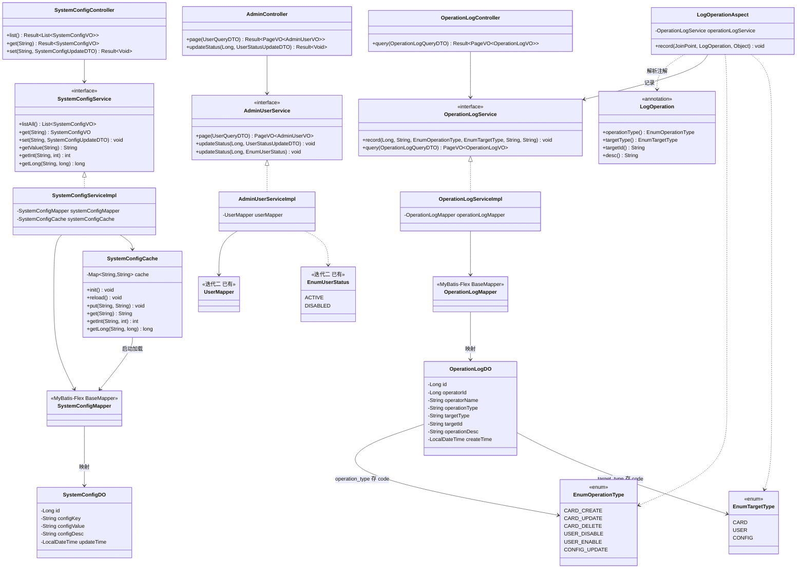

# 详细设计：迭代九 — 系统管理

> 项目：MTCG 后端程序
> 版本：v0.1
> 日期：2026-07-31
> 依据：[需求分析](./01-需求分析.md) FR8.1–FR8.3、[概要设计](./02-概要设计.md) §3 §5、[迭代一详细设计](./03-详细设计-迭代一-用户系统与用户管理.md)（用户系统、`@RequireRole`）

---

## 1. 概述

### 1.1 迭代目标

在迭代二用户系统与权限管理基础上，实现系统管理员的后台管理能力：用户管理、运行参数配置、关键操作审计日志。本迭代为运营与审计提供闭环，不引入新通信模式，全部基于 REST。

### 1.2 范围

| 包含 | 不包含 |
| --- | --- |
| `system_config` / `operation_log` 表建表（PostgreSQL） | 细粒度权限 ACL |
| `EnumOperationType` / `EnumTargetType` 枚举 | 数据库外键（沿用概要设计约定，不建外键） |
| AdminUserService（用户列表、禁用/启用） | 用户角色变更（仅做启用/禁用） |
| SystemConfigService + SystemConfigCache（配置 get/set + 内存缓存） | 配置变更热推送（仅刷新本进程缓存） |
| OperationLogService + `@LogOperation` AOP 切面 | 日志分级检索/归档（仅按时间/类型/操作人检索） |
| AdminController / SystemConfigController / OperationLogController | 前端管理后台 |

### 1.3 对应需求

| 需求 | 说明 | 实现 |
| --- | --- | --- |
| FR8.1 | 用户管理 | `GET /admin/users` 分页查询；`PUT /admin/users/{id}/status` 禁用/启用 |
| FR8.2 | 系统配置 | `GET/PUT /admin/configs[/{key}]`，启动加载内存缓存，修改后刷新 |
| FR8.3 | 操作日志 | `@LogOperation` 注解 + AOP 自动记录；`GET /admin/operation-logs` 查询 |

### 1.4 前置依赖

| 依赖 | 来源 | 复用内容 |
| --- | --- | --- |
| 用户系统 | 迭代二 | `UserDO` / `UserMapper` / `EnumUserStatus` / `EnumUserRole` |
| 权限控制 | 迭代二 | `@RequireRole(EnumUserRole.SYS_ADMIN)`、`JwtInterceptor`、`SecurityConstant`（`ATTR_USER_ID`/`ATTR_USERNAME`） |
| 统一响应 | 迭代一/二 | `Result<T>` / `PageVO<T>` / `ErrorCode` / `BusinessException` / `GlobalExceptionHandler` |

### 1.5 关键决策

| 编号 | 决策 | 理由 |
| --- | --- | --- |
| D1 | 不建数据库外键 | 沿用概要设计 §3.1 约定，关系完整性在应用层校验 |
| D2 | `operation_log.target_id` 用 VARCHAR(64) | 卡牌/用户 id 为 bigint、配置 key 为字符串，统一用字符串存储便于通用记录 |
| D3 | 配置缓存放进程内 `ConcurrentHashMap` | 配置项数量少、读多写少；启动 `@PostConstruct` 加载，写后刷新；避免每次读 DB |
| D4 | 操作日志用 AOP + 注解自动采集 | 与业务代码解耦，注解声明操作语义，切面统一落库；记录失败不影响主流程（try-catch 吞异常 + warn） |
| D5 | `target_id` 用 SpEL 表达式解析 | 灵活支持 `#id`、`#dto.id` 等写法，复用 Spring Expression API |
| D6 | 所有管理接口 `@RequireRole(SYS_ADMIN)` | FR8 为系统管理员专属能力，沿用迭代二鉴权机制 |
| D7 | `operation_type` / `target_type` 存枚举 code 字符串 + CHECK 约束 | 与现有 `role`/`status` 一致，可读且防脏数据 |

---

## 2. 数据库设计

### 2.1 建表 SQL

```sql
-- =====================================================
-- 系统配置表
-- =====================================================
CREATE TABLE system_config (
    id            BIGSERIAL       PRIMARY KEY,
    config_key    VARCHAR(64)     NOT NULL,                       -- 配置键，如 MAX_CONCURRENT_GAMES
    config_value  VARCHAR(512)    NOT NULL,                       -- 配置值（统一字符串存储，使用方按需转型）
    config_desc   VARCHAR(256),                                   -- 配置说明
    update_time   TIMESTAMP       NOT NULL DEFAULT NOW(),
    CONSTRAINT uk_system_config_key UNIQUE (config_key)
);

-- update_time 自动更新（触发器函数已在迭代一声明，此处仅建触发器）
CREATE TRIGGER trigger_system_config_update_time
    BEFORE UPDATE ON system_config
    FOR EACH ROW
    EXECUTE FUNCTION update_update_time();

-- 默认配置项初始化（幂等插入）
INSERT INTO system_config (config_key, config_value, config_desc) VALUES
    ('MAX_CONCURRENT_GAMES', '100', '并发对局上限'),
    ('MATCH_TIMEOUT',        '30',  '匹配超时（秒）'),
    ('SEASON_DURATION',      '30',  '赛季时长（天）')
ON CONFLICT (config_key) DO NOTHING;


-- =====================================================
-- 操作日志表
-- =====================================================
CREATE TABLE operation_log (
    id              BIGSERIAL       PRIMARY KEY,
    operator_id     BIGINT,                                         -- 操作人 id（可为空，兼容系统自动操作）
    operator_name   VARCHAR(64),                                    -- 操作人用户名（冗余存储，便于检索展示）
    operation_type  VARCHAR(32)     NOT NULL,                       -- 操作类型，见 EnumOperationType
    target_type     VARCHAR(16)     NOT NULL,                       -- 目标类型，见 EnumTargetType
    target_id       VARCHAR(64),                                    -- 目标标识（卡牌/用户 id 或配置 key）
    operation_desc  VARCHAR(512),                                   -- 操作描述
    create_time     TIMESTAMP       NOT NULL DEFAULT NOW(),
    CONSTRAINT ck_operation_log_type   CHECK (operation_type IN ('CARD_CREATE','CARD_UPDATE','CARD_DELETE','USER_DISABLE','USER_ENABLE','CONFIG_UPDATE')),
    CONSTRAINT ck_operation_log_target CHECK (target_type IN ('CARD','USER','CONFIG'))
);

-- 检索索引
CREATE INDEX idx_operation_log_operator ON operation_log (operator_id);
CREATE INDEX idx_operation_log_type     ON operation_log (operation_type);
CREATE INDEX idx_operation_log_target   ON operation_log (target_type, target_id);
CREATE INDEX idx_operation_log_create   ON operation_log (create_time);
```

### 2.2 字段说明

**system_config**

| 字段 | 类型 | 说明 |
| --- | --- | --- |
| id | BIGSERIAL | 主键，自增 |
| config_key | VARCHAR(64) | 配置键，唯一，业务方以此读取 |
| config_value | VARCHAR(512) | 配置值，统一字符串，使用方按需转型 |
| config_desc | VARCHAR(256) | 配置说明，便于后台展示 |
| update_time | TIMESTAMP | 更新时间，触发器自动维护 |

**operation_log**

| 字段 | 类型 | 说明 |
| --- | --- | --- |
| id | BIGSERIAL | 主键，自增 |
| operator_id | BIGINT | 操作人 id，冗余自 `"mtcg_user".id` |
| operator_name | VARCHAR(64) | 操作人用户名，冗余存储便于检索/展示 |
| operation_type | VARCHAR(32) | 操作类型 code（`EnumOperationType`） |
| target_type | VARCHAR(16) | 目标类型 code（`EnumTargetType`） |
| target_id | VARCHAR(64) | 目标标识，字符串通用存储 |
| operation_desc | VARCHAR(512) | 操作描述 |
| create_time | TIMESTAMP | 记录时间 |

---

## 3. 枚举设计

> 遵循现有 `EnumCardType` / `EnumUserRole` 规范：`code`（存 DB）+ `desc`（中文说明），`@Getter` + 全参构造，放在 `com.aris.mtcg.common.enums` 包下。DB 存枚举 `code` 字符串。

### 3.1 EnumOperationType

```java
package com.aris.mtcg.common.enums;

import lombok.Getter;

/**
 * 操作类型枚举（FR8.3）
 *
 * @author pengYuJun
 */
@Getter
public enum EnumOperationType {

    CARD_CREATE("CARD_CREATE", "新增卡牌"),
    CARD_UPDATE("CARD_UPDATE", "修改卡牌"),
    CARD_DELETE("CARD_DELETE", "删除卡牌"),
    USER_DISABLE("USER_DISABLE", "禁用用户"),
    USER_ENABLE("USER_ENABLE", "启用用户"),
    CONFIG_UPDATE("CONFIG_UPDATE", "修改配置");

    private final String code;
    private final String desc;

    EnumOperationType(String code, String desc) {
        this.code = code;
        this.desc = desc;
    }

    public static EnumOperationType of(String code) {
        if (code == null) {
            return null;
        }
        for (EnumOperationType type : values()) {
            if (type.code.equals(code)) {
                return type;
            }
        }
        return null;
    }
}
```

### 3.2 EnumTargetType

```java
package com.aris.mtcg.common.enums;

import lombok.Getter;

/**
 * 操作目标类型枚举（FR8.3）
 *
 * @author pengYuJun
 */
@Getter
public enum EnumTargetType {

    CARD("CARD", "卡牌"),
    USER("USER", "用户"),
    CONFIG("CONFIG", "配置");

    private final String code;
    private final String desc;

    EnumTargetType(String code, String desc) {
        this.code = code;
        this.desc = desc;
    }

    public static EnumTargetType of(String code) {
        if (code == null) {
            return null;
        }
        for (EnumTargetType type : values()) {
            if (type.code.equals(code)) {
                return type;
            }
        }
        return null;
    }
}
```

### 3.3 SystemConfigKey（配置键常量）

```java
package com.aris.mtcg.common.constant;

/**
 * 系统配置键常量（FR8.2）
 * <p>
 * 集中维护已知配置项 key，避免业务代码散落魔法字符串。
 *
 * @author pengYuJun
 */
public final class SystemConfigKey {

    private SystemConfigKey() {
    }

    /** 并发对局上限 */
    public static final String MAX_CONCURRENT_GAMES = "MAX_CONCURRENT_GAMES";

    /** 匹配超时（秒） */
    public static final String MATCH_TIMEOUT = "MATCH_TIMEOUT";

    /** 赛季时长（天） */
    public static final String SEASON_DURATION = "SEASON_DURATION";
}
```

---

## 4. 用户管理

### 4.1 AdminUserService 接口

```
包：com.aris.mtcg.service
权限：仅 SYS_ADMIN 调用（由 Controller @RequireRole 控制）
```

```java
package com.aris.mtcg.service;

import com.aris.mtcg.common.enums.EnumUserStatus;
import com.aris.mtcg.domain.dto.UserQueryDTO;
import com.aris.mtcg.domain.dto.UserStatusUpdateDTO;
import com.aris.mtcg.domain.vo.AdminUserVO;
import com.aris.mtcg.domain.vo.PageVO;

/**
 * 用户管理服务（管理员后台）
 *
 * @author pengYuJun
 */
public interface AdminUserService {

    /**
     * 分页查询用户列表
     */
    PageVO<AdminUserVO> page(UserQueryDTO query);

    /**
     * 修改用户状态（禁用/启用）
     *
     * @param userId 目标用户 id
     * @param dto    目标状态
     */
    void updateStatus(Long userId, UserStatusUpdateDTO dto);

    /**
     * 修改用户状态（供切面/内部调用）
     */
    void updateStatus(Long userId, EnumUserStatus status);
}
```

### 4.2 AdminUserServiceImpl

```
包：com.aris.mtcg.service.impl
注解：@Service
依赖：UserMapper（迭代二）
```

| 方法 | 逻辑 |
| --- | --- |
| page | 1. 构造 `QueryWrapper`，按 DTO 非空字段拼接（username/nickname 用 LIKE，role/status 精确）<br>2. 按 create_time 倒序<br>3. `userMapper.paginate` 分页<br>4. DO → `AdminUserVO` 列表，组装 `PageVO` 返回 |
| updateStatus(userId, dto) | 1. `EnumUserStatus.of(dto.getStatus())` 校验合法性 → 非法抛 `PARAMS_ERROR`<br>2. 调 `updateStatus(userId, status)` |
| updateStatus(userId, status) | 1. `selectOneById` 校验用户存在 → 否则 `NOT_FOUND`<br>2. 禁止禁用/降级 SYS_ADMIN 账号自身（防锁死后台）→ 否则 `FORBIDDEN`<br>3. 组装仅含 status 的 UserDO，`updateById` |

```java
package com.aris.mtcg.service.impl;

import com.aris.mtcg.common.enums.EnumUserRole;
import com.aris.mtcg.common.enums.EnumUserStatus;
import com.aris.mtcg.common.exception.BusinessException;
import com.aris.mtcg.common.result.ErrorCode;
import com.aris.mtcg.dao.UserMapper;
import com.aris.mtcg.domain.dto.UserQueryDTO;
import com.aris.mtcg.domain.dto.UserStatusUpdateDTO;
import com.aris.mtcg.domain.entity.UserDO;
import com.aris.mtcg.domain.vo.AdminUserVO;
import com.aris.mtcg.domain.vo.PageVO;
import com.aris.mtcg.service.AdminUserService;
import com.mybatisflex.core.query.QueryWrapper;
import com.mybatisflex.spring.paginator.Page;
import jakarta.annotation.Resource;
import org.springframework.stereotype.Service;

import java.util.List;

/**
 * 用户管理服务实现
 *
 * @author pengYuJun
 */
@Service
public class AdminUserServiceImpl implements AdminUserService {

    @Resource
    private UserMapper userMapper;

    @Override
    public PageVO<AdminUserVO> page(UserQueryDTO query) {
        QueryWrapper qw = QueryWrapper.create();
        if (query.getUsername() != null && !query.getUsername().isBlank()) {
            qw.like("username", query.getUsername());
        }
        if (query.getNickname() != null && !query.getNickname().isBlank()) {
            qw.like("nickname", query.getNickname());
        }
        if (query.getRole() != null && !query.getRole().isBlank()) {
            qw.eq("role", query.getRole());
        }
        if (query.getStatus() != null && !query.getStatus().isBlank()) {
            qw.eq("status", query.getStatus());
        }
        qw.orderBy("create_time", false);

        int page = query.getPage() == null ? 1 : query.getPage();
        int size = query.getSize() == null ? 20 : query.getSize();

        Page<UserDO> result = userMapper.paginate(Page.of(page, size), qw);
        List<AdminUserVO> records = result.getRecords().stream().map(this::toVO).toList();
        return new PageVO<>(records, result.getTotalRow());
    }

    @Override
    public void updateStatus(Long userId, UserStatusUpdateDTO dto) {
        EnumUserStatus status = EnumUserStatus.of(dto.getStatus());
        if (status == null) {
            throw new BusinessException(ErrorCode.PARAMS_ERROR, "非法的用户状态: " + dto.getStatus());
        }
        updateStatus(userId, status);
    }

    @Override
    public void updateStatus(Long userId, EnumUserStatus status) {
        UserDO userDO = userMapper.selectOneById(userId);
        if (userDO == null) {
            throw new BusinessException(ErrorCode.NOT_FOUND, "用户不存在");
        }
        // 保护：禁止对系统管理员执行禁用，避免后台被锁死
        if (EnumUserRole.SYS_ADMIN.getCode().equals(userDO.getRole())
                && EnumUserStatus.DISABLED == status) {
            throw new BusinessException(ErrorCode.FORBIDDEN, "禁止禁用系统管理员账号");
        }
        UserDO update = new UserDO();
        update.setId(userId);
        update.setStatus(status.getCode());
        userMapper.updateById(update);
    }

    private AdminUserVO toVO(UserDO userDO) {
        AdminUserVO vo = new AdminUserVO();
        vo.setId(userDO.getId());
        vo.setUsername(userDO.getUsername());
        vo.setNickname(userDO.getNickname());
        vo.setAvatar(userDO.getAvatar());
        vo.setRole(userDO.getRole());
        vo.setStatus(userDO.getStatus());
        vo.setCreateTime(userDO.getCreateTime());
        return vo;
    }
}
```

### 4.3 相关 DTO / VO

```java
package com.aris.mtcg.domain.dto;

import lombok.Data;

/**
 * 用户列表查询条件
 *
 * @author pengYuJun
 */
@Data
public class UserQueryDTO {

    /** 用户名（模糊） */
    private String username;

    /** 昵称（模糊） */
    private String nickname;

    /** 角色 code（精确） */
    private String role;

    /** 状态 code（精确） */
    private String status;

    /** 页码，默认 1 */
    private Integer page = 1;

    /** 每页条数，默认 20 */
    private Integer size = 20;
}
```

```java
package com.aris.mtcg.domain.dto;

import jakarta.validation.constraints.NotBlank;
import lombok.Data;

/**
 * 用户状态修改请求
 *
 * @author pengYuJun
 */
@Data
public class UserStatusUpdateDTO {

    /** 目标状态：ACTIVE / DISABLED */
    @NotBlank(message = "状态不能为空")
    private String status;
}
```

```java
package com.aris.mtcg.domain.vo;

import lombok.Data;

import java.time.LocalDateTime;

/**
 * 管理后台用户视图（不含密码）
 *
 * @author pengYuJun
 */
@Data
public class AdminUserVO {

    private Long id;
    private String username;
    private String nickname;
    private String avatar;
    private String role;
    private String status;
    private LocalDateTime createTime;
}
```

### 4.4 异常场景

| 场景 | ErrorCode | message |
| --- | --- | --- |
| 目标用户不存在 | NOT_FOUND(404) | 用户不存在 |
| 非法状态值 | PARAMS_ERROR(400) | 非法的用户状态: xxx |
| 禁用系统管理员 | FORBIDDEN(403) | 禁止禁用系统管理员账号 |

---

## 5. 系统配置

### 5.1 SystemConfigCache（内存缓存）

```
包：com.aris.mtcg.manager
类型：@Component
职责：启动时加载全量配置到内存；提供读与刷新能力，避免读配置走 DB
```

```java
package com.aris.mtcg.manager;

import com.aris.mtcg.dao.SystemConfigMapper;
import com.aris.mtcg.domain.entity.SystemConfigDO;
import jakarta.annotation.PostConstruct;
import jakarta.annotation.Resource;
import lombok.extern.slf4j.Slf4j;
import org.springframework.stereotype.Component;

import java.util.Collections;
import java.util.Map;
import java.util.concurrent.ConcurrentHashMap;

/**
 * 系统配置内存缓存
 * <p>
 * 启动时全量加载；写操作由 SystemConfigService 调用 {@link #put} 或 {@link #reload} 刷新。
 *
 * @author pengYuJun
 */
@Slf4j
@Component
public class SystemConfigCache {

    @Resource
    private SystemConfigMapper systemConfigMapper;

    private final Map<String, String> cache = new ConcurrentHashMap<>();

    @PostConstruct
    public void init() {
        reload();
    }

    /**
     * 全量重新加载
     */
    public void reload() {
        cache.clear();
        for (SystemConfigDO config : systemConfigMapper.selectAll()) {
            cache.put(config.getConfigKey(), config.getConfigValue());
        }
        log.info("systemConfigCache reloaded, size={}", cache.size());
    }

    /**
     * 写后单条刷新
     */
    public void put(String configKey, String configValue) {
        cache.put(configKey, configValue);
    }

    public String get(String configKey) {
        return cache.get(configKey);
    }

    public int getInt(String configKey, int defaultValue) {
        String value = cache.get(configKey);
        if (value == null || value.isBlank()) {
            return defaultValue;
        }
        try {
            return Integer.parseInt(value.trim());
        } catch (NumberFormatException e) {
            log.warn("configKey={} 非整数: {}", configKey, value);
            return defaultValue;
        }
    }

    public long getLong(String configKey, long defaultValue) {
        String value = cache.get(configKey);
        if (value == null || value.isBlank()) {
            return defaultValue;
        }
        try {
            return Long.parseLong(value.trim());
        } catch (NumberFormatException e) {
            log.warn("configKey={} 非长整数: {}", configKey, value);
            return defaultValue;
        }
    }

    /**
     * 只读快照
     */
    public Map<String, String> snapshot() {
        return Collections.unmodifiableMap(cache);
    }
}
```

### 5.2 SystemConfigService 接口

```java
package com.aris.mtcg.service;

import com.aris.mtcg.domain.dto.SystemConfigUpdateDTO;
import com.aris.mtcg.domain.vo.SystemConfigVO;

import java.util.List;

/**
 * 系统配置服务（FR8.2）
 *
 * @author pengYuJun
 */
public interface SystemConfigService {

    /**
     * 查询全部配置
     */
    List<SystemConfigVO> listAll();

    /**
     * 查询单个配置
     */
    SystemConfigVO get(String configKey);

    /**
     * 修改配置（key 不存在则新增）
     */
    void set(String configKey, SystemConfigUpdateDTO dto);

    /**
     * 读取字符串配置（供其他模块调用，走缓存）
     */
    String getValue(String configKey);

    /**
     * 读取 int 配置（供其他模块调用，走缓存）
     */
    int getInt(String configKey, int defaultValue);

    /**
     * 读取 long 配置（供其他模块调用，走缓存）
     */
    long getLong(String configKey, long defaultValue);
}
```

### 5.3 SystemConfigServiceImpl

```
包：com.aris.mtcg.service.impl
注解：@Service
依赖：SystemConfigMapper、SystemConfigCache
```

| 方法 | 逻辑 |
| --- | --- |
| listAll | `selectAll` → DO → VO 列表 |
| get(key) | 按 key 查询 → 不存在抛 `CONFIG_NOT_FOUND` → VO |
| set(key, dto) | 1. 按 key 查询现有记录<br>2. 存在：update value/desc → `cache.put`<br>3. 不存在：新增 SystemConfigDO（key+value+desc）insert → `cache.put`<br>4. 不做全量 reload，仅刷新单条 |
| getValue/getInt/getLong | 直接委托 `SystemConfigCache` |

```java
package com.aris.mtcg.service.impl;

import com.aris.mtcg.common.exception.BusinessException;
import com.aris.mtcg.common.result.ErrorCode;
import com.aris.mtcg.dao.SystemConfigMapper;
import com.aris.mtcg.domain.dto.SystemConfigUpdateDTO;
import com.aris.mtcg.domain.entity.SystemConfigDO;
import com.aris.mtcg.domain.vo.SystemConfigVO;
import com.aris.mtcg.manager.SystemConfigCache;
import com.aris.mtcg.service.SystemConfigService;
import com.mybatisflex.core.query.QueryWrapper;
import jakarta.annotation.Resource;
import org.springframework.stereotype.Service;

import java.util.List;

/**
 * 系统配置服务实现
 *
 * @author pengYuJun
 */
@Service
public class SystemConfigServiceImpl implements SystemConfigService {

    @Resource
    private SystemConfigMapper systemConfigMapper;

    @Resource
    private SystemConfigCache systemConfigCache;

    @Override
    public List<SystemConfigVO> listAll() {
        return systemConfigMapper.selectAll().stream().map(this::toVO).toList();
    }

    @Override
    public SystemConfigVO get(String configKey) {
        return toVO(loadOrThrow(configKey));
    }

    @Override
    public void set(String configKey, SystemConfigUpdateDTO dto) {
        SystemConfigDO existing = systemConfigMapper.selectOneByQuery(
                QueryWrapper.create().eq("config_key", configKey));
        if (existing == null) {
            SystemConfigDO config = new SystemConfigDO();
            config.setConfigKey(configKey);
            config.setConfigValue(dto.getValue());
            config.setConfigDesc(dto.getDesc());
            systemConfigMapper.insert(config);
        } else {
            SystemConfigDO update = new SystemConfigDO();
            update.setId(existing.getId());
            update.setConfigValue(dto.getValue());
            if (dto.getDesc() != null) {
                update.setConfigDesc(dto.getDesc());
            }
            systemConfigMapper.updateById(update);
        }
        // 刷新内存缓存
        systemConfigCache.put(configKey, dto.getValue());
    }

    @Override
    public String getValue(String configKey) {
        return systemConfigCache.get(configKey);
    }

    @Override
    public int getInt(String configKey, int defaultValue) {
        return systemConfigCache.getInt(configKey, defaultValue);
    }

    @Override
    public long getLong(String configKey, long defaultValue) {
        return systemConfigCache.getLong(configKey, defaultValue);
    }

    private SystemConfigDO loadOrThrow(String configKey) {
        SystemConfigDO config = systemConfigMapper.selectOneByQuery(
                QueryWrapper.create().eq("config_key", configKey));
        if (config == null) {
            throw new BusinessException(ErrorCode.CONFIG_NOT_FOUND, "配置项不存在: " + configKey);
        }
        return config;
    }

    private SystemConfigVO toVO(SystemConfigDO config) {
        SystemConfigVO vo = new SystemConfigVO();
        vo.setId(config.getId());
        vo.setConfigKey(config.getConfigKey());
        vo.setConfigValue(config.getConfigValue());
        vo.setConfigDesc(config.getConfigDesc());
        vo.setUpdateTime(config.getUpdateTime());
        return vo;
    }
}
```

### 5.4 实体 / DTO / VO

```java
package com.aris.mtcg.domain.entity;

import com.mybatisflex.annotation.Id;
import com.mybatisflex.annotation.KeyType;
import com.mybatisflex.annotation.Table;
import lombok.Data;

import java.time.LocalDateTime;

/**
 * 系统配置数据对象，与 system_config 表一一对应
 *
 * @author pengYuJun
 */
@Data
@Table("system_config")
public class SystemConfigDO {

    @Id(keyType = KeyType.Auto)
    private Long id;

    /** 配置键 */
    private String configKey;

    /** 配置值 */
    private String configValue;

    /** 配置说明 */
    private String configDesc;

    /** 更新时间 */
    private LocalDateTime updateTime;
}
```

```java
package com.aris.mtcg.domain.dto;

import jakarta.validation.constraints.NotBlank;
import lombok.Data;
import org.hibernate.validator.constraints.Length;

/**
 * 系统配置修改请求
 *
 * @author pengYuJun
 */
@Data
public class SystemConfigUpdateDTO {

    @NotBlank(message = "配置值不能为空")
    @Length(max = 512, message = "配置值长度不能超过 512")
    private String value;

    @Length(max = 256, message = "配置说明长度不能超过 256")
    private String desc;
}
```

```java
package com.aris.mtcg.domain.vo;

import lombok.Data;

import java.time.LocalDateTime;

/**
 * 系统配置视图
 *
 * @author pengYuJun
 */
@Data
public class SystemConfigVO {

    private Long id;
    private String configKey;
    private String configValue;
    private String configDesc;
    private LocalDateTime updateTime;
}
```

### 5.5 异常场景

| 场景 | ErrorCode | message |
| --- | --- | --- |
| 配置项不存在 | CONFIG_NOT_FOUND(1003) | 配置项不存在: xxx |

---

## 6. 操作日志（AOP）

### 6.1 设计思路

- 通过自定义注解 `@LogOperation` 声明操作语义（操作类型、目标类型、目标 ID 表达式、描述）。
- `LogOperationAspect` 切面在方法**正常返回后**（`@AfterReturning`）采集日志，落库。
- 操作人从当前请求上下文（`SecurityConstant.ATTR_USER_ID` / `ATTR_USERNAME`）获取，由迭代二 `JwtInterceptor` 写入。
- 目标 ID 通过 SpEL 表达式（如 `#id`、`#dto.id`）从方法入参解析。
- 记录失败仅 `warn` 日志，不阻断主业务流程。

### 6.2 @LogOperation 注解

```
包：com.aris.mtcg.common.annotation
作用：方法级声明操作审计语义
```

```java
package com.aris.mtcg.common.annotation;

import com.aris.mtcg.common.enums.EnumOperationType;
import com.aris.mtcg.common.enums.EnumTargetType;

import java.lang.annotation.ElementType;
import java.lang.annotation.Retention;
import java.lang.annotation.RetentionPolicy;
import java.lang.annotation.Target;

/**
 * 操作日志注解（FR8.3）
 * <p>
 * 标注在 Controller 方法上，由 {@code LogOperationAspect} 在方法正常返回后记录审计日志。
 *
 * @author pengYuJun
 */
@Target(ElementType.METHOD)
@Retention(RetentionPolicy.RUNTIME)
public @interface LogOperation {

    /** 操作类型 */
    EnumOperationType operationType();

    /** 目标类型 */
    EnumTargetType targetType();

    /**
     * 目标 ID 的 SpEL 表达式，如 {@code "#id"}、{@code "#dto.id"}。
     * 留空则不记录目标 ID。
     */
    String targetId() default "";

    /** 操作描述（可留空，留空时使用操作类型的 desc） */
    String desc() default "";
}
```

### 6.3 LogOperationAspect 切面

```
包：com.aris.mtcg.component
类型：@Aspect + @Component
依赖：OperationLogService
```

```java
package com.aris.mtcg.component;

import com.aris.mtcg.common.annotation.LogOperation;
import com.aris.mtcg.common.constant.SecurityConstant;
import com.aris.mtcg.common.enums.EnumOperationType;
import com.aris.mtcg.common.enums.EnumTargetType;
import com.aris.mtcg.service.OperationLogService;
import jakarta.annotation.Resource;
import jakarta.servlet.http.HttpServletRequest;
import lombok.extern.slf4j.Slf4j;
import org.aspectj.lang.JoinPoint;
import org.aspectj.lang.annotation.AfterReturning;
import org.aspectj.lang.annotation.Aspect;
import org.aspectj.lang.reflect.MethodSignature;
import org.springframework.core.DefaultParameterNameDiscoverer;
import org.springframework.expression.EvaluationContext;
import org.springframework.expression.Expression;
import org.springframework.expression.ExpressionParser;
import org.springframework.expression.spel.standard.SpelExpressionParser;
import org.springframework.expression.spel.support.MethodBasedEvaluationContext;
import org.springframework.stereotype.Component;
import org.springframework.util.StringUtils;
import org.springframework.web.context.request.RequestContextHolder;
import org.springframework.web.context.request.ServletRequestAttributes;

import java.lang.reflect.Method;

/**
 * 操作日志切面
 * <p>
 * 仅在目标方法正常返回后记录；记录过程吞异常，不影响主流程。
 *
 * @author pengYuJun
 */
@Slf4j
@Aspect
@Component
public class LogOperationAspect {

    private static final ExpressionParser PARSER = new SpelExpressionParser();
    private static final DefaultParameterNameDiscoverer NAME_DISCOVERER = new DefaultParameterNameDiscoverer();

    @Resource
    private OperationLogService operationLogService;

    @AfterReturning(value = "@annotation(logOperation)", returning = "result")
    public void record(JoinPoint joinPoint, LogOperation logOperation, Object result) {
        try {
            // 1. 操作人（由 JwtInterceptor 写入请求属性）
            HttpServletRequest request = currentRequest();
            Long operatorId = request == null ? null
                    : (Long) request.getAttribute(SecurityConstant.ATTR_USER_ID);
            String operatorName = request == null ? null
                    : (String) request.getAttribute(SecurityConstant.ATTR_USERNAME);

            // 2. 解析目标 ID
            String targetId = StringUtils.hasText(logOperation.targetId())
                    ? evaluateTargetId(logOperation.targetId(), joinPoint)
                    : "";

            // 3. 描述（注解优先，空则取操作类型 desc）
            String desc = StringUtils.hasText(logOperation.desc())
                    ? logOperation.desc()
                    : logOperation.operationType().getDesc();

            // 4. 落库
            operationLogService.record(operatorId, operatorName,
                    logOperation.operationType(), logOperation.targetType(),
                    targetId, desc);
        } catch (Exception e) {
            log.warn("记录操作日志失败: {}", e.getMessage());
        }
    }

    private HttpServletRequest currentRequest() {
        ServletRequestAttributes attrs =
                (ServletRequestAttributes) RequestContextHolder.getRequestAttributes();
        return attrs == null ? null : attrs.getRequest();
    }

    private String evaluateTargetId(String expr, JoinPoint joinPoint) {
        try {
            MethodSignature signature = (MethodSignature) joinPoint.getSignature();
            Method method = signature.getMethod();
            EvaluationContext context = new MethodBasedEvaluationContext(
                    null, method, joinPoint.getArgs(), NAME_DISCOVERER);
            Expression expression = PARSER.parseExpression(expr);
            Object value = expression.getValue(context);
            return value == null ? "" : value.toString();
        } catch (Exception e) {
            log.warn("解析操作日志目标 ID 失败, expr={}: {}", expr, e.getMessage());
            return "";
        }
    }
}
```

### 6.4 OperationLogService 接口

```java
package com.aris.mtcg.service;

import com.aris.mtcg.common.enums.EnumOperationType;
import com.aris.mtcg.common.enums.EnumTargetType;
import com.aris.mtcg.domain.dto.OperationLogQueryDTO;
import com.aris.mtcg.domain.vo.OperationLogVO;
import com.aris.mtcg.domain.vo.PageVO;

/**
 * 操作日志服务（FR8.3）
 *
 * @author pengYuJun
 */
public interface OperationLogService {

    /**
     * 记录一条操作日志（供切面调用）
     */
    void record(Long operatorId, String operatorName,
                EnumOperationType operationType, EnumTargetType targetType,
                String targetId, String desc);

    /**
     * 分页查询操作日志
     */
    PageVO<OperationLogVO> query(OperationLogQueryDTO query);
}
```

### 6.5 OperationLogServiceImpl

```
包：com.aris.mtcg.service.impl
注解：@Service
依赖：OperationLogMapper
```

```java
package com.aris.mtcg.service.impl;

import com.aris.mtcg.common.enums.EnumOperationType;
import com.aris.mtcg.common.enums.EnumTargetType;
import com.aris.mtcg.dao.OperationLogMapper;
import com.aris.mtcg.domain.dto.OperationLogQueryDTO;
import com.aris.mtcg.domain.entity.OperationLogDO;
import com.aris.mtcg.domain.vo.OperationLogVO;
import com.aris.mtcg.domain.vo.PageVO;
import com.aris.mtcg.service.OperationLogService;
import com.mybatisflex.core.query.QueryWrapper;
import com.mybatisflex.spring.paginator.Page;
import jakarta.annotation.Resource;
import org.springframework.stereotype.Service;

import java.time.LocalDateTime;
import java.util.List;

/**
 * 操作日志服务实现
 *
 * @author pengYuJun
 */
@Service
public class OperationLogServiceImpl implements OperationLogService {

    @Resource
    private OperationLogMapper operationLogMapper;

    @Override
    public void record(Long operatorId, String operatorName,
                       EnumOperationType operationType, EnumTargetType targetType,
                       String targetId, String desc) {
        OperationLogDO logDO = new OperationLogDO();
        logDO.setOperatorId(operatorId);
        logDO.setOperatorName(operatorName);
        logDO.setOperationType(operationType.getCode());
        logDO.setTargetType(targetType.getCode());
        logDO.setTargetId(targetId);
        logDO.setOperationDesc(desc);
        logDO.setCreateTime(LocalDateTime.now());
        operationLogMapper.insert(logDO);
    }

    @Override
    public PageVO<OperationLogVO> query(OperationLogQueryDTO query) {
        QueryWrapper qw = QueryWrapper.create();
        if (query.getOperatorName() != null && !query.getOperatorName().isBlank()) {
            qw.like("operator_name", query.getOperatorName());
        }
        if (query.getOperationType() != null && !query.getOperationType().isBlank()) {
            qw.eq("operation_type", query.getOperationType());
        }
        if (query.getTargetType() != null && !query.getTargetType().isBlank()) {
            qw.eq("target_type", query.getTargetType());
        }
        if (query.getStartTime() != null) {
            qw.ge("create_time", query.getStartTime());
        }
        if (query.getEndTime() != null) {
            qw.le("create_time", query.getEndTime());
        }
        qw.orderBy("create_time", false);

        int page = query.getPage() == null ? 1 : query.getPage();
        int size = query.getSize() == null ? 20 : query.getSize();

        Page<OperationLogDO> result = operationLogMapper.paginate(Page.of(page, size), qw);
        List<OperationLogVO> records = result.getRecords().stream().map(this::toVO).toList();
        return new PageVO<>(records, result.getTotalRow());
    }

    private OperationLogVO toVO(OperationLogDO logDO) {
        OperationLogVO vo = new OperationLogVO();
        vo.setId(logDO.getId());
        vo.setOperatorId(logDO.getOperatorId());
        vo.setOperatorName(logDO.getOperatorName());
        vo.setOperationType(logDO.getOperationType());
        vo.setTargetType(logDO.getTargetType());
        vo.setTargetId(logDO.getTargetId());
        vo.setOperationDesc(logDO.getOperationDesc());
        vo.setCreateTime(logDO.getCreateTime());
        return vo;
    }
}
```

### 6.6 实体 / DTO / VO

```java
package com.aris.mtcg.domain.entity;

import com.mybatisflex.annotation.Id;
import com.mybatisflex.annotation.KeyType;
import com.mybatisflex.annotation.Table;
import lombok.Data;

import java.time.LocalDateTime;

/**
 * 操作日志数据对象，与 operation_log 表一一对应
 *
 * @author pengYuJun
 */
@Data
@Table("operation_log")
public class OperationLogDO {

    @Id(keyType = KeyType.Auto)
    private Long id;

    /** 操作人 id */
    private Long operatorId;

    /** 操作人用户名 */
    private String operatorName;

    /** 操作类型，见 {@link com.aris.mtcg.common.enums.EnumOperationType} */
    private String operationType;

    /** 目标类型，见 {@link com.aris.mtcg.common.enums.EnumTargetType} */
    private String targetType;

    /** 目标标识 */
    private String targetId;

    /** 操作描述 */
    private String operationDesc;

    /** 记录时间 */
    private LocalDateTime createTime;
}
```

```java
package com.aris.mtcg.domain.dto;

import lombok.Data;

import java.time.LocalDateTime;

/**
 * 操作日志查询条件
 *
 * @author pengYuJun
 */
@Data
public class OperationLogQueryDTO {

    /** 操作人用户名（模糊） */
    private String operatorName;

    /** 操作类型 code（精确） */
    private String operationType;

    /** 目标类型 code（精确） */
    private String targetType;

    /** 起始时间（含） */
    private LocalDateTime startTime;

    /** 截止时间（含） */
    private LocalDateTime endTime;

    /** 页码，默认 1 */
    private Integer page = 1;

    /** 每页条数，默认 20 */
    private Integer size = 20;
}
```

```java
package com.aris.mtcg.domain.vo;

import lombok.Data;

import java.time.LocalDateTime;

/**
 * 操作日志视图
 *
 * @author pengYuJun
 */
@Data
public class OperationLogVO {

    private Long id;
    private Long operatorId;
    private String operatorName;
    private String operationType;
    private String targetType;
    private String targetId;
    private String operationDesc;
    private LocalDateTime createTime;
}
```

### 6.7 DAO 层

```java
package com.aris.mtcg.dao;

import com.aris.mtcg.domain.entity.SystemConfigDO;
import com.mybatisflex.core.BaseMapper;
import org.apache.ibatis.annotations.Mapper;

/**
 * 系统配置 DAO
 *
 * @author pengYuJun
 */
@Mapper
public interface SystemConfigMapper extends BaseMapper<SystemConfigDO> {
}
```

```java
package com.aris.mtcg.dao;

import com.aris.mtcg.domain.entity.OperationLogDO;
import com.mybatisflex.core.BaseMapper;
import org.apache.ibatis.annotations.Mapper;

/**
 * 操作日志 DAO
 *
 * @author pengYuJun
 */
@Mapper
public interface OperationLogMapper extends BaseMapper<OperationLogDO> {
}
```

### 6.8 使用示例

```java
// 禁用用户（AdminController）
@LogOperation(operationType = EnumOperationType.USER_DISABLE,
              targetType = EnumTargetType.USER,
              targetId = "#id",
              desc = "禁用用户")
@RequireRole(EnumUserRole.SYS_ADMIN)
@PutMapping("/users/{id}/status")
public Result<Void> updateStatus(@PathVariable Long id, @Valid @RequestBody UserStatusUpdateDTO dto) { ... }

// 修改配置（SystemConfigController）
@LogOperation(operationType = EnumOperationType.CONFIG_UPDATE,
              targetType = EnumTargetType.CONFIG,
              targetId = "#configKey",
              desc = "修改系统配置")
@RequireRole(EnumUserRole.SYS_ADMIN)
@PutMapping("/configs/{configKey}")
public Result<Void> set(@PathVariable String configKey, @Valid @RequestBody SystemConfigUpdateDTO dto) { ... }

// 卡牌新增（迭代一 CardController 增补注解）
@LogOperation(operationType = EnumOperationType.CARD_CREATE,
              targetType = EnumTargetType.CARD,
              targetId = "#result",
              desc = "新增卡牌")
@RequireRole({EnumUserRole.CARD_ADMIN, EnumUserRole.SYS_ADMIN})
@PostMapping("/cards")
public Result<Long> createCard(@Valid @RequestBody CardCreateDTO dto) { ... }
```

> 说明：`#result` 为切面 `returning` 绑定的返回值（新增卡牌接口返回新 id）。卡牌 CRUD 接口需在迭代一 `CardController` 上增补 `@LogOperation` 注解（见 §9 配置/依赖变更）。

---

## 7. Controller 层设计

> 所有接口统一 `@RequireRole(EnumUserRole.SYS_ADMIN)`，路径前缀由 `server.servlet.context-path: /api/v1` 自动补全。

### 7.1 AdminController（用户管理）

```
包：com.aris.mtcg.controller
路径：/admin/users
```

| 方法 | HTTP | 路径 | 入参 | 出参 | 说明 |
| --- | --- | --- | --- | --- | --- |
| page | GET | `/admin/users` | UserQueryDTO（Query Param） | `Result<PageVO<AdminUserVO>>` | 分页查询用户列表 |
| updateStatus | PUT | `/admin/users/{id}/status` | Long id, UserStatusUpdateDTO | `Result<Void>` | 禁用/启用账号 |

```java
package com.aris.mtcg.controller;

import com.aris.mtcg.common.annotation.LogOperation;
import com.aris.mtcg.common.enums.EnumOperationType;
import com.aris.mtcg.common.enums.EnumTargetType;
import com.aris.mtcg.common.enums.EnumUserRole;
import com.aris.mtcg.common.annotation.RequireRole;
import com.aris.mtcg.common.result.Result;
import com.aris.mtcg.domain.dto.UserQueryDTO;
import com.aris.mtcg.domain.dto.UserStatusUpdateDTO;
import com.aris.mtcg.domain.vo.AdminUserVO;
import com.aris.mtcg.domain.vo.PageVO;
import com.aris.mtcg.service.AdminUserService;
import io.swagger.v3.oas.annotations.Operation;
import io.swagger.v3.oas.annotations.tags.Tag;
import jakarta.annotation.Resource;
import jakarta.validation.Valid;
import org.springframework.web.bind.annotation.*;

/**
 * 用户管理接口（FR8.1）
 *
 * @author pengYuJun
 */
@Tag(name = "用户管理")
@RestController
@RequestMapping("/admin/users")
@RequireRole(EnumUserRole.SYS_ADMIN)
public class AdminController {

    @Resource
    private AdminUserService adminUserService;

    @Operation(summary = "分页查询用户列表")
    @GetMapping
    public Result<PageVO<AdminUserVO>> page(UserQueryDTO query) {
        return Result.success(adminUserService.page(query));
    }

    @LogOperation(operationType = EnumOperationType.USER_DISABLE,
            targetType = EnumTargetType.USER,
            targetId = "#id",
            desc = "修改用户状态")
    @Operation(summary = "修改用户状态（禁用/启用）")
    @PutMapping("/{id}/status")
    public Result<Void> updateStatus(@PathVariable Long id,
                                     @Valid @RequestBody UserStatusUpdateDTO dto) {
        adminUserService.updateStatus(id, dto);
        return Result.success();
    }
}
```

> 注：禁用/启用复用同一接口与 `EnumOperationType`。切面按 `dto.status` 区分语义可后续增强；当前 `desc` 统一为"修改用户状态"，落库 `operation_type` 由注解决定。若需精确区分 `USER_DISABLE`/`USER_ENABLE`，可在 Service 内根据目标状态二次调用 `operationLogService.record(...)`（见 §6.4），本设计为简化在注解层固定 `USER_DISABLE`，由 Service 在启用场景补记 `USER_ENABLE`。

### 7.2 SystemConfigController（配置管理）

```
包：com.aris.mtcg.controller
路径：/admin/configs
```

| 方法 | HTTP | 路径 | 入参 | 出参 | 说明 |
| --- | --- | --- | --- | --- | --- |
| list | GET | `/admin/configs` | 无 | `Result<List<SystemConfigVO>>` | 查询全部配置 |
| get | GET | `/admin/configs/{configKey}` | String configKey | `Result<SystemConfigVO>` | 查询单个配置 |
| set | PUT | `/admin/configs/{configKey}` | String configKey, SystemConfigUpdateDTO | `Result<Void>` | 修改/新增配置 |

```java
package com.aris.mtcg.controller;

import com.aris.mtcg.common.annotation.LogOperation;
import com.aris.mtcg.common.annotation.RequireRole;
import com.aris.mtcg.common.enums.EnumOperationType;
import com.aris.mtcg.common.enums.EnumTargetType;
import com.aris.mtcg.common.enums.EnumUserRole;
import com.aris.mtcg.common.result.Result;
import com.aris.mtcg.domain.dto.SystemConfigUpdateDTO;
import com.aris.mtcg.domain.vo.SystemConfigVO;
import com.aris.mtcg.service.SystemConfigService;
import io.swagger.v3.oas.annotations.Operation;
import io.swagger.v3.oas.annotations.tags.Tag;
import jakarta.annotation.Resource;
import jakarta.validation.Valid;
import org.springframework.web.bind.annotation.*;

import java.util.List;

/**
 * 系统配置接口（FR8.2）
 *
 * @author pengYuJun
 */
@Tag(name = "系统配置")
@RestController
@RequestMapping("/admin/configs")
@RequireRole(EnumUserRole.SYS_ADMIN)
public class SystemConfigController {

    @Resource
    private SystemConfigService systemConfigService;

    @Operation(summary = "查询全部配置")
    @GetMapping
    public Result<List<SystemConfigVO>> list() {
        return Result.success(systemConfigService.listAll());
    }

    @Operation(summary = "查询单个配置")
    @GetMapping("/{configKey}")
    public Result<SystemConfigVO> get(@PathVariable String configKey) {
        return Result.success(systemConfigService.get(configKey));
    }

    @LogOperation(operationType = EnumOperationType.CONFIG_UPDATE,
            targetType = EnumTargetType.CONFIG,
            targetId = "#configKey",
            desc = "修改系统配置")
    @Operation(summary = "修改/新增配置")
    @PutMapping("/{configKey}")
    public Result<Void> set(@PathVariable String configKey,
                            @Valid @RequestBody SystemConfigUpdateDTO dto) {
        systemConfigService.set(configKey, dto);
        return Result.success();
    }
}
```

### 7.3 OperationLogController（日志查询）

```
包：com.aris.mtcg.controller
路径：/admin/operation-logs
```

| 方法 | HTTP | 路径 | 入参 | 出参 | 说明 |
| --- | --- | --- | --- | --- | --- |
| query | GET | `/admin/operation-logs` | OperationLogQueryDTO（Query Param） | `Result<PageVO<OperationLogVO>>` | 分页查询操作日志 |

```java
package com.aris.mtcg.controller;

import com.aris.mtcg.common.annotation.RequireRole;
import com.aris.mtcg.common.enums.EnumUserRole;
import com.aris.mtcg.common.result.Result;
import com.aris.mtcg.domain.dto.OperationLogQueryDTO;
import com.aris.mtcg.domain.vo.OperationLogVO;
import com.aris.mtcg.domain.vo.PageVO;
import com.aris.mtcg.service.OperationLogService;
import io.swagger.v3.oas.annotations.Operation;
import io.swagger.v3.oas.annotations.tags.Tag;
import jakarta.annotation.Resource;
import org.springframework.web.bind.annotation.GetMapping;
import org.springframework.web.bind.annotation.RequestMapping;
import org.springframework.web.bind.annotation.RestController;

/**
 * 操作日志查询接口（FR8.3）
 *
 * @author pengYuJun
 */
@Tag(name = "操作日志")
@RestController
@RequestMapping("/admin/operation-logs")
@RequireRole(EnumUserRole.SYS_ADMIN)
public class OperationLogController {

    @Resource
    private OperationLogService operationLogService;

    @Operation(summary = "分页查询操作日志")
    @GetMapping
    public Result<PageVO<OperationLogVO>> query(OperationLogQueryDTO query) {
        return Result.success(operationLogService.query(query));
    }
}
```

### 7.4 接口清单

| 模块 | 方法 | 路径 | 说明 | 需求 | 鉴权 |
| --- | --- | --- | --- | --- | --- |
| 用户管理 | GET | `/admin/users` | 分页查询用户列表 | FR8.1 | SYS_ADMIN |
| | PUT | `/admin/users/{id}/status` | 禁用/启用账号 | FR8.1 | SYS_ADMIN |
| 系统配置 | GET | `/admin/configs` | 查询全部配置 | FR8.2 | SYS_ADMIN |
| | GET | `/admin/configs/{configKey}` | 查询单个配置 | FR8.2 | SYS_ADMIN |
| | PUT | `/admin/configs/{configKey}` | 修改/新增配置 | FR8.2 | SYS_ADMIN |
| 操作日志 | GET | `/admin/operation-logs` | 分页查询操作日志 | FR8.3 | SYS_ADMIN |

---

## 8. 类关系图



---

## 9. 文件清单

> 包名前缀统一为 `com.aris.mtcg`。下表“完整包路径”为相对 `src/main/java` 的目录路径。

| # | 文件 | 完整包路径 | 说明 |
| --- | --- | --- | --- |
| 1 | `EnumOperationType.java` | `common/enums` | 操作类型枚举 |
| 2 | `EnumTargetType.java` | `common/enums` | 目标类型枚举 |
| 3 | `SystemConfigKey.java` | `common/constant` | 配置键常量 |
| 4 | `LogOperation.java` | `common/annotation` | 操作日志注解 |
| 5 | `SystemConfigDO.java` | `domain/entity` | 系统配置数据库实体 |
| 6 | `OperationLogDO.java` | `domain/entity` | 操作日志数据库实体 |
| 7 | `UserQueryDTO.java` | `domain/dto` | 用户列表查询条件 DTO |
| 8 | `UserStatusUpdateDTO.java` | `domain/dto` | 用户状态修改 DTO |
| 9 | `SystemConfigUpdateDTO.java` | `domain/dto` | 系统配置修改 DTO |
| 10 | `OperationLogQueryDTO.java` | `domain/dto` | 操作日志查询条件 DTO |
| 11 | `AdminUserVO.java` | `domain/vo` | 管理后台用户视图 |
| 12 | `SystemConfigVO.java` | `domain/vo` | 系统配置视图 |
| 13 | `OperationLogVO.java` | `domain/vo` | 操作日志视图 |
| 14 | `SystemConfigMapper.java` | `dao` | 系统配置 Mapper |
| 15 | `OperationLogMapper.java` | `dao` | 操作日志 Mapper |
| 16 | `SystemConfigCache.java` | `manager` | 系统配置内存缓存 |
| 17 | `AdminUserService.java` | `service` | 用户管理服务接口 |
| 18 | `SystemConfigService.java` | `service` | 系统配置服务接口 |
| 19 | `OperationLogService.java` | `service` | 操作日志服务接口 |
| 20 | `AdminUserServiceImpl.java` | `service/impl` | 用户管理服务实现 |
| 21 | `SystemConfigServiceImpl.java` | `service/impl` | 系统配置服务实现 |
| 22 | `OperationLogServiceImpl.java` | `service/impl` | 操作日志服务实现 |
| 23 | `LogOperationAspect.java` | `component` | 操作日志 AOP 切面 |
| 24 | `AdminController.java` | `controller` | 用户管理接口 |
| 25 | `SystemConfigController.java` | `controller` | 系统配置接口 |
| 26 | `OperationLogController.java` | `controller` | 操作日志查询接口 |

**配置/依赖变更（非新增文件）**：

| 文件 | 变更内容 |
| --- | --- |
| `pom.xml` | 新增 `spring-boot-starter-aop`（启用 AOP 切面支持） |
| `ErrorCode.java` | 新增 `CONFIG_NOT_FOUND(1003, "配置项不存在")` |
| `init.sql`（`resources/sql`） | 追加 `system_config` / `operation_log` 建表 SQL 及默认配置初始化 |
| `CardController.java`（迭代一） | 在卡牌 CRUD 方法上增补 `@LogOperation` 注解（CARD_CREATE/CARD_UPDATE/CARD_DELETE） |

共新增 **26 个文件**，修改 4 个已有文件。

---

## 10. 验收要点

| 需求 | 验收项 |
| --- | --- |
| FR8.1 | SYS_ADMIN 可分页查询用户列表（支持用户名/昵称/角色/状态筛选）；可禁用/启用账号；禁用后用户登录被拒（迭代二 `verifyAndLoad` 校验 status） |
| FR8.1 | 禁止禁用 SYS_ADMIN 账号，防后台锁死 |
| FR8.2 | SYS_ADMIN 可查询/修改配置；配置修改后内存缓存即时刷新；应用重启后缓存从 DB 重新加载 |
| FR8.2 | 其他模块可通过 `SystemConfigService.getInt/getLong` 读取 `MAX_CONCURRENT_GAMES` 等运行参数 |
| FR8.3 | 标注 `@LogOperation` 的方法正常返回后自动落库一条审计日志，含操作人/类型/目标/描述/时间 |
| FR8.3 | 记录日志失败不影响主业务流程 |
| FR8.3 | SYS_ADMIN 可按操作人/类型/目标类型/时间范围分页查询日志 |
| FR7.3 | 所有管理接口均 `@RequireRole(SYS_ADMIN)`，非管理员访问返回 403 |
