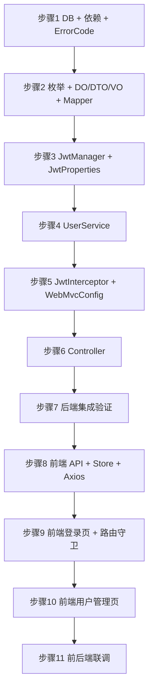

# 实现步骤指南

> **规划调整说明（2026-08-03）**：本文档原为「迭代一：卡牌数据落地」的实现步骤，按 MVP 优先原则重新规划后，**迭代一变更为「基础设施 + 用户系统（含用户管理）」**，迭代二才是卡牌与产品管理。详见 [需求分析 §6](./01-需求分析.md#6-需求优先级与迭代规划)。
>
> 文件名保留历史名称不变（避免 AGENTS.md 索引失效），内容以下方「新迭代一」为准。

---

## 总路线：三阶段 MVP

```
阶段一（先能管）
  ├─ 迭代一：基础设施 + 用户系统（含用户管理）  ← 本文档当前步骤
  └─ 迭代二：卡牌与产品管理
阶段二（先能玩）
  ├─ 迭代三：卡组构筑 + 游戏端登录
  ├─ 迭代四：引擎核心最简版（无效果）
  └─ 迭代五：对战 API + 游戏对战页
阶段三（再完善）
  └─ 迭代六~九：效果/关键词 → AI → 排位 → 体验增强
```

---

# 新迭代一：基础设施 + 用户系统（含用户管理）

> 对应详细设计：[04-详细设计-迭代二（用户系统与用户管理）](./04-详细设计-迭代二-用户系统与权限管理.md)
>
> **目标**：交付「管理后台能登录、能管用户」的最小闭环。登录注册与用户管理 CRUD 一次做完（同操作 `mtcg_user` 表，共用 `UserService` / `UserMapper`，不拆分）。
>
> **鉴权方案**：不引入 Spring Security，自实现 JWT 拦截器 + `@RequireRole` 注解（详见详细设计 §1.4 D1 决策）。

### 步骤状态

| 步骤 | 内容 | 状态 |
| --- | --- | --- |
| 1 | 后端 - 数据库建表（四表）+ 依赖补充 + ErrorCode 扩展 | 🔲 |
| 2 | 后端 - 枚举 + 用户 DO/DTO/VO + Mapper | 🔲 |
| 3 | 后端 - JwtManager + JwtProperties（Token 生成/校验） | 🔲 |
| 4 | 后端 - UserService（登录注册 + 资料改密 + 管理员 CRUD） | 🔲 |
| 5 | 后端 - JwtInterceptor + @RequireRole + WebMvcConfig | 🔲 |
| 6 | 后端 - Controller（Auth + User + AdminUser） | 🔲 |
| 7 | 后端 - 集成验证（Swagger + curl 全用例） | 🔲 |
| 8 | 前端 - API 层 + Pinia Store + Axios 拦截器 | 🔲 |
| 9 | 前端 - 管理后台登录页 + 路由守卫 | 🔲 |
| 10 | 前端 - 管理后台用户管理页 | 🔲 |
| 11 | 前后端联调验证 | 🔲 |

---

## 现有代码盘点

开始前，先盘点后端已有代码的真实状态（经实际核查）：

| 文件 | 状态 | 说明 |
| --- | --- | --- |
| `Result.java` | ✅ 可用 | 统一响应体已完善，含 success/fail/page 方法 |
| `ErrorCode.java` | ⚠️ 需补充 | 缺少用户/权限相关错误码 |
| `BusinessException.java` | ✅ 可用 | 业务异常类已存在 |
| `GlobalExceptionHandler.java` | ✅ 可用 | 全局异常处理已存在 |
| `PageVO.java` | ✅ 可用 | 分页 VO 已存在（records + total） |
| `CorsConfig.java` | ✅ 可用 | 已放行所有跨域 |
| `pom.xml` | ⚠️ 需补充 | 缺少 jjwt、spring-security-crypto |
| `application.yml` | ✅ 可用 | 已配置 PostgreSQL，端口 8081，context-path /api |
| `init.sql` | ⚠️ 需重写 | 需按新规划重写四张表 |
| `CardDO.java` | ⚠️ 迭代二重构 | 本迭代只建表 |
| `EnumCardType.java` | ⚠️ 本迭代建好 | 迭代二再细化 |
| `mtcg-client/` | ✅ 已创建 | Monorepo 结构已搭建；admin-web 基础就绪 |

---

## 步骤 1：后端 - 数据库建表 + 依赖补充 + ErrorCode 扩展

### 实现内容

1. 补充 `pom.xml` 依赖：`jjwt-api` + `jjwt-impl` + `jjwt-jackson`（0.12.6）、`spring-security-crypto`（BCrypt 加密工具，**不引入 Spring Security 过滤链**）
2. 重写 `init.sql`：一次性建立 `mtcg_user`、`mtcg_card`、`mtcg_product`、`mtcg_product_category` 四张表 + CHECK 约束 + update_time 触发器 + 默认管理员
3. 补充 `application.yml`：新增 `mtcg.jwt.*` 配置段
4. 补充 `ErrorCode`：用户/权限领域错误码

### 关键改动

**pom.xml 新增**：

```xml
<properties>
    <jjwt.version>0.12.6</jjwt.version>
</properties>

<!-- JWT -->
<dependency>
    <groupId>io.jsonwebtoken</groupId>
    <artifactId>jjwt-api</artifactId>
    <version>${jjwt.version}</version>
</dependency>
<dependency>
    <groupId>io.jsonwebtoken</groupId>
    <artifactId>jjwt-impl</artifactId>
    <version>${jjwt.version}</version>
    <scope>runtime</scope>
</dependency>
<dependency>
    <groupId>io.jsonwebtoken</groupId>
    <artifactId>jjwt-jackson</artifactId>
    <version>${jjwt.version}</version>
    <scope>runtime</scope>
</dependency>
<!-- BCrypt 加密工具（仅 crypto 模块，不引入 Security 过滤链） -->
<dependency>
    <groupId>org.springframework.security</groupId>
    <artifactId>spring-security-crypto</artifactId>
</dependency>
```

**application.yml 新增**：

```yaml
mtcg:
  jwt:
    secret: ${MTCG_JWT_SECRET:changeme-please-use-a-long-random-secret-key-32chars}
    expire-minutes: 120
    header: Authorization
    token-prefix: "Bearer "
```

**init.sql**：见详细设计 [§2.1](./04-详细设计-迭代二-用户系统与权限管理.md#21-建表sql三张表一次建完)，四张表 + 触发器 + 默认管理员一次建完。

**ErrorCode 补充**：

```java
// 认证相关
USER_NOT_FOUND(1001, "用户不存在"),
USERNAME_DUPLICATE(1002, "用户名已存在"),
PASSWORD_INCORRECT(1003, "用户名或密码错误"),
USER_DISABLED(1004, "账号已被禁用"),
LOGIN_REQUIRED(1005, "未登录"),
// Token 相关
TOKEN_INVALID(1006, "Token 无效或已过期"),
// 权限相关
PERMISSION_DENIED(1010, "无操作权限"),
CANNOT_MODIFY_SELF(1012, "不能禁用/删除自己的账号"),
CANNOT_DELETE_SYSADMIN(1014, "禁止删除系统管理员账号"),
OLD_PASSWORD_INCORRECT(1015, "原密码错误"),
```

### 检验方式

- `mvn compile` 编译通过（含新增 jjwt + crypto 依赖）
- 启动应用，`init.sql` 自动执行无报错
- PgAdmin 查看到 4 张表 + CHECK 约束 + 3 个触发器
- 默认管理员 `admin` 行已插入

---

## 步骤 2：后端 - 枚举 + 用户 DO/DTO/VO + Mapper

### 实现内容

1. 新建枚举（`com.aris.mtcg.common.enums`）：
   - `EnumUserRole`（PLAYER/CARD_ADMIN/SYS_ADMIN/AI）— 本迭代核心
   - `EnumUserStatus`（ACTIVE/DISABLED）— 本迭代核心
   - `EnumCardType`、`EnumColor`、`EnumRarity` — 迭代二用，本迭代顺便建好；产品类型改为 `mtcg_product_category` 分类表管理（迭代二）
2. 新建 `UserDO`（`domain/entity`）+ `UserMapper`（`dao`）
3. 新建 DTO（`domain/dto`）：
   - `UserRegisterDTO`、`UserLoginDTO`、`UserUpdateDTO`、`ChangePasswordDTO`
   - `UserQueryDTO`、`AdminUserCreateDTO`、`AdminUserUpdateDTO`
4. 新建 VO（`domain/vo`）：`UserVO`、`LoginVO`
5. 新建常量（`common/constant`）：`SecurityConstant`（ATTR_USER_ID / ATTR_USERNAME / ATTR_ROLE）
6. 新建注解（`common/annotation`）：`@RequireRole`

### 关键要点

| 要点 | 说明 |
| --- | --- |
| 枚举命名 | `Enum` 前缀（如 `EnumUserRole`），`code` 存 DB，`desc` 中文展示 |
| UserDO 表名 | `@Table("\"mtcg_user\"")` — PostgreSQL 保留字需双引号转义 |
| DTO 校验 | `@NotBlank` / `@Length` 注解，Controller 层 `@Valid` 触发 |
| UserVO | 不含 `passwordHash`，对外永不暴露密文 |

代码详见详细设计 [§3 枚举](./04-详细设计-迭代二-用户系统与权限管理.md#3-枚举设计)、[§4 实体类](./04-详细设计-迭代二-用户系统与权限管理.md#4-实体类设计)、[§5 DAO](./04-详细设计-迭代二-用户系统与权限管理.md#5-dao-层设计)。

### 检验方式

- `mvn compile` 编译通过
- DTO 校验注解生效（空值时 Validation 返回 400 + 错误信息）

---

## 步骤 3：后端 - JwtManager + JwtProperties

### 实现内容

1. 新建 `JwtProperties`（`config`）— `@ConfigurationProperties(prefix = "mtcg.jwt")`，绑定 secret / expireMinutes / header / tokenPrefix
2. 新建 `JwtManager`（`manager`）— `@Component`，封装 JWT 生成 / 解析 / 校验

### 关键要点

| 要点 | 说明 |
| --- | --- |
| 依赖 | `io.jsonwebtoken`（jjwt 0.12.6 API） |
| Claims | userId / username / role 三个自定义 claim |
| 签名算法 | HMAC-SHA，密钥从 `JwtProperties.secret` 读取 |
| 过期时间 | 默认 120 分钟 |
| 异常处理 | parse 失败抛 `BusinessException(ErrorCode.TOKEN_INVALID)` |

代码详见详细设计 [§6 Manager 层](./04-详细设计-迭代二-用户系统与权限管理.md#6-manager-层设计jwt)。

### 检验方式

- 单元测试：`generateToken → parse → getUserId` 往返一致
- 过期 Token 解析抛 TOKEN_INVALID

---

## 步骤 4：后端 - UserService

### 实现内容

新建 `UserService` 接口 + `UserServiceImpl`（`service` / `service.impl`），统一一个 Service 同时支持**玩家自操作**和**管理员操作**：

| 方法分组 | 方法 | 调用者 |
| --- | --- | --- |
| 匿名 | `register` / `login` | 匿名 |
| 自操作 | `getCurrentUserInfo` / `updateCurrentUser` / `changePassword` | 登录用户 |
| 管理员 | `listUsers` / `getUserById` / `adminCreateUser` / `adminUpdateUser` / `adminUpdateStatus` / `adminDeleteUser` | SYS_ADMIN |
| 拦截器 | `verifyAndLoad(token)` | JwtInterceptor |

### 关键要点

| 要点 | 说明 |
| --- | --- |
| 密码加密 | `BCryptPasswordEncoder`（spring-security-crypto），注册时 encode，登录时 matches |
| 防枚举 | 登录失败统一返回"用户名或密码错误"，不区分用户名是否存在 |
| 安全保护 | 禁止禁用 SYS_ADMIN、禁止删除 SYS_ADMIN、禁止操作自己（currentUserId 校验） |
| 分页查询 | `UserMapper.paginate(Page.of(page, size), queryWrapper)` — MyBatis-Flex 原生分页 |
| DO→VO | `toVO()` 方法过滤 passwordHash，永不暴露密文 |

代码详见详细设计 [§7 Service 层](./04-详细设计-迭代二-用户系统与权限管理.md#7-service-层设计)。

### 检验方式

- 单元测试：`register → login → JWT 解析 userId/role` 全流程
- 安全测试：禁用用户 login → 抛 USER_DISABLED；管理员禁用自己 → 抛 CANNOT_MODIFY_SELF

---

## 步骤 5：后端 - JwtInterceptor + @RequireRole + WebMvcConfig

### 实现内容

1. 新建 `JwtInterceptor`（`component`）— 实现 `HandlerInterceptor.preHandle`
2. 新建 `WebMvcConfig`（`config`）— 实现 `WebMvcConfigurer.addInterceptors`，注册 JwtInterceptor

### 关键要点

| 要点 | 说明 |
| --- | --- |
| 拦截范围 | `addPathPatterns("/**")`，排除 `/auth/**`、`/health`、`/swagger-ui/**`、`/v3/api-docs/**` |
| @RequireRole 解析 | 方法注解优先于类注解；空数组表示仅需登录（任意角色） |
| 身份写入 | `request.setAttribute(ATTR_USER_ID/ATTR_USERNAME/ATTR_ROLE)`，Controller 用 `@RequestAttribute` 取用 |
| 非 Controller 请求 | `handler instanceof HandlerMethod` 判断，静态资源等直接放行 |
| 与 CorsConfig 共存 | 两者都实现 `WebMvcConfigurer`，Spring 合并配置互不影响 |

代码详见详细设计 [§9 拦截器与鉴权](./04-详细设计-迭代二-用户系统与权限管理.md#9-拦截器与鉴权设计)。

### 检验方式

- 启动应用，匿名访问 `/users/me` → 返回 `{"code":1005,"message":"未登录"}`
- 注册 → 登录拿到 Token → 带 `Authorization: Bearer <token>` 访问 `/users/me` → 返回用户信息
- PLAYER 带 Token 访问 `/admin/users` → 返回 `{"code":1010,"message":"无操作权限"}`

---

## 步骤 6：后端 - Controller 层

### 实现内容

新建 3 个 Controller，**职责按调用者角色拆分**：

| Controller | 路径 | 鉴权 | 接口数 |
| --- | --- | --- | --- |
| `AuthController` | `/auth` | 匿名 | 2（register / login） |
| `UserController` | `/users` | 任意已登录 | 3（me / updateMe / changePassword） |
| `AdminUserController` | `/admin/users` | `@RequireRole(SYS_ADMIN)` | 6（list / detail / create / update / updateStatus / delete） |

### 关键要点

| 要点 | 说明 |
| --- | --- |
| 权限隔离 | `/users/me` 路径不含 userId，从 `@RequestAttribute(ATTR_USER_ID)` 取，玩家只能操作自身 |
| 管理员操作 | AdminUserController 类级 `@RequireRole(SYS_ADMIN)`，所有方法自动鉴权 |
| "禁止操作自己" | update / updateStatus / delete 方法从 `@RequestAttribute` 取 currentUserId 传入 Service 校验 |

代码详见详细设计 [§8 Controller 层](./04-详细设计-迭代二-用户系统与权限管理.md#8-controller-层设计)。

### 检验方式

- Swagger UI 看到三个 Controller 共 11 个接口
- 用 curl/Postman 按步骤 7 的验证用例全流程跑一遍

---

## 步骤 7：后端 - 集成验证

### 验证用例（端到端，必须全部通过）

```
【匿名场景】
1.  POST /auth/register  → 注册新用户 player1，返回 userId
2.  POST /auth/register  → 重复用户名 → 1002 用户名已存在
3.  POST /auth/login     → 错误密码 → 1003 用户名或密码错误
4.  POST /auth/login     → 成功 → 返回 token + user
5.  GET  /users/me       → 无 Token → 1005 未登录

【登录用户场景】
6.  GET  /users/me       → 带 Token → 返回自己信息（无 passwordHash）
7.  PUT  /users/me       → 修改昵称 → 下次 GET /me 昵称已更新
8.  PUT  /users/me/password → 改密 → 旧密码登录失败，新密码可登录

【管理员场景】
9.  POST /auth/login     → admin 登录 → SYS_ADMIN Token
10. GET  /admin/users    → 列表（含分页）
11. POST /admin/users    → 新增 player2（role=PLAYER）
12. PATCH /admin/users/{player1_id}/status?status=DISABLED → 禁用
13. POST /auth/login     → player1 登录 → 1004 账号已被禁用
14. PATCH /admin/users/{player1_id}/status?status=ACTIVE → 解禁
15. PATCH /admin/users/{admin_id}/status?status=DISABLED → 1012 禁止禁用 SYS_ADMIN
16. DELETE /admin/users/{admin_id} → 1014 禁止删除 SYS_ADMIN
17. DELETE /admin/users/{player2_id} → 删除成功

【权限边界】
18. PLAYER Token → GET /admin/users → 1010 无操作权限
19. Token 过期/篡改 → 1006 Token 无效或已过期
```

---

## 步骤 8：前端 - API 层 + Pinia Store + Axios 拦截器

### 实现内容（mtcg-client/packages/common）

1. **类型定义** `src/types/user.ts`：`UserVO`、`LoginVO`、`UserRegisterDTO`、`UserLoginDTO`、`UserQueryDTO`、`AdminUserCreateDTO` 等 TypeScript 接口
2. **API 层**：
   - `src/api/authApi.ts`：`login(dto)` / `register(dto)`
   - `src/api/userApi.ts`：`getMe()` / `updateMe(dto)` / `changePassword(dto)` / `listUsers(query)` / `getUserById(id)` / `adminCreateUser(dto)` / `adminUpdateUser(id, dto)` / `adminUpdateStatus(id, status)` / `adminDeleteUser(id)`
3. **Pinia Store** `src/stores/userStore.ts`：
   - state：`token`、`userInfo`（UserVO | null）
   - getters：`isLoggedIn`、`role`
   - actions：`login(dto)` / `fetchUserInfo()` / `logout()` / `isAdmin()`
   - 持久化：token 存 localStorage `mtcg_token`，刷新页面时恢复
4. **Axios 实例** `src/utils/request.ts`：
   - 请求拦截器：自动注入 `Authorization: Bearer ${token}`
   - 响应拦截器：code !== 0 时统一 `ElMessage.error(message)`；401/1005/1006 → 清 token + 跳 `/login`；403/1010 → 提示权限不足

### 关键要点

| 要点 | 说明 |
| --- | --- |
| API base URL | `http://localhost:8081/api`（后端 context-path /api） |
| Token 持久化 | localStorage `mtcg_token`，userStore 初始化时从 localStorage 恢复 |
| 统一响应处理 | 响应拦截器统一解包 `Result<T>`，成功返回 `data`，失败弹提示 |
| 401 自动跳登录 | 响应拦截器拦截 1005/1006，清 store + 跳 `/login` |

### 检验方式

- `npm run dev:admin` 启动，浏览器控制台无报错
- 手动调 `authApi.login({ username: 'admin', password: 'admin123' })` → 拿到 token + userInfo

---

## 步骤 9：前端 - 管理后台登录页 + 路由守卫

### 实现内容（mtcg-client/packages/admin-web）

1. **路由配置** `src/router/index.ts`：
   - `/login` → LoginPage（免鉴权）
   - `/` → MainLayout（需鉴权），子路由：
     - `/dashboard` → 仪表盘
     - `/system/users` → UserListView（meta.roles: ['SYS_ADMIN']）
   - `router.beforeEach` 守卫：
     - 无 token → 跳 `/login`
     - 有 token 但角色不匹配 meta.roles → 跳 `/403`
     - 已登录访问 `/login` → 跳 `/`

2. **登录页** `src/views/auth/LoginPage.vue`：
   - 表单：用户名 + 密码 + 登录按钮
   - 校验：用户名/密码非空
   - 提交：调 `userStore.login(dto)` → 成功跳 `/`，失败 `ElMessage.error`
   - 布局：居中卡片，标题「MTCG 管理后台」

3. **主布局** `src/layouts/MainLayout.vue`（修改已有）：
   - 顶部栏：左侧 Logo + 标题，右侧用户昵称 + 角色标签 + 退出按钮
   - 侧边栏菜单：仪表盘 / 系统管理（用户管理）
   - 角色标签颜色：PLAYER info灰 / CARD_ADMIN primary蓝 / SYS_ADMIN warning橙
   - 退出按钮：清 userStore → 跳 `/login`

### 检验方式

- 访问 `localhost:5175` → 自动跳 `/login`
- 输入 admin/admin123 → 成功跳仪表盘，顶部栏显示「系统管理员 · SYS_ADMIN」
- 刷新页面 → 保持登录态（localStorage 恢复 token）
- 点退出 → 清 token → 回到登录页

---

## 步骤 10：前端 - 管理后台用户管理页

### 实现内容

新增路由 `/system/users`，页面 `src/views/system/UserListView.vue`：

| 区块 | 内容 |
| --- | --- |
| **查询条件** | 用户名（模糊）、角色（下拉）、状态（下拉）、查询/重置按钮 |
| **操作按钮** | 「新增用户」按钮 |
| **分页表格** | 列：ID、用户名、昵称、角色（el-tag 色区分）、状态（el-switch 开关）、创建时间、操作列（编辑 / 删除） |
| **新增/编辑弹窗** | el-dialog 表单：用户名、密码（新增时必填）、昵称、角色（下拉）、状态 |
| **删除确认** | el-message-box 二次确认 |
| **分页** | el-pagination 固定底部 |

### 设计要点（符合管理后台 UI 约定）

| 约定 | 实现方式 |
| --- | --- |
| 内容区撑满高度 | 外层 `flex flex-col h-full`；表格区 `flex: 1 overflow-auto` |
| 分页固定底部 | `<el-pagination class="py-3 shrink-0">`，不被滚动 |
| Element Plus 默认主题 | 不额外改色，用默认白蓝 |
| 角色标签颜色 | PLAYER `type="info"` / CARD_ADMIN `type="primary"` / SYS_ADMIN `type="warning"` |
| 状态开关 | `el-switch`：ACTIVE 绿色 / DISABLED 灰色，切换时确认后调 PATCH 接口 |
| 操作列 | 编辑按钮 + 删除按钮（el-button text 类型），SYS_ADMIN 行的删除按钮可禁用 |

### 检验方式

- 管理员登录 → 菜单点「系统管理 / 用户管理」→ 表格展示用户列表
- 按用户名模糊搜索 → 结果正确
- 按角色=SYS_ADMIN 筛选 → 仅显示管理员
- 新增用户 → 列表出现新行
- 切换禁用开关 → 该用户尝试登录返回账号禁用
- 尝试点 admin 行的删除 → 后端拦截失败弹窗提示

---

## 步骤 11：前后端联调验证

### 全流程集成测试

```
1. 启动后端（mvn spring-boot:run）+ 启动前端（npm run dev:admin）
2. 浏览器打开管理后台 → 登录页
3. admin 登录 → 进入仪表盘
4. 进入用户管理页：
   - 看到用户列表
   - 新增一个 CARD_ADMIN 角色用户
   - 用该账号重新登录 → 菜单不同（看不到用户管理，因为非 SYS_ADMIN）
5. 再用 admin 登录 → 把该账号禁用 → 重新登录失败
6. 顶部栏修改密码 → 退出后用新密码登录成功
```

### 浏览器开发者工具检查

- Network 面板所有请求路径 `/api/...`
- 受保护接口 Request Headers 含 `Authorization: Bearer xxx`
- 所有响应 JSON 结构 `{code, message, data}` 一致
- 无 CORS 报错（CorsConfig 已生效）

---

## 步骤依赖关系



后端链路 1→2→3→4→5→6→7 串行；前端链路 8→9→10 依赖后端验证通过；步骤 11 是最终集成门禁。

---

## 文件清单总览（迭代一）

### 后端（mtcg-server）— 28 个文件

| # | 文件 | 包路径 | 步骤 |
| --- | --- | --- | --- |
| 1 | `EnumUserRole.java` | `common/enums` | 2 |
| 2 | `EnumUserStatus.java` | `common/enums` | 2 |
| 3 | `EnumCardType.java` | `common/enums` | 2 |
| 4 | `EnumColor.java` | `common/enums` | 2 |
| 5 | `EnumRarity.java` | `common/enums` | 2 |
| 6 | ~~`EnumProductType.java`~~（已移除，产品类型改为 `mtcg_product_category` 分类表管理） | `common/enums` | — |
| 7 | `RequireRole.java` | `common/annotation` | 2 |
| 8 | `SecurityConstant.java` | `common/constant` | 2 |
| 9 | `UserDO.java` | `domain/entity` | 2 |
| 10 | `UserRegisterDTO.java` | `domain/dto` | 2 |
| 11 | `UserLoginDTO.java` | `domain/dto` | 2 |
| 12 | `UserUpdateDTO.java` | `domain/dto` | 2 |
| 13 | `ChangePasswordDTO.java` | `domain/dto` | 2 |
| 14 | `UserQueryDTO.java` | `domain/dto` | 2 |
| 15 | `AdminUserCreateDTO.java` | `domain/dto` | 2 |
| 16 | `AdminUserUpdateDTO.java` | `domain/dto` | 2 |
| 17 | `UserVO.java` | `domain/vo` | 2 |
| 18 | `LoginVO.java` | `domain/vo` | 2 |
| 19 | `UserMapper.java` | `dao` | 2 |
| 20 | `JwtProperties.java` | `config` | 3 |
| 21 | `JwtManager.java` | `manager` | 3 |
| 22 | `UserService.java` | `service` | 4 |
| 23 | `UserServiceImpl.java` | `service/impl` | 4 |
| 24 | `JwtInterceptor.java` | `component` | 5 |
| 25 | `WebMvcConfig.java` | `config` | 5 |
| 26 | `AuthController.java` | `controller` | 6 |
| 27 | `UserController.java` | `controller` | 6 |
| 28 | `AdminUserController.java` | `controller` | 6 |

**配置/已有文件变更**：

| 文件 | 变更内容 | 步骤 |
| --- | --- | --- |
| `pom.xml` | 新增 jjwt + spring-security-crypto | 1 |
| `application.yml` | 新增 `mtcg.jwt.*` | 1 |
| `ErrorCode.java` | 新增用户/权限错误码 | 1 |
| `init.sql` | 重写四张表 + 触发器 | 1 |

### 前端（mtcg-client）— 8 项

| # | 文件 | 步骤 |
| --- | --- | --- |
| 1 | `packages/common/src/types/user.ts` | 8 |
| 2 | `packages/common/src/api/authApi.ts` | 8 |
| 3 | `packages/common/src/api/userApi.ts` | 8 |
| 4 | `packages/common/src/stores/userStore.ts` | 8 |
| 5 | `packages/common/src/utils/request.ts`（修改或新建） | 8 |
| 6 | `packages/admin-web/src/router/index.ts`（修改） | 9 |
| 7 | `packages/admin-web/src/views/auth/LoginPage.vue` | 9 |
| 8 | `packages/admin-web/src/views/system/UserListView.vue` | 10 |

---

# 后续迭代概览（路标）

> 每个迭代结束后，单独撰写对应实现步骤指南。

| 迭代 | 目标 | 关键交付 |
| --- | --- | --- |
| **迭代二** | 卡牌与产品 CRUD + 管理后台页对接 | CardDO 重构、CardService/ProductService、卡牌列表页/表单、产品列表页/详情 |
| **迭代三** | 卡组构筑 + 游戏端登录 | `mtcg_deck` 表、DeckService、卡组校验（最简 50+9）、game-pc 登录页、卡组编辑页 |
| **迭代四** | 引擎最简版（无效果） | `engine` 包：GameState、PlayerState、CardInstance、PhaseType + 回合处理器、基础战斗（战力比较）、胜负判定 |
| **迭代五** | 对战 API + 游戏对战页 | GameController、GameService、`mtcg_game_record` 表、game-pc BattleView 可实际对战 |
| **迭代六** | 效果系统 + 关键词 | EffectType/EffectResolver、KeywordHandler、Lv4+ 撤退规则 |
| **迭代七** | AI 对战 | AIManager、局面评估、启发式决策、难度分级 |
| **迭代八** | 排位系统 | `mtcg_rank_info` 表、段位枚举、匹配算法、排行榜 API、赛季重置 |
| **迭代九** | 体验增强 | 头像系统、消息通知、打牌习惯分析、系统配置管理、操作审计日志 |
