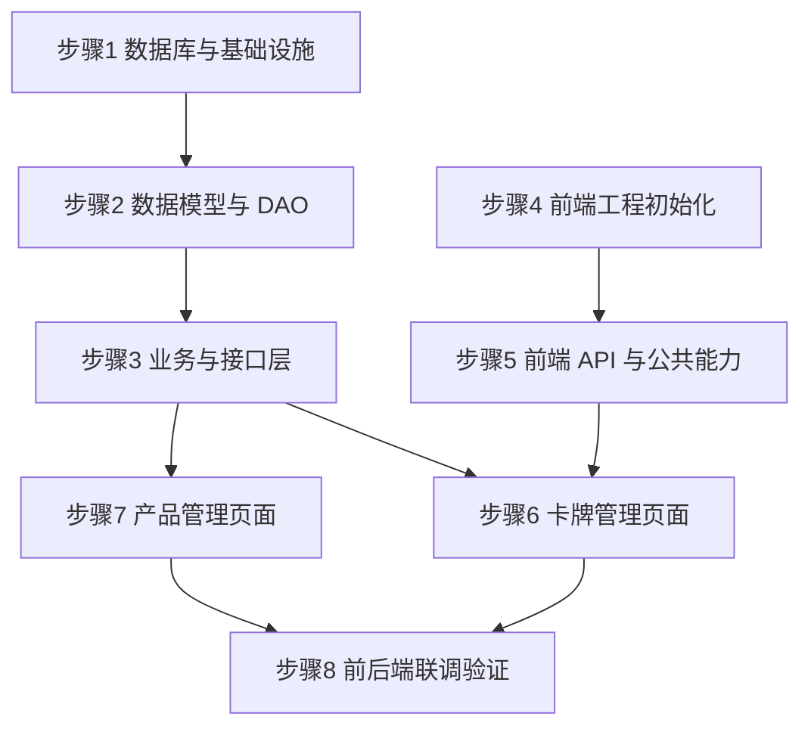

# 实现步骤指南 - 迭代一：卡牌数据落地

> 对应设计文档：[详细设计-迭代一](./03-详细设计-迭代一-卡牌数据落地.md)
> 目标：完成卡牌与产品数据的 CRUD 全链路，**前后端协同**跑通 Vue 管理后台 -> Axios -> Spring Boot Controller -> Service -> MyBatis-Flex DAO -> PostgreSQL 的完整数据闭环。

### 步骤状态

> 规则参考：[编码规范 §9 实现步骤状态跟踪](../编码规范/后端AI编码规范.md#9-实现步骤状态跟踪)

| 步骤 | 内容 | 状态 |
| --- | --- | --- |
| 1 | 后端 - 数据库与基础设施 | 🔲 |
| 2 | 后端 - 数据模型与 DAO 层 | 🔲 |
| 3 | 后端 - 业务与接口层 | 🔲 |
| 4 | 前端 - 管理后台工程初始化 | 🔲 |
| 5 | 前端 - API 层与公共能力 | 🔲 |
| 6 | 前端 - 卡牌管理页面 | 🔲 |
| 7 | 前端 - 产品管理页面 | 🔲 |
| 8 | 前后端联调与集成验证 | 🔲 |

---

## 前端开发策略（2026-08-02 决策）：PC 先行、移动端后续对齐

> 为提升迭代效率，避免 PC / 移动双线重复调整布局与交互，对战视图（BattleView）采用"先在 PC 端定稿、再一次性回补移动端"的推进顺序。

| 端 | 包 | 当前策略 |
| --- | --- | --- |
| PC 端游戏客户端 | `mtcg-client/packages/game-pc` | **优先迭代**：完成对战视图全部样式与逻辑（布局、事件、状态对接、动画、交互） |
| 移动端游戏客户端 | `mtcg-client/packages/game-mobile` | **冻结（待 PC 端稳定后再同步）**：不新增对战视图改动，避免与 PC 端重复劳动 |

### PC 端对战视图（BattleView.vue）阶段性子任务

| # | 子任务 | 说明 | 当前状态 |
| --- | --- | --- | --- |
| 1 | 卡牌比例确定 | 取自项目素材 `assets/card/designs/*.png` = **747×1042**（宽:高 ≈ 0.717），全端统一用 `aspect-ratio: 747 / 1042` | ✅ 已完成 |
| 2 | 卡组/冲击卡组块 | 显示对应卡背图 + 标签（角色卡组/冲击卡组） + 剩余统计数；对手标签置底（靠中线侧）、我方置顶 | ✅ 已完成 |
| 3 | 基地区 | 6 个卡槽位：高度 = 1 卡高，宽度 = 6 卡宽 + 5 gap；卡槽内部也用卡牌比例 | ✅ 已完成 |
| 4 | 顶/底栏布局 | 角色卡组靠左、冲击卡组靠右、基地区居中（`space-between`） | ✅ 已完成 |
| 5 | 战区菱形卡位比例 | 统一用卡牌素材比例（替换此前 5:7 近似值） | ✅ 已完成 |
| 6 | 菱形战区交互 | 卡位选中、拖拽、高亮、放置合法性提示 | 🔲 待实现 |
| 7 | 手牌区逻辑 | 手牌渲染、展开/收起、拖拽到战区、手牌上限管理 | 🔲 待实现 |
| 8 | HUD 对接 | 阶段徽章、回合数、时间线进度、结束阶段/认输按钮接真实 store | 🔲 待实现 |
| 9 | 时间线区 | 9 个堆叠槽位可视化 + 堆叠动画 | 🔲 待实现 |
| 10 | 撤退/裁剪区交互 | 卡牌拖入/移出提示、剩余数统计 | 🔲 待实现 |
| 11 | 引擎事件驱动 | 对局开始/抽牌/行动/结算等事件联动 UI 动画 | 🔲 待实现 |
| 12 | 移动端同步 | 以上 PC 端 6–11 完成并稳定后，一次性同步到 `game-mobile` 的 BattleView | 🔲 待实现 |

### 后续同步原则（移动端冻结解除时）
1. **卡牌比例变量、卡背资源路径、卡组块结构**直接复用（`--card-aspect: 747/1042`、`/card_back_xxx.png`、`deck-tag + deck-count` 结构）
2. 布局调整仅将绝对定位/网格的 px 值换成 `vw / clamp()`，语义不变
3. 所有交互事件（点击/拖放/状态切换）与 PC 端逻辑一致，仅替换触摸事件适配

---

## 现有代码盘点

开始前，先盘点后端已有代码的真实状态（经实际核查）：

| 文件 | 状态 | 说明 |
| --- | --- | --- |
| `CardDO.java` | ⚠️ 需重构 | `@Table("card")`，字段为旧的 cost/attack/health，需改为 level/color/power 等，表名改 mtcg_card |
| `EnumCardType.java` | ⚠️ 需重构 | 值为 HERO/UNIT/EVENT/ITEM，需改为 CHARACTER/RUSH_POINT |
| `CardMapper.java` | ✅ 可用 | 继承 BaseMapper，无需改动 |
| `Result.java` | ✅ 可用 | 统一响应体已完善，含 success/fail/page 方法 |
| `ErrorCode.java` | ⚠️ 需补充 | 缺少卡牌/产品相关错误码（仅有 1001/1002 预留码） |
| `BusinessException.java` | ✅ 可用 | 业务异常类已存在 |
| `GlobalExceptionHandler.java` | ✅ 可用 | 全局异常处理已存在 |
| `PageVO.java` | ✅ 可用 | 分页 VO 已存在（records + total） |
| `CorsConfig.java` | ✅ 可用 | 已放行所有跨域，前端开发无阻 |
| `pom.xml` | ✅ 可用 | 已含 PostgreSQL 驱动 42.7.3、MyBatis-Flex 1.9.5、SpringDoc 2.8.8，无 SQLite 依赖 |
| `application.yml` | ✅ 可用 | 已配置 PostgreSQL（url=jdbc:postgresql://localhost:5432/db_mtcg），端口 8081，context-path /api |
| `init.sql` | ⚠️ 需重构 | 字段为旧结构（cost/attack/health），需按新表结构重写并补充产品表 |
| `mtcg-client/` | ✅ 已创建 | Monorepo 项目结构已搭建（common/game-pc/game-mobile），共享包基础骨架就绪；管理后台页面待后续添加 |

---

## 步骤 1：后端 - 数据库与基础设施

### 实现内容

1. 确认 PostgreSQL 连接正常（`application.yml` 已配好，无需改动）
2. 重写 `init.sql`：`mtcg_card` 表 + `mtcg_product` 表（PostgreSQL DDL，含 CHECK 约束、索引、update_time 触发器）
3. 重构枚举 `EnumCardType`（CHARACTER/RUSH_POINT），新建 `EnumColor`（6 色）、`EnumRarity`（12 种）、`EnumProductType`（3 种）
4. 补充 `ErrorCode`：卡牌相关错误码 2001-2003、产品相关 2004-2005

### 设计意义

数据库与枚举是整个迭代的地基。表结构必须与《超英击战》规则对齐：实际卡牌字段是 level（等级）、color（颜色）、attack_range（攻击距离）、power（战力），而非通用 TCG 的 cost/attack/health。枚举字段用 VARCHAR + CHECK 约束存字符串名称（不存下标），既可读又防脏数据。枚举类作为固定值的单一真相来源，避免魔法字符串散落代码各处。

### 涉及文件

| 文件 | 操作 |
| --- | --- |
| `src/main/resources/sql/init.sql` | 重写 |
| `common/enums/EnumCardType.java` | 重构 |
| `common/enums/EnumColor.java` | 新建 |
| `common/enums/EnumRarity.java` | 新建 |
| `common/enums/EnumProductType.java` | 新建 |
| `common/result/ErrorCode.java` | 补充 |

### 关键改动

**init.sql（核心 DDL）**：

```sql
-- 卡牌统一表（角色卡 + 冲击卡）
CREATE TABLE IF NOT EXISTS mtcg_card (
    id              BIGSERIAL       PRIMARY KEY,
    card_code       VARCHAR(32)     NOT NULL UNIQUE,
    product_code    VARCHAR(16),                            -- 产品编号，如 BP01/SD01/PB01
    card_name       VARCHAR(128)    NOT NULL,
    card_type       VARCHAR(16)     NOT NULL,
    level           SMALLINT,                              -- 等级 Lv（1-6），冲击卡为 NULL
    color           VARCHAR(16),
    environment     VARCHAR(16),
    traits          VARCHAR(256),
    attack_range    SMALLINT,
    power           SMALLINT,
    rarity          VARCHAR(16)     NOT NULL,
    effect_text     TEXT,
    effect_json     TEXT,
    image_path      VARCHAR(256),
    create_time     TIMESTAMP       NOT NULL DEFAULT NOW(),
    update_time     TIMESTAMP       NOT NULL DEFAULT NOW(),
    CONSTRAINT ck_card_type CHECK (card_type IN ('CHARACTER', 'RUSH_POINT')),
    CONSTRAINT ck_color     CHECK (color IS NULL OR color IN ('RED','YELLOW','BLUE','GREEN','ORANGE','PURPLE')),
    CONSTRAINT ck_rarity    CHECK (rarity IN ('C','R','SR','GR','UR','MR','SEC','HR','LR','PR','ER','TR')),
    CONSTRAINT ck_level     CHECK (level IS NULL OR (level >= 1 AND level <= 6))
);

CREATE INDEX IF NOT EXISTS idx_card_type    ON mtcg_card (card_type);
CREATE INDEX IF NOT EXISTS idx_card_name    ON mtcg_card (card_name);
CREATE INDEX IF NOT EXISTS idx_card_color   ON mtcg_card (color);
CREATE INDEX IF NOT EXISTS idx_card_product ON mtcg_card (product_code);

-- 产品表（预组牌 / 补充包 / 推广包）
CREATE TABLE IF NOT EXISTS mtcg_product (
    id              BIGSERIAL       PRIMARY KEY,
    product_code    VARCHAR(16)     NOT NULL UNIQUE,
    product_name   VARCHAR(128)     NOT NULL,
    product_type    VARCHAR(16)     NOT NULL,
    release_date    DATE,
    description     TEXT,
    create_time     TIMESTAMP       NOT NULL DEFAULT NOW(),
    update_time     TIMESTAMP       NOT NULL DEFAULT NOW(),
    CONSTRAINT ck_product_type CHECK (product_type IN ('STRUCTURE_DECK', 'BOOSTER_PACK', 'PROMO_PACK'))
);

-- update_time 自动更新触发器
CREATE OR REPLACE FUNCTION update_update_time()
RETURNS TRIGGER AS $$
BEGIN
    NEW.update_time = NOW();
    RETURN NEW;
END;
$$ LANGUAGE plpgsql;

DROP TRIGGER IF EXISTS trigger_card_update_time ON mtcg_card;
CREATE TRIGGER trigger_card_update_time
    BEFORE UPDATE ON mtcg_card
    FOR EACH ROW EXECUTE FUNCTION update_update_time();

DROP TRIGGER IF EXISTS trigger_product_update_time ON mtcg_product;
CREATE TRIGGER trigger_product_update_time
    BEFORE UPDATE ON mtcg_product
    FOR EACH ROW EXECUTE FUNCTION update_update_time();
```

**EnumCardType 重构**：

```java
public enum EnumCardType {
    CHARACTER("CHARACTER", "角色卡"),
    RUSH_POINT("RUSH_POINT", "冲击卡");

    private final String code;
    private final String desc;

    EnumCardType(String code, String desc) {
        this.code = code;
        this.desc = desc;
    }
}
```

**EnumColor 新建**：

```java
public enum EnumColor {
    RED("RED", "红"), YELLOW("YELLOW", "黄"), BLUE("BLUE", "蓝"),
    GREEN("GREEN", "绿"), ORANGE("ORANGE", "橙"), PURPLE("PURPLE", "紫");
    // code + desc 构造同上
}
```

**EnumRarity 新建**：

```java
public enum EnumRarity {
    C("C", "普通"), R("R", "稀有"), SR("SR", "超稀有"), GR("GR", "黄金稀有"),
    UR("UR", "极度稀有"), MR("MR", "奇迹稀有"), SEC("SEC", "秘稀"), HR("HR", "隐藏稀有"),
    LR("LR", "传奇稀有"), PR("PR", "促销稀有"), ER("ER", "特别稀有"), TR("TR", "究极稀有");
    // code + desc 构造同上
}
```

**EnumProductType 新建**：

```java
public enum EnumProductType {
    STRUCTURE_DECK("STRUCTURE_DECK", "预组牌"),
    BOOSTER_PACK("BOOSTER_PACK", "补充包"),
    PROMO_PACK("PROMO_PACK", "推广包");
    // code + desc 构造同上
}
```

**ErrorCode 补充**：

```java
// 卡牌领域 2001-2003
CARD_NOT_FOUND(2001, "卡牌不存在"),
CARD_CODE_DUPLICATE(2002, "卡牌编号已存在"),
CARD_BATCH_IMPORT_FAILED(2003, "批量导入失败"),
// 产品领域 2004-2005
PRODUCT_NOT_FOUND(2004, "产品不存在"),
PRODUCT_CODE_DUPLICATE(2005, "产品编号已存在");
```

### 实现效果

- 数据库两张表按规则字段建立，枚举值与 CHECK 约束一一对应
- 错误码体系覆盖卡牌与产品两个领域，从 2000 段开始

### 检验方式

- 启动应用，`init.sql` 自动执行（`spring.sql.init.mode: always`），日志无 SQL 报错
- 数据库工具连接 PostgreSQL，确认 `mtcg_card`、`mtcg_product` 表已建、字段正确、CHECK 约束与触发器存在
- 尝试插入非法数据（如 `color='BLACK'`）应被 CHECK 拒绝
- `mvn compile` 编译通过，枚举 code 与 CHECK 约束一一对应

---

## 步骤 2：后端 - 数据模型与 DAO 层

### 实现内容

1. 重写 `CardDO`：对齐 `mtcg_card` 表结构（表名改 mtcg_card，字段改 level/color/power 等，含 productCode）
2. 新建 `ProductDO`：映射 `mtcg_product` 表
3. 新建 `ProductMapper`：继承 BaseMapper
4. 创建 DTO：`CardQueryDTO`、`CardCreateDTO`、`CardBatchImportDTO`、`ProductQueryDTO`、`ProductCreateDTO`
5. 创建 VO：`CardVO`、`BatchImportResultVO`、`ProductVO`

### 设计意义

`CardDO` 是数据库表的 Java 映射，字段不对齐会导致 MyBatis-Flex 读写数据时字段丢失或报错。DTO（入参，带 `@NotBlank`/`@NotNull` 校验）与 VO（出参，面向前端展示）分离是阿里手册标准分层规范：避免入参被篡改（如 id、createTime 不应由前端传入）、出参暴露不必要信息。`CardQueryDTO` 新增 `productCode` 字段，支撑按产品筛选卡牌的联调需求。

### 涉及文件

| 文件 | 操作 |
| --- | --- |
| `domain/entity/CardDO.java` | 重写 |
| `domain/entity/ProductDO.java` | 新建 |
| `dao/ProductMapper.java` | 新建 |
| `domain/dto/CardQueryDTO.java` | 新建 |
| `domain/dto/CardCreateDTO.java` | 新建 |
| `domain/dto/CardBatchImportDTO.java` | 新建 |
| `domain/dto/ProductQueryDTO.java` | 新建 |
| `domain/dto/ProductCreateDTO.java` | 新建 |
| `domain/vo/CardVO.java` | 新建 |
| `domain/vo/BatchImportResultVO.java` | 新建 |
| `domain/vo/ProductVO.java` | 新建 |

### 关键改动

**CardDO 重写**：

```java
@Data
@Table("mtcg_card")
public class CardDO {
    @Id(keyType = KeyType.Auto)
    private Long id;
    private String cardCode;
    private String productCode;      // 新增：关联产品
    private String cardName;
    private String cardType;
    private Short level;             // SMALLINT -> Short
    private String color;
    private String environment;
    private String traits;
    private Short attackRange;       // 攻击距离 R
    private Short power;             // 战力
    private String rarity;
    private String effectText;
    private String effectJson;
    private String imagePath;
    private LocalDateTime createTime;
    private LocalDateTime updateTime;
}
```

**ProductDO 新建**：

```java
@Data
@Table("mtcg_product")
public class ProductDO {
    @Id(keyType = KeyType.Auto)
    private Long id;
    private String productCode;
    private String productName;
    private String productType;
    private LocalDate releaseDate;
    private String description;
    private LocalDateTime createTime;
    private LocalDateTime updateTime;
}
```

**CardCreateDTO（带校验）**：

```java
@Data
public class CardCreateDTO {
    @NotBlank(message = "卡牌编号不能为空")
    private String cardCode;
    private String productCode;
    @NotBlank(message = "卡牌名称不能为空")
    private String cardName;
    @NotBlank(message = "卡牌类型不能为空")
    private String cardType;        // CHARACTER / RUSH_POINT
    private Short level;
    private String color;
    private String environment;
    private String traits;
    private Short attackRange;
    private Short power;
    @NotBlank(message = "稀有度不能为空")
    private String rarity;
    private String effectText;
    private String effectJson;
    private String imagePath;
}
```

**CardQueryDTO（分页 + 多条件）**：

```java
@Data
public class CardQueryDTO {
    private String cardName;       // 模糊查询
    private String cardType;
    private String color;
    private Short level;
    private String rarity;
    private String productCode;    // 按产品精确筛选
    private String traits;
    private Integer page = 1;
    private Integer size = 10;
}
```

**BatchImportResultVO**：

```java
@Data
@AllArgsConstructor
public class BatchImportResultVO {
    private int successCount;
    private int failCount;
    private List<String> failDetails;   // 失败卡牌编号 + 原因
}
```

### 实现效果

- 实体层与表结构完全对齐，MyBatis-Flex 读写无字段丢失
- 入参带校验注解，非法入参在 Web 层被拦截返回 400

### 检验方式

- `mvn compile` 编译通过
- 字段名与 init.sql 列名一一对应（依赖 `map-underscore-to-camel-case: true` 自动转换）
- DTO 校验注解生效：传空值时返回 `{"code":400,...}`

---

## 步骤 3：后端 - 业务与接口层

### 实现内容

1. `CardService` 接口 + `CardServiceImpl`（CRUD + 条件查询 + 批量导入）
2. `ProductService` 接口 + `ProductServiceImpl`（CRUD + 按产品筛选卡牌）
3. `CardController`（6 个卡牌接口，路径 `/v1/cards`）
4. `ProductController`（6 个产品接口，路径 `/v1/products`）
5. 后端集成验证：Swagger UI 看到 12 个接口，用 curl 验证 CRUD

### 设计意义

Service 层是业务编排中心，负责参数校验、对象转换（DTO↔DO↔VO）、调用 DAO、抛出业务异常。Controller 层是薄协议适配层，只做 HTTP 解析与 `Result<T>` 包装，不含业务逻辑——这样后续加 WebSocket/gRPC 入口时 Service 可直接复用。接口路径统一 `/api/v1/...`（context-path `/api` + Controller `/v1`）。

### 涉及文件

| 文件 | 操作 |
| --- | --- |
| `service/CardService.java` | 新建（接口） |
| `service/impl/CardServiceImpl.java` | 新建 |
| `service/ProductService.java` | 新建（接口） |
| `service/impl/ProductServiceImpl.java` | 新建 |
| `controller/CardController.java` | 新建 |
| `controller/ProductController.java` | 新建 |

### 关键改动

**CardServiceImpl 核心方法**：

```java
@Service
public class CardServiceImpl implements CardService {

    @Resource
    private CardMapper cardMapper;

    @Override
    public CardVO getCardById(Long id) {
        CardDO card = cardMapper.selectOneById(id);
        if (card == null) {
            throw new BusinessException(ErrorCode.CARD_NOT_FOUND);
        }
        return toVO(card);
    }

    @Override
    public Result<PageVO<CardVO>> listCards(CardQueryDTO query) {
        QueryWrapper qw = QueryWrapper.create()
            .where(CARD.NAME.like(query.getCardName()))   // 名称模糊
            .and(CARD.TYPE.eq(query.getCardType()))
            .and(CARD.COLOR.eq(query.getColor()))
            .and(CARD.LEVEL.eq(query.getLevel()))
            .and(CARD.PRODUCT_CODE.eq(query.getProductCode()));
        Page<CardDO> page = Page.of(query.getPage(), query.getSize());
        Page<CardDO> result = cardMapper.paginate(page, qw);
        List<CardVO> records = result.getRecords().stream().map(this::toVO).toList();
        return Result.page(records, result.getTotalRow());
    }

    @Override
    public Long createCard(CardCreateDTO dto) {
        // 校验编号唯一
        if (cardMapper.selectCountByQuery(QueryWrapper.create()
                .where(CARD.CODE.eq(dto.getCardCode()))) > 0) {
            throw new BusinessException(ErrorCode.CARD_CODE_DUPLICATE);
        }
        CardDO card = toDO(dto);
        cardMapper.insert(card);
        return card.getId();
    }

    @Override
    public BatchImportResultVO batchImport(List<CardCreateDTO> list) {
        int success = 0, fail = 0;
        List<String> failDetails = new ArrayList<>();
        for (CardCreateDTO dto : list) {
            try {
                createCard(dto);
                success++;
            } catch (Exception e) {
                fail++;
                failDetails.add(dto.getCardCode() + ": " + e.getMessage());
            }
        }
        return new BatchImportResultVO(success, fail, failDetails);
    }
    // updateCard / deleteCard 同理，校验存在性
}
```

**CardController（6 接口）**：

```java
@RestController
@RequestMapping("/v1/cards")
@Tag(name = "卡牌管理")
public class CardController {

    @Resource
    private CardService cardService;

    @GetMapping
    @Operation(summary = "分页查询卡牌")
    public Result<PageVO<CardVO>> list(CardQueryDTO query) {
        return cardService.listCards(query);
    }

    @GetMapping("/{id}")
    @Operation(summary = "查询卡牌详情")
    public Result<CardVO> detail(@PathVariable Long id) {
        return Result.success(cardService.getCardById(id));
    }

    @PostMapping
    @Operation(summary = "新增卡牌")
    public Result<Long> create(@Valid @RequestBody CardCreateDTO dto) {
        return Result.success(cardService.createCard(dto));
    }

    @PutMapping("/{id}")
    @Operation(summary = "修改卡牌")
    public Result<Void> update(@PathVariable Long id, @Valid @RequestBody CardCreateDTO dto) {
        cardService.updateCard(id, dto);
        return Result.success();
    }

    @DeleteMapping("/{id}")
    @Operation(summary = "删除卡牌")
    public Result<Void> delete(@PathVariable Long id) {
        cardService.deleteCard(id);
        return Result.success();
    }

    @PostMapping("/batch")
    @Operation(summary = "批量导入卡牌")
    public Result<BatchImportResultVO> batch(@Valid @RequestBody CardBatchImportDTO dto) {
        return Result.success(cardService.batchImport(dto.getCards()));
    }
}
```

**ProductController（6 接口，含按产品筛选卡牌）**：

```java
@RestController
@RequestMapping("/v1/products")
@Tag(name = "产品管理")
public class ProductController {

    @Resource
    private ProductService productService;

    @GetMapping
    @Operation(summary = "产品分页列表")
    public Result<PageVO<ProductVO>> list(ProductQueryDTO query) {
        return productService.listProducts(query);
    }

    @GetMapping("/{id}")
    @Operation(summary = "查询产品详情")
    public Result<ProductVO> detail(@PathVariable Long id) {
        return Result.success(productService.getProductById(id));
    }

    @PostMapping
    @Operation(summary = "新增产品")
    public Result<Long> create(@Valid @RequestBody ProductCreateDTO dto) {
        return Result.success(productService.createProduct(dto));
    }

    @PutMapping("/{id}")
    @Operation(summary = "修改产品")
    public Result<Void> update(@PathVariable Long id, @Valid @RequestBody ProductCreateDTO dto) {
        productService.updateProduct(id, dto);
        return Result.success();
    }

    @DeleteMapping("/{id}")
    @Operation(summary = "删除产品")
    public Result<Void> delete(@PathVariable Long id) {
        productService.deleteProduct(id);
        return Result.success();
    }

    @GetMapping("/{productCode}/cards")
    @Operation(summary = "按产品筛选卡牌")
    public Result<PageVO<CardVO>> cardsByProduct(@PathVariable String productCode,
                                                 @RequestParam(defaultValue = "1") Integer page,
                                                 @RequestParam(defaultValue = "10") Integer size) {
        return productService.listCardsByProduct(productCode, page, size);
    }
}
```

### 实现效果

- 12 个 REST 接口上线，路径 `/api/v1/cards` 与 `/api/v1/products`
- 批量导入支持部分成功，失败项记录详情

### 检验方式

- `mvn compile` 编译通过
- 启动应用，访问 Swagger UI（`http://localhost:8081/api/swagger-ui.html`）看到 12 个接口
- 用 curl 验证完整流程：

```bash
# 新增产品
curl -X POST http://localhost:8081/api/v1/products \
  -H "Content-Type: application/json" \
  -d '{"productCode":"BP01","productName":"初弹补充包","productType":"BOOSTER_PACK"}'

# 新增角色卡
curl -X POST http://localhost:8081/api/v1/cards \
  -H "Content-Type: application/json" \
  -d '{"cardCode":"BP01-001","productCode":"BP01","cardName":"浩克","cardType":"CHARACTER","level":3,"color":"GREEN","attackRange":2,"power":5000,"rarity":"SR"}'

# 查询卡牌详情
curl http://localhost:8081/api/v1/cards/1

# 按产品筛选卡牌
curl http://localhost:8081/api/v1/products/BP01/cards
```

- 验证异常：查询不存在卡牌返回 `{"code":2001,"message":"卡牌不存在"}`
- 验证校验：缺字段返回 `{"code":400,...}`

---

## 步骤 4：前端 - Monorepo 工程初始化

### 实现内容

`mtcg-client` Monorepo 项目结构已搭建完成（详见 [概要设计 §7.3](./02-概要设计.md#73-前端项目结构mtcg-client)），包含四个包：

| 包 | 说明 |
| --- | --- |
| `packages/common` | 共享包：TS 类型定义、Axios API 封装、Pinia 状态管理、PixiJS 画布基类 |
| `packages/admin-web` | 管理后台（Vue 3 + Element Plus），卡牌/产品 CRUD 页面 |
| `packages/game-pc` | PC 端游戏客户端（横屏布局 + Electron 打包） |
| `packages/game-mobile` | 移动端游戏客户端（竖屏布局 + Capacitor 打包） |

`packages/admin-web` 已完成基础工程搭建，包含 Element Plus 主题配置、侧边栏布局（`MainLayout.vue`）、仪表盘、卡牌列表页和产品列表页。页面布局已修复为"内容区撑满、分页置底"的flex布局。

### 设计意义

Monorepo 结构让管理后台（admin-web）和游戏客户端（game-pc / game-mobile）共享同一套 API 封装和类型定义，避免重复维护。`pixi.js` 已作为 `peerDependency` 下放到 game-pc/game-mobile，admin-web 不依赖重型渲染库，打包产物干净。

### 涉及文件

| 文件 | 操作 |
| --- | --- |
| `mtcg-client/` | ✅ 已创建 |
| `mtcg-client/packages/common/` | ✅ 已创建 |
| `mtcg-client/packages/admin-web/` | ✅ 已创建 |
| `mtcg-client/packages/game-pc/` | ✅ 已创建 |
| `mtcg-client/packages/game-mobile/` | ✅ 已创建 |

### 实现效果

- Monorepo 项目结构就绪，`packages/common` 的类型定义与后端 `GameState` 结构对齐
- 管理后台页面架子已搭好，可直接复用 `@mtcg/common` 的 API 和类型
- 运行 `npm run dev:admin` 可在 `localhost:5175` 看到管理后台界面

### 检验方式

- `cd mtcg-client && npm run dev:admin` 启动管理后台，页面布局正确、侧边栏导航正常
- `cd mtcg-client && npm run dev:pc` 启动 PC 端 dev server，无报错
- `cd mtcg-client && npm run dev:mobile` 启动移动端 dev server，无报错

---

## 步骤 5：前端 - API 层与公共能力

### 实现内容

`packages/common` 已有基础 API 封装（`client.ts`）和类型定义骨架，需补充：

1. 管理后台 API 方法（`cardApi`、`productApi`），与游戏客户端 API（game actions）分开
2. 枚举字典：按后端枚举类逐一拆分文件，放入 `packages/common/src/utils/enums/`（若管理后台和游戏客户端共用）
3. 将 `CardListView.vue` / `ProductListView.vue` 中的 mock 数据替换为真实 API 调用

### 设计意义

- **枚举拆分**：每个后端枚举类对应一个独立 TS 文件，与后端 `common/enums` 目录结构对齐
- **axios 封装**：管理后台和游戏客户端共用 `packages/common` 的 axios 实例，统一 baseURL 和错误处理

### 涉及文件

| 文件 | 操作 |
| --- | --- |
| `packages/common/src/api/cardApi.ts` | 待新建（卡牌 CRUD） |
| `packages/common/src/api/productApi.ts` | 待新建（产品 CRUD） |
| `packages/common/src/api/index.ts` | 待补充导出 |
| `packages/common/src/utils/enums/` | 待新建（枚举字典） |
| `packages/admin-web/src/views/card/CardListView.vue` | 待对接 API |
| `packages/admin-web/src/views/product/ProductListView.vue` | 待对接 API |

### 关键改动（预期）

`packages/common/src/api/cardApi.ts`：

```typescript
import http from './client'
import type { CardVO, CardQueryDTO, CardCreateDTO, BatchImportResultVO, PageVO } from '../types'

export const cardApi = {
  list: (query: CardQueryDTO) => http.get<PageVO<CardVO>>('/v1/cards', { params: query }),
  detail: (id: number) => http.get<CardVO>(`/v1/cards/${id}`),
  create: (dto: CardCreateDTO) => http.post<number>('/v1/cards', dto),
  update: (id: number, dto: CardCreateDTO) => http.put<void>(`/v1/cards/${id}`, dto),
  delete: (id: number) => http.delete<void>(`/v1/cards/${id}`),
  batchImport: (cards: CardCreateDTO[]) => http.post<BatchImportResultVO>('/v1/cards/batch', { cards }),
}
```

### 当前状态

API 层尚未对接。当前阶段，卡牌数据可通过 Swagger UI（`http://localhost:8081/api/swagger-ui.html`）或 curl 直接操作，管理后台页面仅展示静态结构。

### 检验方式

- TypeScript 编译通过，`cardApi.list()` 有完整类型提示
- 管理后台列表页点击"查询"能正确调用后端并渲染数据

---

## 步骤 6：前端 - 卡牌管理页面

### 实现内容

`packages/admin-web` 中已实现卡牌管理列表页 `CardListView.vue`：

1. ✅ 卡牌列表页：分页表格 + 查询条件筛选（名称/类型/颜色）+ 操作按钮
2. ⬜ 卡牌详情抽屉：展示完整卡牌信息（待补充）
3. ⬜ 卡牌新增/编辑表单：字段校验（角色卡必填 level/color/attackRange/power）（待补充）
4. ⬜ 批量导入对话框：支持 JSON 粘贴导入（待补充）

### 设计意义

列表页是数据落地的核心操作面。查询条件与后端 `CardQueryDTO` 字段一一对应。表单校验区分角色卡与冲击卡：冲击卡 level/color/power 为空，角色卡这些字段必填。复用 `packages/common` 的 API 方法（`cardApi`）和类型定义。

### 涉及文件

| 文件 | 操作 |
| --- | --- |
| `packages/admin-web/src/views/card/CardListView.vue` | ✅ 已创建（待对接 API） |
| `packages/admin-web/src/views/card/CardFormDialog.vue` | 待新建 |
| `packages/admin-web/src/views/card/CardDetailDrawer.vue` | 待新建 |
| `packages/admin-web/src/views/card/BatchImportDialog.vue` | 待新建 |

### 当前状态

卡牌列表页已可运行，布局正确，但当前展示的是空数据（`No Data`）。待对接 `cardApi` 后，可完成后端 CRUD 全流程验证。

### 检验方式

- Swagger UI 可完成卡牌 CRUD 全流程
- 前端页面实现后，表单校验与后端 CHECK 约束形成双重防线

---

## 步骤 7：前端 - 产品管理页面

### 实现内容

`packages/admin-web` 中已实现产品管理列表页 `ProductListView.vue`：

1. ✅ 产品列表页：产品类型标签 + 操作按钮
2. ⬜ 产品新增/编辑表单（待补充）
3. ⬜ 产品详情页：展示产品信息 + 关联卡牌列表（调用 `/products/{productCode}/cards`）（待补充）

### 设计意义

产品管理让卡牌可按"补充包/预组牌/推广包"归类。详情页展示产品下的卡牌列表，复用 `packages/common` 的产品 API 方法。

### 涉及文件

| 文件 | 操作 |
| --- | --- |
| `packages/admin-web/src/views/product/ProductListView.vue` | ✅ 已创建（待对接 API） |
| `packages/admin-web/src/views/product/ProductFormDialog.vue` | 待新建 |
| `packages/admin-web/src/views/product/ProductDetailView.vue` | 待新建 |

### 当前状态

产品列表页已可运行，布局正确，但当前展示的是空数据（`No Data`）。待对接 `productApi` 后完成验证。

### 检验方式

- Swagger UI 可完成产品 CRUD 全流程

---

## 步骤 8：前后端联调与集成验证

### 实现内容

启动后端，通过 Swagger UI 或 curl 操作完整 CRUD 流程，覆盖正常与异常场景。管理后台前端页面（`packages/admin-web`）在后续迭代中添加。

### 设计意义

单独编译通过不等于功能正确。需要跑通 Spring Boot -> MyBatis-Flex -> PostgreSQL 的完整闭环，确认数据库连接、SQL 语法、MyBatis-Flex 映射、参数校验、异常处理全部正常。交叉验证 API 操作结果与数据库实际数据一致。

### 验证用例

按以下顺序执行端到端验证：

```
1. 新增产品（补充包 BP01）           -> 返回产品数据
2. 新增角色卡（关联 BP01，浩克）     -> 返回卡牌数据
3. 新增冲击卡（关联 BP01）          -> 返回卡牌数据
4. 列表按颜色=GREEN 筛选            -> 只显示浩克
5. 编辑卡牌（改战力 6000）           -> 详情显示新战力
6. 按产品筛选卡牌                    -> 返回 BP01 产品下的 2 张卡
7. 批量导入 3 张卡（1 张编号重复）    -> 提示成功 2 失败 1
8. 删除一张卡                        -> 列表刷新后消失
9. 查询已删除卡牌                    -> 后端返回 2001 错误
```

异常场景验证：

- 重复编号：新增/批量导入时后端返回 `{"code":2002,...}`
- 非法枚举：直接调接口传 `color=BLACK`，后端 CHECK 约束拒绝（500）或参数校验拦截
- 查询不存在：返回 `{"code":2001,...}`

### 实现效果

- 全链路打通，后端 API 操作即数据落地
- 异常场景有友好错误提示

### 检验方式

- 用 curl 操作上述 9 步用例全部通过
- 数据库工具直查 `mtcg_card` / `mtcg_product` 表，数据与 API 返回一致
- 后续前端页面添加后，通过浏览器 Network 面板确认请求路径 `/api/v1/...`、响应 `code: 0`

---

## 步骤依赖关系



后端链路（步骤 1→2→3）必须先通；前端链路（步骤 4→5）可并行进行。步骤 6/7 需后端接口就绪 + 前端 API 层完成。步骤 8 是最终集成门禁。

---

## 文件清单总览

### 后端（mtcg-server）

| # | 文件 | 操作 | 步骤 |
| --- | --- | --- | --- |
| 1 | `resources/sql/init.sql` | 重写 | 1 |
| 2 | `common/enums/EnumCardType.java` | 重构 | 1 |
| 3 | `common/enums/EnumColor.java` | 新建 | 1 |
| 4 | `common/enums/EnumRarity.java` | 新建 | 1 |
| 5 | `common/enums/EnumProductType.java` | 新建 | 1 |
| 6 | `common/result/ErrorCode.java` | 补充 | 1 |
| 7 | `domain/entity/CardDO.java` | 重写 | 2 |
| 8 | `domain/entity/ProductDO.java` | 新建 | 2 |
| 9 | `dao/ProductMapper.java` | 新建 | 2 |
| 10 | `domain/dto/CardQueryDTO.java` | 新建 | 2 |
| 11 | `domain/dto/CardCreateDTO.java` | 新建 | 2 |
| 12 | `domain/dto/CardBatchImportDTO.java` | 新建 | 2 |
| 13 | `domain/dto/ProductQueryDTO.java` | 新建 | 2 |
| 14 | `domain/dto/ProductCreateDTO.java` | 新建 | 2 |
| 15 | `domain/vo/CardVO.java` | 新建 | 2 |
| 16 | `domain/vo/BatchImportResultVO.java` | 新建 | 2 |
| 17 | `domain/vo/ProductVO.java` | 新建 | 2 |
| 18 | `service/CardService.java` | 新建 | 3 |
| 19 | `service/impl/CardServiceImpl.java` | 新建 | 3 |
| 20 | `service/ProductService.java` | 新建 | 3 |
| 21 | `service/impl/ProductServiceImpl.java` | 新建 | 3 |
| 22 | `controller/CardController.java` | 新建 | 3 |
| 23 | `controller/ProductController.java` | 新建 | 3 |

后端共 23 项（4 重写/重构 + 2 修改 + 17 新建）。注：`pom.xml`、`application.yml`、`CorsConfig` 经核查已就绪，无需改动。

### 前端（mtcg-client）

| # | 文件 | 操作 | 步骤 |
| --- | --- | --- | --- |
| 1 | `mtcg-client/` 整体项目结构 | ✅ 已创建 | 4 |
| 2 | `packages/common/` 共享包 | ✅ 已创建 | 4 |
| 3 | `packages/admin-web/` 管理后台 | ✅ 已创建 | 4 |
| 4 | `packages/game-pc/` PC 端 | ✅ 已创建 | 4 |
| 5 | `packages/game-mobile/` 移动端 | ✅ 已创建 | 4 |
| 6 | `packages/common/src/api/cardApi.ts` | 待新建 | 5 |
| 7 | `packages/common/src/api/productApi.ts` | 待新建 | 5 |
| 8 | `packages/admin-web/src/views/card/CardListView.vue` | ✅ 已创建（待对接 API） | 6 |
| 9 | `packages/admin-web/src/views/product/ProductListView.vue` | ✅ 已创建（待对接 API） | 7 |

前端共 9 项（7 已创建 + 2 待新建）。
