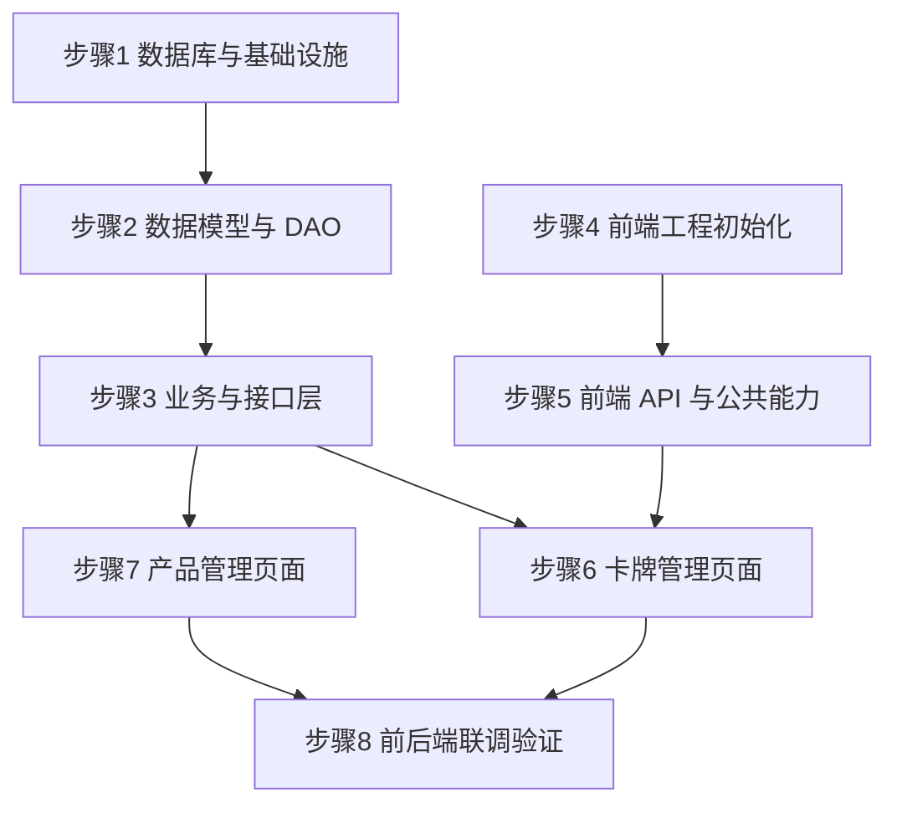

# 实现步骤指南 - 迭代一：卡牌数据落地

> 对应设计文档：[详细设计-迭代一](./03-详细设计-迭代一-卡牌数据落地.md)
> 目标：完成卡牌与产品数据的 CRUD 全链路，**前后端协同**跑通 Vue 管理后台 -> Axios -> Spring Boot Controller -> Service -> MyBatis-Flex DAO -> PostgreSQL 的完整数据闭环。

### 步骤状态

> 规则参考：[编码规范 §9 实现步骤状态跟踪](../编码规范/AI编码规范.md#9-实现步骤状态跟踪)

| 步骤 | 内容 | 状态 |
| --- | --- | --- |
| 1 | 后端 - 数据库与基础设施 | 🔲 |
| 2 | 后端 - 数据模型与 DAO 层 | 🔲 |
| 3 | 后端 - 业务与接口层 | 🔲 |
| 4 | 前端 - 管理后台工程初始化 | 🔲 |
| 5 | 前端 - API 层与公共能力 | 🔲 |
| 6 | 前端 - 卡牌管理页面 | 🔲 |
| 7 | 前端 - 产品管理页面 | 🔲 |
| 8 | 前后端联调与集成验证 | 🔲 |

---

## 现有代码盘点

开始前，先盘点后端已有代码的真实状态（经实际核查）：

| 文件 | 状态 | 说明 |
| --- | --- | --- |
| `CardDO.java` | ⚠️ 需重构 | `@Table("card")`，字段为旧的 cost/attack/health，需改为 level/color/power 等，表名改 mtcg_card |
| `EnumCardType.java` | ⚠️ 需重构 | 值为 HERO/UNIT/EVENT/ITEM，需改为 CHARACTER/RUSH_POINT |
| `CardMapper.java` | ✅ 可用 | 继承 BaseMapper，无需改动 |
| `Result.java` | ✅ 可用 | 统一响应体已完善，含 success/fail/page 方法 |
| `ErrorCode.java` | ⚠️ 需补充 | 缺少卡牌/产品相关错误码（仅有 1001/1002 预留码） |
| `BusinessException.java` | ✅ 可用 | 业务异常类已存在 |
| `GlobalExceptionHandler.java` | ✅ 可用 | 全局异常处理已存在 |
| `PageVO.java` | ✅ 可用 | 分页 VO 已存在（records + total） |
| `CorsConfig.java` | ✅ 可用 | 已放行所有跨域，前端开发无阻 |
| `pom.xml` | ✅ 可用 | 已含 PostgreSQL 驱动 42.7.3、MyBatis-Flex 1.9.5、SpringDoc 2.8.8，无 SQLite 依赖 |
| `application.yml` | ✅ 可用 | 已配置 PostgreSQL（url=jdbc:postgresql://localhost:5432/db_mtcg），端口 8081，context-path /api |
| `init.sql` | ⚠️ 需重构 | 字段为旧结构（cost/attack/health），需按新表结构重写并补充产品表 |
| `mtcg-client-admin/` | ⛔ 待创建 | 前端管理后台目录不存在，需从零搭建 |

---

## 步骤 1：后端 - 数据库与基础设施

### 实现内容

1. 确认 PostgreSQL 连接正常（`application.yml` 已配好，无需改动）
2. 重写 `init.sql`：`mtcg_card` 表 + `mtcg_product` 表（PostgreSQL DDL，含 CHECK 约束、索引、update_time 触发器）
3. 重构枚举 `EnumCardType`（CHARACTER/RUSH_POINT），新建 `EnumColor`（6 色）、`EnumRarity`（12 种）、`EnumProductType`（3 种）
4. 补充 `ErrorCode`：卡牌相关错误码 2001-2003、产品相关 2004-2005

### 设计意义

数据库与枚举是整个迭代的地基。表结构必须与《超英击战》规则对齐：实际卡牌字段是 level（等级）、color（颜色）、attack_range（攻击距离）、power（战力），而非通用 TCG 的 cost/attack/health。枚举字段用 VARCHAR + CHECK 约束存字符串名称（不存下标），既可读又防脏数据。枚举类作为固定值的单一真相来源，避免魔法字符串散落代码各处。

### 涉及文件

| 文件 | 操作 |
| --- | --- |
| `src/main/resources/sql/init.sql` | 重写 |
| `common/enums/EnumCardType.java` | 重构 |
| `common/enums/EnumColor.java` | 新建 |
| `common/enums/EnumRarity.java` | 新建 |
| `common/enums/EnumProductType.java` | 新建 |
| `common/result/ErrorCode.java` | 补充 |

### 关键改动

**init.sql（核心 DDL）**：

```sql
-- 卡牌统一表（角色卡 + 冲击卡）
CREATE TABLE IF NOT EXISTS mtcg_card (
    id              BIGSERIAL       PRIMARY KEY,
    card_code       VARCHAR(32)     NOT NULL UNIQUE,
    product_code    VARCHAR(16),                            -- 产品编号，如 BP01/SD01/PB01
    card_name       VARCHAR(128)    NOT NULL,
    card_type       VARCHAR(16)     NOT NULL,
    level           SMALLINT,                              -- 等级 Lv（1-6），冲击卡为 NULL
    color           VARCHAR(16),
    environment     VARCHAR(16),
    traits          VARCHAR(256),
    attack_range    SMALLINT,
    power           SMALLINT,
    rarity          VARCHAR(16)     NOT NULL,
    effect_text     TEXT,
    effect_json     TEXT,
    image_path      VARCHAR(256),
    create_time     TIMESTAMP       NOT NULL DEFAULT NOW(),
    update_time     TIMESTAMP       NOT NULL DEFAULT NOW(),
    CONSTRAINT ck_card_type CHECK (card_type IN ('CHARACTER', 'RUSH_POINT')),
    CONSTRAINT ck_color     CHECK (color IS NULL OR color IN ('RED','YELLOW','BLUE','GREEN','ORANGE','PURPLE')),
    CONSTRAINT ck_rarity    CHECK (rarity IN ('C','R','SR','GR','UR','MR','SEC','HR','LR','PR','ER','TR')),
    CONSTRAINT ck_level     CHECK (level IS NULL OR (level >= 1 AND level <= 6))
);

CREATE INDEX IF NOT EXISTS idx_card_type    ON mtcg_card (card_type);
CREATE INDEX IF NOT EXISTS idx_card_name    ON mtcg_card (card_name);
CREATE INDEX IF NOT EXISTS idx_card_color   ON mtcg_card (color);
CREATE INDEX IF NOT EXISTS idx_card_product ON mtcg_card (product_code);

-- 产品表（预组牌 / 补充包 / 推广包）
CREATE TABLE IF NOT EXISTS mtcg_product (
    id              BIGSERIAL       PRIMARY KEY,
    product_code    VARCHAR(16)     NOT NULL UNIQUE,
    product_name   VARCHAR(128)     NOT NULL,
    product_type    VARCHAR(16)     NOT NULL,
    release_date    DATE,
    description     TEXT,
    create_time     TIMESTAMP       NOT NULL DEFAULT NOW(),
    update_time     TIMESTAMP       NOT NULL DEFAULT NOW(),
    CONSTRAINT ck_product_type CHECK (product_type IN ('STRUCTURE_DECK', 'BOOSTER_PACK', 'PROMO_PACK'))
);

-- update_time 自动更新触发器
CREATE OR REPLACE FUNCTION update_update_time()
RETURNS TRIGGER AS $$
BEGIN
    NEW.update_time = NOW();
    RETURN NEW;
END;
$$ LANGUAGE plpgsql;

DROP TRIGGER IF EXISTS trigger_card_update_time ON mtcg_card;
CREATE TRIGGER trigger_card_update_time
    BEFORE UPDATE ON mtcg_card
    FOR EACH ROW EXECUTE FUNCTION update_update_time();

DROP TRIGGER IF EXISTS trigger_product_update_time ON mtcg_product;
CREATE TRIGGER trigger_product_update_time
    BEFORE UPDATE ON mtcg_product
    FOR EACH ROW EXECUTE FUNCTION update_update_time();
```

**EnumCardType 重构**：

```java
public enum EnumCardType {
    CHARACTER("CHARACTER", "角色卡"),
    RUSH_POINT("RUSH_POINT", "冲击卡");

    private final String code;
    private final String desc;

    EnumCardType(String code, String desc) {
        this.code = code;
        this.desc = desc;
    }
}
```

**EnumColor 新建**：

```java
public enum EnumColor {
    RED("RED", "红"), YELLOW("YELLOW", "黄"), BLUE("BLUE", "蓝"),
    GREEN("GREEN", "绿"), ORANGE("ORANGE", "橙"), PURPLE("PURPLE", "紫");
    // code + desc 构造同上
}
```

**EnumRarity 新建**：

```java
public enum EnumRarity {
    C("C", "普通"), R("R", "稀有"), SR("SR", "超稀有"), GR("GR", "黄金稀有"),
    UR("UR", "极度稀有"), MR("MR", "奇迹稀有"), SEC("SEC", "秘稀"), HR("HR", "隐藏稀有"),
    LR("LR", "传奇稀有"), PR("PR", "促销稀有"), ER("ER", "特别稀有"), TR("TR", "究极稀有");
    // code + desc 构造同上
}
```

**EnumProductType 新建**：

```java
public enum EnumProductType {
    STRUCTURE_DECK("STRUCTURE_DECK", "预组牌"),
    BOOSTER_PACK("BOOSTER_PACK", "补充包"),
    PROMO_PACK("PROMO_PACK", "推广包");
    // code + desc 构造同上
}
```

**ErrorCode 补充**：

```java
// 卡牌领域 2001-2003
CARD_NOT_FOUND(2001, "卡牌不存在"),
CARD_CODE_DUPLICATE(2002, "卡牌编号已存在"),
CARD_BATCH_IMPORT_FAILED(2003, "批量导入失败"),
// 产品领域 2004-2005
PRODUCT_NOT_FOUND(2004, "产品不存在"),
PRODUCT_CODE_DUPLICATE(2005, "产品编号已存在");
```

### 实现效果

- 数据库两张表按规则字段建立，枚举值与 CHECK 约束一一对应
- 错误码体系覆盖卡牌与产品两个领域，从 2000 段开始

### 检验方式

- 启动应用，`init.sql` 自动执行（`spring.sql.init.mode: always`），日志无 SQL 报错
- 数据库工具连接 PostgreSQL，确认 `mtcg_card`、`mtcg_product` 表已建、字段正确、CHECK 约束与触发器存在
- 尝试插入非法数据（如 `color='BLACK'`）应被 CHECK 拒绝
- `mvn compile` 编译通过，枚举 code 与 CHECK 约束一一对应

---

## 步骤 2：后端 - 数据模型与 DAO 层

### 实现内容

1. 重写 `CardDO`：对齐 `mtcg_card` 表结构（表名改 mtcg_card，字段改 level/color/power 等，含 productCode）
2. 新建 `ProductDO`：映射 `mtcg_product` 表
3. 新建 `ProductMapper`：继承 BaseMapper
4. 创建 DTO：`CardQueryDTO`、`CardCreateDTO`、`CardBatchImportDTO`、`ProductQueryDTO`、`ProductCreateDTO`
5. 创建 VO：`CardVO`、`BatchImportResultVO`、`ProductVO`

### 设计意义

`CardDO` 是数据库表的 Java 映射，字段不对齐会导致 MyBatis-Flex 读写数据时字段丢失或报错。DTO（入参，带 `@NotBlank`/`@NotNull` 校验）与 VO（出参，面向前端展示）分离是阿里手册标准分层规范：避免入参被篡改（如 id、createTime 不应由前端传入）、出参暴露不必要信息。`CardQueryDTO` 新增 `productCode` 字段，支撑按产品筛选卡牌的联调需求。

### 涉及文件

| 文件 | 操作 |
| --- | --- |
| `domain/entity/CardDO.java` | 重写 |
| `domain/entity/ProductDO.java` | 新建 |
| `dao/ProductMapper.java` | 新建 |
| `domain/dto/CardQueryDTO.java` | 新建 |
| `domain/dto/CardCreateDTO.java` | 新建 |
| `domain/dto/CardBatchImportDTO.java` | 新建 |
| `domain/dto/ProductQueryDTO.java` | 新建 |
| `domain/dto/ProductCreateDTO.java` | 新建 |
| `domain/vo/CardVO.java` | 新建 |
| `domain/vo/BatchImportResultVO.java` | 新建 |
| `domain/vo/ProductVO.java` | 新建 |

### 关键改动

**CardDO 重写**：

```java
@Data
@Table("mtcg_card")
public class CardDO {
    @Id(keyType = KeyType.Auto)
    private Long id;
    private String cardCode;
    private String productCode;      // 新增：关联产品
    private String cardName;
    private String cardType;
    private Short level;             // SMALLINT -> Short
    private String color;
    private String environment;
    private String traits;
    private Short attackRange;       // 攻击距离 R
    private Short power;             // 战力
    private String rarity;
    private String effectText;
    private String effectJson;
    private String imagePath;
    private LocalDateTime createTime;
    private LocalDateTime updateTime;
}
```

**ProductDO 新建**：

```java
@Data
@Table("mtcg_product")
public class ProductDO {
    @Id(keyType = KeyType.Auto)
    private Long id;
    private String productCode;
    private String productName;
    private String productType;
    private LocalDate releaseDate;
    private String description;
    private LocalDateTime createTime;
    private LocalDateTime updateTime;
}
```

**CardCreateDTO（带校验）**：

```java
@Data
public class CardCreateDTO {
    @NotBlank(message = "卡牌编号不能为空")
    private String cardCode;
    private String productCode;
    @NotBlank(message = "卡牌名称不能为空")
    private String cardName;
    @NotBlank(message = "卡牌类型不能为空")
    private String cardType;        // CHARACTER / RUSH_POINT
    private Short level;
    private String color;
    private String environment;
    private String traits;
    private Short attackRange;
    private Short power;
    @NotBlank(message = "稀有度不能为空")
    private String rarity;
    private String effectText;
    private String effectJson;
    private String imagePath;
}
```

**CardQueryDTO（分页 + 多条件）**：

```java
@Data
public class CardQueryDTO {
    private String cardName;       // 模糊查询
    private String cardType;
    private String color;
    private Short level;
    private String rarity;
    private String productCode;    // 按产品精确筛选
    private String traits;
    private Integer page = 1;
    private Integer size = 10;
}
```

**BatchImportResultVO**：

```java
@Data
@AllArgsConstructor
public class BatchImportResultVO {
    private int successCount;
    private int failCount;
    private List<String> failDetails;   // 失败卡牌编号 + 原因
}
```

### 实现效果

- 实体层与表结构完全对齐，MyBatis-Flex 读写无字段丢失
- 入参带校验注解，非法入参在 Web 层被拦截返回 400

### 检验方式

- `mvn compile` 编译通过
- 字段名与 init.sql 列名一一对应（依赖 `map-underscore-to-camel-case: true` 自动转换）
- DTO 校验注解生效：传空值时返回 `{"code":400,...}`

---

## 步骤 3：后端 - 业务与接口层

### 实现内容

1. `CardService` 接口 + `CardServiceImpl`（CRUD + 条件查询 + 批量导入）
2. `ProductService` 接口 + `ProductServiceImpl`（CRUD + 按产品筛选卡牌）
3. `CardController`（6 个卡牌接口，路径 `/v1/cards`）
4. `ProductController`（6 个产品接口，路径 `/v1/products`）
5. 后端集成验证：Swagger UI 看到 12 个接口，用 curl 验证 CRUD

### 设计意义

Service 层是业务编排中心，负责参数校验、对象转换（DTO↔DO↔VO）、调用 DAO、抛出业务异常。Controller 层是薄协议适配层，只做 HTTP 解析与 `Result<T>` 包装，不含业务逻辑——这样后续加 WebSocket/gRPC 入口时 Service 可直接复用。接口路径统一 `/api/v1/...`（context-path `/api` + Controller `/v1`）。

### 涉及文件

| 文件 | 操作 |
| --- | --- |
| `service/CardService.java` | 新建（接口） |
| `service/impl/CardServiceImpl.java` | 新建 |
| `service/ProductService.java` | 新建（接口） |
| `service/impl/ProductServiceImpl.java` | 新建 |
| `controller/CardController.java` | 新建 |
| `controller/ProductController.java` | 新建 |

### 关键改动

**CardServiceImpl 核心方法**：

```java
@Service
public class CardServiceImpl implements CardService {

    @Resource
    private CardMapper cardMapper;

    @Override
    public CardVO getCardById(Long id) {
        CardDO card = cardMapper.selectOneById(id);
        if (card == null) {
            throw new BusinessException(ErrorCode.CARD_NOT_FOUND);
        }
        return toVO(card);
    }

    @Override
    public Result<PageVO<CardVO>> listCards(CardQueryDTO query) {
        QueryWrapper qw = QueryWrapper.create()
            .where(CARD.NAME.like(query.getCardName()))   // 名称模糊
            .and(CARD.TYPE.eq(query.getCardType()))
            .and(CARD.COLOR.eq(query.getColor()))
            .and(CARD.LEVEL.eq(query.getLevel()))
            .and(CARD.PRODUCT_CODE.eq(query.getProductCode()));
        Page<CardDO> page = Page.of(query.getPage(), query.getSize());
        Page<CardDO> result = cardMapper.paginate(page, qw);
        List<CardVO> records = result.getRecords().stream().map(this::toVO).toList();
        return Result.page(records, result.getTotalRow());
    }

    @Override
    public Long createCard(CardCreateDTO dto) {
        // 校验编号唯一
        if (cardMapper.selectCountByQuery(QueryWrapper.create()
                .where(CARD.CODE.eq(dto.getCardCode()))) > 0) {
            throw new BusinessException(ErrorCode.CARD_CODE_DUPLICATE);
        }
        CardDO card = toDO(dto);
        cardMapper.insert(card);
        return card.getId();
    }

    @Override
    public BatchImportResultVO batchImport(List<CardCreateDTO> list) {
        int success = 0, fail = 0;
        List<String> failDetails = new ArrayList<>();
        for (CardCreateDTO dto : list) {
            try {
                createCard(dto);
                success++;
            } catch (Exception e) {
                fail++;
                failDetails.add(dto.getCardCode() + ": " + e.getMessage());
            }
        }
        return new BatchImportResultVO(success, fail, failDetails);
    }
    // updateCard / deleteCard 同理，校验存在性
}
```

**CardController（6 接口）**：

```java
@RestController
@RequestMapping("/v1/cards")
@Tag(name = "卡牌管理")
public class CardController {

    @Resource
    private CardService cardService;

    @GetMapping
    @Operation(summary = "分页查询卡牌")
    public Result<PageVO<CardVO>> list(CardQueryDTO query) {
        return cardService.listCards(query);
    }

    @GetMapping("/{id}")
    @Operation(summary = "查询卡牌详情")
    public Result<CardVO> detail(@PathVariable Long id) {
        return Result.success(cardService.getCardById(id));
    }

    @PostMapping
    @Operation(summary = "新增卡牌")
    public Result<Long> create(@Valid @RequestBody CardCreateDTO dto) {
        return Result.success(cardService.createCard(dto));
    }

    @PutMapping("/{id}")
    @Operation(summary = "修改卡牌")
    public Result<Void> update(@PathVariable Long id, @Valid @RequestBody CardCreateDTO dto) {
        cardService.updateCard(id, dto);
        return Result.success();
    }

    @DeleteMapping("/{id}")
    @Operation(summary = "删除卡牌")
    public Result<Void> delete(@PathVariable Long id) {
        cardService.deleteCard(id);
        return Result.success();
    }

    @PostMapping("/batch")
    @Operation(summary = "批量导入卡牌")
    public Result<BatchImportResultVO> batch(@Valid @RequestBody CardBatchImportDTO dto) {
        return Result.success(cardService.batchImport(dto.getCards()));
    }
}
```

**ProductController（6 接口，含按产品筛选卡牌）**：

```java
@RestController
@RequestMapping("/v1/products")
@Tag(name = "产品管理")
public class ProductController {

    @Resource
    private ProductService productService;

    @GetMapping
    @Operation(summary = "产品分页列表")
    public Result<PageVO<ProductVO>> list(ProductQueryDTO query) {
        return productService.listProducts(query);
    }

    @GetMapping("/{id}")
    @Operation(summary = "查询产品详情")
    public Result<ProductVO> detail(@PathVariable Long id) {
        return Result.success(productService.getProductById(id));
    }

    @PostMapping
    @Operation(summary = "新增产品")
    public Result<Long> create(@Valid @RequestBody ProductCreateDTO dto) {
        return Result.success(productService.createProduct(dto));
    }

    @PutMapping("/{id}")
    @Operation(summary = "修改产品")
    public Result<Void> update(@PathVariable Long id, @Valid @RequestBody ProductCreateDTO dto) {
        productService.updateProduct(id, dto);
        return Result.success();
    }

    @DeleteMapping("/{id}")
    @Operation(summary = "删除产品")
    public Result<Void> delete(@PathVariable Long id) {
        productService.deleteProduct(id);
        return Result.success();
    }

    @GetMapping("/{productCode}/cards")
    @Operation(summary = "按产品筛选卡牌")
    public Result<PageVO<CardVO>> cardsByProduct(@PathVariable String productCode,
                                                 @RequestParam(defaultValue = "1") Integer page,
                                                 @RequestParam(defaultValue = "10") Integer size) {
        return productService.listCardsByProduct(productCode, page, size);
    }
}
```

### 实现效果

- 12 个 REST 接口上线，路径 `/api/v1/cards` 与 `/api/v1/products`
- 批量导入支持部分成功，失败项记录详情

### 检验方式

- `mvn compile` 编译通过
- 启动应用，访问 Swagger UI（`http://localhost:8081/api/swagger-ui.html`）看到 12 个接口
- 用 curl 验证完整流程：

```bash
# 新增产品
curl -X POST http://localhost:8081/api/v1/products \
  -H "Content-Type: application/json" \
  -d '{"productCode":"BP01","productName":"初弹补充包","productType":"BOOSTER_PACK"}'

# 新增角色卡
curl -X POST http://localhost:8081/api/v1/cards \
  -H "Content-Type: application/json" \
  -d '{"cardCode":"BP01-001","productCode":"BP01","cardName":"浩克","cardType":"CHARACTER","level":3,"color":"GREEN","attackRange":2,"power":5000,"rarity":"SR"}'

# 查询卡牌详情
curl http://localhost:8081/api/v1/cards/1

# 按产品筛选卡牌
curl http://localhost:8081/api/v1/products/BP01/cards
```

- 验证异常：查询不存在卡牌返回 `{"code":2001,"message":"卡牌不存在"}`
- 验证校验：缺字段返回 `{"code":400,...}`

---

## 步骤 4：前端 - 管理后台工程初始化

### 实现内容

1. 在 `mtcg-client-admin` 目录用 Vite 创建 Vue 3 + TypeScript 项目
2. 安装依赖：element-plus、pinia、vue-router、axios
3. 配置 `vite.config.ts`：proxy 代理 `/api` 到 `http://localhost:8081`
4. 搭建项目结构：`src/api`、`src/components`、`src/views`、`src/router`、`src/stores`、`src/utils`
5. 创建基础布局：侧边栏导航 + 顶部栏 + 内容区
6. 配置路由：`/cards`、`/products`、`/dashboard`

### 设计意义

前端管理后台是卡牌数据落地的操作入口。用 Vite 创建可获极速热更新开发体验；Element Plus 提供成熟的表格/表单/对话框组件，快速搭出可用界面；Pinia 管理全局状态（如枚举字典）；Vue Router 支持页面切换。Vite proxy 解决开发期跨域问题，请求统一走 `/api` 前缀转发到后端，与生产部署一致。

### 涉及文件

| 文件 | 操作 |
| --- | --- |
| `mtcg-client-admin/` | 新建整个工程 |
| `mtcg-client-admin/package.json` | 生成 |
| `mtcg-client-admin/vite.config.ts` | 配置 |
| `mtcg-client-admin/src/main.ts` | 入口 |
| `mtcg-client-admin/src/App.vue` | 根组件 |
| `mtcg-client-admin/src/router/index.ts` | 路由 |
| `mtcg-client-admin/src/layouts/MainLayout.vue` | 布局 |
| `mtcg-client-admin/src/views/DashboardView.vue` | 仪表盘占位 |

### 关键改动

**创建项目（命令）**：

```bash
cd d:/pengYuJun/Project/mtcg
npm create vite@latest mtcg-client-admin -- --template vue-ts
cd mtcg-client-admin
npm install
npm install element-plus pinia vue-router axios
```

**vite.config.ts（代理配置）**：

```typescript
import { defineConfig } from 'vite'
import vue from '@vitejs/plugin-vue'

export default defineConfig({
  plugins: [vue()],
  server: {
    port: 5173,
    proxy: {
      '/api': {
        target: 'http://localhost:8081',
        changeOrigin: true
        // 无需 rewrite，后端 context-path 已是 /api
      }
    }
  }
})
```

**路由配置**：

```typescript
const routes = [
  {
    path: '/',
    component: MainLayout,
    redirect: '/dashboard',
    children: [
      { path: 'dashboard', name: 'Dashboard', component: () => import('@/views/DashboardView.vue') },
      { path: 'cards', name: 'Cards', component: () => import('@/views/card/CardListView.vue') },
      { path: 'products', name: 'Products', component: () => import('@/views/product/ProductListView.vue') }
    ]
  }
]
```

**基础布局（侧边栏 + 顶部栏 + 内容区）**：

```vue
<!-- MainLayout.vue 骨架 -->
<el-container class="layout">
  <el-aside width="200px">
    <el-menu :default-active="route.path" router>
      <el-menu-item index="/dashboard">仪表盘</el-menu-item>
      <el-menu-item index="/cards">卡牌管理</el-menu-item>
      <el-menu-item index="/products">产品管理</el-menu-item>
    </el-menu>
  </el-aside>
  <el-container>
    <el-header>MTCG 管理后台</el-header>
    <el-main><router-view /></el-main>
  </el-container>
</el-container>
```

### 实现效果

- 前端工程可启动，访问 `http://localhost:5173` 看到带导航的布局
- 三个路由页面占位就绪，点击侧边栏可切换

### 检验方式

- `npm run dev` 启动成功，无报错
- 浏览器访问 `http://localhost:5173`，侧边栏三项可切换
- 浏览器控制台无跨域报错（proxy 生效）

---

## 步骤 5：前端 - API 层与公共能力

### 实现内容

1. axios 实例封装（baseURL `/api/v1`、请求/响应拦截器、token 注入、统一错误处理）
2. OpenAPI Generator 根据后端 Swagger 文档自动生成 API 请求方法
3. 枚举字典：按后端枚举类逐一拆分文件，与 `common/enums` 一一对应
4. 通用分页表格组件（Element Plus Table + Pagination 封装）
5. 通用表单校验规则

### 设计意义

- **OpenAPI 生成**：后端 SpringDoc 已提供 `/v3/api-docs`，用 OpenAPI Generator 自动生成 TS 请求方法，保证接口契约一致，避免手写 URL 拼写错误和参数遗漏。后端接口变更后重新生成即可，不必人工同步。
- **枚举拆分**：每个后端枚举类（`EnumCardType`、`EnumColor`、`EnumRarity`、`EnumProductType`）对应一个独立 TS 文件，与后端文件结构对齐，增删改查时能快速定位，不会"一锅端"混在一起。
- **axios 封装**：统一处理 baseURL、token、错误码，响应拦截器识别 `code !== 0` 弹错误提示。

> 命名规范参考：[编码规范 §8 前端规范](../编码规范/AI编码规范.md#8-前端规范)

### 涉及文件

| 文件 | 操作 |
| --- | --- |
| `src/utils/request.ts` | 新建 |
| `src/utils/enums/card-type.ts` | 新建（对应后端 EnumCardType） |
| `src/utils/enums/color.ts` | 新建（对应后端 EnumColor） |
| `src/utils/enums/rarity.ts` | 新建（对应后端 EnumRarity） |
| `src/utils/enums/product-type.ts` | 新建（对应后端 EnumProductType） |
| `src/utils/enums/index.ts` | 新建（统一导出 + codeToDesc 工具） |
| `src/api/generated/` | OpenAPI 自动生成，禁止手改 |
| `src/components/PageTable.vue` | 新建（可选封装） |

### 关键改动

**request.ts（axios 实例 + 拦截器 + token）**：

```typescript
import axios from 'axios'
import { ElMessage } from 'element-plus'

const request = axios.create({
  baseURL: '/api/v1',
  timeout: 10000
})

// 请求拦截：自动携带 token
request.interceptors.request.use((config) => {
  const token = localStorage.getItem('token')
  if (token) {
    config.headers.Authorization = `Bearer ${token}`
  }
  return config
})

// 响应拦截：统一处理 code !== 0
request.interceptors.response.use(
  (response) => {
    const res = response.data
    if (res.code !== 0) {
      ElMessage.error(res.message || '请求失败')
      return Promise.reject(new Error(res.message))
    }
    return res.data
  },
  (error) => {
    if (error.response?.status === 401) {
      localStorage.removeItem('token')
      location.href = '/login'
    }
    ElMessage.error(error.message || '网络异常')
    return Promise.reject(error)
  }
)

export default request
```

**OpenAPI 生成（package.json 脚本）**：

```json
{
  "scripts": {
    "gen:api": "openapi-typescript-codegen --input http://localhost:8081/api/v3/api-docs --output src/api/generated --client axios"
  }
}
```

后端启动后执行 `npm run gen:api`，生成的代码放在 `src/api/generated/`，包含完整的类型定义和请求方法，**禁止手动修改**。

**枚举文件（逐一对应后端，不合并）**：

`src/utils/enums/card-type.ts`：
```typescript
// 对应后端 com.aris.mtcg.common.enums.EnumCardType
export const CardTypeOptions = [
  { code: 'CHARACTER', desc: '角色卡' },
  { code: 'RUSH_POINT', desc: '冲击卡' }
] as const
```

`src/utils/enums/color.ts`：
```typescript
// 对应后端 com.aris.mtcg.common.enums.EnumColor
export const ColorOptions = [
  { code: 'RED', desc: '红' },
  { code: 'YELLOW', desc: '黄' },
  { code: 'BLUE', desc: '蓝' },
  { code: 'GREEN', desc: '绿' },
  { code: 'ORANGE', desc: '橙' },
  { code: 'PURPLE', desc: '紫' }
] as const
```

`src/utils/enums/rarity.ts`：
```typescript
// 对应后端 com.aris.mtcg.common.enums.EnumRarity
export const RarityOptions = [
  { code: 'C', desc: '普通' },
  { code: 'R', desc: '稀有' },
  { code: 'SR', desc: '超稀有' },
  { code: 'GR', desc: '黄金稀有' },
  { code: 'UR', desc: '极度稀有' },
  { code: 'MR', desc: '奇迹稀有' },
  { code: 'SEC', desc: '秘稀' },
  { code: 'HR', desc: '隐藏稀有' },
  { code: 'LR', desc: '传奇稀有' },
  { code: 'PR', desc: '促销稀有' },
  { code: 'ER', desc: '特别稀有' },
  { code: 'TR', desc: '究极稀有' }
] as const
```

`src/utils/enums/product-type.ts`：
```typescript
// 对应后端 com.aris.mtcg.common.enums.EnumProductType
export const ProductTypeOptions = [
  { code: 'STRUCTURE_DECK', desc: '预组牌' },
  { code: 'BOOSTER_PACK', desc: '补充包' },
  { code: 'PROMO_PACK', desc: '推广包' }
] as const
```

`src/utils/enums/index.ts`：
```typescript
export * from './card-type'
export * from './color'
export * from './rarity'
export * from './product-type'

// code -> desc 查询工具
export const codeToDesc = (
  options: readonly { code: string; desc: string }[],
  code: string
): string => options.find(o => o.code === code)?.desc ?? code
```

### 实现效果

- OpenAPI 生成的请求方法有完整 TS 类型提示，接口变更后重新生成即可
- 枚举字典与后端 `common/enums` 逐一对应，每个枚举独立文件
- 所有请求自动携带 token，401 自动跳登录
- 枚举 code 值与后端 CHECK 约束完全一致

### 检验方式

- 执行 `npm run gen:api` 后 `src/api/generated/` 下生成卡牌和产品的请求方法
- 前端启动后，浏览器 Network 面板看到请求走 `http://localhost:5173/api/v1/...` 并被代理到后端
- 调用列表接口返回数据，控制台无报错
- 检查枚举文件的 code 数量与后端枚举类的枚举值数量一致

---

## 步骤 6：前端 - 卡牌管理页面

### 实现内容

1. 卡牌列表页：分页表格 + 查询条件筛选（名称/颜色/等级/类型/产品）+ 删除按钮
2. 卡牌详情抽屉：展示完整卡牌信息
3. 卡牌新增/编辑表单：字段校验（角色卡必填 level/color/attackRange/power）
4. 批量导入对话框：支持 JSON 粘贴导入

### 设计意义

列表页是数据落地的核心操作面。查询条件与后端 `CardQueryDTO` 字段一一对应，实现前后端契约协同。表单校验区分角色卡与冲击卡：冲击卡 level/color/power 为空，角色卡这些字段必填——与数据库 CHECK 约束形成双重防线。批量导入支持 JSON 粘贴，便于快速录入整包卡牌。

### 涉及文件

| 文件 | 操作 |
| --- | --- |
| `src/views/card/CardListView.vue` | 新建 |
| `src/views/card/CardFormDialog.vue` | 新建 |
| `src/views/card/CardDetailDrawer.vue` | 新建 |
| `src/views/card/BatchImportDialog.vue` | 新建 |

### 关键改动

**列表页查询条件 + 表格骨架**：

```vue
<template>
  <div>
    <!-- 查询条件 -->
    <el-form inline>
      <el-form-item label="名称"><el-input v-model="query.cardName" /></el-form-item>
      <el-form-item label="颜色"><el-select v-model="query.color" clearable>
        <el-option v-for="o in ColorOptions" :key="o.code" :label="o.desc" :value="o.code" />
      </el-select></el-form-item>
      <el-form-item label="类型"><el-select v-model="query.cardType" clearable>
        <el-option v-for="o in CardTypeOptions" :key="o.code" :label="o.desc" :value="o.code" />
      </el-select></el-form-item>
      <el-button type="primary" @click="loadData">查询</el-button>
      <el-button type="success" @click="openCreate">新增</el-button>
      <el-button @click="batchVisible = true">批量导入</el-button>
    </el-form>
    <!-- 表格 -->
    <el-table :data="tableData">
      <el-table-column prop="cardCode" label="编号" />
      <el-table-column prop="cardName" label="名称" />
      <el-table-column label="类型">
        <template #default="{ row }">{{ codeToDesc(CardTypeOptions, row.cardType) }}</template>
      </el-table-column>
      <el-table-column label="颜色">
        <template #default="{ row }">{{ codeToDesc(ColorOptions, row.color) }}</template>
      </el-table-column>
      <el-table-column prop="power" label="战力" />
      <el-table-column label="操作">
        <template #default="{ row }">
          <el-button size="small" @click="openDetail(row.id)">详情</el-button>
          <el-button size="small" type="primary" @click="openEdit(row.id)">编辑</el-button>
          <el-button size="small" type="danger" @click="handleDelete(row.id)">删除</el-button>
        </template>
      </el-table-column>
    </el-table>
    <el-pagination v-model:current-page="query.page" v-model:page-size="query.size"
      :total="total" @current-change="loadData" />
  </div>
</template>
```

**表单校验规则（角色卡条件必填）**：

```typescript
const rules = {
  cardCode: [{ required: true, message: '请输入卡牌编号', trigger: 'blur' }],
  cardName: [{ required: true, message: '请输入卡牌名称', trigger: 'blur' }],
  cardType: [{ required: true, message: '请选择卡牌类型', trigger: 'change' }],
  rarity: [{ required: true, message: '请选择稀有度', trigger: 'change' }],
  // 角色卡时 level/color/attackRange/power 必填
  level: [{ validator: validateCharacterRequired('level'), trigger: 'blur' }],
  color: [{ validator: validateCharacterRequired('color'), trigger: 'change' }]
}

// 当 cardType === 'CHARACTER' 时这些字段必填
function validateCharacterRequired(field) {
  return (rule, value, callback) => {
    if (form.cardType === 'CHARACTER' && !value) {
      callback(new Error('角色卡此字段必填'))
    } else {
      callback()
    }
  }
}
```

**批量导入对话框**：

```vue
<el-dialog v-model="batchVisible" title="批量导入">
  <el-input type="textarea" :rows="15" v-model="batchJson"
    placeholder='[{"cardCode":"BP01-001","cardName":"浩克","cardType":"CHARACTER",...}]' />
  <el-button type="primary" @click="handleBatchImport">导入</el-button>
</el-dialog>
```

### 实现效果

- 卡牌列表可分页、按多条件筛选，展示中文标签
- 新增/编辑表单带校验，角色卡字段条件必填
- 批量导入支持粘贴 JSON

### 检验方式

- 列表页加载数据，分页切换正常
- 新增角色卡缺 level 时表单报错
- 新增冲击卡不填 level/color 可通过
- 批量导入后列表刷新显示新数据

---

## 步骤 7：前端 - 产品管理页面

### 实现内容

1. 产品列表页：产品类型标签 + 操作按钮
2. 产品新增/编辑表单
3. 产品详情页：展示产品信息 + 关联卡牌列表（调用 `/products/{productCode}/cards`）

### 设计意义

产品管理让卡牌可按"补充包/预组牌/推广包"归类。详情页展示产品下的卡牌列表，复用后端 `GET /products/{productCode}/cards` 接口，验证产品→卡牌的关联查询链路。产品类型用 Element Plus Tag 组件按类型着色，提升可读性。

### 涉及文件

| 文件 | 操作 |
| --- | --- |
| `src/views/product/ProductListView.vue` | 新建 |
| `src/views/product/ProductFormDialog.vue` | 新建 |
| `src/views/product/ProductDetailView.vue` | 新建 |

### 关键改动

**产品列表（类型标签）**：

```vue
<el-table :data="tableData">
  <el-table-column prop="productCode" label="编号" />
  <el-table-column prop="productName" label="名称" />
  <el-table-column label="类型">
    <template #default="{ row }">
      <el-tag :type="tagType(row.productType)">
        {{ codeToDesc(ProductTypeOptions, row.productType) }}
      </el-tag>
    </template>
  </el-table-column>
  <el-table-column prop="releaseDate" label="发售日" />
  <el-table-column label="操作">
    <template #default="{ row }">
      <el-button size="small" @click="openDetail(row.id)">详情</el-button>
      <el-button size="small" type="primary" @click="openEdit(row.id)">编辑</el-button>
      <el-button size="small" type="danger" @click="handleDelete(row.id)">删除</el-button>
    </template>
  </el-table-column>
</el-table>
```

**产品表单校验**：

```typescript
const rules = {
  productCode: [{ required: true, message: '请输入产品编号', trigger: 'blur' }],
  productName: [{ required: true, message: '请输入产品名称', trigger: 'blur' }],
  productType: [{ required: true, message: '请选择产品类型', trigger: 'change' }]
}
```

**产品详情页（产品信息 + 关联卡牌）**：

```vue
<template>
  <el-descriptions :column="2" border>
    <el-descriptions-item label="编号">{{ product.productCode }}</el-descriptions-item>
    <el-descriptions-item label="名称">{{ product.productName }}</el-descriptions-item>
    <el-descriptions-item label="类型">{{ codeToDesc(ProductTypeOptions, product.productType) }}</el-descriptions-item>
    <el-descriptions-item label="发售日">{{ product.releaseDate }}</el-descriptions-item>
    <el-descriptions-item label="描述" :span="2">{{ product.description }}</el-descriptions-item>
  </el-descriptions>
  <h3>关联卡牌</h3>
  <el-table :data="cards">
    <el-table-column prop="cardCode" label="编号" />
    <el-table-column prop="cardName" label="名称" />
    <el-table-column prop="rarity" label="稀有度" />
  </el-table>
</template>

<script setup>
import { productApi } from '@/api/product'
// 加载关联卡牌：productApi.cardsByProduct(product.productCode)
</script>
```

### 实现效果

- 产品 CRUD 完整可用，类型标签着色
- 产品详情页展示产品信息 + 该产品下所有卡牌

### 检验方式

- 新增/编辑/删除产品功能正常
- 进入产品详情，关联卡牌列表正确加载

---

## 步骤 8：前后端联调与集成验证

### 实现内容

启动后端 + 前端，通过前端界面操作完整 CRUD 流程，覆盖正常与异常场景。

### 设计意义

单独编译通过不等于功能正确。只有跑通 Vue 界面 -> Axios -> Spring Boot -> PostgreSQL 的完整闭环，才能确认数据库连接、SQL 语法、MyBatis-Flex 映射、参数校验、异常处理、跨域代理全部正常。交叉验证前端操作结果与数据库实际数据一致，是数据落地最终的质量门禁。

### 验证用例

按以下顺序执行端到端验证：

```
1. 新增产品（补充包 BP01）           -> 列表出现 BP01
2. 新增角色卡（关联 BP01，浩克）     -> 列表出现该卡
3. 新增冲击卡（关联 BP01）          -> 列表出现该卡
4. 列表按颜色=GREEN 筛选            -> 只显示浩克
5. 编辑卡牌（改战力 6000）           -> 详情显示新战力
6. 进入产品详情                      -> 关联卡牌列表显示 2 张卡
7. 批量导入 3 张卡（1 张编号重复）    -> 提示成功 2 失败 1
8. 删除一张卡                        -> 列表刷新消失
9. 查询已删除卡牌                    -> 后端返回 2001 错误
```

异常场景验证：

- 重复编号：新增/批量导入时后端返回 `{"code":2002,...}`，前端弹错误提示
- 非法枚举：直接调接口传 `color=BLACK`，后端 CHECK 约束拒绝（500）或参数校验拦截
- 查询不存在：返回 `{"code":2001,...}`

### 实现效果

- 全链路打通，前端操作即数据落地
- 异常场景有友好提示，不出现白屏或未捕获错误

### 检验方式

- 前端界面操作上述 9 步用例全部通过
- 数据库工具直查 `mtcg_card` / `mtcg_product` 表，数据与界面一致
- 浏览器 Network 面板确认请求路径 `/api/v1/...`、响应 `code: 0`
- 异常场景前端弹 ElMessage 错误提示，不崩溃

---

## 步骤依赖关系



后端链路（步骤 1→2→3）必须先通；前端链路（步骤 4→5）可并行进行。步骤 6/7 需后端接口就绪 + 前端 API 层完成。步骤 8 是最终集成门禁。

---

## 文件清单总览

### 后端（mtcg-server）

| # | 文件 | 操作 | 步骤 |
| --- | --- | --- | --- |
| 1 | `resources/sql/init.sql` | 重写 | 1 |
| 2 | `common/enums/EnumCardType.java` | 重构 | 1 |
| 3 | `common/enums/EnumColor.java` | 新建 | 1 |
| 4 | `common/enums/EnumRarity.java` | 新建 | 1 |
| 5 | `common/enums/EnumProductType.java` | 新建 | 1 |
| 6 | `common/result/ErrorCode.java` | 补充 | 1 |
| 7 | `domain/entity/CardDO.java` | 重写 | 2 |
| 8 | `domain/entity/ProductDO.java` | 新建 | 2 |
| 9 | `dao/ProductMapper.java` | 新建 | 2 |
| 10 | `domain/dto/CardQueryDTO.java` | 新建 | 2 |
| 11 | `domain/dto/CardCreateDTO.java` | 新建 | 2 |
| 12 | `domain/dto/CardBatchImportDTO.java` | 新建 | 2 |
| 13 | `domain/dto/ProductQueryDTO.java` | 新建 | 2 |
| 14 | `domain/dto/ProductCreateDTO.java` | 新建 | 2 |
| 15 | `domain/vo/CardVO.java` | 新建 | 2 |
| 16 | `domain/vo/BatchImportResultVO.java` | 新建 | 2 |
| 17 | `domain/vo/ProductVO.java` | 新建 | 2 |
| 18 | `service/CardService.java` | 新建 | 3 |
| 19 | `service/impl/CardServiceImpl.java` | 新建 | 3 |
| 20 | `service/ProductService.java` | 新建 | 3 |
| 21 | `service/impl/ProductServiceImpl.java` | 新建 | 3 |
| 22 | `controller/CardController.java` | 新建 | 3 |
| 23 | `controller/ProductController.java` | 新建 | 3 |

后端共 23 项（4 重写/重构 + 2 修改 + 17 新建）。注：`pom.xml`、`application.yml`、`CorsConfig` 经核查已就绪，无需改动。

### 前端（mtcg-client-admin）

| # | 文件 | 操作 | 步骤 |
| --- | --- | --- | --- |
| 1 | `package.json` | 生成 | 4 |
| 2 | `vite.config.ts` | 配置 | 4 |
| 3 | `src/main.ts` | 新建 | 4 |
| 4 | `src/App.vue` | 新建 | 4 |
| 5 | `src/router/index.ts` | 新建 | 4 |
| 6 | `src/layouts/MainLayout.vue` | 新建 | 4 |
| 7 | `src/views/DashboardView.vue` | 新建 | 4 |
| 8 | `src/utils/request.ts` | 新建 | 5 |
| 9 | `src/utils/enums.ts` | 新建 | 5 |
| 10 | `src/api/card.ts` | 新建 | 5 |
| 11 | `src/api/product.ts` | 新建 | 5 |
| 12 | `src/views/card/CardListView.vue` | 新建 | 6 |
| 13 | `src/views/card/CardFormDialog.vue` | 新建 | 6 |
| 14 | `src/views/card/CardDetailDrawer.vue` | 新建 | 6 |
| 15 | `src/views/card/BatchImportDialog.vue` | 新建 | 6 |
| 16 | `src/views/product/ProductListView.vue` | 新建 | 7 |
| 17 | `src/views/product/ProductFormDialog.vue` | 新建 | 7 |
| 18 | `src/views/product/ProductDetailView.vue` | 新建 | 7 |

前端共 18 项（全部新建）。
