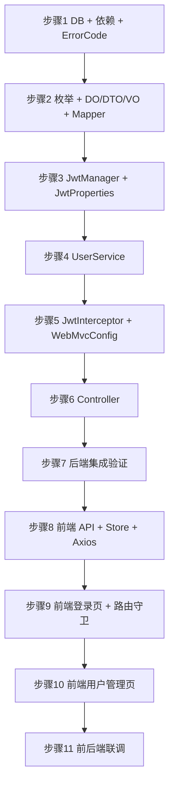

# 实现步骤指南：迭代一 — 用户系统与用户管理

---

## 总路线：三阶段 MVP

```
阶段一（先能管）
  ├─ 迭代一：基础设施 + 用户系统（含用户管理）  ← 本文档当前步骤
  └─ 迭代二：卡牌与产品管理
阶段二（先能玩）
  ├─ 迭代三：卡组构筑 + 游戏端登录
  ├─ 迭代四：引擎状态模型 + 回合流程
  ├─ 迭代五：行动与战斗处理器
  ├─ 迭代六：效果系统 + 关键词
  └─ 迭代七：对战 API + 游戏对战页
阶段三（再完善）
  └─ 迭代七~九：AI 对战 → 排位系统 → 系统管理
```

---

# 迭代一：基础设施 + 用户系统（含用户管理）

> 对应详细设计：[03-详细设计-迭代一（用户系统与用户管理）](./03-详细设计-迭代一-用户系统与用户管理.md)
>
> **目标**：交付「管理后台能登录、能管用户」的最小闭环。登录注册与用户管理 CRUD 一次做完（同操作 `mtcg_user` 表，共用 `UserService` / `UserMapper`，不拆分）。
>
> **鉴权方案**：不引入 Spring Security，自实现 JWT 拦截器 + `@RequireRole` 注解。

## 步骤状态（✅ 全部完成）


| 步骤  | 内容                                                | 状态  | 说明                |
| --- | ------------------------------------------------- | --- | ----------------- |
| 1   | 后端 - 数据库建表 + 依赖补充 + ErrorCode 扩展                  | ✅   | 2026-08-04        |
| 2   | 后端 - 枚举 + 用户 DO/DTO/VO + Mapper                   | ✅   | 2026-08-04        |
| 3   | 后端 - JwtManager + JwtProperties                   | ✅   | 2026-08-04        |
| 4   | 后端 - UserService（登录注册 + 资料改密 + 管理员 CRUD）          | ✅   | 2026-08-04        |
| 5   | 后端 - JwtInterceptor + @RequireRole + WebMvcConfig | ✅   | 2026-08-04        |
| 6   | 后端 - Controller（Auth + User + AdminUser）          | ✅   | 2026-08-04        |
| 7   | 后端 - 集成验证（Swagger + curl 全用例）                     | ✅   | 2026-08-04        |
| 8   | 前端 - API 层 + Pinia Store + Axios 拦截器              | ✅   | 2026-08-09（补漏后完成） |
| 9   | 前端 - 管理后台登录页 + 路由守卫                               | ✅   | 2026-08-04        |
| 10  | 前端 - 管理后台用户管理页                                    | ✅   | 2026-08-04        |
| 11  | 前后端联调验证                                           | ✅   | 2026-08-09（补漏后完成） |


---


## 代码盘点（经实际核查，2026-08-09）


### 后端可用文件


| 文件                            | 状态    | 说明                                                    |
| ----------------------------- | ----- | ----------------------------------------------------- |
| `Result.java`                 | ✅ 可用  | 统一响应体，含 success / fail / page 方法                      |
| `ErrorCode.java`              | ✅ 已完善 | 含用户/权限错误码（1001-1008）                                  |
| `BusinessException.java`      | ✅ 可用  | 业务异常类                                                 |
| `GlobalExceptionHandler.java` | ✅ 可用  | 全局异常处理                                                |
| `PageVO.java`                 | ✅ 可用  | 分页 VO（records + total）                                |
| `pom.xml`                     | ✅ 已完善 | 已有 jjwt 0.12.6 + spring-security-crypto               |
| `application.yml`             | ✅ 已完善 | 已有 `mtcg.jwt.*` 配置                                    |
| `init.sql`                    | ✅ 已完善 | 3 张表（mtcg_user / mtcg_card / mtcg_product） + CHECK 约束 |


### 后端新增文件（28 个，均已交付）


| #   | 文件                                  | 步骤   |
| --- | ----------------------------------- | ---- |
| 1   | `EnumUserRole.java`                 | 2    |
| 2   | `EnumUserStatus.java`               | 2    |
| 3   | `EnumCardType.java`                 | 2    |
| 4   | `EnumColor.java`                    | 2    |
| 5   | `EnumRarity.java`                   | 2    |
| 6   | `RequireRole.java`                  | 2    |
| 7   | `SecurityConstant.java`             | 2    |
| 8   | `UserDO.java`                       | 2    |
| 9   | `UserRegisterDTO.java`              | 2    |
| 10  | `UserLoginDTO.java`                 | 2    |
| 11  | `UserUpdateDTO.java`                | 2    |
| 12  | `ChangePasswordDTO.java`            | 2    |
| 13  | `UserQueryDTO.java`                 | 2    |
| 14  | `AdminUserCreateDTO.java`           | 2    |
| 15  | `AdminUserUpdateDTO.java`           | 2    |
| 16  | `AdminResetPasswordDTO.java`        | 2    |
| 17  | `UserVO.java`                       | 2    |
| 18  | `LoginVO.java`                      | 2    |
| 19  | `UserMapper.java`                   | 2    |
| 20  | `JwtProperties.java`                | 3    |
| 21  | `JwtManager.java`                   | 3    |
| 22  | `SecurityConfig.java`（BCrypt Bean）  | 3 附赠 |
| 23  | `DataInitializer.java`（触发器 + 默认管理员） | 3 附赠 |
| 24  | `UserService.java`                  | 4    |
| 25  | `UserServiceImpl.java`              | 4    |
| 26  | `JwtInterceptor.java`               | 5    |
| 27  | `WebMvcConfig.java`                 | 5    |
| 28  | `AuthController.java`               | 6    |
| 29  | `UserController.java`               | 6    |
| 30  | `AdminUserController.java`          | 6    |
| 31  | `JacksonConfig.java`                | 5 附赠 |


### 前端文件（10 项，均已交付）


| #   | 文件                                                         | 步骤  | 说明                                        |
| --- | ---------------------------------------------------------- | --- | ----------------------------------------- |
| 1   | `packages/common/src/api/generated/`                       | 8   | OpenAPI 自动生成，含所有 DTO/VO 类型                |
| 2   | `packages/common/src/api/client.ts                         | 8   | 手写封装层：axios 全局拦截器 + Token 注入 + 响应解包       |
| 3   | `packages/common/src/stores/userStore.ts`                  | 8   | 改用 `client.auth.login` / `client.user.me` |
| 4   | `packages/admin-web/src/router/index.ts`                   | 9   | 路由守卫（无变化）                                 |
| 5   | `packages/admin-web/src/views/auth/LoginPage.vue`          | 9   | 登录页（无变化）                                  |
| 6   | `packages/admin-web/src/views/system/UserListView.vue`     | 10  | 改用 `client.admin.*`                       |
| 7   | `packages/admin-web/src/views/DashboardView.vue`           | —   | 改用 `client.dashboard.getStats`            |
| 8   | `packages/admin-web/src/views/card/CardListView.vue`       | —   | 改用 `client.admin.*`                       |
| 9   | `packages/admin-web/src/views/product/ProductListView.vue` | —   | 改用 `client.admin.*`                       |
| 10  | `packages/common/src/utils/request.ts`                     | —   | 保留（axios 默认配置）                            |


> 注：`authApi.ts`、`userApi.ts`、`cardApi.ts`、`productApi.ts` 已删除（废弃），其功能由 OpenAPI 生成接管。

另有额外交付：`DashboardController` + `DashboardService` + `DashboardStatsVO` + `CardMapper`（迭代二产物）。

---


## 步骤详解（含关键设计要点）


### 步骤 1：后端 - 数据库建表 + 依赖补充 + ErrorCode


#### 实现内容

1. `pom.xml`：已有 `jjwt-api` / `jjwt-impl` / `jjwt-jackson`（0.12.6）+ `spring-security-crypto`
2. `init.sql`：3 张表（`mtcg_user` / `mtcg_card` / `mtcg_product`）+ CHECK 约束 + 索引
  > **注意**：`mtcg_user` 表名含 `user`（PostgreSQL 保留字），MyBatis-Flex 需 `@Table("\"mtcg_user\"")` 转义。
3. `application.yml`：已有 `mtcg.jwt.*` 配置段
4. `ErrorCode.java`：已有用户/权限错误码（1001-1008），含：
  ```java
   USERNAME_DUPLICATE(1001, "用户名已存在"),
   PASSWORD_INCORRECT(1002, "用户名或密码错误"),
   USER_DISABLED(1003, "账号已被禁用"),
   USER_NOT_FOUND(1004, "用户不存在"),
   OLD_PASSWORD_INCORRECT(1005, "原密码错误"),
   CANNOT_MODIFY_SELF(1006, "不能禁用/删除自己的账号"),
   CANNOT_DELETE_SYSADMIN(1007, "禁止删除系统管理员账号"),
   CANNOT_DISABLE_SYSADMIN(1008, "禁止禁用系统管理员账号"),
  ```
5. `DataInitializer.java`（附赠）：启动时执行 `initTriggers()` + `initAdminUser()`，默认管理员 `admin / admin123`


#### 检验方式

- `mvn compile` 编译通过
- 启动应用，`init.sql` 自动执行无报错
- PgAdmin 查看到 3 张表 + CHECK 约束
- 默认管理员 `admin` 行存在

---


### 步骤 2：后端 - 枚举 + 用户 DO/DTO/VO + Mapper


#### 实现内容

**枚举（5 个）**：


| 枚举               | 路径             | 值                                                        |
| ---------------- | -------------- | -------------------------------------------------------- |
| `EnumUserRole`   | `common/enums` | PLAYER / CARD_ADMIN / SYS_ADMIN / AI                     |
| `EnumUserStatus` | `common/enums` | ACTIVE / DISABLED                                        |
| `EnumCardType`   | `common/enums` | CHARACTER / RUSH_POINT                                   |
| `EnumColor`      | `common/enums` | RED / YELLOW / BLUE / GREEN / ORANGE / PURPLE            |
| `EnumRarity`     | `common/enums` | C / R / SR / GR / UR / MR / SEC / HR / LR / PR / ER / TR |


> `EnumRarity` 中文名对照（规则书 201.14）：
> R=稀有、SR=超稀有、GR=极稀有、UR=终极稀有、MR=一级异画、SEC=二级异画、HR=英雄异画、LR=传奇异画、PR=推广稀有、ER=赛事稀有、TR=宝藏稀有、C=普通。

**DO / DTO / VO（12 个）**：


| 类型  | 文件                           | 说明                                         |
| --- | ---------------------------- | ------------------------------------------ |
| DO  | `UserDO.java`                | `@Table("\"mtcg_user\"")`，字段含 passwordHash |
| DTO | `UserRegisterDTO.java`       | @NotBlank + @Length(3-32/6-32)             |
| DTO | `UserLoginDTO.java`          | @NotBlank × 2                              |
| DTO | `UserUpdateDTO.java`         | nickname / avatar 可选                       |
| DTO | `ChangePasswordDTO.java`     | oldPassword / newPassword                  |
| DTO | `UserQueryDTO.java`          | username(模糊) / role / status / page / size |
| DTO | `AdminUserCreateDTO.java`    | username / password / nickname / role      |
| DTO | `AdminUserUpdateDTO.java`    | nickname / role / status                   |
| DTO | `AdminResetPasswordDTO.java` | newPassword                                |
| VO  | `UserVO.java`                | 无 passwordHash，含 createTime                |
| VO  | `LoginVO.java`               | token + user(UserVO)                       |


**Mapper**：`UserMapper.java` extends `BaseMapper<UserDO>`

#### 关键要点

- `UserDO` 表名双引号转义：`@Table("\"mtcg_user\"")`
- DTO 校验注解：`@NotBlank` / `@Length`，Controller 层 `@Valid` 触发
- `UserVO.toVO()` 过滤 passwordHash，永不暴露密文

---


### 步骤 3：后端 - JwtManager + JwtProperties


#### 实现内容

1. `JwtProperties`（`config`）：`@ConfigurationProperties(prefix = "mtcg.jwt")`，绑定 secret / expireMinutes / header / tokenPrefix
2. `JwtManager`（`manager`）：`@Component`，封装 JWT 生成 / 解析 / 校验
3. `SecurityConfig`（附赠）：提供 `BCryptPasswordEncoder` Bean


#### 关键要点


| 要点     | 说明                                                                         |
| ------ | -------------------------------------------------------------------------- |
| JWT 版本 | jjwt 0.12.6，使用 `Jwts.parser().verifyWith(key).build().parseSignedClaims()` |
| Claims | subject=userId + claim(username) + claim(role)                             |
| 签名算法   | HMAC-SHA，密钥从 `JwtProperties.secret` 读取（`Keys.hmacShaKeyFor`）               |
| 异常处理   | 解析失败抛 `BusinessException(ErrorCode.UNAUTHORIZED, "Token 无效或已过期")`          |


#### 检验方式

- `mvn compile` 通过
- 单元测试：`generateToken → parse → getUserId` 往返一致

---


### 步骤 4：后端 - UserService


#### 实现内容

`UserService` 接口 + `UserServiceImpl`，统一支持玩家自操作 + 管理员操作：


| 方法分组 | 方法                                                                                                                                   |
| ---- | ------------------------------------------------------------------------------------------------------------------------------------ |
| 匿名   | `register` / `login`                                                                                                                 |
| 自操作  | `getCurrentUserInfo` / `updateCurrentUser` / `changePassword`                                                                        |
| 管理员  | `listUsers` / `getUserById` / `adminCreateUser` / `adminUpdateUser` / `adminUpdateStatus` / `adminDeleteUser` / `adminResetPassword` |
| 拦截器  | `verifyAndLoad(token)`                                                                                                               |


#### 关键要点


| 要点                   | 说明                                                                     |
| -------------------- | ---------------------------------------------------------------------- |
| 密码加密                 | `BCryptPasswordEncoder`（spring-security-crypto），注册时 encode，登录时 matches |
| 防枚举                  | 登录失败统一返回"用户名或密码错误"，不区分用户名是否存在                                          |
| 安全保护                 | 禁止禁用 SYS_ADMIN、禁止删除 SYS_ADMIN、禁止操作自己                                   |
| 分页查询                 | `userMapper.paginate(Page.of(page, size), queryWrapper)`               |
| `adminResetPassword` | 禁止重置 SYS_ADMIN 密码，禁止重置自己密码                                             |


#### 检验方式

- `mvn compile` 通过
- 注册 → 登录 → JWT 解析 userId/role 全流程正确

---


### 步骤 5：后端 - JwtInterceptor + @RequireRole + WebMvcConfig


#### 实现内容

1. `JwtInterceptor`（`component`）：实现 `HandlerInterceptor.preHandle`
2. `WebMvcConfig`（`config`）：实现 `WebMvcConfigurer.addInterceptors`


#### 关键要点


| 要点              | 说明                                                                                  |
| --------------- | ----------------------------------------------------------------------------------- |
| 拦截范围            | `addPathPatterns("/**")`，排除 `/auth/**`、`/health`、`/swagger-ui/**`、`/v3/api-docs/**` |
| @RequireRole 解析 | 方法注解优先于类注解；空数组表示仅需登录（任意角色）                                                          |
| 身份写入            | `request.setAttribute(ATTR_USER_ID / ATTR_USERNAME / ATTR_ROLE)`                    |
| 非 Controller 请求 | `handler instanceof HandlerMethod` 判断，静态资源直接放行                                      |


#### 检验方式

- 匿名访问 `/users/me` → 返回 `{"code":401,"message":"未登录"}`
- 带 Token 访问 `/users/me` → 返回用户信息
- PLAYER 带 Token 访问 `/admin/users` → 返回 `{"code":403,"message":"无操作权限"}`

---


### 步骤 6：后端 - Controller 层


#### 实现内容

3 个 Controller，职责按调用者角色拆分：


| Controller            | 路径             | 鉴权                        | 接口数                                                                     |
| --------------------- | -------------- | ------------------------- | ----------------------------------------------------------------------- |
| `AuthController`      | `/auth`        | 匿名                        | 2（register / login）                                                     |
| `UserController`      | `/users`       | 任意已登录                     | 3（me / updateMe / changePassword）                                       |
| `AdminUserController` | `/admin/users` | `@RequireRole(SYS_ADMIN)` | 7（list / get / create / update / updateStatus / delete / resetPassword） |


#### 关键要点

- `/users/me` 路径不含 userId，从 `@RequestAttribute(ATTR_USER_ID)` 取
- AdminUserController 类级 `@RequireRole(SYS_ADMIN)`，所有方法自动鉴权
- update / updateStatus / delete / resetPassword 方法传入 `currentUserId` 校验自身保护


#### 检验方式

- Swagger UI 看到 3 个 Controller 共 12 个接口
- curl/Postman 全用例（见步骤 7）

---


### 步骤 7：后端 - 集成验证


#### 验证用例（端到端）

```
【匿名场景】
1.  POST /auth/register  → 注册新用户 player1，返回 userId
2.  POST /auth/register  → 重复用户名 → 1001 用户名已存在
3.  POST /auth/login     → 错误密码 → 1002 用户名或密码错误
4.  POST /auth/login     → 成功 → 返回 token + user
5.  GET  /users/me       → 无 Token → 401 未登录

【登录用户场景】
6.  GET  /users/me       → 带 Token → 返回自己信息（无 passwordHash）
7.  PUT  /users/me       → 修改昵称 → 下次 GET /me 昵称已更新
8.  PUT  /users/me/password → 改密 → 旧密码登录失败，新密码可登录

【管理员场景】
9.  POST /auth/login     → admin 登录 → SYS_ADMIN Token
10. GET  /admin/users    → 列表（含分页）
11. POST /admin/users    → 新增 player2（role=PLAYER）
12. PATCH /admin/users/{player1_id}/status?status=DISABLED → 禁用
13. POST /auth/login     → player1 登录 → 1003 账号已被禁用
14. PATCH /admin/users/{player1_id}/status?status=ACTIVE → 解禁
15. PATCH /admin/users/{admin_id}/status?status=DISABLED → 1008 禁止禁用系统管理员
16. DELETE /admin/users/{admin_id} → 1007 禁止删除系统管理员
17. PATCH /admin/users/{player1_id}/password → 重置密码 → 可用新密码登录
18. DELETE /admin/users/{player2_id} → 删除成功

【权限边界】
19. PLAYER Token → GET /admin/users → 403 无操作权限
20. Token 篡改 → 401 Token 无效或已过期
```

---


### 步骤 8：前端 - API 层 + Pinia Store + Axios 拦截器

> **技术方案**：使用 `openapi-typescript-codegen` 从后端 OpenAPI 文档自动生成 TypeScript 类型和 API 方法，手写 `src/api/client.ts` 封装层统一处理 Token 注入、响应解包、错误处理。生成的 `src/api/generated/` 目录禁止手动修改。


#### 实现内容（mtcg-client/packages/common）

1. **类型定义** `src/api/generated/`：由 `openapi-typescript-codegen` 自动生成，含所有 DTO/VO 类型（禁止手动修改）
2. **API 封装层** `src/api/client.ts`（手写）：
  - `client.auth`：register / login
  - `client.user`：me / updateMe / changePassword
  - `client.admin`：用户管理（listUsers / getUser / createUser / updateUser / deleteUser / updateUserStatus / resetUserPassword）+ 产品管理（listProducts / getProduct / createProduct / updateProduct / deleteProduct）+ 卡牌管理（listCards / getCard / createCard / updateCard / deleteCard）
  - `client.dashboard`：getStats / health
  - 所有方法已自动解包：返回 data 而非 `{code, data, message}` 包装
3. **axios 全局拦截器**（`client.ts` 内）：
  - baseURL：`/api`（Vite 代理到后端）
  - 请求拦截器：自动注入 `Authorization: Bearer ${token}`
  - 响应拦截器：code !== 0 → `ElMessage.error`；401/1005/1006 → 清 token + 强制刷新跳登录页
4. **Pinia Store** `src/stores/userStore.ts`：
  - state：`token`、`userInfo`（UserVO | null）
  - getters：`isLoggedIn`、`role`
  - actions：`login(dto)` / `fetchUserInfo()` / `logout()` / `isAdmin()`
  - 持久化：token 存 `localStorage.mtcg_token`


#### 关键要点


| 要点        | 说明                                                |
| --------- | ------------------------------------------------- |
| 调用方式      | `import { client } from '@mtcg/common/api'`       |
| 类型来源      | `import type { UserVO } from '@mtcg/common/api'`  |
| Token 持久化 | 登录时写入 `localStorage.mtcg_token`，axios 请求拦截器自动读取注入 |
| 401 自动处理  | 响应拦截器 `window.location.reload()` 重置内存状态后跳登录页      |


#### 重新生成 API（后端接口变更后）

```bash
# 1. 确保后端运行在 localhost:8081
# 2. 拉取 OpenAPI 文档
npx openapi --input http://localhost:8081/api/v3/api-docs \
  --output ./packages/common/src/api/generated --client axios --name MTCGClient
# 3. 覆盖 generated/ 后，在 client.ts 对应 Api 类中补充新方法即可
```


#### 检验方式

- `npm run dev:admin` 启动，浏览器控制台无 TS 报错
- admin 登录 → 控制台 network 看到 `/api/auth/login` 返回 `{code: 0, data: {token, user}}`
- 退出登录后访问 `/system/users` → 自动跳 `/login`

---


### 步骤 9：前端 - 管理后台登录页 + 路由守卫


#### 实现内容

1. `src/router/index.ts`：
  - `/login` → LoginPage（meta.public: true）
  - `/` → MainLayout（需鉴权），子路由含 `/system/users`（meta.requiresAdmin: true）
  - `router.beforeEach` 守卫：公开路由例外、登录状态检查、管理员权限校验
2. `src/views/auth/LoginPage.vue`：
  - 表单：用户名 + 密码 + 记住我复选框
  - 提交：调 `userStore.login(dto)` → 成功跳 `/`，失败由拦截器弹提示
3. `src/layouts/MainLayout.vue`（修改）：
  - 顶部栏：Logo + 标题 + 用户下拉菜单（含角色标签 + 退出按钮）
  - 侧边栏：根据 `isAdmin()` 显示「系统管理」菜单


#### 关键要点

- 角色标签颜色：SYS_ADMIN `type="primary"` / CARD_ADMIN `type="warning"` / PLAYER `type="info"`
- 记住用户名存 `localStorage.mtcg_remember_user`，刷新页面保持登录态


#### 检验方式

- 访问 `localhost:5175` → 自动跳 `/login`
- 输入 admin/admin123 → 成功跳仪表盘，顶部栏显示角色标签
- 刷新页面 → 保持登录态

---


### 步骤 10：前端 - 管理后台用户管理页


#### 实现内容

`src/views/system/UserListView.vue`：


| 区块          | 内容                                                                |
| ----------- | ----------------------------------------------------------------- |
| **查询条件**    | 用户名（模糊）、角色（下拉）、状态（下拉）、查询/重置按钮                                     |
| **操作按钮**    | 「新增用户」按钮                                                          |
| **分页表格**    | ID、用户名+头像、昵称、角色（el-tag 色区分）、状态（el-switch 开关）、创建时间、操作列（编辑/重置密码/删除） |
| **新增/编辑弹窗** | el-dialog 表单：用户名（编辑时禁用）/ 密码（新增时必填）/ 昵称 / 角色 / 状态                  |
| **重置密码弹窗**  | 新密码输入 + 确认提交                                                      |
| **删除确认**    | `ElMessageBox.confirm` 二次确认                                       |
| **分页**      | `el-pagination` 固定底部                                              |


#### 关键要点

- 状态开关禁用 SYS_ADMIN 行（后端也拦截禁用操作）
- 编辑/重置密码/删除按钮对 SYS_ADMIN 行禁用（文案提示：禁止操作系统管理员）
- `handleSubmit` 调用 `adminCreateUser` / `adminUpdateUser` 时表单校验后传参


#### 检验方式

- admin 登录 → 进入用户管理页 → 可新增/编辑/禁用/重置密码/删除
- 非 SYS_ADMIN 账号登录 → 菜单无「系统管理」，直接访问 `/system/users` 被守卫拦截

---


### 步骤 11：前后端联调验证


#### 全流程集成测试

```
1. 启动后端（mvn spring-boot:run）+ 启动前端（npm run dev:admin）
2. 浏览器打开管理后台 → 登录页
3. admin 登录 → 进入仪表盘（显示卡牌/产品/用户数量）
4. 进入用户管理页：
   - 看到用户列表
   - 新增一个 CARD_ADMIN 角色用户
   - 用该账号重新登录 → 菜单无用户管理入口
5. 再用 admin 登录 → 禁用该账号 → 重新登录失败
6. 顶部栏修改密码 → 退出后用新密码登录成功
```


#### 浏览器开发者工具检查

- Network 面板：所有请求路径 `/api/...`
- 受保护接口：Request Headers 含 `Authorization: Bearer xxx`
- 所有响应 JSON：`{code, message, data}` 结构一致
- 无 CORS 报错

---


## 步骤依赖关系




后端链路 1→2→3→4→5→6→7 串行；前端链路 8→9→10 依赖后端验证通过；步骤 11 是最终集成门禁。

---


## 迭代一交付物清单


### 后端（31 个新增文件）


| #   | 文件                           | 包路径                 | 步骤   |
| --- | ---------------------------- | ------------------- | ---- |
| 1   | `EnumUserRole.java`          | `common/enums`      | 2    |
| 2   | `EnumUserStatus.java`        | `common/enums`      | 2    |
| 3   | `EnumCardType.java`          | `common/enums`      | 2    |
| 4   | `EnumColor.java`             | `common/enums`      | 2    |
| 5   | `EnumRarity.java`            | `common/enums`      | 2    |
| 6   | `RequireRole.java`           | `common/annotation` | 2    |
| 7   | `SecurityConstant.java`      | `common/constant`   | 2    |
| 8   | `UserDO.java`                | `domain/entity`     | 2    |
| 9   | `UserRegisterDTO.java`       | `domain/dto`        | 2    |
| 10  | `UserLoginDTO.java`          | `domain/dto`        | 2    |
| 11  | `UserUpdateDTO.java`         | `domain/dto`        | 2    |
| 12  | `ChangePasswordDTO.java`     | `domain/dto`        | 2    |
| 13  | `UserQueryDTO.java`          | `domain/dto`        | 2    |
| 14  | `AdminUserCreateDTO.java`    | `domain/dto`        | 2    |
| 15  | `AdminUserUpdateDTO.java`    | `domain/dto`        | 2    |
| 16  | `AdminResetPasswordDTO.java` | `domain/dto`        | 2    |
| 17  | `UserVO.java`                | `domain/vo`         | 2    |
| 18  | `LoginVO.java`               | `domain/vo`         | 2    |
| 19  | `UserMapper.java`            | `dao`               | 2    |
| 20  | `JwtProperties.java`         | `config`            | 3    |
| 21  | `JwtManager.java`            | `manager`           | 3    |
| 22  | `SecurityConfig.java`        | `config`            | 3 附赠 |
| 23  | `DataInitializer.java`       | `config`            | 3 附赠 |
| 24  | `UserService.java`           | `service`           | 4    |
| 25  | `UserServiceImpl.java`       | `service/impl`      | 4    |
| 26  | `JwtInterceptor.java`        | `component`         | 5    |
| 27  | `WebMvcConfig.java`          | `config`            | 5    |
| 28  | `AuthController.java`        | `controller`        | 6    |
| 29  | `UserController.java`        | `controller`        | 6    |
| 30  | `AdminUserController.java`   | `controller`        | 6    |
| 31  | `JacksonConfig.java`         | `config`            | 5 附赠 |


**配置/依赖变更**：


| 文件                | 变更内容                                           | 步骤  |
| ----------------- | ---------------------------------------------- | --- |
| `pom.xml`         | 已有 jjwt 0.12.6 + spring-security-crypto        | 1   |
| `application.yml` | 已有 `mtcg.jwt.*` 配置                             | 1   |
| `ErrorCode.java`  | 已有用户/权限错误码（1001-1008）                          | 1   |
| `init.sql`        | 3 张表（mtcg_user / mtcg_card / mtcg_product）+ 索引 | 1   |


### 前端（3 项 + OpenAPI 生成）


| #   | 文件                                                             | 步骤  | 说明                                        |
| --- | -------------------------------------------------------------- | --- | ----------------------------------------- |
| 1   | `packages/common/src/api/generated/`                           | 8   | **OpenAPI 自动生成**，含所有 DTO/VO 类型            |
| 2   | `packages/common/src/api/client.ts`                            | 8   | 手写封装层：Token 注入 + 响应解包 + 错误处理              |
| 3   | `packages/common/src/stores/userStore.ts`（修改）                  | 8   | 改用 `client.auth.login` / `client.user.me` |
| 4   | `packages/common/src/utils/request.ts`                         | —   | 保留，axios 全局默认配置（现已由 client.ts 接管）         |
| 5   | `packages/admin-web/src/router/index.ts`（修改）                   | 9   | 路由守卫保持不变                                  |
| 6   | `packages/admin-web/src/views/auth/LoginPage.vue`              | 9   | 登录页保持不变                                   |
| 7   | `packages/admin-web/src/views/system/UserListView.vue`（修改）     | 10  | 改用 `client.admin.*`                       |
| 8   | `packages/admin-web/src/views/DashboardView.vue`（修改）           | —   | 改用 `client.dashboard.getStats`            |
| 9   | `packages/admin-web/src/views/card/CardListView.vue`（修改）       | —   | 改用 `client.admin.*`                       |
| 10  | `packages/admin-web/src/views/product/ProductListView.vue`（修改） | —   | 改用 `client.admin.*`                       |


> 注：`src/api/authApi.ts`、`userApi.ts`、`cardApi.ts`、`productApi.ts` 已删除（废弃），其功能由 OpenAPI 生成接管。

---


# 后续迭代概览


| 迭代      | 目标                   | 关键交付                                                                            |
| ------- | -------------------- | ------------------------------------------------------------------------------- |
| **迭代二** | 卡牌与产品 CRUD + 管理后台页对接 | CardService/ProductService、CardMapper、CardListView、ProductListView              |
| **迭代三** | 卡组构筑 + 游戏端登录         | `mtcg_deck` 表、DeckService、卡组校验（最简 50+9）、game-pc 登录页、卡组编辑页                       |
| **迭代四** | 引擎状态模型 + 回合流程 | `engine` 包：GameState、PlayerState、CardInstance、PhaseType + 回合处理器 |
| **迭代五** | 行动与战斗处理器 | ActionDispatcher、CombatContext、战斗判定、距离计算 |
| **迭代六** | 效果系统 + 关键词 | EffectType/EffectResolver、KeywordHandler |
| **迭代七** | 对战 API + 游戏对战页 | GameController、GameService、`mtcg_game_record` 表、game-pc BattleView 可实际对战 |
| **迭代七** | AI 对战 | AIManager、局面评估、启发式决策、难度分级 |
| **迭代八** | 排位系统 | `mtcg_rank_info` 表、段位枚举、匹配算法、排行榜 API、赛季重置 |
| **迭代九** | 系统管理 | 头像系统、消息通知、打牌习惯分析、系统配置管理、操作审计日志 |


